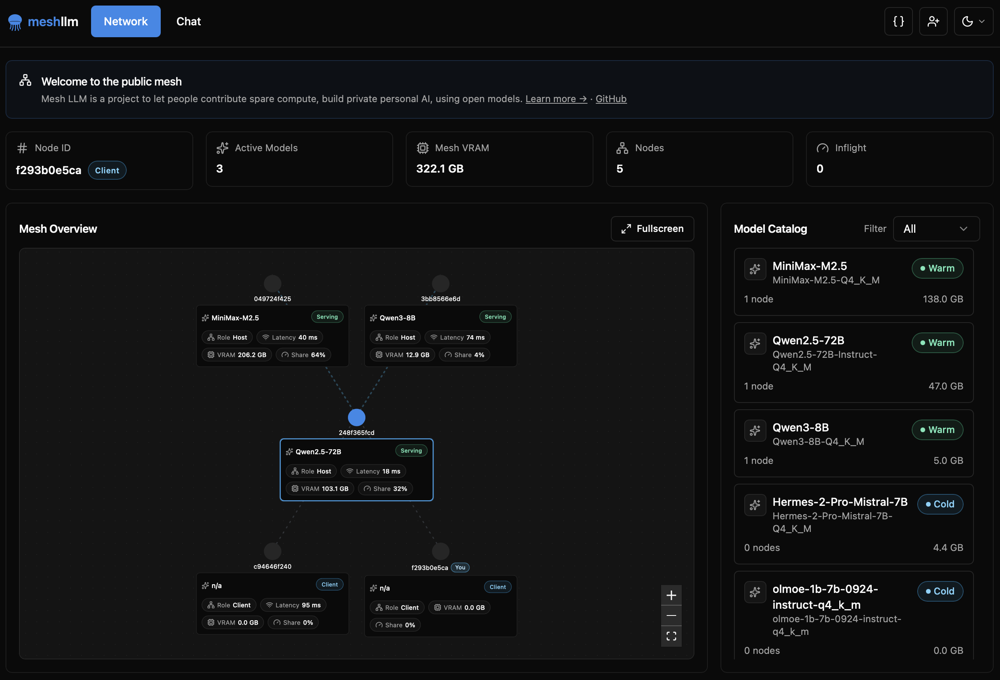

<p align="center">
  
</p>



Mesh LLM pools GPUs and memory across machines and exposes the result as one
OpenAI-compatible API at `http://localhost:9337/v1`. Start one node, add more
nodes later, and let the mesh decide whether a model runs locally, routes to a
peer, or uses Skippy stage splits for models that are too large for one box.

## Quick start

Install the latest release:

```bash
curl -fsSL https://raw.githubusercontent.com/Mesh-LLM/mesh-llm/main/install.sh | bash
```

Join the public mesh and start serving:

```bash
mesh-llm serve --auto
```

That command chooses a backend flavor, downloads a suitable model if needed,
joins the best discovered public mesh, starts the local API on port `9337`, and
starts the web console on port `3131`.

Check available models:

```bash
curl -s http://localhost:9337/v1/models | jq '.data[].id'
```

Send an OpenAI-compatible request:

```bash
curl http://localhost:9337/v1/chat/completions \
  -H "Content-Type: application/json" \
  -d '{"model":"GLM-4.7-Flash-Q4_K_M","messages":[{"role":"user","content":"hello"}]}'
```

For server deployments, add `--headless` to hide the web UI while keeping the
management API on the `--console` port:

```bash
mesh-llm serve --auto --headless
```

## Pick the workflow you need

| Goal | Command | Full guide |
|---|---|---|
| Try the public mesh | `mesh-llm serve --auto` | [docs/MESHES.md](docs/MESHES.md) |
| Start a private mesh | `mesh-llm serve --model Qwen3-8B-Q4_K_M` | [docs/MESHES.md](docs/MESHES.md) |
| Publish your own mesh | `mesh-llm serve --model Qwen3-8B-Q4_K_M --publish` | [docs/MESHES.md](docs/MESHES.md) |
| Join by invite token | `mesh-llm serve --join <token>` | [docs/MESHES.md](docs/MESHES.md) |
| Run an API-only client | `mesh-llm client --auto` | [docs/MESHES.md](docs/MESHES.md) |
| Run a big model with splits | `mesh-llm serve --model hf://meshllm/<repo>@<rev> --split` | [docs/SKIPPY_SPLITS.md](docs/SKIPPY_SPLITS.md) |
| Use Goose, OpenCode, Claude Code, or Pi | `mesh-llm goose`, `mesh-llm opencode`, `mesh-llm claude`, `mesh-llm pi` | [docs/AGENTS.md](docs/AGENTS.md) |
| Build or contribute | `just build` | [CONTRIBUTING.md](CONTRIBUTING.md) |

## How the mesh works

- **Single-machine fit first.** If one node can host the full model, it serves
  the model locally without stage traffic.
- **Mesh routing.** Every node exposes the same `/v1` API. Requests are routed
  by the `model` field to the peer that can serve that model.
- **Owner-control plane.** Operator config and inventory actions use an
  additive `mesh-llm-control/1` lane with explicit endpoint bootstrap, while
  public mesh join, gossip, routing, and inference stay on the public mesh
  plane for mixed-version compatibility.
- **Skippy stage splits.** Large dense models can load as package-backed layer
  stages. The coordinator plans contiguous layer ranges, starts downstream
  stages first, waits for readiness, then publishes the stage-0 route.
- **Layer packages.** Package repositories contain `model-package.json` plus
  GGUF fragments so peers fetch only the pieces needed for their assigned stage.
- **Public discovery.** Published meshes advertise through Nostr discovery;
  private meshes stay invite-token based.

For a deeper operator guide, see [docs/USAGE.md](docs/USAGE.md). For every CLI
command and switch, see [docs/CLI.md](docs/CLI.md).

## Supported model families

Mesh LLM's Skippy runtime tracks llama.cpp family parity with reviewed GGUF
representatives. The current reviewed support set covers 72 P0/P1 family rows,
with 89 certified rows in the full parity inventory, including Qwen, Llama,
Gemma, Mistral, DeepSeek, GLM, MiniMax, Phi, Granite, Hunyuan, EXAONE, Cohere,
Falcon, RWKV, and many others.

Split multimodal serving is certified for Qwen2-VL, Qwen3-VL,
Qwen3-VL-MoE, HunyuanOCR/Hunyuan-VL, and DeepSeek-OCR using real GGUF plus
projector fixtures. DeepSeek3 and EXAONE-MoE use package-backed stages because
the full GGUFs are too large for the cheap local baseline.

See [docs/skippy/FAMILY_STATUS.md](docs/skippy/FAMILY_STATUS.md) for the full
artifact, split, wire dtype, cache policy, and exception matrix. See
[docs/skippy/LLAMA_PARITY.md](docs/skippy/LLAMA_PARITY.md) for the remaining
llama.cpp parity queue.

## Install and build notes

Tagged releases publish macOS bundles plus Linux CPU, Linux ARM64 CPU, Linux
CUDA, Linux CUDA Blackwell, Linux ROCm, Linux Vulkan, Windows CPU, Windows
CUDA, Windows ROCm, and Windows Vulkan bundles. Metal is macOS-only. The Linux
ARM64 artifact is `mesh-llm-aarch64-unknown-linux-gnu.tar.gz`; in install and
release contexts, `arm64` and `aarch64` mean the same 64-bit ARM target.

Build from source with `just`:

```bash
git clone https://github.com/Mesh-LLM/mesh-llm
cd mesh-llm
just build
```

Source builds require `just`, `cmake`, Rust, and Node.js 24 + npm. CUDA builds
need `nvcc`, ROCm builds need ROCm/HIP, and Vulkan builds need Vulkan dev files
plus `glslc`.

## Documentation hub

| Doc | Use it for |
|---|---|
| [docs/MESHES.md](docs/MESHES.md) | Private meshes, public discovery, publishing, invite tokens, API-only clients |
| [docs/SKIPPY_SPLITS.md](docs/SKIPPY_SPLITS.md) | Running big models with package-backed Skippy stage splits |
| [docs/LAYER_PACKAGE_REPOS.md](docs/LAYER_PACKAGE_REPOS.md) | Contributing and publishing layer package repositories |
| [docs/AGENTS.md](docs/AGENTS.md) | Goose, Claude Code, OpenCode, Pi, curl, and blackboard |
| [docs/EXO_COMPARISON.md](docs/EXO_COMPARISON.md) | Balanced comparison with Exo |
| [docs/CLI.md](docs/CLI.md) | Command reference and JSON automation |
| [docs/USAGE.md](docs/USAGE.md) | Longer operational usage guide, runtime control, owner-control operator flows |
| [docs/design/TESTING.md](docs/design/TESTING.md) | Testing playbook, mixed-version QA, remote deploy checks |
| [docs/skippy/FAMILY_STATUS.md](docs/skippy/FAMILY_STATUS.md) | Certified Skippy model-family status |
| [docs/specs/layer-package-repos.md](docs/specs/layer-package-repos.md) | Manifest and artifact format spec |

## Community

Mesh LLM is experimental distributed-systems software. When you report bugs,
include the command you ran, platform/backend flavor, `/api/status` output if
available, and whether the node was private, published, or joined with `--auto`.
