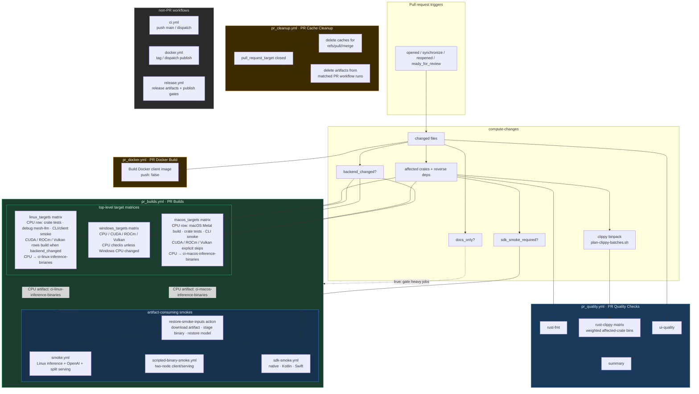

## Current PR Builds contract

- `pr_quality.yml` is named **PR Quality Checks** and owns the earliest feedback:
  formatting, UI quality when relevant, and deterministic clippy bins from
  `scripts/plan-clippy-batches.sh`.
- `pr_builds.yml` is named **PR Builds** and owns PR target matrices plus integration
  and smoke validation. Linux, macOS, and Windows are top-level matrices; Linux
  and macOS CPU rows upload the binaries that downstream smoke jobs consume.
- `pr_docker.yml` validates the PR Docker client image without publishing.
- `pr_cleanup.yml` deletes PR merge-ref caches and artifacts from positively
  matched PR workflow runs when a pull request closes.
- Non-PR workflows (`ci.yml`, `docker.yml`, `release.yml`) own main, dispatch,
  tag, and release-grade publishing behavior.

## Artifact and smoke reuse

- Smoke jobs restore binaries through `.github/actions/restore-smoke-inputs` and
  reusable workflows instead of rebuilding `mesh-llm` or patched llama.cpp.
- Linux CPU artifacts feed inference, two-node, native SDK, and Kotlin SDK
  smokes. macOS CPU artifacts feed Swift SDK smokes.
- PR and smoke-only CI artifacts use `retention-days: 1`; PR cleanup removes
  matched PR-run artifacts proactively.
- Direct `mesh-llm` invocations in workflows and CI scripts must include
  `--log-format json`.

For agent-facing workflow editing rules, see `.github/AGENTS.md`.
