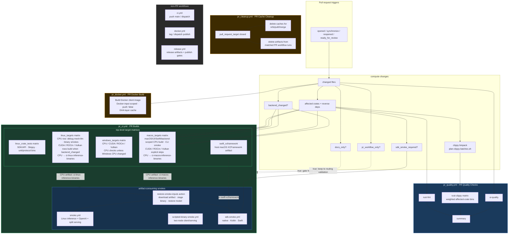

## Current PR Builds contract

- `pr_quality.yml` is named **PR Quality Checks** and owns the earliest feedback:
  formatting, UI quality when relevant, and deterministic clippy bins from
  `scripts/plan-clippy-batches.sh`.
- `pr_ci.yml` is named **PR Builds** and owns PR target matrices plus integration
  and smoke validation. Linux crate tests run in a separate matrix so Linux CPU
  can produce the smoke artifact without serializing every Rust test on the
  binary-build critical path. Linux, macOS, and Windows are top-level matrices;
  Linux and macOS CPU rows upload the binaries that downstream smoke jobs consume.
  Swift XCFramework production runs in parallel with the macOS CPU row so Swift
  SDK smoke consumes a built XCFramework artifact instead of rebuilding it after
  the macOS binary is ready.
- `pr_docker.yml` validates the PR Docker client image without publishing when
  Docker packaging inputs change. Workflow-only edits are covered by the shared
  YAML/consistency validation instead of self-triggering a heavyweight image
  build. Docker builds use GitHub Actions layer cache scoped to the PR cache ref
  so repeated Docker checks do not rebuild every layer.
- `pr_cleanup.yml` deletes PR merge-ref caches and artifacts from positively
  matched PR workflow runs when a pull request closes.
- Non-PR workflows (`ci.yml`, `docker.yml`, `release.yml`) own main, dispatch,
  tag, and release-grade publishing behavior.

## Rust cache reuse

- PR Rust builds use `Swatinem/rust-cache` alongside `sccache` so repeated runs
  on the same pull request can restore Cargo registry/git state while compiler
  outputs are primarily handled by `sccache`.
- PR `rust-cache` saves avoid workspace `target/` uploads because the post-run
  archive cost was longer than the reuse benefit for PR Builds; main-branch
  cache saves may still include target data.
- Rust caches stay platform/backend scoped. Linux CPU, Linux backend rows, macOS,
  Linux crate-test groups, Windows backend rows, clippy, and HuggingFace download
  smoke each keep their own compatible cache namespace instead of sharing a
  single prebuilt dependency artifact across incompatible runners or SDK
  environments.
- PR cache writes use the standard GitHub Actions cache service under
  `refs/pull/<PR>/merge`; `pr_cleanup.yml` deletes that ref's caches when the PR
  closes so PR-lifetime Rust caches do not linger unbounded.
- PR workflow/control-plane-only changes use `pr_workflow_only` routing so they
  validate the CI surface without forcing every Rust crate and backend lane.

## Artifact and smoke reuse

- Smoke jobs restore binaries through `.github/actions/restore-smoke-inputs` and
  reusable workflows instead of rebuilding `mesh-llm` or patched llama.cpp.
- Linux CPU artifacts feed inference, two-node, native SDK, and Kotlin SDK
  smokes. macOS CPU artifacts and the parallel Swift XCFramework artifact feed
  Swift SDK smokes.
- PR and smoke-only CI artifacts use `retention-days: 1`; PR cleanup removes
  matched PR-run artifacts proactively.
- Direct `mesh-llm` invocations in workflows and CI scripts must include
  `--log-format json`.

For agent-facing workflow editing rules, see `.github/AGENTS.md`.
