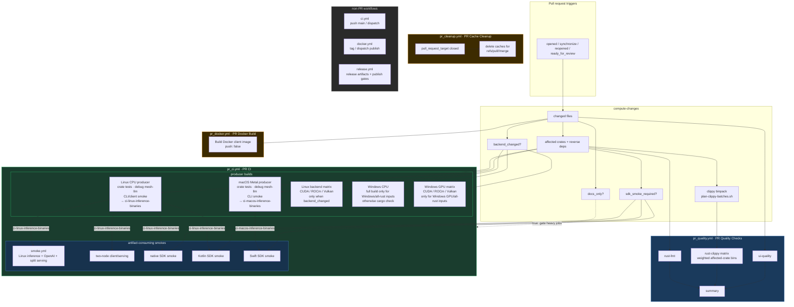

```mermaid
flowchart TD
    subgraph Triggers["Pull request triggers"]
        PR["opened / synchronize / reopened / ready_for_review"]
    end

    subgraph Changes["compute-changes"]
        Files["changed files"]
        Affected["affected crates + reverse deps"]
        ClippyBins["clippy binpack\nplan-clippy-batches.sh"]
        Backend["backend_changed?"]
        SDK["sdk_smoke_required?"]
        Docs["docs_only?"]
    end

    PR --> Files --> Affected
    Affected --> ClippyBins
    Files --> Backend
    Affected --> SDK
    Files --> Docs

    subgraph Quality["pr_quality.yml · PR Quality Checks"]
        direction TB
        Fmt["rust-fmt"]
        Clippy["rust-clippy matrix\nweighted affected-crate bins"]
        UIQ["ui-quality"]
        QSummary["summary"]
        Fmt --> QSummary
        Clippy --> QSummary
        UIQ --> QSummary
    end

    ClippyBins --> Clippy
    Affected --> Fmt
    Files --> UIQ

    subgraph PRCI["pr_ci.yml · PR CI"]
        direction TB
        subgraph Producers["producer builds"]
            Linux["Linux CPU producer\ncrate tests · debug mesh-llm\nCLI/client smoke\n→ ci-linux-inference-binaries"]
            Mac["macOS Metal producer\ncrate tests · debug mesh-llm\nCLI smoke\n→ ci-macos-inference-binaries"]
            LinuxGPU["Linux backend matrix\nCUDA / ROCm / Vulkan\nonly when backend_changed"]
            WindowsCPU["Windows CPU\nfull build only for Windows/all-rust inputs\notherwise cargo check"]
            WindowsGPU["Windows GPU matrix\nCUDA / ROCm / Vulkan\nonly for Windows GPU/all-rust inputs"]
        end

        subgraph Smokes["artifact-consuming smokes"]
            Inference["smoke.yml\nLinux inference + OpenAI + split serving"]
            TwoNode["two-node client/serving"]
            NativeSDK["native SDK smoke"]
            KotlinSDK["Kotlin SDK smoke"]
            SwiftSDK["Swift SDK smoke"]
        end
    end

    Docs -. "true: gate heavy jobs" .-> PRCI
    Affected --> Linux
    Affected --> Mac
    Backend --> LinuxGPU
    Backend --> WindowsCPU
    Backend --> WindowsGPU
    Linux -- "ci-linux-inference-binaries" --> Inference
    Linux -- "ci-linux-inference-binaries" --> TwoNode
    Linux -- "ci-linux-inference-binaries" --> NativeSDK
    Linux -- "ci-linux-inference-binaries" --> KotlinSDK
    Mac -- "ci-macos-inference-binaries" --> SwiftSDK
    SDK --> NativeSDK
    SDK --> KotlinSDK
    SDK --> SwiftSDK

    subgraph PRDocker["pr_docker.yml · PR Docker Build"]
        DockerBuild["Build Docker client image\npush: false"]
    end

    Files --> DockerBuild

    subgraph Cleanup["pr_cleanup.yml · PR Cache Cleanup"]
        Closed["pull_request_target closed"]
        DeleteCaches["delete caches for\nrefs/pull/<PR>/merge"]
        Closed --> DeleteCaches
    end

    subgraph MainRelease["non-PR workflows"]
        MainCI["ci.yml\npush main / dispatch"]
        DockerPublish["docker.yml\ntag / dispatch publish"]
        Release["release.yml\nrelease artifacts + publish gates"]
    end

    style Quality fill:#1a3a5c,stroke:#4a90d9,color:#e8f4fd
    style PRCI fill:#1a3d2e,stroke:#2ecc71,color:#eaffef
    style Producers fill:#1a3d2e,stroke:#2ecc71,color:#eaffef
    style Smokes fill:#17324d,stroke:#4a90d9,color:#e8f4fd
    style PRDocker fill:#3d2b00,stroke:#f39c12,color:#fff8e1
    style Cleanup fill:#3d2b00,stroke:#f39c12,color:#fff8e1
    style MainRelease fill:#2a2a2a,stroke:#888,color:#ddd
```
