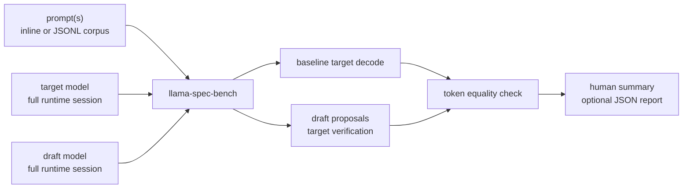
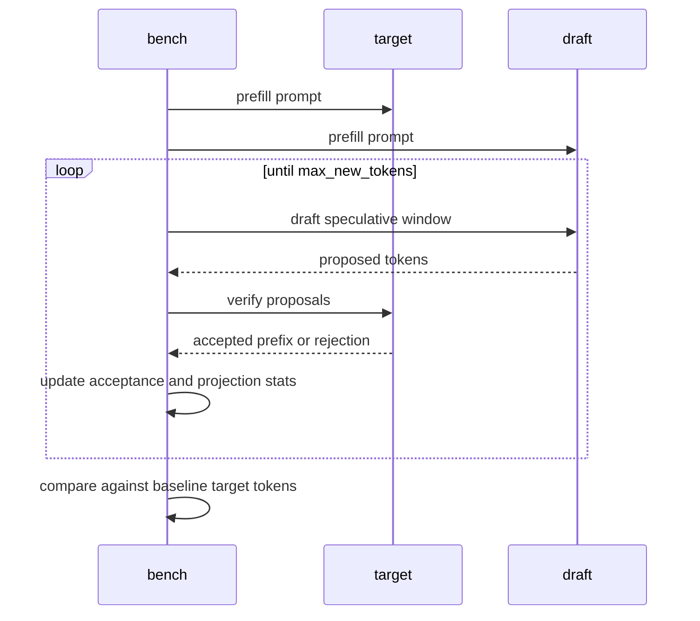

# llama-spec-bench

Local target/draft speculative decoding checker and benchmark.

`llama-spec-bench` compares a target GGUF model with a draft GGUF model on a
prompt set. It checks tokenizer compatibility, verifies speculative output
against baseline target decoding, measures acceptance behavior, and reports
projected verification costs.

## Architecture Role

This crate runs both models locally through `skippy-runtime`. It is a
preflight tool for deciding whether a draft model is safe and useful before it
is wired into `skippy-prompt` or benchmark launchers.
The target and draft are opened as complete local models without tensor
filtering; this keeps draft compatibility focused on tokenizer agreement and
full-model decode behavior instead of requiring every candidate draft
architecture to support staged tensor filtering.



## Verification Loop



## Commands

```bash
llama-spec-bench \
  --target-model-path target.gguf \
  --draft-model-path draft.gguf \
  --prompt "Write a short Rust function." \
  --max-new-tokens 128 \
  --speculative-window 4

llama-spec-bench \
  --target-model-path target.gguf \
  --draft-model-path draft.gguf \
  --prompt-corpus crates/skippy-bench/corpora/kv_mixed_prompts.jsonl \
  --prompt-limit 20 \
  --json-out /tmp/spec-bench.json
```

Use `--allow-mismatch` only while investigating failures; by default, any
speculative output mismatch makes the command fail.

## Report Contents

- prompt/token counts
- tokenizer compatibility
- accepted/rejected draft token counts
- acceptance rate and mean accepted tokens per window
- baseline and speculative decode timing
- projected rollback and scratch verification costs
- per-prompt text previews and mismatch index

The default corpus path is
`crates/skippy-bench/corpora/kv_mixed_prompts.jsonl`.
