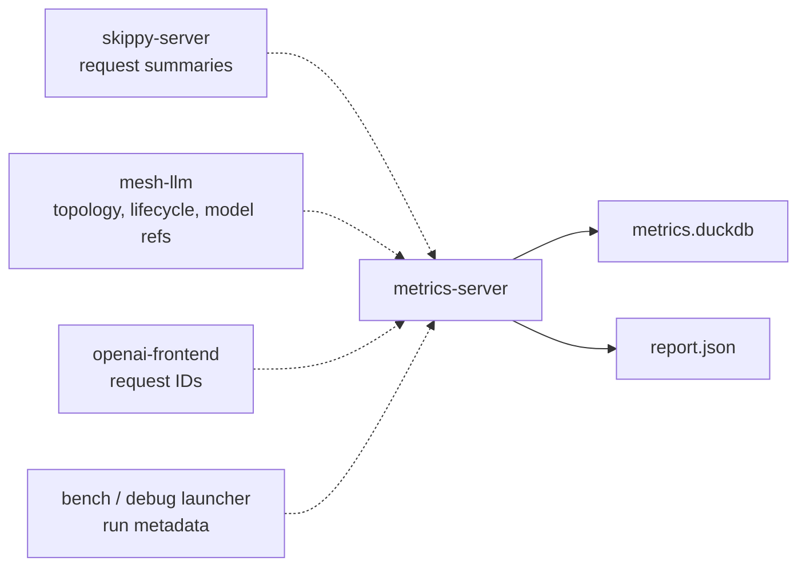

# metrics-server

Benchmark and debug telemetry service for staged runtime runs.

`metrics-server` is an OTLP-compatible collection and report service, not a
replacement for a general observability stack.

## Architecture Role

`metrics-server` receives best-effort telemetry from the staged runtime. It must
not sit on the inference request path: mesh and stage runtimes continue
executing if telemetry queues fill or export retries fail.



Stage summaries include compute time, downstream forwarding/wait time,
activation byte counts, credit counters, and lifecycle/queue counters.
Experimental feature runs should emit enough run, request, session, topology,
stage, and model identifiers for report export and post-run debugging.

## Commands

```bash
metrics-server serve --db metrics.duckdb
metrics-server serve --db metrics.duckdb --debug-retain-raw-otlp
metrics-server emit-fixture --run-id fixture
```

## Responsibilities

- ingest OTLP traces, metrics, and logs
- accept OTLP/gRPC on `--otlp-grpc-addr`
- accept OTLP/HTTP protobuf at `/v1/traces`, `/v1/metrics`, and `/v1/logs`
- persist scalar OTLP gauge/sum data points in `metric_points`
- index data by run/request/session/stage IDs
- expose run lifecycle HTTP APIs
- export canonical benchmark `report.json`
- omit raw OTLP payload retention unless `--debug-retain-raw-otlp` is set

## Source Layout

- `main.rs` - binary entrypoint only
- `lib.rs` - command dispatch and tests for end-to-end ingest/report behavior
- `cli.rs` - clap command shapes
- `server.rs` - Axum and tonic listener orchestration
- `api.rs` - HTTP route handlers
- `otlp.rs` - OTLP/gRPC service adapters
- `store.rs` - DuckDB schema, ingest mutations, lifecycle, and report queries
- `model.rs` - HTTP/report DTOs
- `otlp_value.rs` - OTLP attribute/value conversion helpers
- `fixture.rs` - fixture telemetry emitter for local workflow checks
