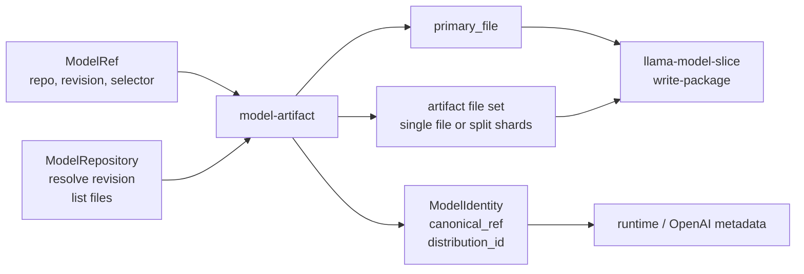

# model-artifact

Model artifact resolution over a pluggable repository interface.

`model-artifact` turns a parsed model coordinate into a concrete primary model
file, artifact file set, and provenance record. It knows artifact-selection
policy, but it does not know how any particular registry downloads files.

## Architecture Role

Repository adapters implement `ModelRepository`. This crate asks the adapter for
the resolved revision and file listing, then applies shared selection rules for
GGUF and safetensors artifacts.

## Selection Rules

- With a selector, prefer exact file and basename matches before quant-like GGUF
  matches.
- Without a selector, prefer `model.safetensors`, then split safetensors, then
  GGUF first shards, then single GGUF files.
- Split GGUF shards are grouped by matching shard prefix and total count.
- Known GGUF sidecars are ignored during default selection.

## Main Types

- `ModelRepository` abstracts revision resolution and file listing.
- `ResolvedModelArtifact` records source repo, source revision, selected files,
  primary file, canonical ref, format, and distribution id.
- `ModelIdentity` is the portable identity shape used by higher-level crates.
- `ModelArtifactFile` carries path plus optional size and checksum metadata.

Concrete Hugging Face behavior lives in `model-hf`; tests and other callers can
provide small in-memory repository implementations.
