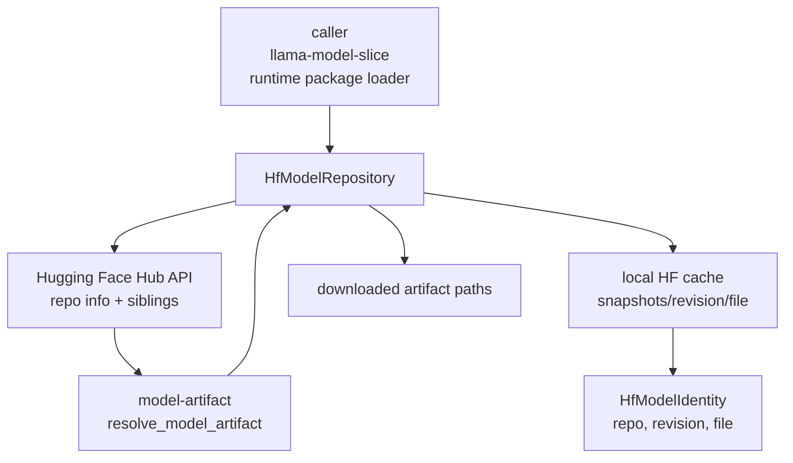

# model-hf

Hugging Face Hub repository and cache adapter for model artifact resolution.

`model-hf` is the concrete `model-artifact::ModelRepository` implementation
backed by the `huggingface-hub` Rust client. It resolves revisions, lists model
repo files, downloads selected artifacts, and recognizes model identity from
paths inside the local Hugging Face cache.

## Architecture Role

The pure identity and selection crates stay registry-agnostic. This crate owns
the Hugging Face edge: endpoint, token, cache layout, repo metadata, downloads,
and cache path identity recovery.



## Configuration

`HfModelRepository::from_env()` follows the usual Hugging Face environment:

```text
HF_ENDPOINT
HF_TOKEN
HUGGING_FACE_HUB_TOKEN
HF_HUB_CACHE
HUGGINGFACE_HUB_CACHE
HF_HOME
XDG_CACHE_HOME
```

Use `HfModelRepository::builder()` to override the cache directory, endpoint, or
token explicitly in tests and embedding applications.

## Responsibilities

- resolve branch/tag names to immutable Hugging Face revisions
- list model repository files at a resolved revision
- download the selected artifact file set
- locate the default Hugging Face cache directory
- derive `HfModelIdentity` and `ModelIdentity` from cached snapshot paths

Keep artifact ranking in `model-artifact`, public reference parsing in
`model-ref`, and stage materialization in `skippy-runtime` or
`llama-model-slice`.
