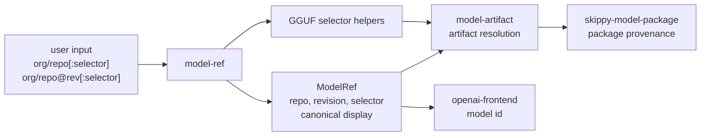

# model-ref

Pure model-reference parsing and formatting helpers.

`model-ref` owns the small, dependency-light rules for turning public model
coordinates into structured identity. It deliberately has no network, cache,
download, runtime, or topology behavior.

## Architecture Role

This crate sits at the very front of model identity handling. Higher-level
crates can parse a user-facing reference once, then pass the normalized pieces
into repository, artifact, packaging, or serving code.



## Supported Forms

```text
org/repo
org/repo:Q4_K_M
org/repo@revision
org/repo@revision:Q4_K_M
https://huggingface.co/org/repo
https://huggingface.co/org/repo/tree/revision
```

Selectors are artifact selectors, usually quantization-like GGUF suffixes such
as `Q4_K_M`, `F16`, `BF16`, or `IQ4_XS`. They are not runtime backends,
topology identifiers, or stage counts.

Mesh uses the full normalized model ref as the model identity everywhere it can:
status, demand, cold-model tracking, OpenAI `/v1/models`, and stage topology
metadata. GGUF path stems are artifact names, not model ids.

## Responsibilities

- parse and display `ModelRef`
- format canonical source refs as `repo@revision/file`
- identify quant-like GGUF selectors
- match selectors against GGUF file paths
- normalize GGUF distribution ids
- detect split GGUF shard naming such as `name-00001-of-00002.gguf`

Keep repository API calls and file selection policy in `model-artifact` and
Hugging Face cache/download behavior in `model-hf`.
