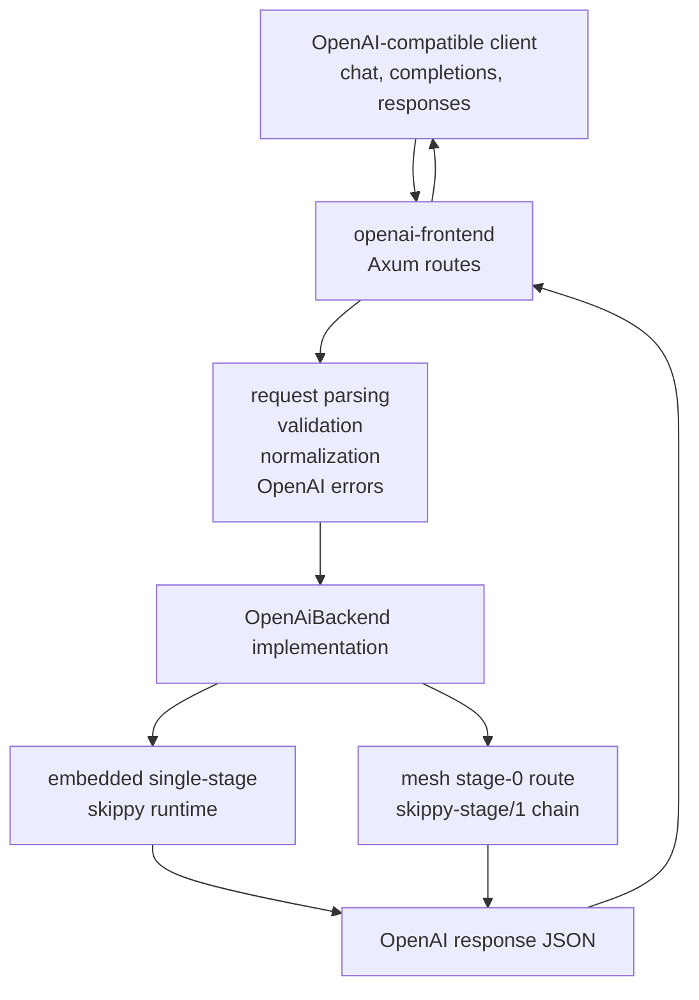

# openai-frontend

Reusable OpenAI-compatible HTTP frontend primitives for mesh and staged runtime
entry points.

This crate owns the public API shapes and route machinery that should not be
duplicated inside `skippy-server`. Stage server code should provide a thin
backend adapter that implements the frontend trait, while this crate handles
request/response JSON, OpenAI-style errors, `/v1/models`, chat completions, and
streaming Server-Sent Events framing. Mesh uses this as the single OpenAI
surface for embedded single-stage and stage-split serving.

The compatibility target is the mesh OpenAI surface, not llama-server process
compatibility. Request fields such as tools, structured-output shape,
logprobs, and `/v1/responses` are parsed and normalized here; backend support
is advertised or rejected explicitly by the runtime adapter.

For the concrete benchy command and contract, see
[`docs/LLAMA_BENCHY.md`](../../docs/LLAMA_BENCHY.md).

## Supported API Surface

| Surface | Status | Notes |
|---|---|---|
| `GET /v1/models` | Supported | Returns backend-provided model objects with opaque ids such as `org/repo:Q4_K_M`. |
| `POST /v1/chat/completions` | Supported | Handles streaming and non-streaming response shapes. |
| `POST /v1/completions` | Supported | Handles streaming and non-streaming response shapes. |
| `POST /v1/responses` | Supported | Adapts OpenAI responses requests onto chat/completion backend calls and preserves response metadata where possible. |
| `GET /health` / `GET /healthz` | Supported | Lightweight liveness probes for hosts and CI smoke tests. |
| `GET /readyz` | Supported | Backend readiness probe that verifies model discovery through `OpenAiBackend::models`. |
| Server-Sent Events | Supported | Emits OpenAI-style JSON chunks and `[DONE]`. |
| `model` | Supported | Opaque exact-match id; Mesh-style refs such as `org/repo:Q4_K_M` pass through without frontend parsing. |
| `messages` | Supported | String and text-part content are parsed; stage backend applies the model chat template through llama.cpp `llama-common`. |
| `prompt` | Supported | String and string-array prompts are accepted; token prompts parse but are rejected until a backend can honor token IDs directly. |
| `max_tokens` / `max_completion_tokens` | Parsed | Backend decides enforcement. |
| `stop` | Parsed | Backend decides enforcement. |
| `n` / `best_of` | Parsed | Single-choice requests are accepted; multi-choice generation is rejected until the response/backend path supports it. |
| `temperature`, `top_p`, `seed` | Supported | Stage backend passes supported sampling controls to llama.cpp sampling. |
| penalties / `logit_bias` | Supported | Presence/frequency/repeat penalties and token-id logit bias are passed to llama.cpp. |
| `logprobs` / `top_logprobs` | Frontend-compatible | Parsed, validated, and preserved. Backend decides whether logits/probability data can be produced. |
| `tools` / `tool_choice` | Frontend-compatible | Parsed, validated, and preserved. Backend decides whether tool-call generation is available. |
| `response_format` | Frontend-compatible | Text and structured-output shapes are parsed and preserved. Backend decides whether constrained decoding is available. |
| OpenAI-style error envelope | Supported | Includes strict `type`, `param`, and `code` fields. |
| OpenAI-style HTTP fallbacks | Supported | Unknown routes, unsupported methods, invalid JSON, and oversized JSON return the shared error envelope. |
| Request body limit | Supported | Configurable via `OpenAiFrontendConfig`; defaults to 4 MiB. |
| Request IDs | Supported | Propagates or generates `x-request-id`, returns it on every response, and emits a tracing event with method, URI, status, and request ID. |
| Backend timeout | Supported | Configurable via `OpenAiFrontendConfig`; defaults to 300 seconds and maps timeouts to OpenAI-shaped 504 errors. |
| embeddings/rerank/infill/audio/vision | Out of scope | Not needed for staged text benchmark entrypoints. |

## Shape



The backend boundary is intentionally small:

```rust
#[async_trait]
pub trait OpenAiBackend {
    async fn models(&self) -> OpenAiResult<Vec<ModelObject>>;
    async fn chat_completion(
        &self,
        request: ChatCompletionRequest,
    ) -> OpenAiResult<ChatCompletionResponse>;
    async fn chat_completion_stream(
        &self,
        request: ChatCompletionRequest,
        context: OpenAiRequestContext,
    ) -> OpenAiResult<ChatCompletionStream>;
    async fn completion(
        &self,
        request: CompletionRequest,
    ) -> OpenAiResult<CompletionResponse>;
    async fn completion_stream(
        &self,
        request: CompletionRequest,
        context: OpenAiRequestContext,
    ) -> OpenAiResult<CompletionStream>;
}
```

## Model Identity

`openai-frontend` treats model ids as opaque OpenAI-facing strings. For
Mesh-owned routing, the expected user-facing form is a Hugging Face coordinate
plus artifact selector, for example `org/repo:Q4_K_M`. The suffix is an artifact
selector, not a stage-server topology or serving-backend variant.

Backends should advertise the exact ids they accept through `/v1/models` and
perform exact string matching on requests. Resolution to a concrete Hugging Face
revision, GGUF file, split-shard distribution, local runtime, or staged binary
chain remains backend-owned.

## Backend Responsibility Matrix

| Area | Frontend responsibility | Backend responsibility | Status |
|---|---|---|---|
| `/v1/models` | Route shape and model-object serialization | Advertise exact full model refs accepted by the runtime | Supported |
| `/v1/chat/completions` | Parse common and advanced fields, stream/non-stream envelopes | Tokenization, sampling, stop handling, usage, feature execution | Supported with backend feature guards |
| `/v1/completions` | Prompt parsing and response envelopes | Token prompts, sampling, stop handling, usage | Supported with backend feature guards |
| `/v1/responses` | Translate request/response shapes onto the backend contract | Execute the resulting chat/completion request | Supported |
| HTTP operations | Health/readiness, fallbacks, payload limits, content-type handling | Model readiness and backend timeouts | Supported |
| Streaming | SSE chunks, `[DONE]`, cancellation context | Produce deltas, usage, and optional logprob/tool metadata | Supported with backend feature guards |
| Chat templates | Preserve OpenAI message shape | Apply model-aware chat templates through the skippy ABI | Backend-owned |
| Sampling | Parse OpenAI sampling fields | Apply supported llama sampling controls and reject unsupported knobs | Backend-owned |
| Stop handling | Preserve stop fields | Hold back streamed text enough to avoid leaking stop strings | Backend-owned |
| Context limits | Carry requested limits | Validate prompt plus generation against `ctx_size` | Backend-owned |
| Concurrency | Request timeout and cancellation | Runtime slots, batching, lane pools, and backpressure | Backend-owned |
| Cache behavior | Request IDs for correlation | Prefix/state cache policy and telemetry | Backend-owned |
| Errors | Shared OpenAI error envelope | Return precise unsupported/runtime errors | Supported |
| Usage accounting | Response field shape | Prompt/completion/total token counts | Backend-owned |
| Multi-choice generation | Parse `n` / `best_of` | Generate or reject multi-choice requests | Backend-owned |
| Logprobs | Parse and preserve request/response shape | Expose logits/probabilities | Frontend ready; backend-gated |
| Tools/function calling | Parse and preserve tool schemas and tool-call response shape | Generate tool calls | Frontend ready; backend-gated |
| JSON schema/grammar | Parse and preserve `response_format` | Constrained decoding | Frontend ready; backend-gated |
| Embeddings/rerank/infill/audio | Route fallback/error handling | Runtime implementation if reintroduced | Out of current scope |
| Metrics | Request IDs and tracing context | Stage/OpenAI telemetry emitted to `metrics-server` | Supported |

## Stage-Server Integration

`skippy-server` and mesh use this crate by implementing `OpenAiBackend` for a
small adapter:

- local text/runtime backend for single-stage smoke tests
- staged chain backend that connects to the first `serve-binary` endpoint

That keeps `serve-openai` and the embedded mesh path thin: parse or build the
runtime config, construct the backend, pass it to `openai_frontend::router`,
and serve the Axum app.
