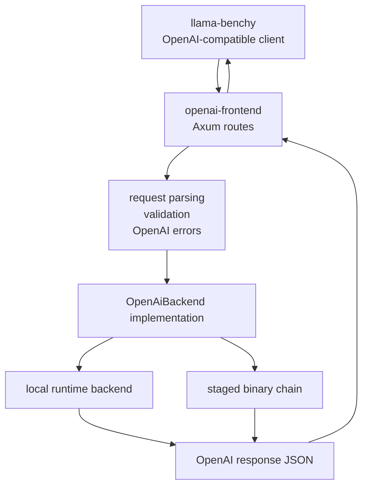

# openai-frontend

Reusable OpenAI-compatible HTTP frontend primitives for staged runtime entry
points.

This crate owns the public API shapes and route machinery that should not be
duplicated inside `skippy-server`. Stage server code should provide a thin
backend adapter that implements the frontend trait, while this crate handles
request/response JSON, OpenAI-style errors, `/v1/models`, chat completions, and
streaming Server-Sent Events framing.

The initial target is benchmark compatibility for tools such as
`llama-benchy`, with production-friendly HTTP behavior around the supported
subset. This is still not full `llama-server` parity.

For the concrete benchy command and contract, see
[`docs/LLAMA_BENCHY.md`](../../docs/LLAMA_BENCHY.md).

## Supported API Subset

The first supported surface is intentionally small:

| Surface | Status | Notes |
|---|---|---|
| `GET /v1/models` | Supported | Returns backend-provided model objects with opaque ids such as `org/repo:Q4_K_M`. |
| `POST /v1/chat/completions` | Supported | Handles streaming and non-streaming response shapes. |
| `POST /v1/completions` | Supported | Handles streaming and non-streaming response shapes. |
| `GET /health` / `GET /healthz` | Supported | Lightweight liveness probes for hosts and CI smoke tests. |
| `GET /readyz` | Supported | Backend readiness probe that verifies model discovery through `OpenAiBackend::models`. |
| Server-Sent Events | Supported | Emits OpenAI-style JSON chunks and `[DONE]`. |
| `model` | Supported | Opaque exact-match id; Mesh-style refs such as `org/repo:Q4_K_M` pass through without frontend parsing. |
| `messages` | Supported | String and text-part content are parsed; stage backend applies the model chat template through llama.cpp `llama-common`. |
| `prompt` | Supported | String and string-array prompts are accepted; token prompts parse but are rejected until a backend can honor token IDs directly. |
| `max_tokens` / `max_completion_tokens` | Parsed | Backend decides enforcement. |
| `stop` | Parsed | Backend decides enforcement. |
| `n` / `best_of` | Parsed | Single-choice requests are accepted; multi-choice generation is rejected until the response/backend path supports it. |
| `temperature`, `top_p`, `seed` | Supported | Stage backend passes supported sampling controls to llama.cpp sampling. |
| penalties / `logit_bias` | Supported | Presence/frequency/repeat penalties and token-id logit bias are passed to llama.cpp. |
| `logprobs` / `top_logprobs` | Parsed | Rejected until logits/probability exposure exists. |
| `tools` / `tool_choice` | Parsed | Rejected until tool-call response formatting exists. |
| `response_format` | Parsed | Text is accepted; structured outputs are rejected until constrained decoding exists. |
| OpenAI-style error envelope | Supported | Includes strict `type`, `param`, and `code` fields. |
| OpenAI-style HTTP fallbacks | Supported | Unknown routes, unsupported methods, invalid JSON, and oversized JSON return the shared error envelope. |
| Request body limit | Supported | Configurable via `OpenAiFrontendConfig`; defaults to 4 MiB. |
| Request IDs | Supported | Propagates or generates `x-request-id`, returns it on every response, and emits a tracing event with method, URI, status, and request ID. |
| Backend timeout | Supported | Configurable via `OpenAiFrontendConfig`; defaults to 300 seconds and maps timeouts to OpenAI-shaped 504 errors. |
| embeddings/rerank/infill/audio/vision | Out of scope | Not needed for staged text benchmark entrypoints. |

## Shape



The backend boundary is intentionally small:

```rust
#[async_trait]
pub trait OpenAiBackend {
    async fn models(&self) -> OpenAiResult<Vec<ModelObject>>;
    async fn chat_completion(
        &self,
        request: ChatCompletionRequest,
    ) -> OpenAiResult<ChatCompletionResponse>;
    async fn chat_completion_stream(
        &self,
        request: ChatCompletionRequest,
        context: OpenAiRequestContext,
    ) -> OpenAiResult<ChatCompletionStream>;
    async fn completion(
        &self,
        request: CompletionRequest,
    ) -> OpenAiResult<CompletionResponse>;
    async fn completion_stream(
        &self,
        request: CompletionRequest,
        context: OpenAiRequestContext,
    ) -> OpenAiResult<CompletionStream>;
}
```

## Model Identity

`openai-frontend` treats model ids as opaque OpenAI-facing strings. For
Mesh-owned routing, the expected user-facing form is a Hugging Face coordinate
plus artifact selector, for example `org/repo:Q4_K_M`. The suffix is an artifact
selector, not a stage-server topology or serving-backend variant.

Backends should advertise the exact ids they accept through `/v1/models` and
perform exact string matching on requests. Resolution to a concrete Hugging Face
revision, GGUF file, split-shard distribution, local runtime, or staged binary
chain remains backend-owned.

## llama-server Gap Analysis

| Area | llama-server already handles | openai-frontend initial target | Gap / risk |
|---|---|---|---|
| `/v1/models` | Model metadata and aliases | One or more backend-provided `ModelObject` values | Low |
| `/v1/chat/completions` | Broad OpenAI-compatible parsing | Parse common fields and preserve unknown JSON | Low for `llama-benchy` |
| HTTP operations | Health/readiness, fallbacks, payload handling, content-type handling | Liveness/readiness probes plus OpenAI-shaped 404/405/413/JSON errors | Low |
| Streaming | SSE chunks, `[DONE]`, role/content deltas | OpenAI-shaped SSE chunks plus `[DONE]`; dropped SSE bodies cancel the request context | Low |
| Non-streaming | Complete OpenAI response and usage | Response shape and backend-provided usage | Low |
| Chat templates | Model-aware template application | Stage backend applies the GGUF default chat template through the skippy ABI backed by `llama-common` Jinja templating | Low for text-only chat |
| Tokenization | Model-aware llama tokenization | Backend responsibility | Low if using llama ABI |
| Detokenization | Model-aware token text handling | Stage backend detokenizes accumulated generated tokens and emits only valid UTF-8 deltas | Low for text streaming |
| Sampling | Temperature, top-p/top-k, penalties, grammar, seed | Stage backend supports temperature, top-p, top-k, seed, presence/frequency/repeat penalties, and token-id logit bias through the stage ABI; binary-chain requests omit the sampling extension when defaults are used | Medium; grammar/min-p/typical remain rejected |
| Stop handling | Stop strings/tokens and EOS behavior | Backend responsibility; stage backend holds back streamed deltas enough to avoid leaking configured stop strings | Medium |
| Context limits | Slot/window management and validation | Stage backend rejects prompt plus requested generation beyond configured `ctx_size` | Low for current stage backend |
| Concurrency | Slots, batching, cancellation, backpressure | Stage backend runs generation on a blocking worker, gates current requests with an explicit single-generation semaphore, and cancels streaming decode on client disconnect | Medium; batching/slots remain future work |
| Prefix cache | llama-server slot/KV prompt cache behavior | Staged KV behavior is separate and backend-owned | High |
| Errors | OpenAI-ish error JSON | Shared `OpenAiError` response envelope | Low |
| Usage accounting | Prompt/completion/total token counts | Backend-provided `Usage` | Low |
| Multi-choice generation | `n`, `best_of`, multiple choices | Parsed and rejected above one choice | Medium |
| Logprobs | Optional token probability data | Parsed and rejected until backend exposes logits/probs | High |
| Tools/function calling | Tool request/response formatting | Parsed and rejected until backend/tool-call machinery exists | Out of scope |
| JSON schema/grammar | Constrained decoding | `response_format` parsed; structured output rejected until backend support exists | Out of scope |
| Embeddings/rerank/infill | Extra endpoints | Out of initial scope | Out of scope |
| Auth/CORS/UI | API keys, CORS, browser UI | Out of initial scope | Out of scope |
| Metrics | llama-server metrics | Backend/stage telemetry; request IDs should correlate with `metrics-server` | Medium |

## Stage-Server Integration

`skippy-server` should use this crate by implementing `OpenAiBackend` for a
small adapter:

- local text/runtime backend for single-stage smoke tests
- staged chain backend that connects to the first `serve-binary` endpoint

That keeps the `serve-openai` command thin: parse CLI config, build the backend,
pass it to `openai_frontend::router`, and serve the Axum app.
