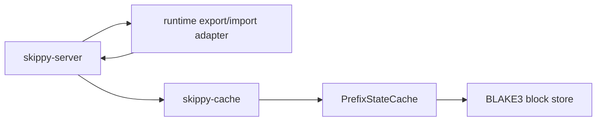

# skippy-cache

## Architecture Role

`skippy-cache` contains reusable cache storage primitives for staged serving.
Its first cache is `PrefixStateCache`, represented today by the existing
full-state cache types while the server-facing names are migrated.

## Responsibilities

- Build exact token-prefix cache identities from model, topology, stage, and
  token information.
- Store opaque prefix-state payloads: full-state, recurrent-only, or
  KV-plus-recurrent.
- Dedupe payload bytes through a content-addressed BLAKE3 block store.
- Enforce entry and physical-byte capacity limits with LRU-style eviction.
- Report logical bytes, physical bytes, dedupe savings, block counts, and
  reconstruction overhead.

## Notes

The crate does not call live runtimes. It stores payload bytes and metadata,
while `skippy-server` decides how to export/import those bytes from a live
stage runtime.
