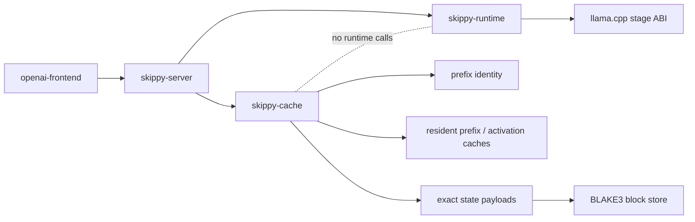
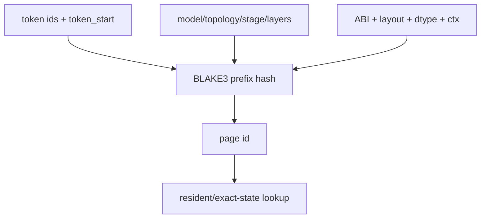
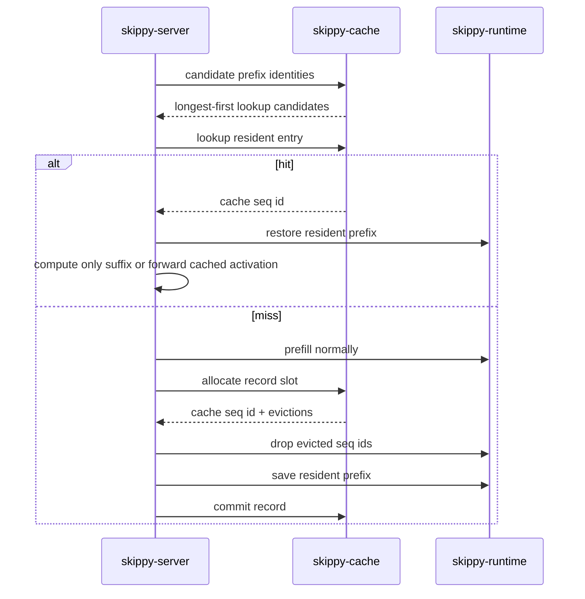
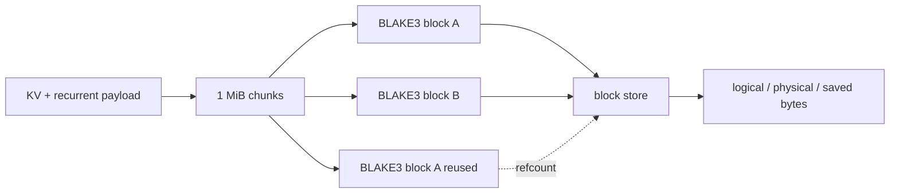
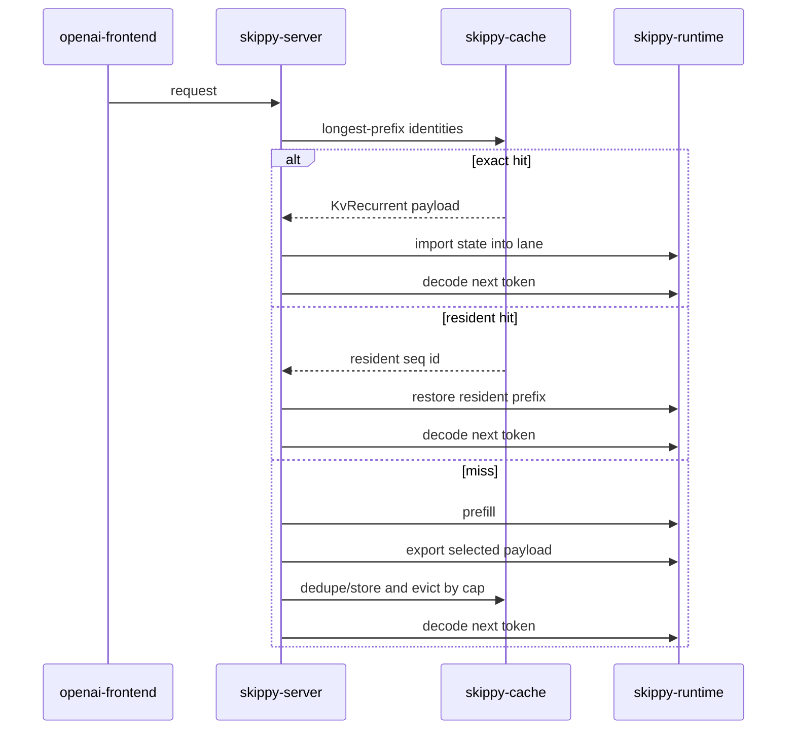

# skippy-cache

`skippy-cache` owns the cache model for staged serving. It does not talk to
llama.cpp, open sockets, route OpenAI requests, or plan topology. Those
responsibilities stay in `skippy-server`, `skippy-runtime`, and mesh.

The crate answers cache questions:

- what exact prefix identity should be used for this stage?
- which prefix lengths should be looked up or recorded?
- which resident cache entry should be evicted?
- how should exact state payload bytes be represented and deduplicated?

## Boundaries



`skippy-server` remains the adapter. It turns protocol messages into cache
lookups, performs the runtime save/restore/import/export calls, and records
telemetry. `skippy-cache` only owns pure data structures and policies.

## Prefix Identity

Prefix identity is exact. A hit is valid only for the same:

- model id
- topology id
- stage id and stage index
- layer range
- runtime ABI schema
- KV layout and dtype
- context/position configuration
- token start and token ids

The identity hash uses BLAKE3 over these fields. The short page id is derived
from the hash and is suitable for logs and resident-cache maps.



## Resident Cache Flow

The current resident path keeps reusable state inside the live llama.cpp
session. `skippy-cache` chooses candidates and tracks entries; `skippy-server`
does the native sequence copy/drop calls.



Activation frames are cached separately by `act:{page_id}:w{activation_width}`.
In a split topology, an upstream stage may reuse both its resident prefix and
the activation frame it would have forwarded downstream.

## Exact State Payloads

The payload module models the portable exact-cache path we need for
recurrent/stateful families:

| Payload | Contents | Use |
| --- | --- | --- |
| `FullState` | whole exported sequence state | diagnostic/reference only; not selected by production serving policy |
| `RecurrentOnly` | recurrent/SSM state only | diagnostic; not generally exact for non-final stages |
| `KvRecurrent` | attention KV plus recurrent/SSM state | preferred exact payload for hybrid/recurrent repeated-prefix cache |

Large payloads are split into 1 MiB BLAKE3-addressed blocks. Repeated blocks are
stored once, so capacity is accounted by physical bytes as well as logical
payload bytes.



## Family Cache Policy

Cache support is family-dependent because different model families have
different continuation state.

| Family shape | Safe cache shape | Notes |
| --- | --- | --- |
| Dense attention models such as Llama, Qwen3 dense, DeepSeek2, DeepSeek3, GLM4, GLM-4.7 Flash, OLMo, Gemma, MiniMax-M2.7 | `ResidentKv` | Attention KV is the continuation state for the certified prompt-continuation path. The cache entry is resident in the live runtime, so serving reuses llama.cpp sequence state without serializing bytes. |
| Hybrid/recurrent models such as Qwen3Next, Falcon-H1, RWKV/Mamba-like tensors | `KvRecurrent` only | KV-only reuse is disabled; recurrent/SSM state must be restored with KV for exact continuation. |
| Families with uncertain state layout | disabled until certified | Unknown families should not silently reuse state. |
| Diagnostic/correctness runs | `FullState`, `RecurrentOnly`, or `KvRecurrent` | Used to prove exactness and payload economics before enabling serving policy. |

The serving integration currently scans GGUF tensor names and disables the
KV-only resident path when recurrent/stateful tensors are present, including
`.ssm`, `ssm_`, `time_mix`, `recurrent`, and `rwkv`. That guard prevents a
hybrid model from importing attention KV while missing the recurrent state that
changes the next token.

The intended recurrent/stateful serving path is:

1. lookup exact prefix identity
2. import/restore `KvRecurrent`
3. recompute safely on any miss or incompatible payload
4. record a new exact payload after successful prefill

The OpenAI serving path now uses the same cache policy. A cache-enabled stage
selects one payload shape:

- `ResidentKv` for certified dense families where resident llama.cpp sequence
  copy is enough
- `KvRecurrent` for hybrid/recurrent families where attention KV and recurrent
  state must move together

`FullState` is intentionally not selected by the production family policy. It is
kept as a correctness/certification tool so a family can first prove exact
restore behavior before we design and promote a compact serving payload.



## Benchmark Evidence

README performance claims must be backed by correctness runs and comparable
llama-server baselines. Rows marked `untested` are intentionally not promoted as
default evidence yet.

Local correctness evidence below was collected on the same machine with
`n_predict = 1`, `n_gpu_layers = -1`, Skippy `--runtime-lane-count 1`, and
llama-server `--parallel 1`. The payload column is the production serving
payload, not an experimental fallback. Results use median warm-hit latency from
matched repeated prompts. The full-GGUF table uses the same 128-token requested
prefix and one generated token for every row so each Skippy result is compared
against the matching llama-server workload.

`Cache bytes` is serialized payload size for `KvRecurrent` and measured native
KV-page footprint for `ResidentKv` when the runtime can expose it. Rows marked
`metadata-derived` use the same llama.cpp KV dimensions from GGUF metadata:
active KV layers, KV heads, key/value head lengths, SWA pattern, shared-KV
layers, token count, and f16 KV element size.

### Full-GGUF llama-server vs Skippy

Rows are ordered so related runtime/cache families appear next to each other.

| Family | Representative model ref | Production payload | Correctness | Prefix tokens | Prompt tokens | llama-server warm median ms | Skippy hit median ms | Skippy win | Cache bytes | Size method | Notes |
| --- | --- | --- | --- | ---: | ---: | ---: | ---: | ---: | ---: | --- | --- |
| Qwen3Next | `bartowski/Qwen_Qwen3-Coder-Next-GGUF:IQ2_XS` | `KvRecurrent` | pass | 128 | 129 | 318.0 | 26.4 | **12.06x faster** | 78.4 MiB | measured | Recurrent-backed state reuse makes llama-server reprocess work Skippy skips. |
| Falcon-H1 | `tiiuae/Falcon-H1-1.5B-Instruct-GGUF:Q4_K_M` | `KvRecurrent` | pass | 128 | 129 | 105.2 | 12.0 | **8.73x faster** | 76.0 MiB | measured | Same recurrent-state advantage on the Falcon-H1 cache payload. |
| Llama | `hugging-quants/Llama-3.2-1B-Instruct-Q4_K_M-GGUF:Q4_K_M` | `ResidentKv` | pass | 128 | 129 | 8.8 | 4.5 | **1.95x faster** | 4.0 MiB | measured | Matches the llama-server slot contract, then wins on overhead. |
| Qwen3 dense | `Qwen/Qwen3-0.6B:Q8_0` | `ResidentKv` | pass | 128 | 129 | 7.4 | 6.8 | **1.08x faster** | 14.0 MiB | measured | Correct and faster; this is the narrowest win in the normalized matrix. |
| DeepSeek2 | `bartowski/DeepSeek-Coder-V2-Lite-Instruct-GGUF:Q4_K_M` | `ResidentKv` | pass | 128 | 129 | 12.6 | 9.6 | **1.32x faster** | 33.8 MiB | measured | Correct and faster on the resident prefix path. |
| GLM-4.7 Flash | `unsloth/GLM-4.7-Flash-GGUF:Q4_K_M` | `ResidentKv` | pass | 128 | 129 | 26.0 | 18.9 | **1.38x faster** | 12.5 MiB | metadata-derived | Correct and faster under the normalized 128-token workload. |
| GLM4 | `meshllm/glm-4-9b-0414-parity-q4_k_m-gguf:Q4_K_M` | `ResidentKv` | pass | 128 | 129 | 23.2 | 18.9 | **1.23x faster** | 5.0 MiB | measured | Correct and faster. |
| Gemma4 A4B | `batiai/Gemma-4-26B-A4B-it-GGUF:Q6_K` | `ResidentKv` | pass | 128 | 129 | 21.0 | 17.6 | **1.20x faster** | 27.5 MiB | metadata-derived | Correct and faster with SWA KV dimensions accounted for in sizing. |
| Gemma4 E4B | `unsloth/gemma-4-E4B-it-GGUF:Q4_K_M` | `ResidentKv` | pass | 128 | 129 | 20.7 | 16.1 | **1.29x faster** | 7.0 MiB | metadata-derived | Correct and faster with shared-KV layers accounted for in sizing. |
| Gemma3 | `ggml-org/gemma-3-1b-it-GGUF:Q4_K_M` | `ResidentKv` | pass | 128 | 129 | 10.1 | 7.0 | **1.45x faster** | 3.2 MiB | metadata-derived | Hot-lane resident prefix reuse beats llama-server warm slots. |
| Gemma2 | `bartowski/gemma-2-2b-it-GGUF:Q4_K_M` | `ResidentKv` | pass | 128 | 129 | 12.1 | 8.5 | **1.43x faster** | 13.0 MiB | metadata-derived | Correct and faster. |
| OLMo | `meshllm/olmo-7b-instruct-hf-parity-f16-gguf:F16` | `ResidentKv` | pass | 128 | 129 | 28.9 | 24.0 | **1.20x faster** | 64.0 MiB | measured | Correct and faster. |
| MiniMax M2.7 | `unsloth/MiniMax-M2.7-GGUF:UD-Q2_K_XL` | `ResidentKv` | pass | 128 | 129 | 39.5 | 31.9 | **1.24x faster** | 31.0 MiB | measured | Correct and faster on the large sharded GGUF. |

### HF Use-Case Matrix

This matrix uses one Hugging Face-sourced representative prompt per use case,
the same `128` requested prefix tokens, one generated token, Skippy
`--runtime-lane-count 1`, llama-server `--parallel 1`, and the same full-GGUF
family set as the table above. Values are Skippy warm-hit latency speedup over
llama-server warm-cache latency. DeepSeek3 stays in the package-only section
because there is no practical local full-GGUF llama-server baseline for that
artifact.

| Use case | Qwen3Next | Falcon-H1 | Llama | Qwen3 dense | DeepSeek2 | GLM-4.7 Flash | GLM4 | Gemma4 A4B | Gemma4 E4B | Gemma3 | Gemma2 | OLMo | MiniMax M2.7 |
| --- | ---: | ---: | ---: | ---: | ---: | ---: | ---: | ---: | ---: | ---: | ---: | ---: | ---: |
| Tool calling | 15.23x | 8.53x | 1.33x | 1.32x | 1.60x | 1.30x | 1.27x | 1.04x | 1.33x | 1.58x | 1.40x | 1.21x | 1.19x |
| Text-to-SQL | 15.42x | 8.58x | 1.69x | 1.35x | 1.52x | 1.19x | 1.13x | 1.30x | 1.26x | 1.64x | 1.41x | 1.08x | 1.14x |
| Coding agent loop | 14.62x | 8.24x | 1.56x | 1.68x | 1.47x | 1.24x | 1.28x | 1.32x | 1.25x | 1.54x | 1.52x | 1.24x | 1.26x |
| Issue fixing | 14.45x | 8.84x | 1.74x | 1.68x | 1.56x | 1.24x | 1.30x | 1.28x | 1.29x | 1.65x | 1.49x | 1.12x | 1.28x |
| Code refinement | 14.55x | 8.65x | 1.98x | 1.43x | 1.53x | 1.25x | 1.23x | 1.27x | 1.43x | 1.76x | 1.47x | 1.25x | 1.21x |
| Few-shot reasoning | 14.44x | 8.55x | 1.73x | 1.64x | 1.56x | 1.26x | 1.21x | 1.08x | 1.33x | 1.61x | 1.52x | 1.20x | 1.18x |
| Open chat | 13.74x | 9.15x | 1.62x | 1.35x | 1.60x | 1.30x | 1.23x | 1.36x | 1.31x | 1.58x | 1.28x | 1.06x | 1.27x |
| Summarization/RAG | 13.89x | 8.94x | 1.81x | 1.41x | 1.67x | 1.26x | 1.13x | 1.27x | 1.32x | 1.55x | 1.61x | 1.20x | 1.19x |

Prompt sources are checked in at `evals/skippy-usecase-corpus.json` with source
dataset metadata:

| Use case | Dataset | Config | Split | Row |
| --- | --- | --- | --- | ---: |
| Tool calling | `glaiveai/glaive-function-calling-v2` | `default` | `train` | 1 |
| Text-to-SQL | `gretelai/synthetic_text_to_sql` | `default` | `test` | 0 |
| Coding agent loop | `SWE-bench/SWE-smith-trajectories` | `default` | `tool` | 0 |
| Issue fixing | `SWE-bench/SWE-bench` | `default` | `dev` | 0 |
| Code refinement | `google/code_x_glue_cc_code_refinement` | `small` | `test` | 0 |
| Few-shot reasoning | `openai/gsm8k` | `main` | `test` | 0 |
| Open chat | `HuggingFaceH4/mt_bench_prompts` | `default` | `train` | 0 |
| Summarization/RAG | `nvidia/ChatRAG-Bench` | `doc2dial` | `test` | 0 |

### Package-Only Giant Models

These rows validate cache strategy for models where a full llama-server
baseline is not operationally useful because monolithic residency is too large.

| Family | Representative model ref | Production payload | Correctness | Prefix tokens | Prompt tokens | Baseline | Skippy hit median ms | Skippy win | Cache bytes | Size method | Notes |
| --- | --- | --- | --- | ---: | ---: | --- | ---: | ---: | ---: | --- | --- |
| DeepSeek3 | `unsloth/DeepSeek-V3.2-GGUF:UD-Q4_K_XL` | `ResidentKv` | pass | 4 | 5 | Skippy stage recompute | 3.4 | **4.40x faster** | 8.5 KiB | metadata-derived | Package-only proof on expert slice `3..4`; selected 7.47 GB stage part plus upstream `0..3`, no full 406.8 GB layer set loaded or merged. |

DeepSeek3 uses `ResidentKv` for package-backed serving. The local gate verifies
the package stage cache without requiring a monolithic full-GGUF baseline:
`0..1` passed with real token input, `3..4` passed with a real upstream `0..3`
activation producer, and late layers `30..31` plus `60..61` passed with
deterministic synthetic upstream activations so only the owned stage range had
to be materialized.

`state-handoff` reports distinguish behavioral exactness from byte-stable state
re-export. `status = pass` means the restored cache state produced the same next
token/output and repeat hits matched. `roundtrip_state_matches = false` means a
state exported after import was not byte-for-byte identical; that is a
canonicalization/deduplication diagnostic, not a serving correctness failure.
Raw reports from this run are under
`/tmp/skippy-cache-production-bench-track1-apples-p128`.

### Current Performance Read

With llama-server-compatible thread defaults, hot-lane resident prefix reuse,
and the production borrowed-prefix path, Skippy is at parity or ahead for every
locally available family in the normalized single-stage matrix:

| Scenario | Current read | Why |
| --- | --- | --- |
| Recurrent/hybrid families | Strong wins where compact recurrent state is exported | Falcon-H1 and Qwen3Next avoid llama-server reprocessing by restoring `KvRecurrent` state. |
| Dense attention families | Parity to moderate wins | Hot-lane resident prefix reuse preserves the same lane-local slot behavior that made llama-server fast, while the resident cache still supports later exact-prefix reuse. |
| Full-state diagnostics | Not a production target | `FullState` can prove restore exactness, but it is not selected by serving policy and should not be benchmarked as a cache win/loss. |
| Split serving | Still needs its own benchmark | Single-stage numbers do not prove end-to-end split wins because activation transfer, stage scheduling, and upstream/downstream cache hits change the cost model. |

### Exact Result Cache

Resident KV now preserves hot lane prefixes, so single-stage warm hits no longer
pay a copy/restore penalty versus llama-server slots. Both systems still
evaluate the final prompt token on a warm hit. The next optimization for
repeated identical prompts is an exact decoded-result cache:

1. keep or restore the runtime state after the full prompt has been evaluated
2. reuse the already-computed logits / first sampled token for an exact prompt
   hit
3. continue normal decode only if the request asks for more tokens

The correctness harness can model this with `--borrow-resident-hits
--cache-decoded-result-hits`. That mode is a prompt-result cache win, separate
from the resident KV slot-parity path shown in the table above.

Example:

```bash
LLAMA_STAGE_BUILD_DIR=.deps/llama-build/build-stage-abi-cpu \
  python3 evals/skippy-cache-production-bench.py \
    --case llama \
    --output-dir /tmp/skippy-cache-production-bench-llama-result-cache \
    --runtime-lane-count 1 \
    --borrow-resident-hits \
    --cache-decoded-result-hits \
    --llama-parallel 1 \
    --prefix-tokens 128
```

Before claiming a family is faster than llama-server, run a matched benchmark
with the same GGUF, backend, context size, prompt tokens, generated tokens,
slot/parallel settings, and warm-cache policy. The README table above is a
serving-correctness table first; performance wins are only claimed for the rows
whose matched speedup is above 1.0x.

Reproduce the local production-payload table with:

```bash
LLAMA_STAGE_BUILD_DIR=.deps/llama-build/build-stage-abi-cpu \
  python3 evals/skippy-cache-production-bench.py \
    --output-dir /tmp/skippy-cache-production-bench \
    --runtime-lane-count 1 \
    --llama-parallel 1 \
    --prefix-tokens 128
```

Reproduce the HF use-case matrix with:

```bash
LLAMA_STAGE_BUILD_DIR=.deps/llama-build/build-stage-abi-cpu \
  python3 evals/skippy-cache-production-bench.py \
    --output-dir /tmp/skippy-cache-usecase-matrix-p128 \
    --use-case all \
    --case qwen3_dense --case llama --case deepseek2 \
    --case glm47_flash --case glm4 \
    --case gemma4_a4b --case gemma4_e4b \
    --case gemma3 --case gemma2 --case falcon_h1 \
    --case olmo --case minimax_m27 --case qwen3next \
    --runtime-lane-count 1 \
    --llama-parallel 1 \
    --borrow-resident-hits \
    --prefix-tokens 128
```

## Module Map

| Module | Responsibility |
| --- | --- |
| `config` | candidate prefix lengths, record limits, resident cache sizing |
| `identity` | exact prefix hash and page ids |
| `resident` | resident prefix and activation LRU bookkeeping |
| `payload` | exact state payloads and BLAKE3 block dedupe |

## Testing

The crate is intentionally lightweight. It should test without building or
linking llama.cpp:

```bash
cargo test -p skippy-cache --lib
```

Supported-family cache safety is smoked through the topology capability
registry:

```bash
cargo test -p skippy-topology reviewed_supported_families_smoke --lib
```

That smoke does not execute model files. It verifies that every reviewed
supported family can be inferred, planned with `f16` serving wire, and emits the
expected recurrent/sticky, q8 validation, and sideband policy signals.

Server/runtime integration tests belong in `skippy-server`,
`skippy-runtime`, and `skippy-correctness`.
