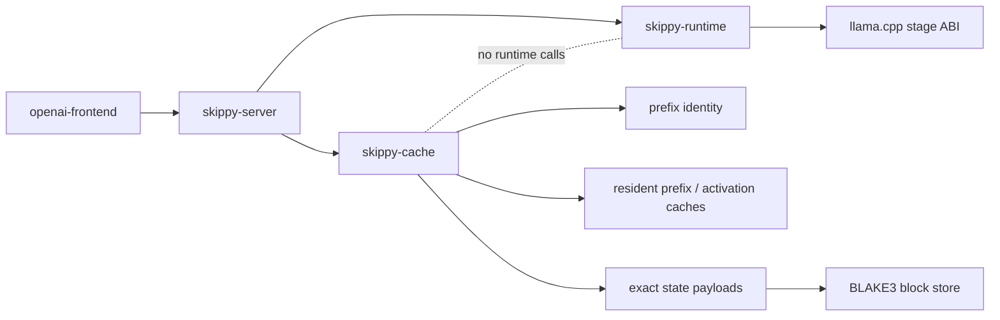
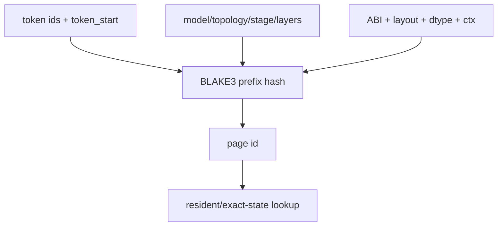
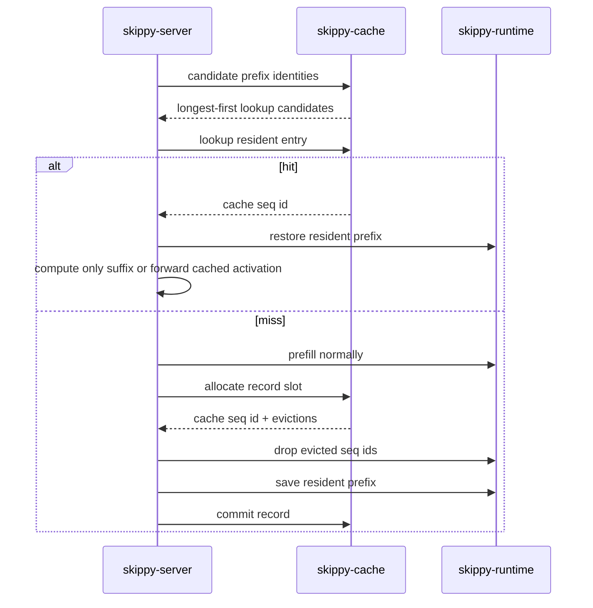
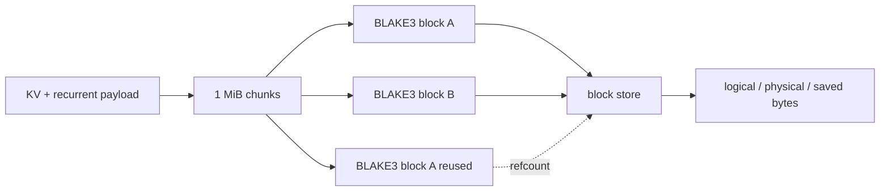
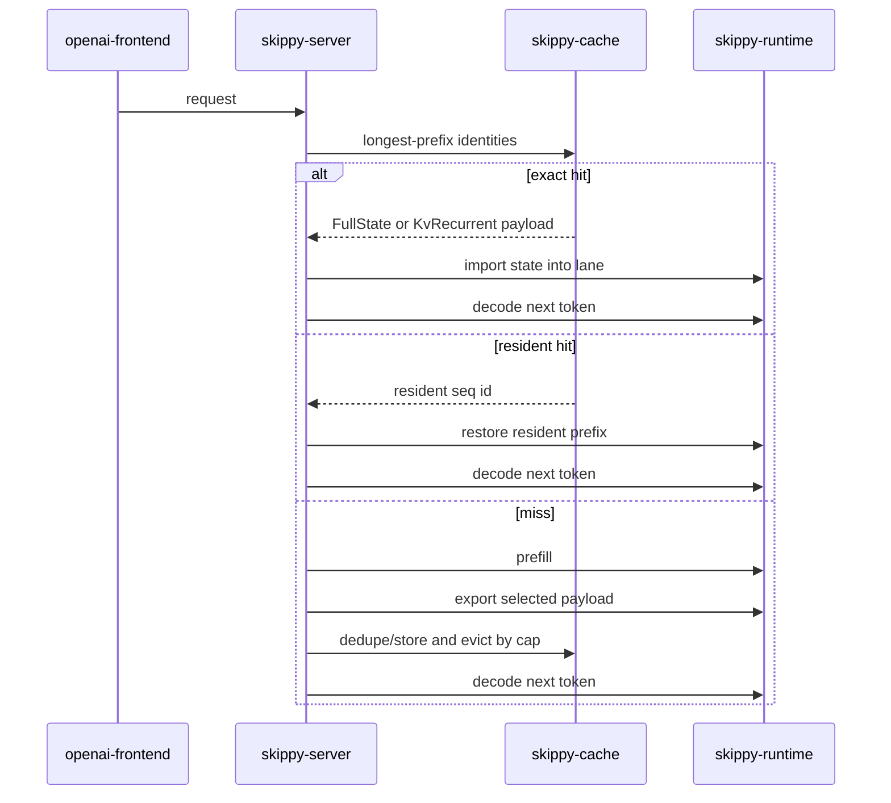

# skippy-cache

`skippy-cache` owns the cache model for staged serving. It does not talk to
llama.cpp, open sockets, route OpenAI requests, or plan topology. Those
responsibilities stay in `skippy-server`, `skippy-runtime`, and mesh.

The crate answers cache questions:

- what exact prefix identity should be used for this stage?
- which prefix lengths should be looked up or recorded?
- which resident cache entry should be evicted?
- how should exact state payload bytes be represented and deduplicated?

## Boundaries



`skippy-server` remains the adapter. It turns protocol messages into cache
lookups, performs the runtime save/restore/import/export calls, and records
telemetry. `skippy-cache` only owns pure data structures and policies.

## Prefix Identity

Prefix identity is exact. A hit is valid only for the same:

- model id
- topology id
- stage id and stage index
- layer range
- runtime ABI schema
- KV layout and dtype
- context/position configuration
- token start and token ids

The identity hash uses BLAKE3 over these fields. The short page id is derived
from the hash and is suitable for logs and resident-cache maps.



## Resident Cache Flow

The current resident path keeps reusable state inside the live llama.cpp
session. `skippy-cache` chooses candidates and tracks entries; `skippy-server`
does the native sequence copy/drop calls.



Activation frames are cached separately by `act:{page_id}:w{activation_width}`.
In a split topology, an upstream stage may reuse both its resident prefix and
the activation frame it would have forwarded downstream.

## Exact State Payloads

The payload module models the portable exact-cache path we need for
recurrent/stateful families:

| Payload | Contents | Use |
| --- | --- | --- |
| `FullState` | whole exported sequence state | fallback/reference when smaller payloads are not certified |
| `RecurrentOnly` | recurrent/SSM state only | diagnostic; not generally exact for non-final stages |
| `KvRecurrent` | attention KV plus recurrent/SSM state | preferred exact payload for hybrid/recurrent repeated-prefix cache |

Large payloads are split into 1 MiB BLAKE3-addressed blocks. Repeated blocks are
stored once, so capacity is accounted by physical bytes as well as logical
payload bytes.



## Family Cache Policy

Cache support is family-dependent because different model families have
different continuation state.

| Family shape | Safe cache shape | Notes |
| --- | --- | --- |
| Attention-only dense models | resident KV prefix + optional activation replay | KV-only reuse is valid because attention KV is the continuation state. |
| Dense attention models such as Llama, Qwen3 dense, DeepSeek2, DeepSeek3, GLM4, OLMo, MiniMax-M2.7 | resident KV prefix or exact KV-backed prefix payload | Attention KV is the continuation state; family policy keeps this separate from unknown families. |
| Hybrid/recurrent models such as Qwen3.6, Qwen3Next, Falcon-H1, RWKV/Mamba-like tensors | `KvRecurrent` or `FullState` only | KV-only reuse is disabled; recurrent/SSM state must be restored with KV for exact continuation. |
| Families with uncertain state layout | disabled until certified | Unknown families should not silently reuse state. |
| Diagnostic/correctness runs | `FullState`, `RecurrentOnly`, or `KvRecurrent` | Used to prove exactness and payload economics before enabling serving policy. |

The serving integration currently scans GGUF tensor names and disables the
KV-only resident path when recurrent/stateful tensors are present, including
`.ssm`, `ssm_`, `time_mix`, `recurrent`, and `rwkv`. That guard prevents a
hybrid model from importing attention KV while missing the recurrent state that
changes the next token.

The intended recurrent/stateful serving path is:

1. lookup exact prefix identity
2. import/restore `KvRecurrent` or `FullState`
3. recompute safely on any miss or incompatible payload
4. record a new exact payload after successful prefill

The OpenAI serving path now uses the same cache policy. A cache-enabled stage
selects one payload shape:

- `ResidentKv` for certified dense families where resident llama.cpp sequence
  copy is enough
- `KvRecurrent` for hybrid/recurrent families where attention KV and recurrent
  state must move together
- `FullState` for families where full sequence state is the only certified
  exact payload



## Benchmark Evidence

README performance claims must be backed by correctness runs and comparable
llama-server baselines. Rows marked `untested` are intentionally not promoted as
default evidence yet.

| Family | Representative model ref | Payload | llama-server warm repeat | skippy cache hit | Speedup | Payload size | Status | Notes |
| --- | --- | --- | --- | --- | --- | --- | --- | --- |
| Falcon-H1 | `tiiuae/Falcon-H1-1.5B-Instruct-GGUF:Q4_K_M` | `KvRecurrent` | 304.17 ms | 14.76 ms | 20.6x | 89.1 MB | accepted | 512-token prefix, one-token decode, `matches = true`; llama-server repeated prompt reprocessed recurrent-backed state. |
| Qwen3Next | TBD | `KvRecurrent` | TBD | TBD | TBD | TBD | untested | Needs state-handoff certification before README speedup claims. |
| Llama | TBD | `ResidentKv` / exact KV-backed | TBD | TBD | TBD | TBD | untested | Dense-family row needs same-prompt baseline because llama-server prompt cache may already reuse well. |
| Qwen3 dense | TBD | `ResidentKv` / exact KV-backed | TBD | TBD | TBD | TBD | untested | Certify representative GGUF at 512/2k/8k prefix lengths. |
| DeepSeek2 | TBD | `ResidentKv` / exact KV-backed | TBD | TBD | TBD | TBD | untested | Needs dense-family correctness and baseline row. |
| DeepSeek3 | TBD | `ResidentKv` / MLA-specific exact state TBD | TBD | TBD | TBD | TBD | untested | Exact-state mobility remains unpromoted until real DeepSeek3 GGUF evidence exists. |
| Gemma / GLM full-state | TBD | `FullState` | TBD | TBD | TBD | TBD | untested | Needs full-state correctness and payload-economics measurement. |

Current accepted Falcon-H1 numbers came from
`skippy-correctness state-handoff` with `--state-payload-kind kv-recurrent`,
`--prefix-token-count 512`, and `--cache-hit-repeats 10`, compared against a
same-GGUF llama-server repeated-prompt baseline. Raw reports were kept under
`/tmp` during measurement and are not committed.

## Module Map

| Module | Responsibility |
| --- | --- |
| `config` | candidate prefix lengths, record limits, resident cache sizing |
| `identity` | exact prefix hash and page ids |
| `resident` | resident prefix and activation LRU bookkeeping |
| `payload` | exact state payloads and BLAKE3 block dedupe |

## Testing

The crate is intentionally lightweight. It should test without building or
linking llama.cpp:

```bash
cargo test -p skippy-cache --lib
```

Supported-family cache safety is smoked through the topology capability
registry:

```bash
cargo test -p skippy-topology reviewed_supported_families_smoke --lib
```

That smoke does not execute model files. It verifies that every reviewed
supported family can be inferred, planned with `f16` serving wire, and emits the
expected recurrent/sticky, q8 validation, and sideband policy signals.

Server/runtime integration tests belong in `skippy-server`,
`skippy-runtime`, and `skippy-correctness`.
