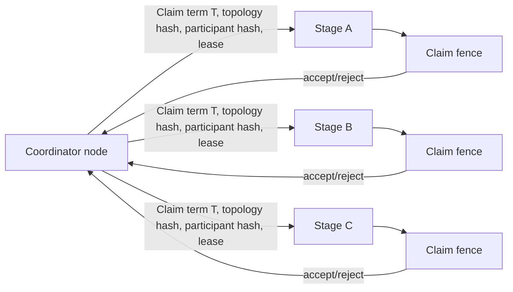
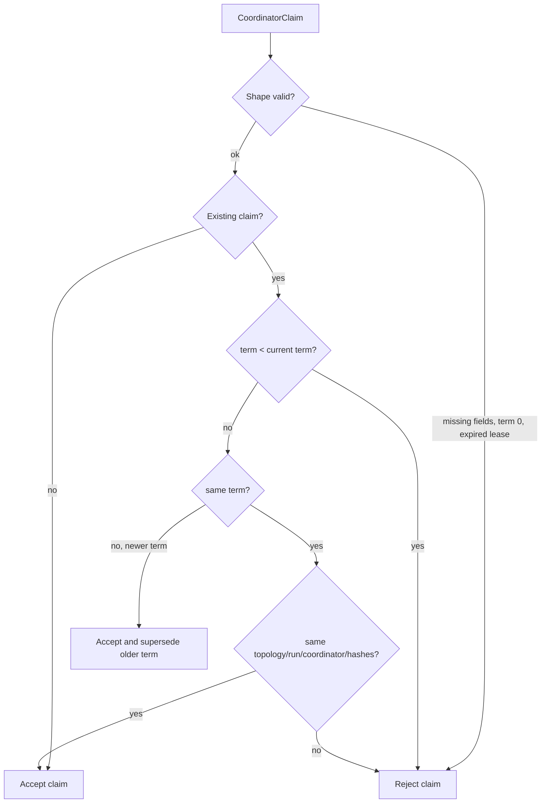
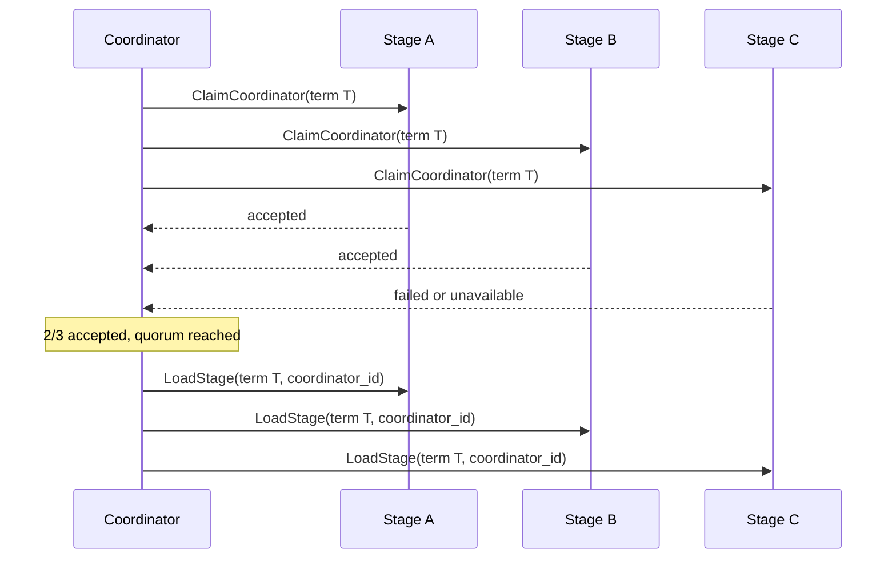
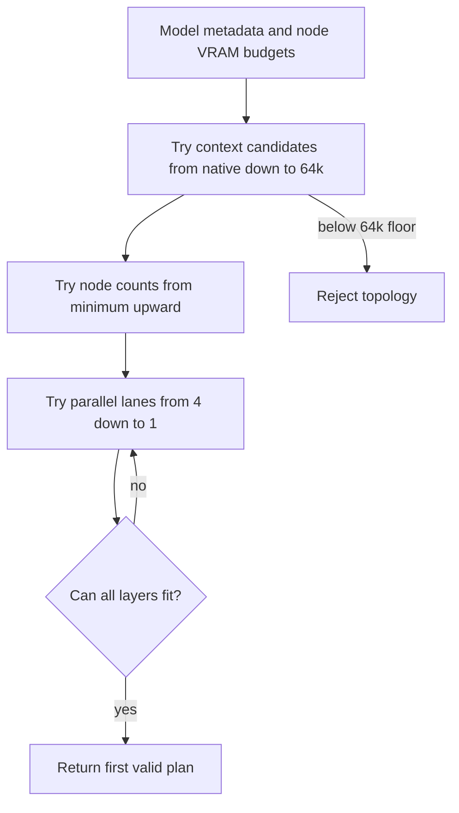
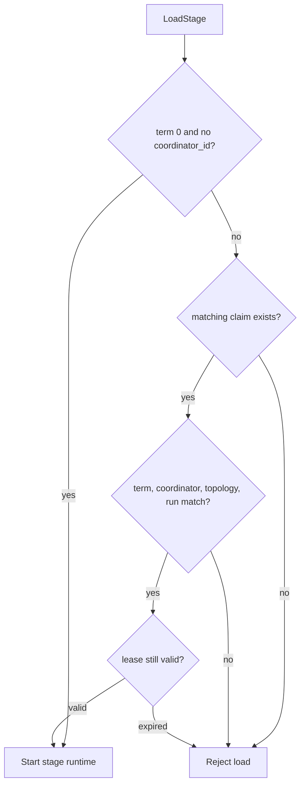
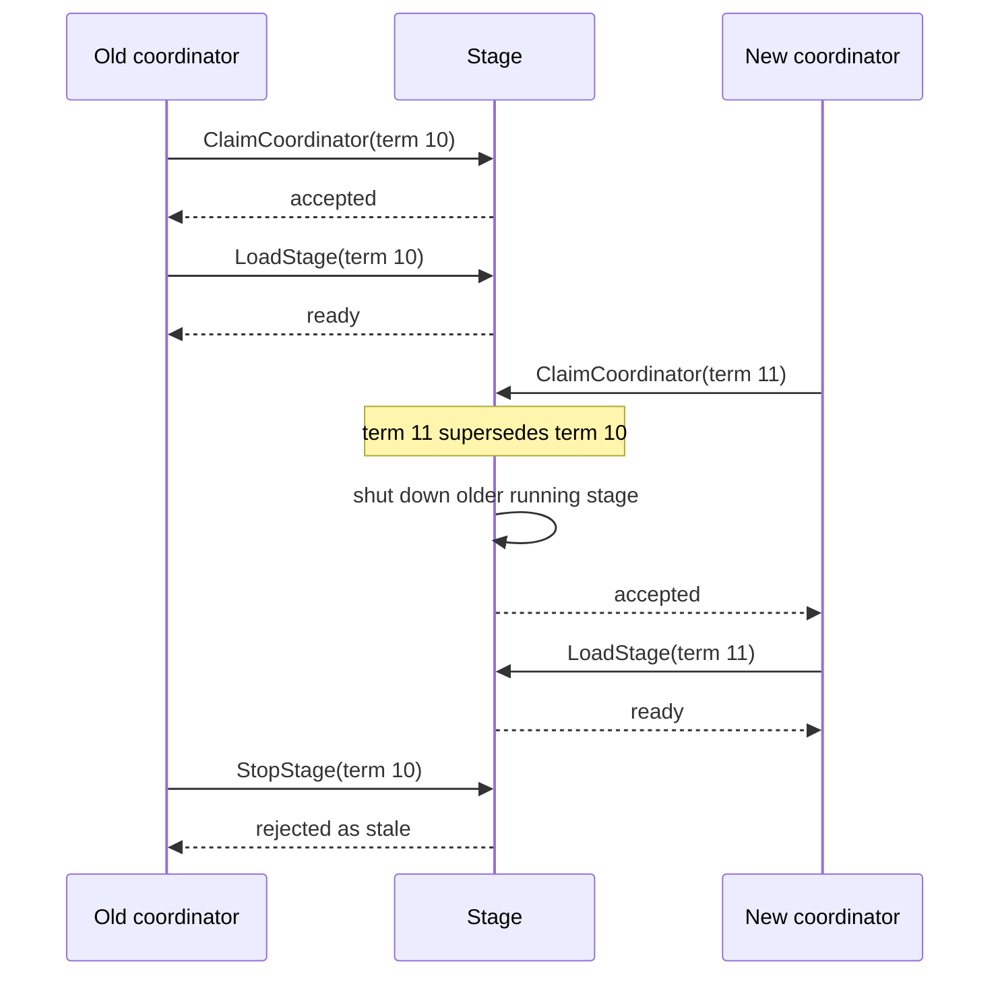
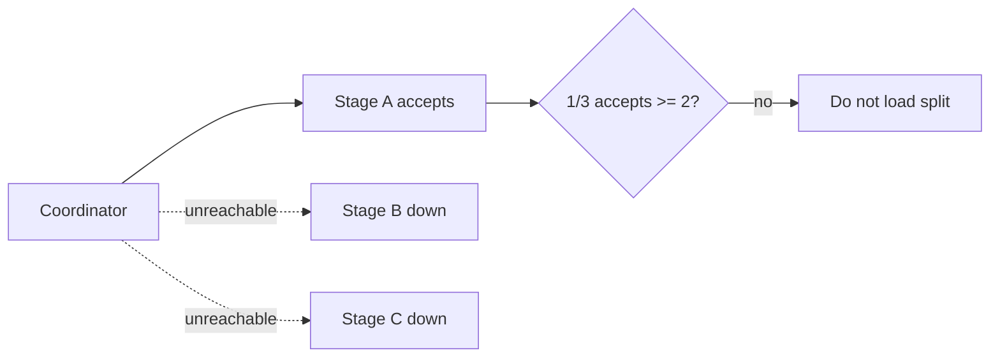
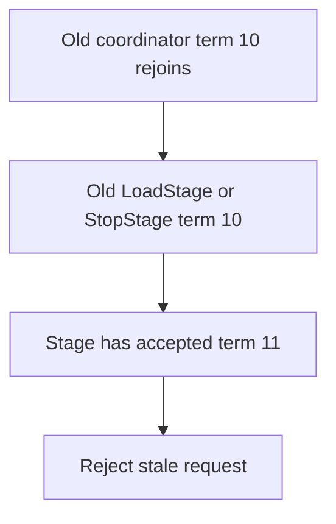
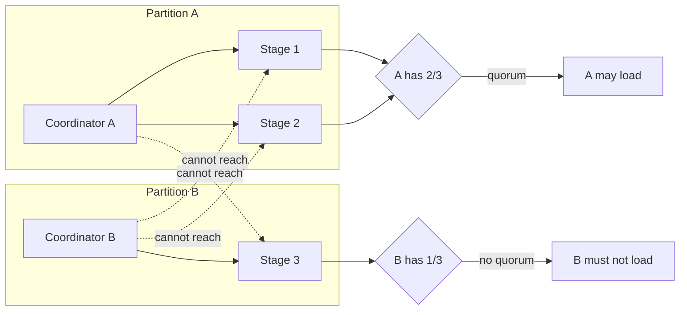

# Skippy Coordinator

`skippy-coordinator` owns the pure coordinator lease and fencing rules for
Skippy split topologies. It deliberately does not know about QUIC, gossip,
protobuf, Tokio, iroh endpoint IDs, or process management. Those parts live in
`mesh-llm-host-runtime`; this crate only answers:

- Is this coordinator claim valid?
- Does this newer claim supersede an older coordinator?
- Is this load fenced by the current accepted claim?
- How many planned stages must accept before a split can start?

## Mental Model

A split runtime has one coordinator. The coordinator chooses a topology, asks
the planned stage runtimes to accept a lease, and only loads the split if a
majority of those planned stages accept.

Every accepted claim is keyed by:

- `model_id`
- `package_ref`
- `manifest_sha256`

That means a stage remembers the current coordinator claim for a specific model
artifact. A newer term for the same model/package/manifest can replace an older
one; stale terms cannot.



## Terms, Leases, And Hashes

Each claim carries:

- `coordinator_id`: the node that owns the split generation.
- `coordinator_term`: a monotonic-ish term chosen by the runtime for the split generation.
- `topology_id` and `run_id`: the concrete split generation being claimed.
- `participant_set_hash`: hash of the planned participants and capacity inputs.
- `topology_hash`: hash of the planned stages, owners, and layer ranges.
- `lease_until_unix_ms`: wall-clock lease expiry.

The current host runtime uses a 4 hour split coordinator lease. The lease is a
fence, not a heartbeat protocol. If a load arrives after the lease expires, the
stage rejects it.



## Startup Flow

The coordinator must win a quorum before it loads stages. Quorum is a majority
of the planned stage count:

```text
quorum = planned_stage_count / 2 + 1
```

For a 3 stage split, 2 accepts are enough. For a 4 stage split, 3 accepts are
required.



If quorum is not reached, the coordinator must not load the split.

## Topology Planning

`skippy-coordinator` also owns the pure split-topology planner. The planner
does not inspect machines directly; the host runtime passes in the model shape
and each node's usable memory budget. Runtime-specific concerns such as
`--max-vram` and local headroom are applied before or while building those
inputs, then the coordinator planner makes a deterministic stage plan.

The planner inputs are:

- native GGUF context length
- model layer count
- model weight bytes
- KV bytes per token for the selected KV cache type
- minimum node count
- available nodes, each with detected VRAM, optional max VRAM, and runtime
  headroom
- optional explicit context or parallel-lane overrides

The planner output is:

- selected context length
- selected parallel lanes
- ordered stage list, with one contiguous layer range per selected node

Planning priority is deliberately ordered for decode speed:

1. Choose the highest valid context length, never exceeding the model's native
   GGUF context length.
2. Within that context length, choose the fewest nodes that can run the full
   model.
3. Within that node count, choose the highest parallel lane count that fits.
4. If several node sets produce the same shape, choose the set with the best
   remaining VRAM margin.

This means extra nodes are not added just to increase lanes once a smaller node
set can already run the chosen context. More nodes add split boundaries and
network hops, which can reduce decode speed, so the planner treats fewer nodes
as more important than additional parallel lanes.



The planner refuses bad topologies. A split does not launch when the layers
cannot be distributed over the selected nodes, or when the highest feasible
context would fall below the shared 64k context floor. For models with native
context below 64k, the floor is capped at the model's native context length.
Explicit context overrides are also rejected if they exceed the native context
or fall below that shared floor.

Memory fitting is approximate and intentionally conservative. For each
candidate shape, the planner estimates per-layer memory as:

```text
bytes_per_layer =
    ceil(model_weight_bytes / layer_count)
    + ceil(kv_bytes_per_token / layer_count) * context_length
```

Parallel lanes share a single unified KV cache (`kv_unified=true` in
llama.cpp) and do not multiply KV memory cost. The planner defaults to 4
parallel lanes (matching llama-server's default `--parallel 4`). Users can
override via `gpu.parallel` in `config.toml` or the per-model `parallel`
setting.

Each selected node must fit at least one layer, and the selected nodes together
must fit all layers. Layer ranges are contiguous, but they do not have to be
evenly sized; smaller nodes can receive fewer layers so they do not force the
whole topology down to a smaller context.

The Qwen 480B simulations in `src/topology.rs` document representative
outcomes:

- `4 x 70 GiB`: rejected because the model cannot fit above the 64k context
  floor.
- `4 x 80 GiB`: `4` stages, `65_536` context, `4` lanes.
- `5 x 80 GiB`: `5` stages, native `262_144` context, `4` lanes.
- `10 x 80 GiB`: still `5` stages, native `262_144` context, `4` lanes,
  because five nodes are enough and fewer nodes wins before more lanes.
- capped or lower-VRAM nodes receive fewer layers than larger peers.

## Load Fencing

Stages validate fenced loads against the accepted claim. A `LoadStage` is
accepted only when:

- it has a non-zero `coordinator_term`
- it has a `coordinator_id`
- the stage has an accepted claim for the same model/package/manifest
- the load term equals the claim term
- the load coordinator equals the claim coordinator
- the load topology/run equals the claim topology/run
- the accepted lease has not expired

Loads with `coordinator_term = 0` and no coordinator ID are treated as
unfenced legacy/local loads and bypass this coordinator policy.



## Superseding And Fencing Old Work

When a stage accepts a newer term for the same model/package/manifest, the host
runtime fences stale work:

- running stages with older coordinator terms are shut down
- preparations with older coordinator terms are cancelled
- stale stop requests cannot stop a newer running stage



## Scenarios

### 1. Fresh Split Startup

The coordinator plans a topology, sends `ClaimCoordinator` to every planned
stage, reaches majority, then loads stages with the same term and coordinator
ID.

Expected result: split starts.

### 2. One Planned Stage Is Down During Startup

For a 3 stage topology, if two stages accept and one is unreachable, quorum is
still reached.

Expected result: the coordinator may continue. The later load can still fail if
the missing stage is required for the concrete topology.

### 3. Too Many Planned Stages Are Down

For a 3 stage topology, if only one stage accepts, quorum is not reached.

Expected result: the split is not loaded. The node remains in standby/retry
behavior and can try again after peer changes or retry ticks.



### 4. Coordinator Disappears After Split Is Running

The stages do not elect a new coordinator by themselves. Other mesh nodes
observe peer/status changes through the runtime layer, plan a replacement split,
and attempt a newer coordinator claim.

Expected result: a reachable node can become coordinator by claiming a newer
term from a majority of the planned replacement stages.

### 5. Old Coordinator Comes Back

If the old coordinator tries to load or stop using an older term, stages reject
the stale request once they have accepted a newer claim.

Expected result: the old coordinator cannot corrupt the newer split.



### 6. Two Coordinators Race With The Same Term

The first valid claim for a term is accepted. A second claim with the same term
but different topology, coordinator, participant hash, or topology hash is
rejected as a conflicting same-term claim.

Expected result: same-term split brain is fenced at the stage.

### 7. Two Coordinators Race With Different Terms

The higher term wins at each stage. Accepting the higher term supersedes the
older claim and fences stale runtime work.

Expected result: convergence on the newer term for stages that receive it.
The coordinator still needs majority acceptance before it can load a split.

### 8. Network Partition

A partition means the mesh has split into groups that cannot talk to each
other. The coordinator protocol does not use gossip as consensus. Gossip helps
the runtime notice peer changes, but coordinator ownership is decided by direct
stage-control claims.

Expected result:

- the side that can claim a majority of the planned stages may load
- the side that cannot claim majority stays out
- when the partition heals, stale terms are rejected by stages that accepted a
  newer term



### 9. Lease Expiry

An expired claim cannot authorize new loads. A coordinator must claim again
with a valid lease before loading fenced stages.

Expected result: old or delayed load messages do not start stages after the
lease window.

### 10. Local Or Legacy Unfenced Load

Loads with term `0` and no coordinator ID bypass the split coordinator fence.

Expected result: non-split stage usage and tests that do not participate in
split coordination still work.

## What This Is Not

This is not Raft. There is no replicated log, no committed command sequence,
and no long-lived cluster membership stored in this crate. The runtime only
needs a fencing token for split ownership:

- majority claim before load
- monotonic term replacement
- stale request rejection
- lease expiry

That is enough to prevent old coordinators from continuing to mutate a split
after a newer coordinator has taken ownership, without turning every stage into
a consensus node.
