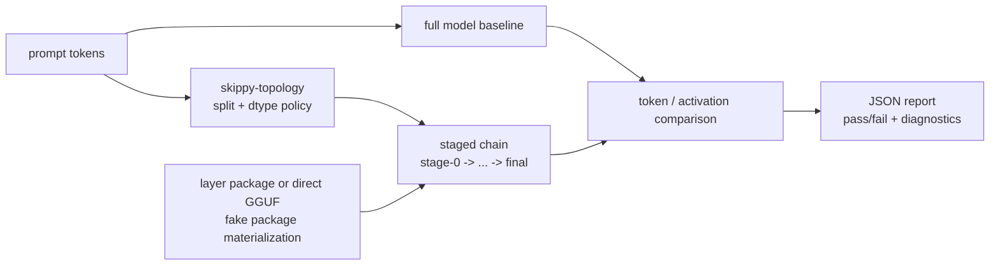

# skippy-correctness

Validates staged execution against full-model execution.

This is the correctness gate for new model families, split boundaries, load
modes, and activation wire dtypes. It intentionally focuses on exactness and
diagnostics rather than throughput.

## Architecture Role

`skippy-correctness` compares staged execution against a full-model
baseline before performance results are trusted. It validates the same split
boundaries, load modes, activation wire dtypes, and binary-chain behavior used
by `skippy-server`.



Use this crate when adding model-family support, changing split boundaries,
touching activation dtype conversion, or validating KV import/export behavior
against recompute.

## Commands

```bash
skippy-correctness single-step \
  --model model.gguf \
  --model-id org/repo:Q4_K_M \
  --split-layer 15 \
  --layer-end 30

skippy-correctness single-step \
  --model model.gguf \
  --model-id org/repo:Q4_K_M \
  --stage-load-mode layer-package \
  --stage-model /path/to/model-package \
  --split-layer 15 \
  --layer-end 30 \
  --report-out reports/single-step.json

skippy-correctness single-step \
  --model model.gguf \
  --model-id org/repo:Q4_K_M \
  --stage-load-mode artifact-slice \
  --stage-model /path/to/slice-dir \
  --split-layer 15 \
  --layer-end 30

skippy-correctness chain \
  --model model.gguf \
  --model-id org/repo:Q4_K_M \
  --splits 10,20 \
  --layer-end 30

skippy-correctness split-scan \
  --model model.gguf \
  --model-id org/repo:Q4_K_M \
  --splits 1..30 \
  --layer-end 30

skippy-correctness dtype-matrix \
  --model model.gguf \
  --model-id org/repo:Q4_K_M \
  --split-layer 15 \
  --dtypes f32,f16,q8

skippy-correctness state-handoff \
  --model model.gguf \
  --model-id org/repo:Q4_K_M \
  --layer-end 30 \
  --state-layer-start 10 \
  --state-layer-end 20 \
  --state-stage-index 1 \
  --prefix-token-count 1024 \
  --cache-hit-repeats 3 \
  --n-gpu-layers=-1 \
  --report-out reports/state-handoff.json
```

All commands emit JSON, optionally write the same JSON with `--report-out`, and
exit non-zero on mismatch unless `--allow-mismatch` is set.

## Llama Family Parity Tests

`tests/parity_models.rs` is the Rust regression lane for the P0/P1 llama.cpp
family matrix in `docs/skippy/llama-parity-candidates.json`. Each P0/P1 family
has its own test module so missing coverage is obvious in test output and code
review. The cheap tests validate manifest completeness and fail if a P0/P1
manifest row is added without a matching family module.

```bash
LLAMA_STAGE_BUILD_DIR="$PWD/.deps/llama-build/build-stage-abi-cpu" \
  cargo test -p skippy-correctness --test parity_models
```

The artifact-loading checks are ignored by default because they may download
and load every representative GGUF/package. Run a single family while developing:

```bash
SKIPPY_PARITY_DOWNLOAD=1 \
LLAMA_STAGE_BUILD_DIR="$PWD/.deps/llama-build/build-stage-abi-cpu" \
  cargo test -p skippy-correctness --test parity_models \
  p0_qwen2_qwen2 -- --ignored
```

Run the full P0/P1 artifact lane before rebuilding the llama patch queue or
promoting a broad family-parity change:

```bash
SKIPPY_PARITY_DOWNLOAD=1 \
LLAMA_STAGE_BUILD_DIR="$PWD/.deps/llama-build/build-stage-abi-cpu" \
  cargo test -p skippy-correctness --test parity_models -- --ignored
```

The ignored tests prove two production contracts per family:

- `activation_handoff_matches_full_model` compares a local three-stage split
  against a full-model baseline for the same prompt.
- `cache_state_restore_matches_recompute` records state from one session/lane,
  restores it into a different session/lane, and compares the next token or
  activation frame against normal recompute. Dense families use `ResidentKv`;
  recurrent/hybrid families use `KvRecurrent`.

Useful knobs:

- `SKIPPY_PARITY_DOWNLOAD=0` requires the artifacts to already exist in the
  Hugging Face cache.
- `SKIPPY_PARITY_DOWNLOAD_PACKAGE_ONLY=1` opts into downloading
  `certified_package_only` GGUF rows whose representative artifacts are often
  tens or hundreds of GB. By default those rows only run when the artifact or
  package is already local.
- `SKIPPY_PARITY_REQUIRE_PACKAGE_ONLY=1` turns a missing package-only local
  artifact into a test failure instead of a documented skip.
- `SKIPPY_PARITY_N_GPU_LAYERS` controls runtime offload for the heavy checks.
  It defaults to `999`, matching the family-certification lane; set it to `0`
  for an explicit CPU-only repro.
- `SKIPPY_PARITY_NATIVE_LOGS=1` leaves llama.cpp native logs on stdout; by
  default the test redirects them to a temp file.

Rows whose manifest `include` is `model-package.json` are package-backed tests:
the harness downloads the package repo, materializes stage slices, and runs the
same activation/cache contracts without requiring a monolithic full GGUF.

## Notes

- `--model` is always the full GGUF baseline.
- `--model-id` is required for arbitrary local paths. If `--model` points into
  the Hugging Face cache, correctness can resolve model identity from cache
  provenance and records the resolved repo, revision, source file, canonical
  ref, distribution id, and selector in `model_identity`.
- `--stage-load-mode runtime-slice` uses the full GGUF for staged execution.
- `--stage-load-mode artifact-slice` compares the full GGUF baseline with
  prewritten `skippy-model-package` artifacts. `--stage-model` may be a directory
  containing `stage-000.gguf`, `stage-001.gguf`, and so on, or a
  `slice-manifest.json`.
- `--stage-load-mode layer-package` compares the full GGUF baseline with stage
  slices materialized from `--stage-model`, which may be a local package
  directory or `hf://namespace/repo[:revision]`.
- `state-handoff` validates state export/import for a whole model or a
  stage range selected with `--state-layer-start`, `--state-layer-end`, and
  `--state-stage-index`. `--state-payload-kind` selects `full-state`,
  `recurrent-only`, or `kv-recurrent` payloads. Partial non-final ranges use
  direct runtime handoff because a standalone binary stage without downstream is
  necessarily final; final full-state ranges can use the binary control path.
  The report includes the handoff transport, payload kind, state payload size,
  and prefill/export/import/decode timings needed for cache economics. Use
  `--prefix-token-count` to request a deterministic synthetic prefix length;
  the command extends the prompt with stable filler text and truncates tokenized
  input to exactly that prefix plus one continuation token. Use
  `--cache-hit-repeats` to repeatedly attach the exported state and decode the
  same continuation, producing a recompute-vs-cache-hit speedup estimate. Use
  `--allow-mismatch` only for diagnostic payloads such as recurrent-only.
- Requires a built `skippy-server` binary for binary transport checks.
- Uses the same llama-backed runtime ABI as the server.
- The default build statically links llama from
  `.deps/llama.cpp/build-stage-abi-static`; set
  `LLAMA_STAGE_BUILD_DIR` only when using a non-default build directory.
