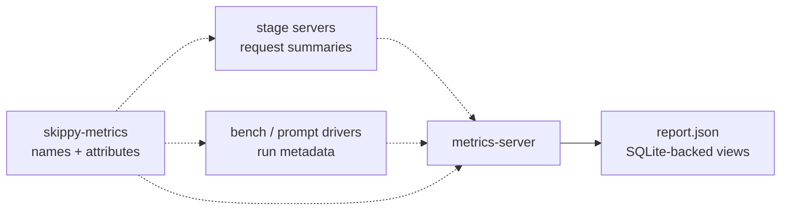

# skippy-metrics

Shared telemetry naming conventions for staged runtime components.

Use this crate for stable attribute keys, metric names, and report vocabulary
that must line up across `skippy-server`, `metrics-server`, benchmarks, and
correctness tooling.

## Architecture Role

`skippy-metrics` is the shared vocabulary for the staged request path. It
does not collect or store telemetry itself; it keeps names stable while other
crates emit or consume OTLP data.

The hot inference path must not block on telemetry. Stage servers and KV
runtime operations emit best-effort summaries, while `metrics-server` owns
ingestion, storage, and report export.
