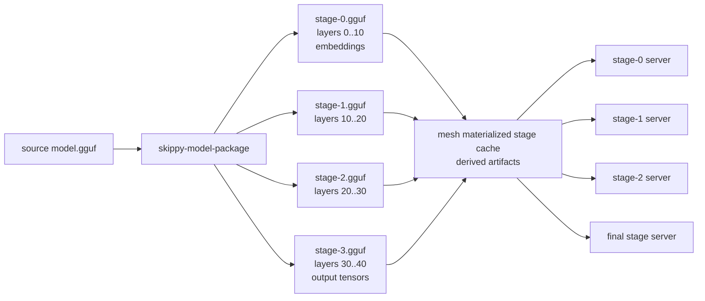

# skippy-model-package

Model inspection and stage-package CLI.

This tool uses llama-backed model introspection through the C ABI. GGUF writing
must go through llama.cpp writer code exposed by the ABI; Rust owns package
planning, manifests, checksums, and CLI behavior.

## Architecture Role

`skippy-model-package` prepares the per-stage model artifacts consumed by
`skippy-server` through the mesh materialization cache. Each stage owns one
contiguous layer range and loads a sparse GGUF shard or a materialized package
slice:



Mesh treats these generated shards as derived cache. Package-backed models use
stable Hugging Face identity from `model-ref`/`model-hf`; direct local GGUFs are
materialized as synthetic package inputs instead of using the path stem as a
model id.

## Commands

```bash
skippy-model-package inspect model.gguf
skippy-model-package plan model.gguf --stages 4
skippy-model-package write model.gguf --layers 0..12 --out stage-0.gguf --manifest stage-0.json
skippy-model-package write-stages model.gguf --stages 4 --out-dir slices/
skippy-model-package write-package org/repo:Q4_K_M --out-dir model-package/
skippy-model-package validate model.gguf slices/stage-*.gguf
skippy-model-package validate-package model.gguf model-package/
```

`write` and `write-stages` call the llama C ABI, which uses llama.cpp GGUF
writer code for artifact metadata and streams selected tensor bytes from the
source model. The Rust CLI owns planning, manifests, file checksums, and
validation reports.

`validate` checks that every owned tensor from the source model appears exactly
once across the supplied artifact slices, with no unknown tensors and no
duplicate owned tensors. Shared metadata and tokenizer KVs are preserved by the
llama-backed writer.

`write-package` prefers model coordinates such as `org/repo:Q4_K_M`. It resolves
the coordinate through `model-ref`, `model-artifact`, and the `huggingface-hub`
backed `model-hf` adapter, downloads the resolved source artifact, and records
the resolved repo, revision, primary file, canonical ref, distribution id, and
artifact file set in `model-package.json`.
Layer packages store input-boundary tensors in `shared/embeddings.gguf` and
final-boundary tensors in `shared/output.gguf`; owned tensors should appear in
exactly one package artifact.

Local paths are only accepted for package creation when the caller supplies
explicit provenance:

```bash
skippy-model-package write-package ./model.gguf \
  --out-dir model-package/ \
  --model-id org/repo:Q4_K_M \
  --source-revision abc123 \
  --source-file Qwen3-8B-Q4_K_M.gguf
```

This keeps canonical package identity tied to real model coordinates rather
than inferred from arbitrary filesystem paths.

`validate-package` checks the source-model checksum, manifest artifact checksums
and sizes, declared tensor counts/bytes, layer coverage, duplicate layers, and
exact owned tensor coverage against the source model.
