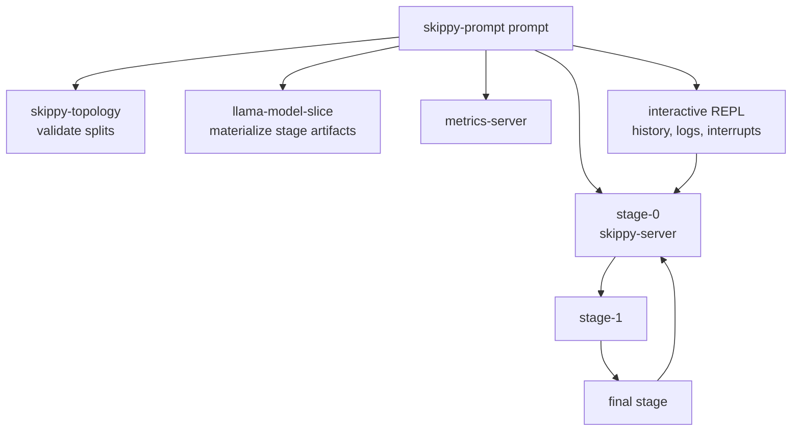
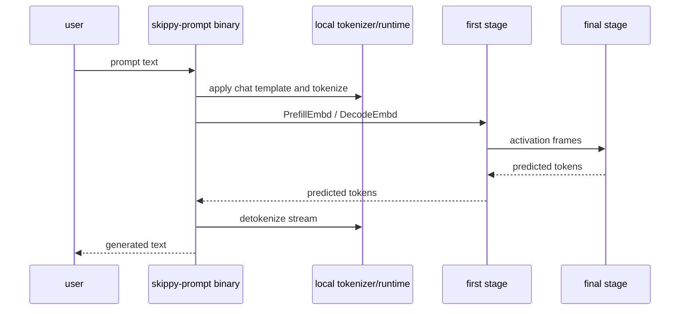

# skippy-prompt

Prompt REPL and local/multi-host stage topology launcher.

`skippy-prompt` is the operator-facing CLI for driving interactive text
generation against a running first stage. In mesh-llm, normal topology launch
and lifecycle are owned by mesh, so the imported `prompt` launcher exits before
starting sidecars. Use the `binary` subcommand against a mesh-managed first
stage for diagnostics.

## Architecture Role

The `prompt` subcommand builds a runnable topology from CLI inputs, starts the
supporting processes, waits for readiness, and then drives the first stage over
the binary protocol.



The `binary` subcommand skips launching servers and connects to an already
running first-stage `serve-binary` endpoint.



## Commands

```bash
skippy-prompt binary --model-path model.gguf --first-stage-addr 127.0.0.1:19031
```

Useful REPL commands include `:history`, `:logs [name] [lines]`, and `:quit`.

## Notes

- Default local state lives under `/tmp/skippy-prompt`.
- Remote runs stage inputs under `/tmp/skippy-remote-prompt` by default.
- `--activation-wire-dtype q8` is accepted only when topology policy has
  validation for the requested family/split.
- `--draft-model-path` enables draft-model speculative proposals.
- Standalone `kv-server`, `ngram-pool`, and `ngram-pool-server` are not
  imported into mesh-llm; topology launch exits before starting sidecars.
- Thinking controls are forwarded through the shared `openai-frontend`
  reasoning/template normalization helpers.

Keep server transport behavior in `skippy-server`, model/session ABI
wrapping in `skippy-runtime`, and reusable OpenAI request shapes in
`openai-frontend`.
