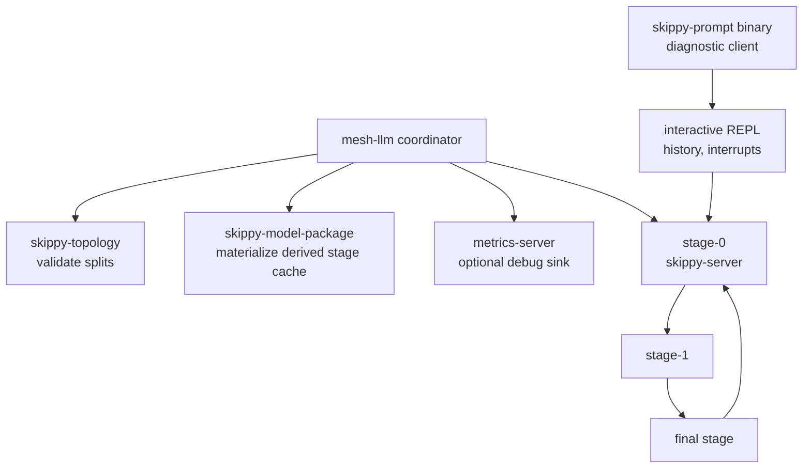
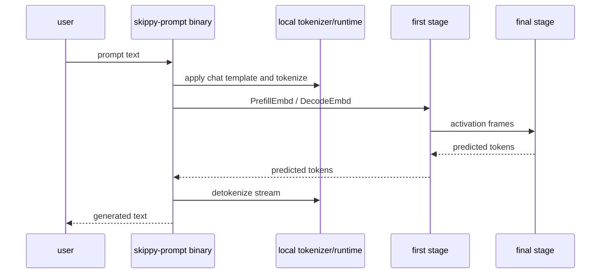

# skippy-prompt

Prompt REPL and diagnostics client for staged runtimes.

`skippy-prompt` is the operator-facing CLI for driving interactive text
generation against a running first stage. In mesh-llm, topology launch,
materialization, metrics wiring, and lifecycle are owned by mesh, so the
imported `prompt` launcher is retained only as a diagnostic planning surface.
Use the `binary` subcommand against a mesh-managed first stage for live checks.

## Architecture Role

The mesh-managed path builds a topology from model/package metadata and peer
inventory, starts stage servers, waits for readiness, publishes the stage-0
route, and then lets diagnostic clients attach to the first stage.



The `binary` subcommand skips launching servers and connects to an already
running first-stage `serve-binary` endpoint.



## Commands

```bash
skippy-prompt binary --model-path model.gguf --first-stage-addr 127.0.0.1:19031
```

Useful REPL commands include `:history`, `:logs [name] [lines]`, and `:quit`.

## Notes

- Default local state lives under `/tmp/skippy-prompt`.
- Remote runs stage inputs under `/tmp/skippy-remote-prompt` by default.
- `--activation-wire-dtype q8` is accepted only when topology policy has
  validation for the requested family/split.
- `--draft-model-path` enables draft-model speculative proposals.
- Standalone cache and n-gram sidecars are not imported into mesh-llm; topology
  launch exits before starting sidecars.
- Thinking controls are forwarded through the shared `openai-frontend`
  reasoning/template normalization helpers.

Keep server transport behavior in `skippy-server`, model/session ABI
wrapping in `skippy-runtime`, and reusable OpenAI request shapes in
`openai-frontend`.
