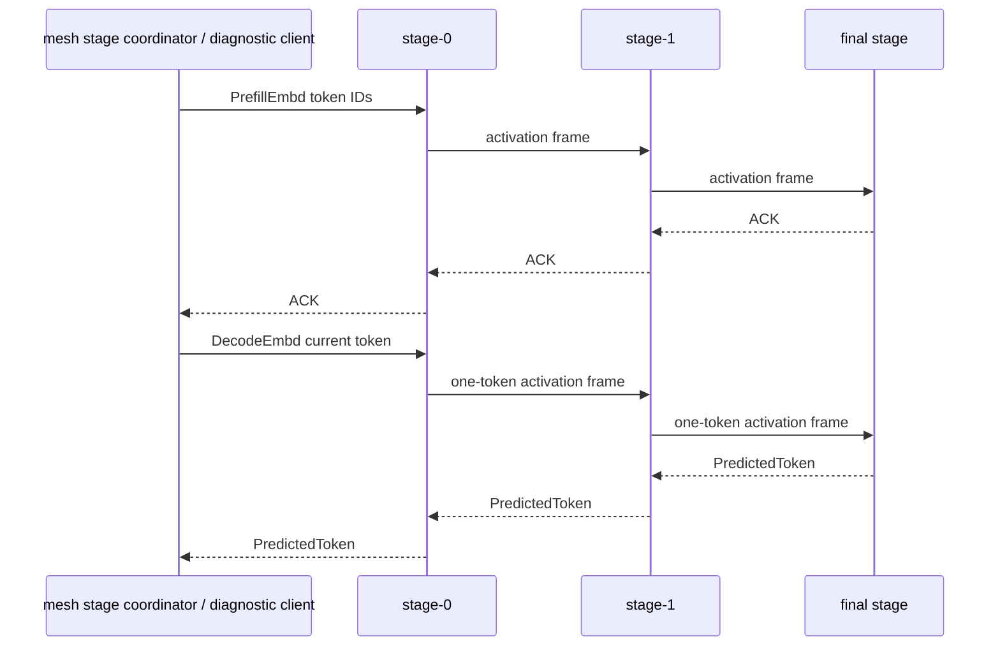

# skippy-protocol

Versioned protocol types for staged execution.

This crate owns wire-compatible message, reply, activation, and state-header
encoding. It should remain independent of server process lifecycle and llama ABI
bindings.

## Architecture Role

`skippy-protocol` is the `skippy-stage/1` binary contract between mesh's stage
coordinator/diagnostic clients and the stage chain, and between neighboring
stage servers. It is separate from mesh gossip/control protocol `mesh-llm/1`.



Activation payloads dominate the wire path. The protocol supports `f32`, `f16`,
and `q8` activation wire dtypes so transport experiments can reduce payload
size without changing the stage execution contract.

## Responsibilities

- binary stage message and reply codecs
- activation wire dtype conversion
- ready handshake encoding
- stage config fields that must survive JSON generation, including K/V cache
  type strings consumed by the runtime layer
- protocol compatibility constants

Because skippy is new inside mesh, this protocol can evolve independently from
the stable mixed-version mesh protocol. Keep changes explicit and versioned so
stage nodes fail closed instead of corrupting an active topology.

Run protocol tests with:

```bash
cargo test -p skippy-protocol
```
