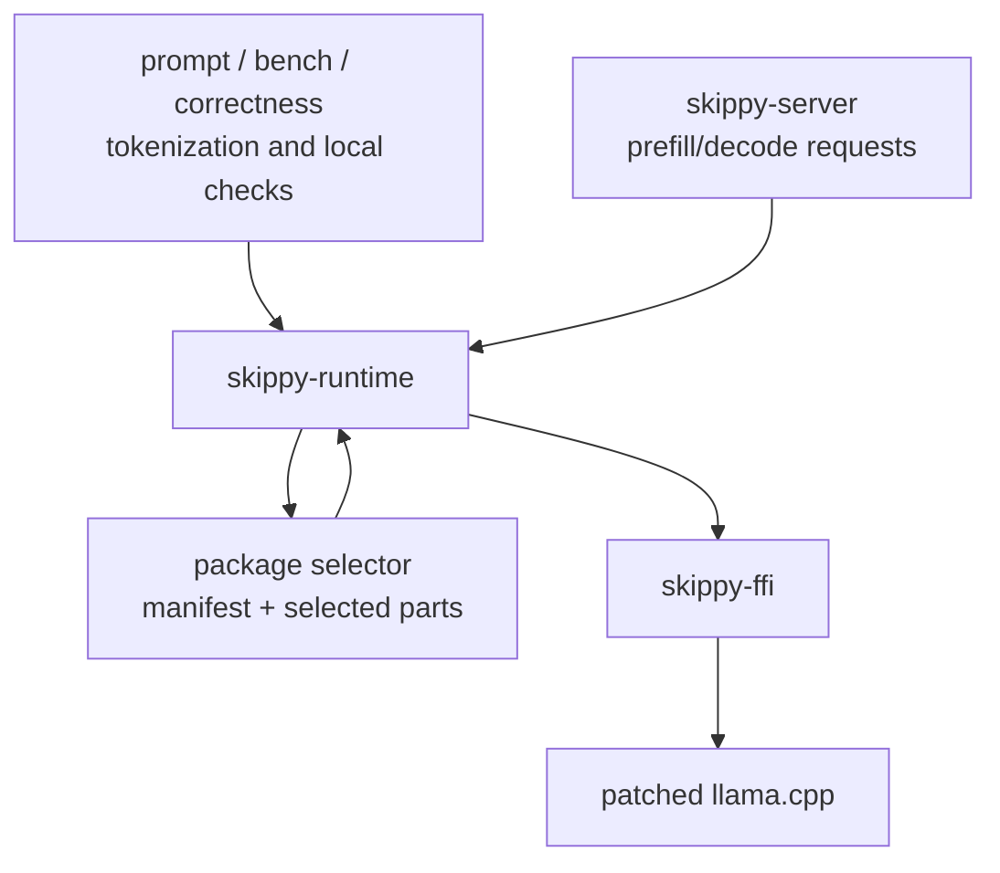

# skippy-runtime

Safe Rust wrapper around the experimental skippy C ABI.

This crate owns Rust-side model/session wrappers and converts raw ABI buffers
into typed runtime structures.

## Architecture Role

`skippy-runtime` is the safe model/session layer used by servers, prompt
drivers, benchmarks, correctness checks, and slicing tools. It does not own TCP
transport, sidecar process lifecycle, or telemetry export.

For inference, the runtime opens a stage view, creates a session, runs prefill
or decode for that stage's layer range, and returns either an activation frame
for downstream stages or a predicted token on the final stage. KV page
probe/export/import also passes through this crate for runtimes that expose
native cache page movement.

## Responsibilities

- open staged model views
- create runtime sessions
- tokenize and detokenize through llama
- run prefill/decode calls
- set llama.cpp context options needed by staged serving, including K/V cache
  type selection for TCQ/TurboQuant experiments and selected backend device
  placement
- expose activation frames with descriptors and payloads
- select layer-package parts from local or Hugging Face package refs
- validate package ABI/manifest compatibility before loading or composing parts
- compose materialized package stages for tools that need a concrete GGUF path
- open selected package parts directly through the ABI for server runtime loads

Keep service lifecycle, transport, and telemetry in higher-level crates.
