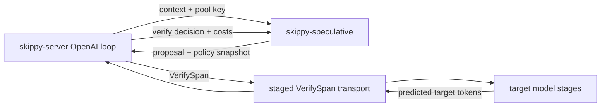
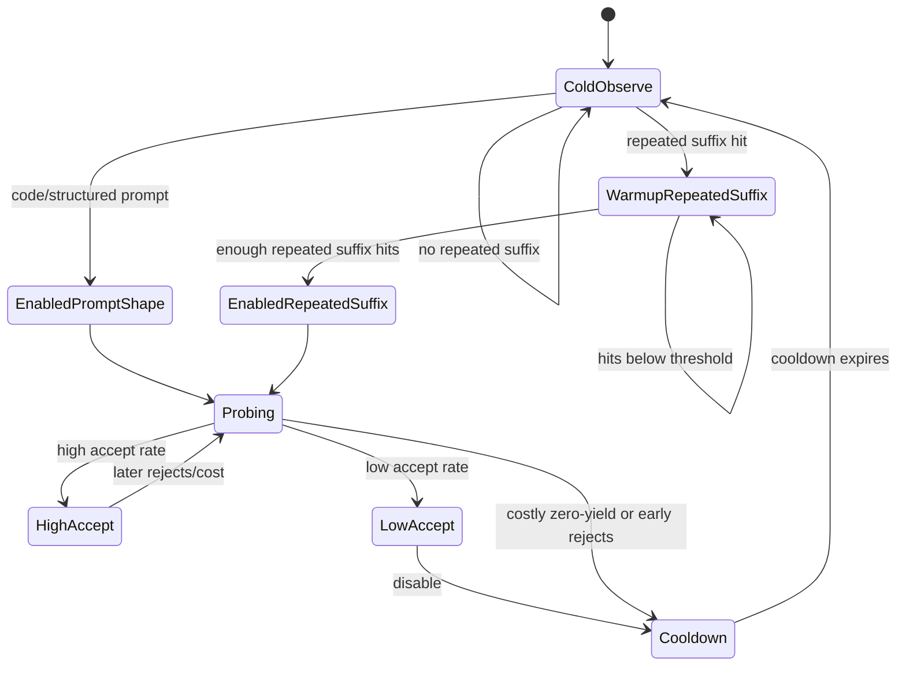
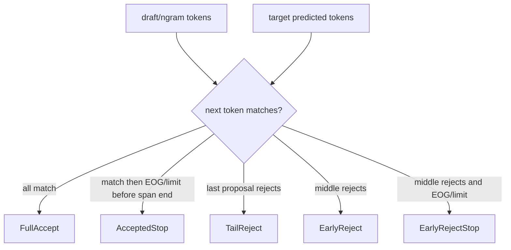
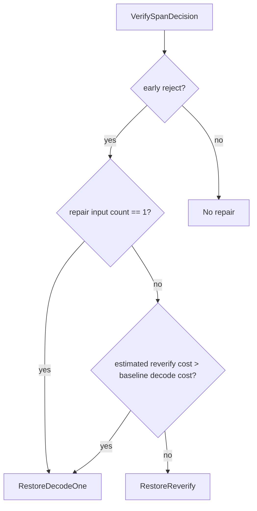

# skippy-speculative

`skippy-speculative` owns the reusable speculative decoding policy pieces shared
by Skippy serving paths. It intentionally does not load models, run the staged
transport, or own OpenAI request handling. The crate answers smaller questions:

- when an n-gram pool should propose;
- how large an adaptive proposal window should be;
- how a verified proposal span should be classified;
- which repair strategy is cheapest after an early reject.

The target model remains the source of truth. Proposal tokens are only a
performance hint; correctness comes from target verification.

## Crate Boundary

The crate is deliberately model-free. Neural draft runners and future native
MTP proposers can use the same span classification and repair helpers, but
model loading and probability-aware sampling belong outside this crate until
the runtime and wire protocol expose the needed data.

## N-Gram Auto Policy

N-gram proposal state is stored per pool. A pool is keyed outside this crate by
the serving layer, typically using model identity plus OpenAI `user` or a prompt
prefix hash.

Manual activation preserves the older behavior: stable-user pools can try
n-gram immediately, while anonymous pools wait for a repeated suffix. Auto
activation is more conservative: it enables immediately for prompt-shape
candidates, otherwise it observes repeated suffix hits before spending verifier
work.

## Verification Decisions

`classify_verify_span` compares proposed tokens with target-predicted tokens and
returns a compact decision used by the serving loop.

Tail rejects need no restore because the target state has advanced exactly to
the committed point. Early rejects require a repair choice because the verifier
has evaluated past the accepted prefix.

## Repair Strategy

The repair selector is cost-aware for n-gram proposals. It estimates reverify
cost from the primary verification span and compares it with the pool's recent
non-speculative decode cost.

## Benchmark Evidence

The current promotion evidence lives in
[`docs/skippy/speculative_decoding.md`](../../docs/skippy/speculative_decoding.md).
The short version:

- `--openai-ngram-auto` is default-ready for skippy serving.
- Local Qwen3.6 long gates show neutral or positive mixed traffic and strong
  warm coding-loop wins.
- Depth-4 concurrency stress completed with zero errors and neutral throughput.
- Draft-model speculation remains explicit and assistant-dependent.

Use `just skippy-openai-ngram-bench` from the repo root for the local OpenAI
speculation gate.
