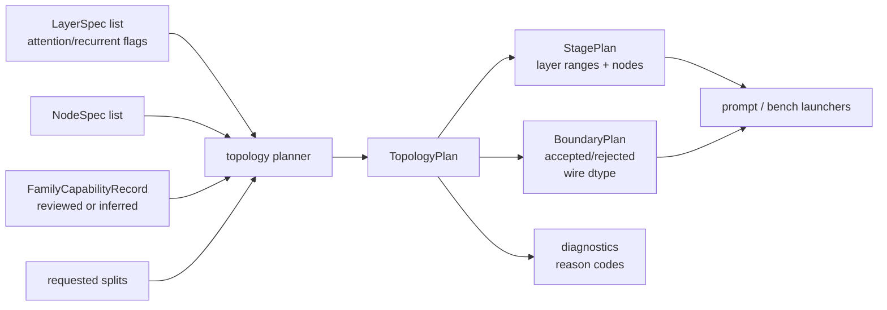
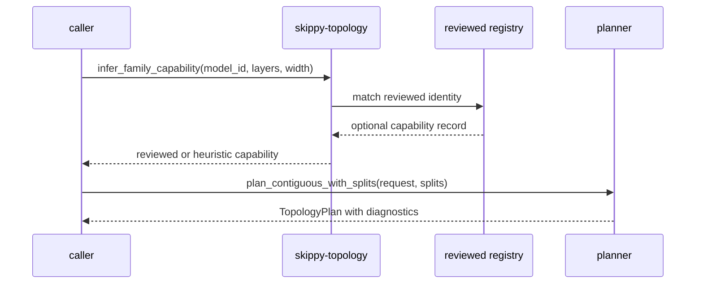

# skippy-topology

Topology planning and model-family capability policy.

`skippy-topology` turns model layers, node capacity, requested split points,
and optional family capability records into a validated stage plan. It is a pure
Rust planning crate: no model loading, process launching, sockets, telemetry, or
GGUF writing.

## Architecture Role

Prompt, benchmark, and correctness flows ask this crate whether a split plan is
acceptable before slicing models or starting servers. The returned plan carries
stage ranges, boundary decisions, wire dtype policy, and diagnostics.

## Family Policy Flow

Reviewed capability records live in
`crates/skippy-topology/capabilities/reviewed-family-capabilities.json`.

## Responsibilities

- validate contiguous layer ranges and split boundaries
- produce even contiguous plans or explicit split plans
- classify stages as stateless, attention-KV, recurrent, or mixed
- reject family-forbidden boundaries such as shared KV producer/consumer cuts
- report activation wire dtype and payload sizing
- infer capabilities for reviewed and known dense/recurrent families

Use this crate before `llama-model-slice`, `skippy-prompt`, or
`skippy-bench` commits to a runnable stage layout.
