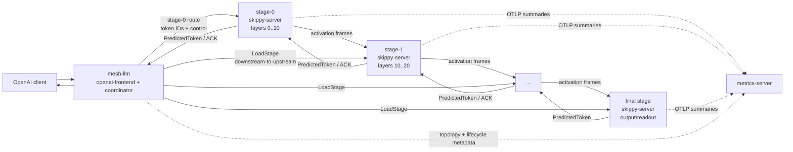
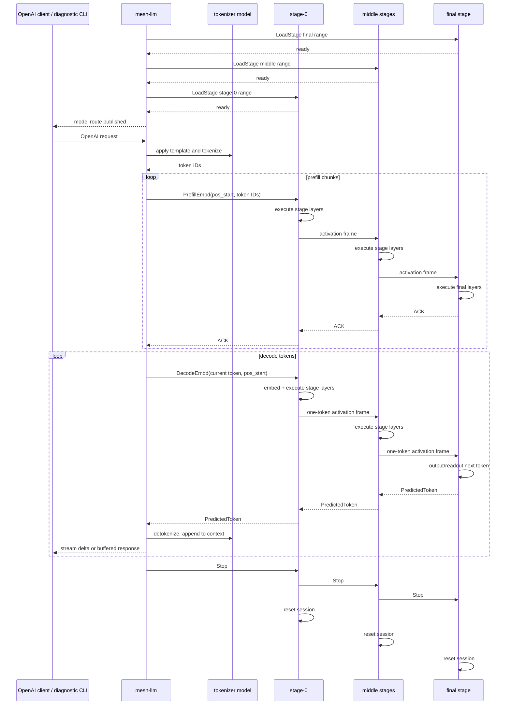
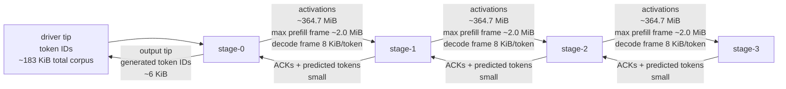
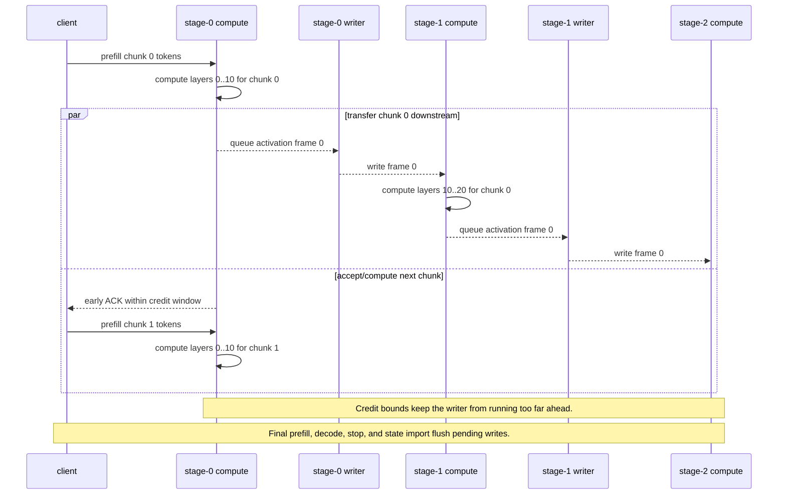
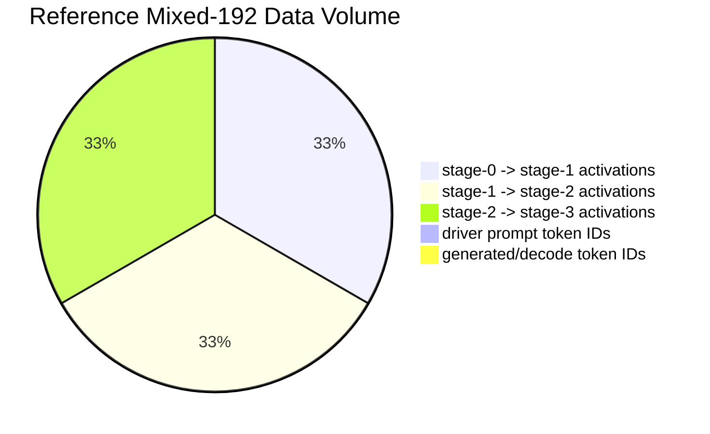
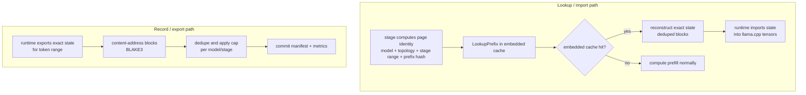

# Skippy Runtime README

This document is copied from the standalone skippy runtime repository to
preserve the original runtime context while mesh-llm absorbs the relevant
pieces. Treat it as source-background material, not the mesh integration
contract.

Mesh's integration plan intentionally drops standalone `kv-server` and
`ngram-pool` from the replacement scope. Where this README describes those
sidecars, read that as historical skippy runtime context rather than planned
mesh behavior. The mesh-specific replacement plan lives in
[SKIPPY.md](SKIPPY.md).

# Skippy Runtime

Rust workspace for the production staged llama runtime.

The production architecture and milestone plan live in [docs/SPEC.md](docs/SPEC.md).

Model execution remains in llama.cpp behind the experimental
`skippy.h` C ABI. The Rust workspace owns server lifecycle, protocol,
metrics, slicing utilities, benchmark orchestration, and correctness tooling.

Quick mental model for the mesh integration: mesh receives OpenAI requests,
normalizes them through `openai-frontend`, routes to stage 0, stage servers pass
activation frames, and the final stage returns token IDs. Exact cache work is a
future embedded-runtime feature, not a standalone `kv-server` sidecar path.

## Architecture

`skippy-runtime` splits one llama-family model into a linear chain of
stage processes. Each `skippy-server` owns one contiguous layer range, for
example `stage-0` owns layers `0..10`, `stage-1` owns `10..20`, and so on. A
driver such as `skippy-prompt` or `skippy-bench` connects only to the
first stage. Every non-final stage connects to its configured downstream peer
over the binary stage protocol, and the final stage produces logits and the next
token reply.



The stage server process owns model loading, readiness, TCP accept/connect,
binary message handling, calls into `skippy-runtime`, and non-blocking
telemetry. Model math still happens inside patched llama.cpp through the stage
ABI. `skippy-protocol` owns the wire format for ready handshakes, prefill
messages, decode messages, activation payloads, ACKs, and predicted-token
replies. `metrics-server` is observational only; request execution must not
wait on telemetry export.

Mesh intentionally does not carry the standalone `kv-server` topology. Future
exact-cache work should live behind the embedded runtime lifecycle, use full
model/topology/stage identity, and emit metrics without adding separate sidecar
ownership to the serving path.

Stage configs describe the chain:

- `stage_id`, `stage_index`, `layer_start`, and `layer_end` identify the shard.
- for package-backed stages, `model_path` points at the package ref/directory;
  the runtime selects the manifest parts for the stage range and loads them
  directly, without composing a per-stage GGUF file.
- `upstream` and `downstream` describe the neighboring stages.
- cache-related fields are runtime-owned and must remain tied to exact
  model/topology/stage identity when reintroduced.

Historical standalone prompt runs materialized a complete runnable topology
under a run directory. Mesh package-backed serving no longer materializes
per-stage GGUF shards; the old local layout looked like:

```text
/tmp/skippy-prompt/model-cache/<cache-key>/stage-N.gguf
/tmp/skippy-prompt/<run-id>/configs/stage-N.json
/tmp/skippy-prompt/<run-id>/stage-N.log
/tmp/skippy-prompt/<run-id>/metrics.duckdb
```

For multi-host runs, the launcher keeps local materialized shards in
`/tmp/skippy-prompt/model-cache`, then rsyncs stage inputs to each
remote host under:

```text
/tmp/skippy-remote-prompt/model-cache/<cache-key>/stage-N.gguf
/tmp/skippy-remote-prompt/binary-cache/<binary-key>/skippy-server
/tmp/skippy-remote-prompt/runs/<run-id>/stage-N/stage-N.json
/tmp/skippy-remote-prompt/runs/<run-id>/stage-N/stage-N.log
```

Standalone cache sidecars are not part of the mesh integration.

### Where Things Live

| Artifact | Prompt CLI local path | Multi-host path | Owner |
| --- | --- | --- | --- |
| Stage GGUF shard | `/tmp/skippy-prompt/model-cache/<cache-key>/stage-N.gguf` | `/tmp/skippy-remote-prompt/model-cache/<cache-key>/stage-N.gguf` | `skippy-model-package`, launcher |
| Stage config | `<run-root>/<run-id>/configs/stage-N.json` | `<remote-root>/runs/<run-id>/stage-N/stage-N.json` | launcher, `skippy-server` |
| Logs | `<run-root>/<run-id>/stage-N.log` | `<remote-root>/runs/<run-id>/stage-N/stage-N.log` | launcher |
| Metrics DB | `<run-root>/<run-id>/metrics.duckdb` | launcher host run directory | `metrics-server` |

### Config Shape

A generated stage config points a server at one model shard, one layer range,
and its upstream/downstream peers:

```json
{
  "run_id": "prompt-...",
  "topology_id": "local-binary-repl",
  "model_id": "unsloth/Qwen3.6-35B-A3B-GGUF:UD-Q4_K_XL",
  "model_path": "/tmp/skippy-prompt/model-cache/.../stage-1.gguf",
  "stage_id": "stage-1",
  "stage_index": 1,
  "layer_start": 10,
  "layer_end": 20,
  "ctx_size": 4096,
  "n_gpu_layers": -1,
  "filter_tensors_on_load": true,
  "load_mode": "artifact-slice",
  "bind_addr": "127.0.0.1:19032",
  "upstream": {
    "stage_id": "stage-0",
    "stage_index": 0,
    "endpoint": "tcp://127.0.0.1:19031"
  },
  "downstream": {
    "stage_id": "stage-2",
    "stage_index": 2,
    "endpoint": "tcp://127.0.0.1:19033"
  }
}
```

Exact-cache configuration will be added as embedded runtime configuration when
that feature returns. It should identify model, topology, stage range, cache
namespace, cap, and metrics endpoint without introducing standalone sidecar
ownership:

```json
{
  "cache": {
    "mode": "lookup-record",
    "namespace": "customer-or-workload",
    "max_bytes": 1073741824,
    "payload": "kv-recurrent",
    "dedupe": "blake3"
  },
  "run_id": "prompt-...",
  "metrics": {
    "otlp_grpc_endpoint": "http://127.0.0.1:14317",
    "export_interval_ms": 5000
  }
}
```

## Inference Data Flow

A typical binary-chain request moves through these phases:



1. Mesh loads stages downstream-to-upstream, waits for readiness, and publishes
   the stage-0 route only after the topology is ready.
2. Mesh opens a tokenizer/runtime view through `skippy-runtime` and tokenizes
   the prompt text to token IDs. The stage chain receives token IDs, not raw
   text.
3. Mesh connects to `stage-0`, waits for the ready handshake, then sends
   prompt tokens as `PrefillEmbd` chunks. Each message carries `pos_start`,
   `token_count`, sideband token IDs, and an empty activation payload because
   the first stage starts from embeddings.
4. A non-final stage emits an activation frame for the same token span and
   forwards it downstream. The receiving stage consumes that activation as its
   input, computes its own layer range, and forwards the next activation frame.
   Prefill messages usually require only ACKs; the final predicted token is not
   needed until decode.
5. Decode starts with the final prompt token as the current token. Mesh
   sends one `DecodeEmbd` message per generated token with `token_count = 1`
   and `pos_start = prefill_tokens + decode_index`.
6. `stage-0` embeds and executes its layers for that token, then forwards a
   one-token activation frame. Each downstream stage repeats the same pattern.
   The final stage runs the output/readout path, samples or selects the next
   token through the runtime ABI, and sends a `PredictedToken` reply upstream.
7. Intermediate stages relay that predicted-token reply back to the previous
   hop. The client detokenizes the returned token for display, appends it to the
   context, and sends the next decode step until `max_new_tokens`, EOG, or an
   error.
8. The client sends `Stop`. Each stage forwards the stop message downstream,
   emits its request summary, resets the stage session, and drops local session
   state. Future exact-cache state, when enabled, remains available according
   to embedded runtime cache policy.

Activation traffic dominates this path. Prompt tokens, ACKs, predicted-token
replies, and telemetry are small compared with stage-to-stage activation frames;
see [docs/DATA_FLOW.md](docs/DATA_FLOW.md) for measured sizes.

### Tip-to-Tip and Middle-Out

Tip-to-tip is the full stage-chain path: token IDs enter at the driver-facing
tip, move forward through stage-0, middle stages, and the final stage, then the
predicted-token reply travels back upstream to the driver. Middle-out is the
overlapped handoff inside that path, where boundary activations leave the
middle of the model while compute continues on the next chunk.

The expensive stage-to-stage payload is the boundary activation frame: the
hidden state produced by one layer range and consumed by the next. In the
reference four-stage Qwen3.6 run, prompt token/control bytes were only about
`183 KiB` for the corpus, while each stage boundary carried about `364.7 MiB`
of activation frames. With `f32` and `--prefill-chunk-size 256`, the largest
prefill activation frame is about `2.0 MiB`; decode is much smaller at
`8 KiB/token/boundary`.

Middle-out is the data path where that internal hidden-state stream is handed
off from the middle of the model while compute continues around it. It is not
raw KV transfer; it is the boundary hidden-state stream that the downstream
stage's attention and feed-forward layers consume.



The runtime tries to hide that transfer during prefill by chunking the prompt
and letting non-final stages move activation frames while other work continues.
`--prefill-chunk-size` controls the frame size, `--stage-max-inflight` and
`--stage-reply-credit-limit` bound how many downstream prefill replies can be
deferred, and `--async-prefill-forward` moves eligible non-final prefill writes
onto a bounded background writer.



Without chunking, a stage tends to compute a large prompt span and then pay a
large downstream write before the next stage can start. With chunking and credit,
the chain behaves more like a wavefront: while `stage-1` consumes chunk `i`,
`stage-0` can be computing chunk `i+1`, and a writer thread can be draining the
activation frame for chunk `i` to the next host. That overlap can reduce TTFT
when the network and receiver can keep up, but it is topology dependent:
`--async-prefill-forward` remains opt-in, and benchmark notes in
[docs/EXPERIMENTS.md](docs/EXPERIMENTS.md) should be checked before promoting a
new default.



### Future Exact-Cache Lifecycle

Exact cache support should be embedded under mesh/runtime lifecycle. The stage
server owns runtime import/export calls, while cache lookup, dedupe, eviction,
and telemetry stay tied to model/topology/stage identity and remain invisible to
the OpenAI routing surface.



### KV Performance Notes

Current KV performance work keeps the request path nonblocking and makes hot
cache reuse cheap, but the recorder still needs scheduling work before cold
adjacent repeated-prefix traffic consistently wins.

- Record candidate fanout is bounded by `shared_prefix_record_limit`. The
  default records the exact prompt prefix plus a small number of shared-prefix
  anchors instead of every stride candidate. Set it to `0` only for exhaustive
  experiments.
- Record commits run on a background recorder path. Stages queue native KV page
  export after prefill compute, skip duplicate inflight page records, and avoid
  waiting for remote or local commit completion before continuing the request.
- Local hot pages are attached by fd and imported into llama.cpp KV tensors.
  Qwen3.6 hot-cache HTTP lookup-record runs measured imported-hit attach/import
  around `0.12 ms` mean for the small shared-prefix corpus; warmed sessions
  avoid that import on the requests that consume a prepared idle session.
- Binary first-stage or full-model prefill can use a partial prefix hit and
  compute only the suffix tokens. Non-final stages still compute boundary
  activations until activation slicing is added.
- The native llama.cpp export path now scans KV cells once to map token
  positions before copying page tensors. A broader batched tensor copy
  experiment was slower on Metal in the Qwen3.6 smoke, so it was not kept.

Fast local import does not automatically mean a cold sequential benchmark gets
faster. In a Qwen3.6 eight-request shared-prefix loop, the immediate async
record pass saw `8/8` misses and averaged `278.96 ms` because the requests
outran the background recorder. A second pass over the populated cache saw
`6` imported hits, `2` warm-session hits, and averaged `138.35 ms`. The
previous synchronous/fixed reference averaged `232.62 ms`. The next production
optimization should prioritize shared-anchor records first, then full prompt
pages, so adjacent repeated-prefix requests hit during the first pass without
putting full record commit back on the request path.

### Current Limitations

- Non-final stages still need to produce boundary activations for downstream
  stages, even when local KV helps with parts of prefill.
- Binary transport can skip suffix compute for first-stage/full-model partial
  prefix hits. Non-final stages still need activation slicing before partial
  hits can skip compute safely.
- `--async-prefill-forward` is an overlap tool, not a universal win. It should
  be benchmarked per topology, chunk size, activation dtype, and link.
- The speculative prompt path uses staged `VerifySpan` requests for draft and
  n-gram proposal windows. Full-window acceptance keeps the advanced stage
  session in place. Each stage checkpoints its session inline immediately before
  executing `VerifySpan`; on rejection the prompt CLI sends `RestoreSession`
  and re-verifies only the accepted/replacement prefix needed to leave the stage
  chain at the visible output context. Stage checkpoints record the verified
  token position and keep recurrent checkpoints inside the native session;
  restore trims the native attention KV suffix and restores the recurrent
  sequence slot without exporting/importing full state through the host.
- Hot KV bytes are anonymous shared memory attached by fd. The durable-looking
  files under `page_root/manifests` are metadata; they are not ordinary raw KV
  payload files.

### Follow-Up Investigations

- Investigate batched target verification throughput now that checkpoints are
  inline with `VerifySpan`. The next likely win is reducing speculative
  verification compute/transport per window rather than optimizing rollback
  bookkeeping.

## Llama Patch Workflow

This repo carries the llama-side ABI as clean patches on top of upstream
`ggml-org/llama.cpp` `master`.

- `third_party/llama.cpp/upstream.txt` pins the validated upstream commit.
- `third_party/llama.cpp/patches/*.patch` is the Mesh-LLM stage ABI patch
  stack.
- `just llama-prepare` checks out the pinned upstream commit into
  `.deps/llama.cpp` and applies the patches.
- `just llama-build` builds patched llama.cpp as static archives, using
  `sccache` when it is installed.

Linux GPU backend builds use the same patch stack but should write to distinct
build directories. `scripts/build-llama.sh` accepts `LLAMA_STAGE_BACKEND`
with `cuda`, `rocm`/`hip`, or `vulkan`:

```bash
just llama-prepare

LLAMA_STAGE_BACKEND=cuda \
LLAMA_STAGE_CUDA_ARCHITECTURES=89 \
  scripts/build-llama.sh
LLAMA_STAGE_BUILD_DIR=.deps/llama.cpp/build-stage-abi-cuda \
  cargo build --workspace

LLAMA_STAGE_BACKEND=rocm \
LLAMA_STAGE_AMDGPU_TARGETS=gfx1036 \
  scripts/build-llama.sh
LLAMA_STAGE_BUILD_DIR=.deps/llama.cpp/build-stage-abi-rocm \
  cargo build --workspace

LLAMA_STAGE_BACKEND=vulkan \
  scripts/build-llama.sh
LLAMA_STAGE_BUILD_DIR=.deps/llama.cpp/build-stage-abi-vulkan \
  cargo build --workspace
```

Set `LLAMA_STAGE_CUDA_ARCHITECTURES` or `LLAMA_STAGE_AMDGPU_TARGETS` when the
build host cannot reliably infer a device architecture, such as compile-only
ROCm hosts or newer NVIDIA GPUs with an older CUDA compiler.

Set `SKIPPY_CORRECTNESS_MODEL=/path/to/model.gguf` before
the skippy correctness tests to include model-backed `skippy-correctness`
single-step and binary-chain smokes.

Rust builds also use `sccache` automatically when it is available and
`RUSTC_WRAPPER` is not already set. Set `LLAMA_STAGE_USE_SCCACHE=0` to disable
that local auto-detection.

By default, `skippy-ffi` statically links the patched `libllama.a` and
ggml archives from `.deps/llama.cpp/build-stage-abi-static`. Dynamic linking is
kept as an explicit escape hatch with `LLAMA_STAGE_LINK_MODE=dynamic` and
`LLAMA_STAGE_LIB_DIR=/path/to/lib`.
On Linux static builds, `skippy-ffi` also detects and links ggml CUDA, HIP, and
Vulkan backend archives when they are present in `LLAMA_STAGE_BUILD_DIR`.

## Crates

- `skippy-ffi` - raw ABI boundary and constants
- `skippy-runtime` - safe Rust wrapper around the ABI
- `skippy-protocol` - stage messages and load-mode types
- `skippy-metrics` - OTEL/report naming conventions
- `skippy-server` - stage service binary
- `skippy-model-package` - model inspection and stage-package CLI
- `skippy-correctness` - staged-vs-full validation CLI
- `metrics-server` - benchmark telemetry service
- `skippy-bench` - benchmark launcher
- `skippy-prompt` - diagnostic prompt CLI for mesh-managed stage chains
- `llama-spec-bench` - local target/draft speculative pair checker

## Prompt CLI

For speculative decoding modes, diagrams, usage, and current benchmark notes,
see [`SPECULATIVE_DECODING.md`](SPECULATIVE_DECODING.md).

For local prompt diagnostics against the staged runtime:

```bash
just prompt /path/to/model.gguf
```

Historically this launcher started all local sidecars itself. In mesh, normal
topology and lifecycle are owned by `mesh-llm`; `skippy-prompt binary` is the
diagnostic path for a running first-stage endpoint. The prompt CLI is
implemented in the `skippy-prompt` Rust crate and streams decode tokens over
the binary stage protocol.
Pass extra script flags through the recipe, for example:

```bash
just prompt /path/to/model.gguf --max-new-tokens 64 --ctx-size 4096
```

To host the full model in one stage, use:

```bash
just prompt /path/to/model.gguf --single-stage
```

That mode infers the model layer count, materializes one full-range stage
artifact with embeddings and output tensors, and starts one binary stage server.

Future embedded exact-cache support can let first-stage or full-model prefill
restore a local prefix hit and compute only the suffix. Non-final stages still
need a coherent boundary activation stream whenever an upstream stage falls
back to recompute.

Each prompt CLI process has a chain-wide `session_id`. Pass `--session-id` to
choose it explicitly; otherwise the REPL generates one. The CLI keeps that
human-readable ID for logs, but hashes it to a nonzero `u64` for the binary
stage protocol. Every binary prefill, decode, verify-span, and stop message
carries fixed-width `u64` `session_id` and `request_id` fields; the wire does
not carry variable-length ID strings in the prefill path. The binary message
fixed prefix is currently 72 bytes before token sideband or activation payload.
Binary stages use the incoming session ID for runtime stage sessions, future
cache identity, and telemetry, so concurrent prompt sessions do not collapse
into stage-local connection identifiers.

### Multi-Host Prompt CLI

Use `--hosts` to spread one stage per host. The host count determines the stage
count; a single host is valid when you want one remote full-model stage:

```bash
just prompt \
  /Volumes/External/models/huggingface/hub/models--unsloth--Qwen3.6-35B-A3B-GGUF/snapshots/9280dd353ab587157920d5bd391ada414d84e552/Qwen3.6-35B-A3B-UD-Q4_K_XL.gguf \
  --model-id unsloth/Qwen3.6-35B-A3B-GGUF \
  --hosts shadowfax.local,black.local,build.local,studio54.local \
  --max-new-tokens 128
```

With four hosts and the default `--layer-end 40`, the launcher materializes and
runs these shards:

```text
shadowfax.local  stage-0  layers 0..10
black.local      stage-1  layers 10..20
build.local      stage-2  layers 20..30
studio54.local   stage-3  layers 30..40
```

For three hosts the split is `0..14`, `14..27`, `27..40`. To control the split
explicitly, pass boundary values such as `--splits 12,25`; the resulting
ranges are `0..12`, `12..25`, `25..40`, and the range count must match the
number of hosts.

Each remote host receives only its `stage-N.gguf` shard plus the binaries needed
for that stage. It does not load the full source GGUF. The launcher uses `rsync`
over SSH, prints transfer progress for each file, and reuses caches when the
same model shard or binary is already present:

```text
/tmp/skippy-prompt/model-cache      local materialized shards
/tmp/skippy-remote-prompt/model-cache     remote shard cache
/tmp/skippy-remote-prompt/binary-cache    remote binary cache
/tmp/skippy-remote-prompt/runs            per-run configs and logs
```

Requirements:

- Passwordless SSH from the launcher to every host.
- `rsync` on the launcher and every host.
- Compatible OS/architecture for the locally built Rust binaries.
- Stage ports are reachable between hosts. The first stage uses
  `--first-stage-port` and each next stage increments it by one.
- The launcher runs `metrics-server` and exposes OTLP on `0.0.0.0:14317`.
  Remote stages report metrics back to the launcher; override with
  `--metrics-otlp-grpc-url` if the inferred launcher address is wrong.

Useful flags:

```text
--log-tail-lines N        default line count for :logs; default 80
--remote-root PATH        remote cache/run root; default /tmp/skippy-remote-prompt
--max-new-tokens N        response length cap
--prefill-chunk-size N    prompt prefill chunk size
--ctx-size N              llama context size
--decode-timeout-secs N   per-stage-chain read/write timeout while generating
--adaptive-speculative-window
                           grow/shrink speculative window up to --speculative-window
```

### Draft Speculative Prompt Example

The prompt CLI can run a small local draft model with `--draft-model-path` and
verify proposed windows against the staged target model using `VerifySpan`.
Accepted windows advance in one staged request; each stage creates the
pre-window checkpoint inline before running the verify span. If the target
rejects part of a window, the prompt CLI restores that checkpoint and
re-verifies only the accepted/replacement prefix before continuing. Restore
trims the speculative attention KV suffix and uses the native recurrent
checkpoint slot for recurrent models.

The draft model must be loadable by the runtime-slice ABI. Today that includes
plain Llama, dense Qwen2/Qwen3, Gemma/Gemma4, and DeepSeek2 graphs. Falcon-H1
has initial hybrid recurrent runtime-slice support; other hybrid
families still need family-specific validation before they can be treated as
supported runtime-slice targets.

Once you have a compatible local draft GGUF, run the four-host Qwen3.6 target
with:

```bash
just prompt \
  /Volumes/External/models/huggingface/hub/models--unsloth--Qwen3.6-35B-A3B-GGUF/snapshots/9280dd353ab587157920d5bd391ada414d84e552/Qwen3.6-35B-A3B-UD-Q4_K_XL.gguf \
  --model-id unsloth/Qwen3.6-35B-A3B-GGUF \
  --hosts shadowfax.local,black.local,build.local,studio54.local \
  --max-new-tokens 128 \
  --ctx-size 16384 \
  --draft-model-path /Volumes/External/models/drafts/qwen3.6-28b-reap20-a3b-q2k/Qwen3.6-28B-REAP20-A3B-Q2_K.gguf \
  --speculative-window 8 \
  --adaptive-speculative-window
```

The tested draft candidate is:

```text
barozp/Qwen3.6-28B-REAP20-A3B-GGUF
Qwen3.6-28B-REAP20-A3B-Q2_K.gguf
```

The stats block includes draft acceptance counters when a draft model is active:

```text
spec     windows=12 draft=48 accepted=31 rejected=11 accept_rate=64.6%
```

`--speculative-window` controls the fixed proposal window by default. Add
`--adaptive-speculative-window` to treat it as a maximum: the prompt starts at
`min(4, --speculative-window)`, grows after full accepts or tail rejects, and
shrinks after early rejects. Prompt stats report acceptance shape, window
policy, checkpoint, restore, and recovery reverify timings.

### N-Gram Speculative Prompt Example

Standalone n-gram pool serving is not part of the mesh integration. Keep older
n-gram benchmark notes as historical evidence only; new speculative work should
enter through mesh-owned runtime hooks and be validated by
`llama-spec-bench`, `skippy-correctness`, and `skippy-bench`.

Inside the prompt CLI, `:history` shows prior prompts, `:logs [name] [lines]`
tails process logs, `:rerun N` repeats a prompt, and `:quit` tears down the
launcher-owned local and remote processes. Interactive prompts are rendered as
single user chat turns by default; pass `--raw-prompt` when you want raw
completion-style continuation for benchmark or corpus work. Visible
`<think>...</think>` blocks are stripped from streamed output by default; pass
`--show-thinking` to display them. Prompt CLI chat turns render with
`enable_thinking=false` by default; pass `--thinking-token-budget N` to opt into
template-level thinking.

## Speculative Pair Benchmark

Before using a draft model in `just prompt`, run `llama-spec-bench` to check the
target/draft pair locally. It loads both GGUFs through the runtime-slice ABI,
checks tokenizer agreement, runs baseline target decode, runs draft-verified
decode, verifies the generated target tokens match, and reports draft acceptance
plus local decode timings.

By default, the recipe uses
`crates/skippy-bench/corpora/kv_mixed_prompts.jsonl`. That corpus has
short, long, and repeated-prefix prompts. Override it with `--prompt-corpus`, or
pass one or more `--prompt` values for a tiny smoke.

```bash
just spec-bench \
  /Volumes/External/models/huggingface/hub/models--unsloth--Qwen3.6-35B-A3B-GGUF/snapshots/9280dd353ab587157920d5bd391ada414d84e552/Qwen3.6-35B-A3B-UD-Q4_K_XL.gguf \
  /Volumes/External/models/drafts/qwen3.6-28b-reap20-a3b-q2k/Qwen3.6-28B-REAP20-A3B-Q2_K.gguf \
  --prompt-limit 8 \
  --max-new-tokens 64 \
  --speculative-window 4 \
  --ctx-size 16384 \
  --json-out /tmp/qwen3.6-spec-bench.json
```

Useful flags:

```text
--prompt-limit N
--prompt-id kv-long-003
--prompt "What is the capital of France?"
--prompt-corpus /path/to/prompts.jsonl
--max-new-tokens 128
--speculative-window 4
--ctx-size 16384
--json
--json-out /tmp/spec-bench.json
--allow-mismatch
--debug-projection
```

## Prompt Speculative Sweep

Use the prompt sweep when changing staged `VerifySpan`, checkpoint/restore, or
window policy behavior. It runs the real staged prompt topology through fixed and
adaptive speculative windows, preserves each raw prompt log, and prints the
high-signal timing/acceptance/recovery lines:

```bash
PROMPT_SPEC_SWEEP_WINDOWS=2,4,6,8 \
PROMPT_SPEC_SWEEP_MAX_TOKENS=32 \
just prompt-spec-sweep \
  /Volumes/External/models/huggingface/hub/models--unsloth--Qwen3.6-35B-A3B-GGUF/snapshots/9280dd353ab587157920d5bd391ada414d84e552/Qwen3.6-35B-A3B-UD-Q4_K_XL.gguf \
  /Volumes/External/models/drafts/qwen3.6-28b-reap20-a3b-q2k/Qwen3.6-28B-REAP20-A3B-Q2_K.gguf
```

Useful environment knobs:

```text
PROMPT_SPEC_SWEEP_PROMPT       prompt text
PROMPT_SPEC_SWEEP_WINDOWS      comma-separated max windows; default 2,4,6,8
PROMPT_SPEC_SWEEP_MAX_TOKENS   max generated tokens; default 32
PROMPT_SPEC_SWEEP_CTX_SIZE     context size; default 1024
PROMPT_SPEC_SWEEP_TIMEOUT_SECS decode timeout; default 120
PROMPT_SPEC_SWEEP_LOG_DIR      log directory
```

## Prompt Speculative Corpus

Use the prompt corpus runner for actual staged prompt numbers across baseline,
draft, adaptive draft, n-gram, and adaptive n-gram modes. It keeps raw logs and
partial summaries under `target/prompt-spec-corpus/<timestamp>` by default, so a
failed mode still leaves completed prompt stats and a repro log:

```bash
just bench-corpus smoke

PROMPT_SPEC_CORPUS_LIMIT=8 \
PROMPT_SPEC_CORPUS_MODES=baseline,ngram,ngram-adaptive \
PROMPT_SPEC_CORPUS_WINDOWS=2,4,8 \
PROMPT_SPEC_CORPUS_MAX_TOKENS=16 \
PROMPT_SPEC_CORPUS=target/bench-corpora/smoke/corpus.jsonl \
just prompt-spec-corpus \
  /Volumes/External/models/huggingface/hub/models--unsloth--Qwen3.6-35B-A3B-GGUF/snapshots/9280dd353ab587157920d5bd391ada414d84e552/Qwen3.6-35B-A3B-UD-Q4_K_XL.gguf \
  /Volumes/External/models/drafts/qwen3.6-28b-reap20-a3b-q2k/Qwen3.6-28B-REAP20-A3B-Q2_K.gguf \
  -- --spec-ngram-size-n 4 --draft-min 1 --draft-max 4
```

The default corpus is `target/bench-corpora/smoke/corpus.jsonl`, generated from
Hugging Face sources by `just bench-corpus smoke`. Use
`just bench-corpus long` and point `PROMPT_SPEC_CORPUS` at
`target/bench-corpora/long/corpus.jsonl` for broader runs. Use
`just bench-corpus coding-loop` and
`target/bench-corpora/coding-loop/corpus.jsonl` for warm repeated coding-edit
runs sourced from `SWE-bench/SWE-smith-trajectories` on Hugging Face.
The corpus runner preserves multiline prompts and sends each row with its
`session_group` as the prompt session ID, so repeated-edit trajectories warm one
pool without mixing unrelated sessions.
Use `PROMPT_SPEC_CORPUS_PER_FAMILY_LIMIT=N` for a balanced smoke slice across
all task families. Use `PROMPT_SPEC_CORPUS_WINDOWS=2,4,8,16` to sweep target
verification windows in one run. The runner writes both `summary.tsv` and
`summary-by-family.tsv`, including verify-stage totals, compute time, stage
count, proposed-token verify throughput, and primary verify wall-time columns
for request count, avg span latency, ms/token, client-side unaccounted time, and
primary verifier compute/forward/downstream-wait breakdowns.
Set `PROMPT_SPEC_CORPUS_MODES` to reduce memory pressure when testing large
target/draft pairs.

## Family Certification

Use `family-certify` to collect the current family-support gates into one dated
artifact: staged correctness, chain correctness, activation wire dtype policy,
exact state-handoff payload pressure, and optional staged speculative decoding.

```bash
just family-certify qwen3-dense /path/to/target.gguf \
  --model-id Qwen/Qwen3-0.6B:Q8_0 \
  --layer-end 28 \
  --split-layer 14 \
  --splits 9,18 \
  --activation-width 1024 \
  --draft-model /path/to/draft.gguf \
  --with-ngram \
  --per-family-limit 1
```

The output lands in `target/family-certify/<run-id>/<family>/<model>/` with a
`summary.md`, `manifest.json`, `capability-draft.json`, raw logs, correctness
reports, and speculative TSV summaries when enabled. See
`docs/FAMILY_STATUS.md` for the current customer-facing support matrix and
recommended settings, and `docs/FAMILY_CERTIFY.md` for the certification
runbook. Reviewed capability records are checked in under
`crates/skippy-topology/capabilities/` and are keyed by model coordinate
or canonical artifact identity before falling back to family-name heuristics.

Latest long-corpus rebaseline, run on 2026-04-27 with the Qwen3.6 target/draft
pair above, used the HF-sourced `target/bench-corpora/long/corpus.jsonl`, all
565 prompts, `--ctx-size 4096`, `--max-new-tokens 8`, window `8`, and all five
modes. Raw logs: `target/prompt-spec-corpus/20260427-233512-full-rebaseline`.

| Mode | Tok/s | Acceptance | Repair required | Verify tok/s | vs baseline |
| --- | ---: | ---: | ---: | ---: | ---: |
| baseline | 12.63 | N/A | 0 | 0.00 | 1.00x |
| draft-fixed | 40.35 | 58.2% | 578 | 24.93 | 3.19x |
| draft-adaptive | 41.02 | 71.3% | 552 | 20.41 | 3.25x |
| ngram | 13.25 | 72.0% | 361 | 12.54 | 1.05x |
| ngram-adaptive | 13.28 | 73.1% | 344 | 12.43 | 1.05x |

Warm coding-loop confidence confirmation, run on 2026-04-28 with 80 prompts,
window `16`, and max new tokens `16`, favored the flat 55% confidence policy
over flat 65%. Raw logs:
`target/prompt-spec-corpus/20260428-141544-coding-loop-80-flat55-vs-flat65`.

| N-gram policy | Tok/s | Acceptance | Proposed | Accepted | Repair required | Primary verify tok/s |
| --- | ---: | ---: | ---: | ---: | ---: | ---: |
| flat55 | 7.87 | 51.0% | 467 | 238 | 27 | 9.22 |
| flat65 | 5.46 | 45.8% | 465 | 213 | 29 | 6.62 |

Task-type rollup, grouped from the per-family results:

| Task type | Baseline tok/s | Best strategy | Best tok/s | Speedup | N-gram tok/s | N-gram accept |
| --- | ---: | --- | ---: | ---: | ---: | ---: |
| Coding | 14.65 | draft-adaptive | 41.18 | 2.81x | 12.51 | 80.5% |
| Chat / instruction | 25.25 | draft-adaptive | 45.29 | 1.79x | 23.44 | 69.0% |
| Structured / tool | 6.21 | draft-adaptive | 37.69 | 6.07x | 10.82 | 56.7% |
| Reasoning / math | 20.11 | draft-fixed | 52.37 | 2.60x | 18.04 | 66.6% |
| Summarization | 12.22 | draft-fixed | 37.27 | 3.05x | 9.61 | 45.7% |

Full task-type mode comparison:

| Task type | Baseline | Draft fixed | Draft adaptive | N-gram | N-gram adaptive | Winner |
| --- | ---: | ---: | ---: | ---: | ---: | --- |
| Coding | 14.65 | 40.97 | 41.18 | 12.51 | 12.05 | draft-adaptive |
| Chat / instruction | 25.25 | 42.52 | 45.29 | 23.44 | 24.19 | draft-adaptive |
| Structured / tool | 6.21 | 34.67 | 37.69 | 10.82 | 11.37 | draft-adaptive |
| Reasoning / math | 20.11 | 52.37 | 45.09 | 18.04 | 19.13 | draft-fixed |
| Summarization | 12.22 | 37.27 | 36.53 | 9.61 | 9.99 | draft-fixed |

Per-family view, comparing all five modes:

| Family | Baseline | Draft fixed | Draft adaptive | N-gram | N-gram adaptive | Best |
| --- | ---: | ---: | ---: | ---: | ---: | --- |
| chat_open | 26.72 | 39.12 | 43.81 | 25.86 | 27.26 | draft-adaptive |
| code_explain | 16.54 | 36.50 | 34.32 | 11.40 | 12.02 | draft-fixed |
| coding_edit | 16.12 | 45.71 | 46.75 | 17.10 | 16.44 | draft-adaptive |
| coding_generate | 12.27 | 39.82 | 43.45 | 8.32 | 7.67 | draft-adaptive |
| coding_issue | 12.37 | 36.08 | 34.66 | 11.53 | 10.78 | draft-fixed |
| instruction_general | 23.93 | 46.58 | 46.88 | 21.44 | 21.74 | draft-adaptive |
| reasoning_math | 20.11 | 52.37 | 45.09 | 18.04 | 19.13 | draft-fixed |
| structured_sql | 14.01 | 38.86 | 40.12 | 13.16 | 14.04 | draft-adaptive |
| structured_tool_call | 3.99 | 31.29 | 35.53 | 9.19 | 9.55 | draft-adaptive |
| summarization | 12.22 | 37.27 | 36.53 | 9.61 | 9.99 | draft-fixed |

This is a cold, one-pass run over a mixed task corpus. It is good at catching
broad regressions and showing routing direction, but it still does not exercise
n-gram's best case: repeated same-session coding edits. The high n-gram
acceptance rate confirms useful reuse signal, while the modest 1.05x wall-clock
gain shows that target verification, repair, and pool handoff overhead dominate
until the session is warmer or verification gets batched.

## Research-Driven Things To Try Next

Recent paper-watch notes from `/Users/jdumay/.codex/automations/new-papers`
point to these next experiments:

- **DFlash-style verification:** investigate parallel/block speculative
  verification so proposal windows are verified as a batch instead of paying
  one target state walk per rejected tail. This maps directly to our
  `batched target verification` TODO.
- **DDTree:** track diffusion draft trees as the next step beyond a single
  drafted trajectory. It suggests a future `VerifyTree`/ancestor-mask protocol
  after we have good `VerifySpan` window sweep actuals.
- **Mirror Speculative Decoding:** keep as a design reference for heterogeneous
  target/draft setups, especially once we route across local GPUs, remote
  hosts, or mixed accelerators.
- **FlowPrefill:** study operator-level preemption and event-driven scheduling
  for prefill-heavy serving. This belongs with async prefill forwarding,
  prefill chunk scheduling, and head-of-line blocking work.
- **Untied Ulysses:** revisit for long-context distributed prefill/context
  parallelism once the topology planner starts placing context-parallel work.
- **semi-PD and DistServe:** use as baselines for prefill/decode
  disaggregation, unified KV/storage tradeoffs, and placement decisions.

Based on the long rebaseline, the immediate engineering priority is still
target-side verification: draft speculation is strong across diverse cold tasks,
while n-gram shows strong acceptance but needs warm-session evaluation and lower
repair/verification overhead to compete outside repeated coding loops.
