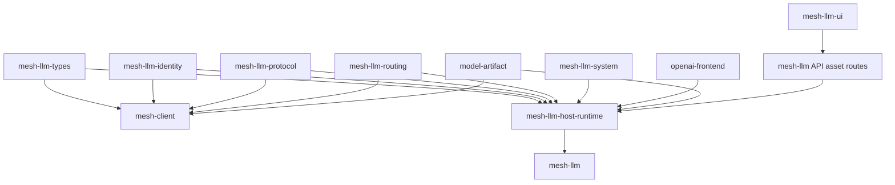
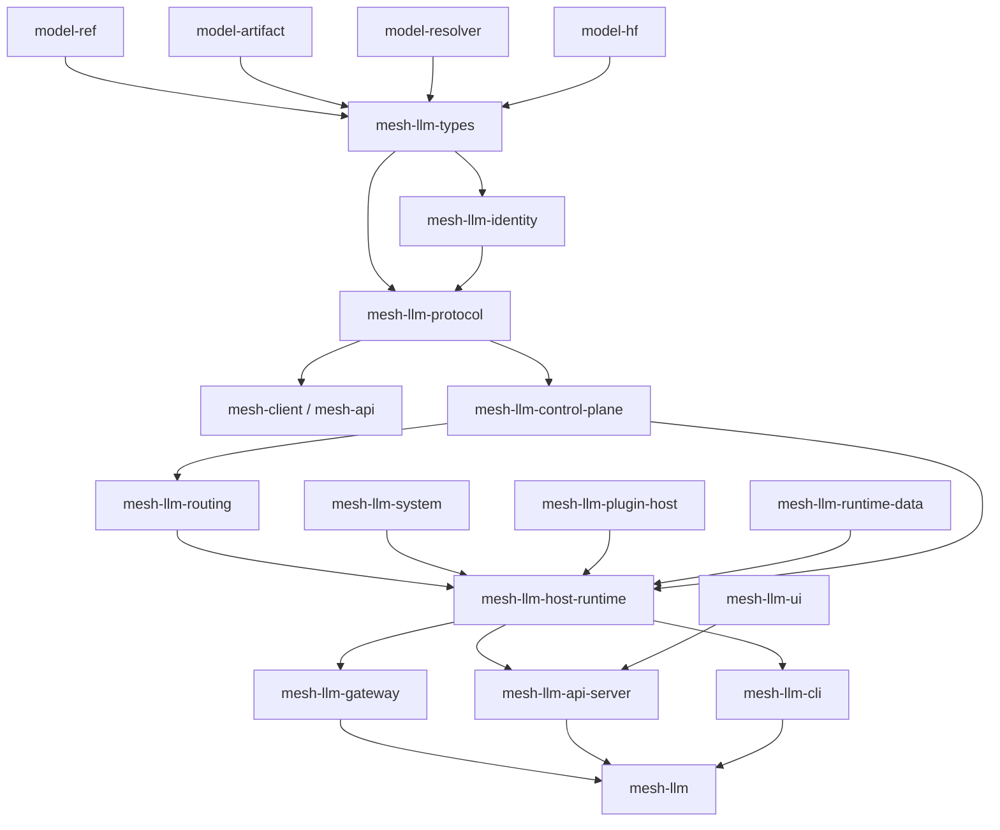

# mesh-llm crate decomposition plan

This plan decomposes the current `mesh-llm` crate in two layers:

1. Move shared or pure code into existing crates where ownership is already clear.
2. Extract app-specific host subsystems into focused `mesh-llm-*` crates.

The root `mesh-llm` crate should become a thin binary and app assembly layer:
parse CLI, configure logging, assemble runtime dependencies, and call `run()`.

## Implemented slices

The app crate is now decomposed into the following owned crates:

- `mesh-llm-ui` owns the React console source, package metadata, build output,
  embedded asset helpers, and UI README.
- `mesh-llm-types` owns pure shared model and protocol-facing data shapes:
  capabilities, topology metadata, served-model identity/descriptors, runtime
  descriptors, model demand counters, and shared routing constants.
- `mesh-llm-identity` owns shared owner keypairs, owner ID derivation, signed
  encrypted envelopes, key-provider traits, and shared crypto errors.
- `mesh-llm-protocol` owns generated protobuf message types, mesh ALPN/stream
  constants, control-frame validation, frame helpers, v0 tunnel-map
  compatibility, and canonical config hashing.
- `mesh-llm-routing` owns shared inference targets, per-model routing tables,
  round-robin/sticky candidate selection, and split-GGUF size accounting.
- `mesh-llm-system` owns local-machine concerns: hardware discovery, backend
  flavor/device helpers, process liveness validation, benchmark fingerprinting,
  benchmark prompt import support, release target modeling, and self-update
  plumbing.
- `mesh-llm-host-runtime` owns the remaining host runtime implementation behind
  the binary: CLI, management API, mesh orchestration, host-local protocol
  conversion, gateway/proxy glue, plugin host, runtime-data aggregation, and
  embedded skippy coordination.
- `openai-frontend` now owns the OpenAI request/response adapter pieces that
  were previously duplicated under the host network module: request
  normalization, stream-chunk parsing, response stream usage conversion, and
  upstream error mapping.
- `model-artifact` owns GGUF header metadata scanning and KV-cache byte
  estimation; host/client model modules re-export it instead of treating
  `mesh-client` as the GGUF parser crate.

## Target dependency graph

## Proposed destinations

| Current area | Destination | Reason |
| --- | --- | --- |
| Node proto schema, generated proto, ALPN and stream IDs, frame validation, frame helpers, legacy tunnel-map decoding | `mesh-llm-protocol` | Implemented as the shared wire-protocol crate consumed by the host and `mesh-client`. |
| Host protocol conversion between proto and runtime structs | Host `protocol/convert.rs` for now | These conversions still depend on host-owned mesh, ownership, plugin config, and runtime structs; move them after control-plane/runtime boundaries are smaller. |
| Pure shared mesh/client model types such as capabilities, topology, model demand, served-model identity, and descriptors | `mesh-llm-types` | Implemented first because these types are protocol-facing but do not need QUIC, protobuf, ownership, CLI, or runtime dependencies. |
| Runtime peer state such as `PeerAnnouncement`, `PeerInfo`, and `NodeRole` | Later `mesh-llm-control-plane` or `mesh-llm-protocol` boundary after decoupling | These still carry `iroh`, protobuf summaries, ownership attestation, timestamps, and gossip semantics, so moving them before protocol/control-plane cleanup would smear dependencies into `mesh-llm-types`. |
| Shared signing and envelope crypto | `mesh-llm-identity` | Implemented as a dependency-light shared crate for owner keypairs, owner IDs, signed encrypted envelopes, and key-provider traits. |
| Host ownership persistence, keystore files, trust-store files, OS keychain integration | Host crypto modules for now | These are local machine and CLI/runtime policy concerns; they can move later behind host-oriented crate boundaries. |
| `mesh/` gossip, heartbeat, membership, peer state, config sync | New `mesh-llm-control-plane` | This avoids the self-referential `mesh-llm-mesh` name and describes the subsystem's actual role: control-plane membership and coordination, not model execution. |
| `network/router.rs`, `network/affinity.rs`, route scoring, request placement, election-adjacent logic | New `mesh-llm-routing` | Routing and placement should be reusable without pulling in process runtime or CLI UI. |
| `network/proxy.rs`, `network/tunnel.rs`, HTTP ingress glue | New `mesh-llm-gateway` | This is the network edge around OpenAI/API traffic. |
| `network/openai/*` | Existing `openai-frontend` | Request/response adapter shims, stream-chunk schema parsing, response stream usage conversion, and upstream error mapping now live in `openai-frontend`; host networking keeps ingress and mesh transport glue. |
| `plugin/` host runtime, MCP bridge, transport, config support | New `mesh-llm-plugin-host` | Keep host-side plugin orchestration separate from `mesh-llm-plugin`, which should remain the plugin author API. |
| Plugin protobuf schema | `mesh-llm-plugin` | The plugin wire schema now lives beside the plugin author/runtime API crate instead of under the host binary crate. |
| `plugins/blobstore`, `plugins/blackboard`, telemetry, OpenAI endpoint plugin | Initially submodules of `mesh-llm-plugin-host`; later first-party plugin crates if needed | These do not all need crates yet. Extract only when boundaries harden. |
| `runtime_data/` | New `mesh-llm-runtime-data` | Shared by runtime, API, plugins, and CLI dashboard. |
| `system/hardware.rs`, backend detection, benchmark primitives, process validation, prompt benchmark import, release target modeling, self-update plumbing | `mesh-llm-system` | Implemented so local-machine concerns stay out of mesh/protocol/runtime crates. |
| `models/resolve`, `catalog`, `remote_catalog`, `search`, download code | Existing `model-resolver` and `model-hf` | Avoid creating `mesh-llm-models` for code that already belongs to model infrastructure. |
| `models/capabilities.rs`, `models/topology.rs`, `models/gguf.rs` | Existing `model-artifact`, `model-ref`, or `model-resolver` depending on final ownership | GGUF scanner ownership has moved to `model-artifact`; remaining capability/topology helpers should keep moving into existing model infrastructure instead of a new host-owned model crate. |
| `inference/skippy/*` | Existing `skippy-*` crates where possible | The host should orchestrate Skippy rather than own Skippy package, topology, and runtime internals. |
| `inference/election.rs`, split planning | `mesh-llm-routing`, or existing shared client inference modules if needed by embedded clients | Shared target/table primitives and split-GGUF size accounting are implemented in `mesh-llm-routing`; higher-level split planning still needs further extraction. |
| React console | `mesh-llm-ui` | The console owns its package metadata, build, generated assets, Rust embedding surface, and UI conventions instead of living under the host binary crate. |
| `api/` | New `mesh-llm-api-server` | Management API routes can depend on `mesh-llm-runtime-data` and serve assets produced by `mesh-llm-ui`, but should not own the console source. |
| `cli/` | New `mesh-llm-cli` | Large dependency surface: Clap, Ratatui, terminal progress, dashboard output. Extract late. |
| Remaining host implementation: `api/`, `cli/`, `mesh/`, `network/`, `plugin/`, `plugins/`, `runtime/`, `runtime_data/`, host-local `models/`, and host-local protocol conversion | `mesh-llm-host-runtime` | Implemented as the host runtime crate behind the now-thin `mesh-llm` app assembly package. |

## Expected benefits

The split should pay off in both engineering velocity and operational safety:

- Faster targeted builds and checks: pure/shared crates such as protocol, types, identity, routing, and runtime data can be checked without rebuilding the full host binary, UI, Skippy runtime wiring, or terminal dashboard stack.
- Smaller CI blast radius: changes can run crate-specific validation first, reserving `just build` and distributed/runtime tests for changes that actually touch those layers.
- Better mergeability: smaller ownership boundaries reduce conflicts in large files such as `runtime/mod.rs`, `mesh/mod.rs`, and broad crate-level module glue.
- Clearer reviews: PRs can be reviewed by subsystem ownership, such as protocol compatibility, routing behavior, plugin host behavior, UI packaging, or model resolution, instead of asking reviewers to reason about the entire binary crate.
- Cleaner dependency hygiene: CLI, TUI, keychain, Hugging Face, OpenAI frontend, Skippy, and platform hardware dependencies can stay attached to the crates that need them instead of leaking through `mesh-llm`.
- Safer protocol evolution: protobuf generation, frame validation, ALPN/stream IDs, and compatibility tests can live in `mesh-llm-protocol`, making mixed-version compatibility easier to audit.
- Better embedded-client reuse: shared protocol, identity, routing, and type crates give `mesh-client` and `mesh-api` stable dependencies without depending on host-only runtime code.
- More predictable documentation ownership: each crate README can explain the subsystem boundary, while top-level docs and Mermaid diagrams describe composition instead of implementation detail.
- Easier incremental extraction: once the dependency graph points inward toward shared crates and outward toward app assembly, later moves become mechanical instead of architectural surgery.

## Refactors before extraction

The main blocker is dependency direction. Before extracting crates, reduce direct calls from domain modules into app-level modules:

- Add a `MeshEventSink` or equivalent callback instead of calling `crate::cli::output` from `mesh/`.
- Move pinned-GPU preflight out of `mesh/` and into runtime or plugin config handling.
- Continue moving protocol-facing shared types into `mesh-llm-types` so protocol conversion does not depend on `crate::mesh`.
- Continue shrinking host protocol conversion until only wire-format code remains in `mesh-llm-protocol`.
- Make host-only integrations explicit through traits or feature-gated adapters.

## Documentation scope

The crate split should include the documentation migration as part of the same scope, not as follow-up cleanup:

- Add a `README.md` for every new crate that explains ownership, public API boundaries, dependency expectations, and how the crate fits into the host runtime.
- Update existing crate READMEs when code moves into or out of those crates, especially `mesh-client`, `mesh-api`, `mesh-llm-plugin`, `openai-frontend`, `model-*`, and `skippy-*`.
- Update top-level docs that describe repository structure, architecture, runtime composition, plugin ownership, model resolution, OpenAI routing, and console/API packaging.
- Update Mermaid diagrams anywhere they describe the crate graph, runtime architecture, protocol/control-plane flow, API/UI packaging, or plugin/data ownership.
- Keep the root `README.md`, `docs/README.md`, and `crates/mesh-llm/README.md` aligned so new contributors can find the owning crate for a subsystem without reading implementation details first.

## Extraction order

1. Extract the first `mesh-llm-types`, `mesh-llm-identity`, `mesh-llm-protocol`, and `mesh-llm-routing` slices.
2. Continue moving model metadata, resolve, search, and download code into existing `model-*` crates.
3. Continue moving OpenAI adapter and schema code into `openai-frontend`.
4. Push Skippy-owned logic into existing `skippy-*` crates.
5. Extract `mesh-llm-runtime-data`.
6. Decouple `mesh/` from CLI, system, and runtime, then extract `mesh-llm-control-plane`.
7. Continue extracting routing, affinity, and election logic into `mesh-llm-routing`.
8. Keep the React console and asset embedding surface in `mesh-llm-ui`.
9. Extract plugin host, gateway, and API server crates.
10. Extract `mesh-llm-cli`.
11. Add new crate READMEs and update affected existing READMEs, docs, and Mermaid diagrams as each ownership boundary moves.
12. Leave root `mesh-llm` as the thin binary and app assembly crate.

The guiding rule is to split by dependency direction and ownership, not by folder size. The first win is making protocol, types, and identity shared and boring; after that, the remaining crate boundaries should become much easier to see.
