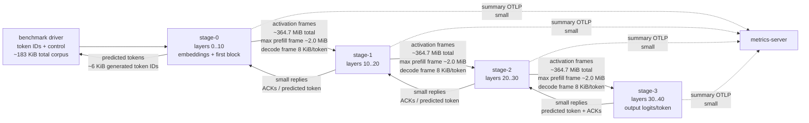

# Stage Data Flow

This note describes the current four-stage benchmark data path and the relative
size of each flow. The reference run is the mixed 192-prompt Qwen3.6 benchmark
using `f32` activation wire format, `--prefill-chunk-size 256`,
`--stage-max-inflight 2`, `--stage-reply-credit-limit 1`,
`--n-gpu-layers -1`, summary telemetry, and balanced splits `10,20,30`.

## Current Flow



## Relative Sizes

| Flow | Size |
| --- | ---: |
| Driver to stage-0 prompt tokens | ~177 KiB prefill token IDs |
| Driver/stage decode token IDs | ~6 KiB token IDs |
| stage-0 -> stage-1 activations | 364.7 MiB |
| stage-1 -> stage-2 activations | 364.7 MiB |
| stage-2 -> stage-3 activations | 364.7 MiB |
| Per-boundary activation total | ~365 MiB |
| Total activation traffic across 3 boundaries | ~1.09 GiB |
| Max prefill activation frame, `f32` chunk256 | ~2.0 MiB |
| Decode activation frame, `f32` | 8 KiB/token/boundary |
| Summary telemetry | Tiny compared with activations |

The activation frames dominate the data path. Prompt tokens, predicted-token
replies, ACKs, and summary telemetry are all small next to the activation
traffic.

```text
Driver tokens:          .
Stage replies:          .
Telemetry summary:      .
Each boundary activations:
████████████████████████████████████████
All 3 boundaries:
████████████████████████████████████████
████████████████████████████████████████
████████████████████████████████████████
```

## Optimization Implication

The next prefill optimization should attack activation traffic or activation
handling before spending time on token/control traffic. Under the current
locked topology, `f16` activation wire format is the conservative default: it
roughly halves activation payload size without changing stage placement, layer
balance, or decode behavior. `q8` remains a per-family/per-split opt-in because
it can change exact next-token results.
