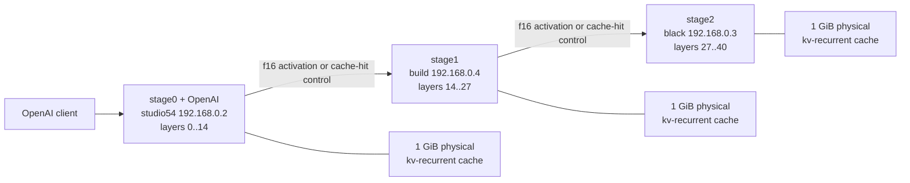

# Qwen3.6 LAN Package Runbook

This runbook captures the first package-candidate shape for
`Qwen3.6-35B-A3B-UD-Q4_K_XL` on the three-node private LAN lab.

## Scope

The package candidate is intended for stable repeated-prefix workloads:
system prompts, policy bundles, tool schemas, reusable RAG documents, or other
large prompt prefixes that repeat exactly across requests. Keep the cache
package-controlled for arbitrary traffic until customer-specific hit rates are
measured.

Do not enable KV-only cache for Qwen3.6. The package candidate is exact
`kv-recurrent` full-state cache with BLAKE3 content-addressed block dedupe.

## Topology



Use fixed `192.168.0.x` endpoints. During the package gates, `build` by
hostname timed out while `192.168.0.4` worked immediately.

## Before Every Run

1. Stop stale stage, llama, metrics, and mesh processes on all hosts.
2. Check that the lab ports are free on all hosts.
3. Capture `vm_stat` and `ps aux` snapshots before launch.
4. Confirm remote stage artifacts are mounted or host-local and readable.
5. Launch remote stage servers with foreground real-TTY SSH:

```bash
ssh -tt 192.168.0.4 '/bin/zsh -ilc '\''COMMAND 2>&1 | tee /tmp/RUN/logs/stage-1.log'\'''
ssh -tt 192.168.0.3 '/bin/zsh -ilc '\''COMMAND 2>&1 | tee /tmp/RUN/logs/stage-2.log'\'''
```

Do not use detached `screen`, detached `tmux`, `nohup`, or command-mode SSH for
the first package bring-up. Only detach after proving the exact binary, config,
bind address, downstream endpoint, and traffic path behave the same.

## Package Knobs

| Knob | Value |
| --- | --- |
| split | `14,27` |
| stage0 | `studio54`, `192.168.0.2`, layers `0..14` |
| stage1 | `build`, `192.168.0.4`, layers `14..27` |
| stage2 | `black`, `192.168.0.3`, layers `27..40` |
| activation wire dtype | `f16` |
| OpenAI surface | embedded in stage0 |
| OpenAI bind | `192.168.0.2:20680` in the soak gate |
| generation concurrency | `1` for current package gates |
| prefill chunk size | `512` for cache package gates |
| cache payload | `kv-recurrent` |
| cache mode | `lookup-record` |
| cache namespace | `qwen3.6-35b-a3b-ud-q4-k-xl-first-customer` |
| cache identity | namespace plus exact token prefix plus model/topology/stage identity |
| block identity | BLAKE3, `1 MiB` blocks |
| physical cache cap | `1 GiB` per stage |
| KV-only cache | disabled |
| draft speculation | disabled |
| native n-gram speculation | disabled |

## Quality Gate

A package validation run must produce a metrics-server report and pass all of
these checks:

| Check | Pass Criteria |
| --- | --- |
| OpenAI requests | `http_errors = 0` |
| propagated cache hits | downstream misses return `CacheMiss` and stage0 recomputes the chunk; no `502` |
| remote memory | `swapins_delta = 0` and `swapouts_delta = 0` on `build` and `black` |
| cache bound | physical resident cache bytes stay `<= 1 GiB` per stage |
| warm latency | warm-cycle prefill stays under `2s` for the package soak pattern |
| telemetry | report includes hits, misses, entries, logical bytes, physical bytes, saved bytes, dedupe ms, reconstruct ms, and evictions by stage |

Cache-hit control is only sent when the upstream stage is also using the
full-state cache for that chunk. If stage0 falls back to recompute, it sends a
normal activation frame and downstream stages recompute/record that chunk too.
That is deliberately conservative: it keeps the chain coherent and avoids
mixing restored local state with a fallback activation path.

## Current Evidence

| Gate | Result |
| --- | --- |
| LAN cache gate | `/Volumes/External/llama-stage-runtime-bench/qwen36-lab/qwen-lan-deduped-cache-20260502-171556` |
| LAN cache soak | `/Volumes/External/llama-stage-runtime-bench/qwen36-lab/qwen-lan-cache-soak-20260502-172611` |
| Release capacity sweep | `/Volumes/External/llama-stage-runtime-bench/qwen36-lab/qwen-blake3-release-cap-sweep-20260502-170121` |
| Depth-2 plus arbitrary gate | `/Volumes/External/llama-stage-runtime-bench/qwen36-lab/qwen-lan-package-depth2-arbitrary-20260502-175643` |
| Depth-2 cache-miss fallback gate | `/Volumes/External/llama-stage-runtime-bench/qwen36-lab/qwen-lan-package-depth2-arbitrary-fallback-20260502-183306` |
| Depth-1 namespace gate | `/Volumes/External/llama-stage-runtime-bench/qwen36-lab/qwen-lan-package-depth1-namespace-gate-20260502-192337` |
| Depth-2 record-skip gate | `/Volumes/External/llama-stage-runtime-bench/qwen36-lab/qwen-lan-package-depth2-record-skip-gate-20260502-193519` |
| Ordered warm-cache and prewarmed depth-2 gate | `/Volumes/External/llama-stage-runtime-bench/qwen36-lab/qwen-depth2-ordered-and-prewarmed-20260502-205142` |

The soak gate passed `35/35` OpenAI requests with no remote swap delta. Final
physical resident cache stayed under the `1 GiB` cap on every stage.

The first depth-2 plus arbitrary gate exposed a package bug: after six
unrelated arbitrary prompts, two post-arbitrary shared-prefix warm checks
returned `502` because stage0 propagated a full-state cache-hit control message
while stage1 had evicted or missed the matching local state. The follow-up
cache-miss fallback gate fixes that availability issue. It passed `17/17`
OpenAI requests, converted `19` propagated-hit local misses into safe recompute,
and kept telemetry loss at `0/0`. Treat fallback recompute as correct but not
free: it prevents `502`s, while coherent repeated-prefix hits are still the
latency win we want from the cache.

The namespace/depth gate adds two package decisions:

- `full_state_cache.namespace` is part of the cache key and emitted in cache
  telemetry. Replace the lab placeholder namespace before customer delivery.
- Keep OpenAI generation concurrency at `1` for the first package. Depth `2`
  now passes availability after cache record errors were made best-effort, but
  the proxy sequence is not a warmed-cache latency proof: some consumer
  requests start before their producer request has finished recording cache, so
  those consumers are correctly cold. Total wall is effectively neutral
  (`100.856s` depth 1 vs `99.348s` depth 2). Use a separate ordered warm-cache
  test to prove cache benefit, and a customer-shaped independent-request corpus
  to prove depth-2 throughput.

The ordered warm-cache and prewarmed depth-2 gate supplies that separated
evidence. Producer-then-consumer ordering dropped `shared-a-cold` from
`21.114s` to `2.206s` for a changed suffix (`14/15` stage0 chunks hit) and
`0.785s` for full warm replay (`15/15` chunks hit). Exact unrelated replay
dropped from `7.922s` to `0.443s`. Prewarmed independent hot replay at depth
`2` completed six requests in `1.868s` versus `2.143s` sequential (`1.15x`),
which is useful evidence but still not enough to make depth `2` the default
without a customer-shaped corpus.

Generate configs from the manifest instead of hand-copying run directories:

```bash
python3 scripts/qwen-package-generate-configs.py \
  --manifest docs/family/qwen-package-manifest.json \
  --out-dir target/qwen-package-generated \
  --run-id qwen-package-validation
```

## Default-On Decision

Default on for:

- stable repeated system prompts;
- stable tool schemas;
- stable policy or instruction bundles;
- exact repeated RAG/document prefixes;
- repeated prompt templates where the prefix tokenization is byte-for-byte
  stable.

Keep opt-in or package-controlled for:

- arbitrary chat traffic with low expected prefix reuse;
- workloads where prompt templates are still changing;
- fuzzy or semantic similarity reuse;
- multi-tenant deployments unless each tenant/package has an explicit cache
  namespace and isolation policy;
- arbitrary mixed traffic unless fallback recompute cost is acceptable for that
  customer workload;
- concurrent-depth modes above `1` until a longer customer-shaped depth gate
  shows useful throughput and memory behavior.

Cache record failures are best-effort. A failed cache export should emit
`stage.binary_full_state_cache_record_error`, skip that cache entry, and still
return the model response. A cache recording failure is not allowed to become a
customer-visible `502`.
