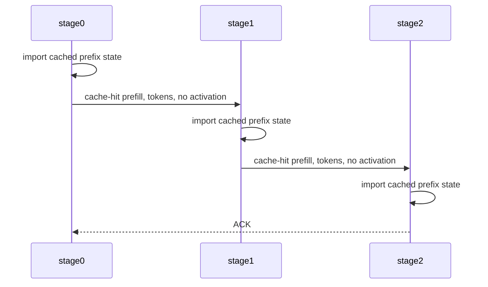

# Qwen3.6 Results

This file holds concise promoted summaries. Raw logs, corpora, metrics
databases, model artifacts, and materialized GGUFs stay outside git.

## M2 Correctness: m2-correctness-20260429-112147

Status: pass

Decision: use the fixed layer package for local references and three-node lab
bring-up.

Reason: the package validates with exact owned-tensor coverage, and staged
correctness matches the full-model baseline at both split boundaries, across
the full three-stage chain, and across `f32`, `f16`, and `q8` activation wire
dtypes.

| Field | Value |
| --- | --- |
| Date | 2026-04-29 |
| Raw run root | `/Volumes/External/skippy-runtime-bench/qwen36-lab/m2-correctness-20260429-112147` |
| Package | `/Volumes/External/skippy-runtime-bench/model-cache/unsloth_Qwen3.6-35B-A3B-GGUF/layer-package-ud-q4-k-xl` |
| Source | `unsloth/Qwen3.6-35B-A3B-GGUF@9280dd353ab587157920d5bd391ada414d84e552/Qwen3.6-35B-A3B-UD-Q4_K_XL.gguf` |
| Source SHA256 | `707a55a8a4397ecde44de0c499d3e68c1ad1d240d1da65826b4949d1043f4450` |
| Model id | `unsloth/Qwen3.6-35B-A3B-GGUF:UD-Q4_K_XL` |
| Layer count | `40` |
| Topology | three-stage split `0..14`, `14..27`, `27..40` |
| Prompt | `Explain why staged execution must preserve the next token.` |
| Context | `ctx_size=4096` |
| Package validation | `valid=true`; no missing or duplicate owned tensors; `checked_artifact_count=43` |

| Check | Report | Result | Notes |
| --- | --- | --- | --- |
| single-step split 14 | `correctness-single-step-14.json` | pass | baseline token `814`, predicted token `20139`; split matches with `f16`, `wire_payload_bytes=4096` |
| single-step split 27 | `correctness-single-step-27.json` | pass | baseline token `814`, predicted token `20139`; split matches with `f16`, `wire_payload_bytes=4096` |
| chain 14,27 | `correctness-chain-14-27.json` | pass | stages `0..14`, `14..27`, `27..40`; final predicted token `20139` |
| dtype matrix split 14 | `correctness-dtype-matrix-14.json` | pass | `f32`, `f16`, and `q8` all match; q8 `wire_payload_bytes=2052` |

The package writer was fixed before this run so `shared/output.gguf` no longer
duplicates `token_embd.weight`. The regenerated package validation report is
part of the package directory.

## M3 Local References: m3-local-references-20260429-173642

Status: pass

Decision: classify the M4 three-node long-corpus projection relative to the
single-node full-stage reference instead of using a hard one-hour wall. Before
attempting the full three-node long run, run a projection window of the first 24
long-corpus rows or 12 minutes, whichever comes first. If the projection is
performance-red, stop before the full 565-row run and record the baseline as
stable-but-too-slow.

Reason: both local references are already in the 43-50 minute projected range
for the full `long` corpus at depth 1 with `max_tokens=512`, so an hours-long
three-node run is not a useful readiness spend unless it can stay close to the
single-node reference. M4 gets a calibrated classification rather than an
unbounded run.

| Field | Value |
| --- | --- |
| Date | 2026-04-29 |
| Raw run root | `/Volumes/External/llama-stage-runtime-bench/qwen36-lab/m3-local-references-20260429-173642` |
| Corpus | `target/bench-corpora/long/corpus.jsonl`, first 24 rows for projection |
| Smoke corpus | `target/bench-corpora/smoke/corpus.jsonl`, 24 rows |
| Model id | `unsloth/Qwen3.6-35B-A3B-GGUF:UD-Q4_K_XL` |
| Source | `unsloth/Qwen3.6-35B-A3B-GGUF@9280dd353ab587157920d5bd391ada414d84e552/Qwen3.6-35B-A3B-UD-Q4_K_XL.gguf` |
| Context / generation | `ctx_size=8192`, `max_tokens=512` for long window; `max_tokens=64` for smoke |
| Concurrency / thinking | `concurrency_depth=1`, frontend generation concurrency `1`, thinking disabled |
| Vanilla llama | `~/code/llama.cpp`, upstream default branch `master`, commit `739393beeb4b78397003d5d8c5dd0c25a051bc14`, Metal enabled, prompt cache disabled with `--cache-ram 0` |

| Reference | Evidence | Result | Notes |
| --- | --- | --- | --- |
| single-node full-stage smoke | `full-stage-smoke-c1.json` | pass | 24/24, `errors=0`, `completion_tok_s=38.21`, `total_tok_s=191.56` |
| single-node full-stage long-24 | `full-stage-long-24-c1.json` | pass | 24/24, `errors=0`, `completion_tok_s=47.15`, `total_wall_ms=110601.581`, projected full long corpus `43.40 min` |
| vanilla llama smoke | `vanilla-llama-smoke-c1.json` | pass | 24/24, `errors=0`, `completion_tok_s=37.80`, `total_tok_s=191.66` |
| vanilla llama long-24 | `vanilla-llama-long-24-c1.json` | pass | 24/24, `errors=0`, `completion_tok_s=41.52`, `total_wall_ms=126154.664`, projected full long corpus `49.50 min` |

M4 classification and short-circuit rule:

- reference: single-node full-stage projected full long corpus is `43.40 min`;
- green: projected full three-node long-corpus runtime is `<= 2x`
  single-node, or `<= 86.8 min`;
- yellow: projected full three-node long-corpus runtime is `<= 3x`
  single-node, or `<= 130.2 min`;
- red: projected full three-node long-corpus runtime is `> 3x`
  single-node, or `> 130.2 min`;
- projection window: first 24 long-corpus rows or 12 minutes, whichever comes
  first;
- stability pass: zero request errors, no API error bodies, no silent
  truncation, no unexplained crashes or reconnects, and no telemetry drops;
- short-circuit: if the projection is red, or if the projection window hits 12
  minutes before enough clean rows complete to classify yellow or green, stop M4
  and record it as a stable-but-too-slow baseline instead of running the full
  corpus.

## Smoke Span Capture: span-smoke-20260429-183501

Status: pass

Decision: use this run as the first smoke evidence with full OpenAI-surface
spans. Vanilla llama was intentionally skipped because it cannot emit the same
internal `stage.openai_*` and binary-stage spans.

Reason: both single-node full-stage and three-node embedded stage0 smoke runs
completed the frozen smoke corpus with zero request errors, and the metrics
databases contain the expected OpenAI pipeline spans. The three-node run also
contains stage1/stage2 binary timing spans.

| Field | Value |
| --- | --- |
| Date | 2026-04-29 |
| Raw run root | `/Volumes/External/llama-stage-runtime-bench/qwen36-lab/span-smoke-20260429-183501` |
| Corpus | `target/bench-corpora/smoke/corpus.jsonl`, 24 rows |
| Model id | `unsloth/Qwen3.6-35B-A3B-GGUF:UD-Q4_K_XL` |
| Context / generation | `ctx_size=8192`, `max_tokens=64` |
| Concurrency / thinking | `concurrency_depth=1`, frontend generation concurrency `1`, thinking disabled |
| Single-node output | `single-full-stage-smoke-c1.json`, `single-metrics.sqlite` |
| Three-node output | `three-node-smoke-c1.json`, `three-node-metrics.sqlite` |
| Preflight | `preflight.txt`; repeated before three-node in `preflight-before-three-node.txt` |

| Run | Requests | Errors | Wall | E2E p50 | E2E p95 | E2E p99 | Completion tok/s | Total tok/s |
| --- | ---: | ---: | ---: | ---: | ---: | ---: | ---: | ---: |
| single-node full-stage | 24 | 0 | `38.52s` | `1.57s` | `2.10s` | `2.65s` | `37.62` | `188.60` |
| three-node embedded stage0 | 24 | 0 | `124.96s` | `5.10s` | `6.46s` | `8.57s` | `11.28` | `57.83` |

OpenAI pipeline span rollup:

| Phase | Single p50 | Single p95 | Three-node p50 | Three-node p95 | Notes |
| --- | ---: | ---: | ---: | ---: | --- |
| HTTP request | `1560.63ms` | `2099.84ms` | `5100.64ms` | `6458.39ms` | Server-side OpenAI request time. |
| Chat template | `34.11ms` | `39.27ms` | `28.30ms` | `30.85ms` | Template cost is not the bottleneck. |
| Tokenize | `1.14ms` | `4.27ms` | `1.10ms` | `4.16ms` | Tokenization is tiny on smoke. |
| Generation admit | `0.01ms` | `0.01ms` | `0.01ms` | `0.01ms` | No frontend queueing at depth 1. |
| Downstream connect | n/a | n/a | `4.55ms` | `5.22ms` | Embedded stage0 connection cost is tiny. |
| Prefill | `4.83ms` | `448.23ms` | `146.92ms` | `1493.65ms` | Three-node prefill includes stage0 compute/write/wait. |
| Decode | `1504.72ms` | `1754.81ms` | `4888.38ms` | `5333.05ms` | Decode dominates the smoke delta. |
| Response build | `0.02ms` | `0.04ms` | `0.02ms` | `0.03ms` | Response assembly is negligible. |

Three-node stage0 internals:

| Phase | p50 elapsed | p95 elapsed | p50 stage0 compute | p95 stage0 compute | p50 forward write | p95 forward write | p50 downstream wait | p95 downstream wait |
| --- | ---: | ---: | ---: | ---: | ---: | ---: | ---: | ---: |
| prefill | `146.92ms` | `1493.65ms` | `102.62ms` | `292.09ms` | `4.40ms` | `7.41ms` | `3.95ms` | `1059.34ms` |
| decode | `4888.38ms` | `5333.05ms` | `669.43ms` | `687.77ms` | `8.54ms` | `8.91ms` | `4182.71ms` | `4634.42ms` |

Remote binary stage totals:

| Stage | Kind | Messages | Compute | Downstream wait | Forward write | Elapsed |
| --- | --- | ---: | ---: | ---: | ---: | ---: |
| stage-1 | `PrefillEmbd` | 36 | `13.35s` | `0.68s` | `0.46s` | `18.22s` |
| stage-1 | `DecodeEmbd` | 1415 | `34.19s` | `46.54s` | `0.55s` | `86.03s` |
| stage-2 | `PrefillEmbd` | 36 | `0.64s` | `0s` | `0s` | `2.64s` |
| stage-2 | `DecodeEmbd` | 1415 | `40.15s` | `0s` | `0s` | `43.52s` |

Interpretation: the refreshed spans confirm that tokenization, template work,
response build, and raw stage0 downstream connect are not material on smoke.
The three-node delta is concentrated in decode, especially stage0 waiting for
the downstream chain and stage1 waiting on stage2. This is expected serial
decode dependency; for long-prefill optimization, the next report must add the
middle-out overlap fields from the measurement contract so dependency wait is
separated from avoidable serialization.

## Middle-Out Span Capture: span-smoke-middleout-20260429-192345

Status: pass

Decision: the three-node smoke path now measures middle-out overlap directly.
Use this run as the first evidence that the trace can distinguish stage compute,
downstream activation writes, downstream waits, and real stage1-to-stage2
prefill overlap.

Reason: the frozen smoke corpus completed through embedded stage0 OpenAI with
zero request errors, and the metrics database contains real
`stage.binary_llama_decode`, `stage.binary_downstream_write`, and
`stage.binary_message_timing` spans. The run used the known-stable
`reply-credit-limit=0` shape to stay comparable with the previous smoke span
capture.

| Field | Value |
| --- | --- |
| Date | 2026-04-29 |
| Raw run root | `/Volumes/External/llama-stage-runtime-bench/qwen36-lab/span-smoke-middleout-20260429-192345` |
| Analysis | `middleout-analysis.md` |
| Corpus | `target/bench-corpora/smoke/corpus.jsonl`, 24 rows |
| Model id | `unsloth/Qwen3.6-35B-A3B-GGUF:UD-Q4_K_XL` |
| Context / generation | `ctx_size=8192`, `max_tokens=64` |
| Concurrency / thinking | `concurrency_depth=1`, frontend generation concurrency `1`, thinking disabled |
| Topology | stage0 `studio54` `192.168.0.2`, stage1 `build` `192.168.0.4`, stage2 `black` `192.168.0.3` |
| Split / wire | `14,27`, `activation_wire_dtype=f16` |
| Credit / async | `reply_credit_limit=0`, `async_prefill_forward=false` |

| Run | Requests | Errors | Wall | E2E p50 | E2E p95 | E2E p99 | Completion tok/s | Total tok/s |
| --- | ---: | ---: | ---: | ---: | ---: | ---: | ---: | ---: |
| three-node embedded stage0 | 24 | 0 | `128.27s` | `5.17s` | `6.60s` | `8.66s` | `11.11` | `56.45` |

Stage compute by phase:

| Phase | Stage | Messages | p50 | p95 | p99 | Total |
| --- | --- | ---: | ---: | ---: | ---: | ---: |
| Prefill | stage0 | 24 | `104.05ms` | `286.42ms` | `666.47ms` | `3.48s` |
| Prefill | stage1 | 36 | `393.43ms` | `528.77ms` | `548.08ms` | `13.40s` |
| Prefill | stage2 | 36 | `2.66ms` | `186.00ms` | `208.28ms` | `680.78ms` |
| Decode | stage0 | 24 | `672.20ms` | `683.06ms` | `683.70ms` | `15.05s` |
| Decode | stage1 | 1429 | `24.05ms` | `24.89ms` | `27.88ms` | `34.37s` |
| Decode | stage2 | 1429 | `24.99ms` | `33.66ms` | `197.51ms` | `42.25s` |

OpenAI pipeline:

| Phase | p50 | p95 | p99 | Total |
| --- | ---: | ---: | ---: | ---: |
| HTTP POST | `5.13s` | `6.59s` | `8.66s` | `128.24s` |
| Chat template | `27.85ms` | `29.89ms` | `31.27ms` | `666.69ms` |
| Tokenize | `1.01ms` | `3.80ms` | `5.75ms` | `32.43ms` |
| Downstream connect | `4.64ms` | `5.36ms` | `5.74ms` | `110.62ms` |
| Prefill | `148.56ms` | `1.49s` | `3.56s` | `11.93s` |
| Decode | `4.93s` | `5.43s` | `5.64s` | `115.00s` |
| Response build | `0.02ms` | `0.02ms` | `0.02ms` | `0.42ms` |

Middle-out overlap:

| Scope | Edge | Requests | Overlap p50 | Overlap p95 | Overlap pct p50 | Tail p50 | Tail p95 |
| --- | --- | ---: | ---: | ---: | ---: | ---: | ---: |
| all prompts | stage0 -> stage1 | 24 | `0.00ms` | `982.60ms` | `0.0%` | `303.07ms` | `573.30ms` |
| all prompts | stage1 -> stage2 | 24 | `2.66ms` | `43.18ms` | `20.5%` | `45.31ms` | `167.63ms` |
| multi-chunk prompts only | stage0 -> stage1 | 7 | `500.17ms` | `2.57s` | `61.2%` | `381.77ms` | `486.29ms` |
| multi-chunk prompts only | stage1 -> stage2 | 7 | `4.15ms` | `54.84ms` | `50.3%` | `102.14ms` | `167.63ms` |

Interpretation: middle-out is working in the narrow sense that downstream
prefill compute overlaps upstream prefill windows, especially on multi-chunk
prompts. The smoke corpus is still too short to decide whether middle-out moves
customer-readiness wall clock; the next useful run is the M4 projection window
or an async-prefill-forward comparison on the same smoke corpus.

## Chunk Sweep Follow-Up: chunk-sweep-20260429-194648

Status: investigate

Decision: do not promote smaller chunks by themselves. Smaller chunks increase
measured overlap, but the current synchronous `reply-credit-limit=0` path pays
more overhead than it saves on the smoke corpus.

| Field | Value |
| --- | --- |
| Date | 2026-04-29 |
| Raw run root | `/Volumes/External/llama-stage-runtime-bench/qwen36-lab/chunk-sweep-20260429-194648` |
| Analysis | `chunk-sweep-analysis.md` |
| Corpus | `target/bench-corpora/smoke/corpus.jsonl`, 24 rows |
| Fixed knobs | `ctx_size=8192`, `max_tokens=64`, `concurrency_depth=1`, `reply_credit_limit=0`, `activation_wire_dtype=f16`, thinking disabled |

| Chunk | Requests | Errors | Wall | p50 | p95 | p99 | Completion tok/s |
| ---: | ---: | ---: | ---: | ---: | ---: | ---: | ---: |
| 256 baseline | 24 | 0 | `128.27s` | `5.17s` | `6.60s` | `8.66s` | `11.11` |
| 128 | 24 | 0 | `128.22s` | `5.09s` | `6.77s` | `9.62s` | `11.07` |
| 64 | 24 | 0 | `133.04s` | `5.24s` | `7.25s` | `11.14s` | `10.77` |
| 32 | 24 | 0 | `136.77s` | `5.14s` | `7.91s` | `13.09s` | `10.27` |

| Chunk | Multi-chunk requests | OpenAI prefill p50 | Stage1 -> stage2 multi-chunk overlap p50 | Stage0 -> stage1 multi-chunk overlap p50 |
| ---: | ---: | ---: | ---: | ---: |
| 256 baseline | 7 | `148.56ms` | `50.3%` | `61.2%` |
| 128 | 14 | `557.74ms` | `50.3%` | `69.5%` |
| 64 | 19 | `691.71ms` | `61.6%` | `83.3%` |
| 32 | 20 | `898.23ms` | `67.9%` | `86.5%` |

Interpretation: chunk `128` is roughly wall-neutral on smoke but worsens p99.
Chunks `64` and `32` improve overlap but clearly regress wall time and tail
latency. This points to per-frame and synchronization overhead, not lack of
overlap visibility.

## Prefill Chunk Schedule A/B: prefill-schedule-ab-20260429-225328

Status: investigate

Decision: do not promote the `128,256,512` schedule as the default. It slightly
improves p95 on this long-prefill slice, but median TTFT and total wall time
regress versus fixed chunk `256`.

| Field | Value |
| --- | --- |
| Date | 2026-04-29 |
| Raw run root | `/Volumes/External/llama-stage-runtime-bench/qwen36-lab/prefill-schedule-ab-20260429-225328` |
| Corpus | `long-multichunk-8.jsonl`, eight long-corpus rows with prompt tokens `>= 1000` |
| Context / generation | `ctx_size=8192`, `max_tokens=1` |
| Fixed knobs | `activation_wire_dtype=q8`, `activation_width=2048`, `async_prefill_forward=true`, `reply_credit_limit=0`, `max_inflight=4`, `concurrency_depth=1`, thinking disabled |

| Policy | Requests | Errors | Wall | TTFT p50 | TTFT p95 | TTFT p99 | Total tok/s |
| --- | ---: | ---: | ---: | ---: | ---: | ---: | ---: |
| fixed `256` | 8 | 0 | `40.29s` | `4.81s` | `9.28s` | `9.28s` | `332.91` |
| schedule `128,256,512` | 8 | 0 | `41.66s` | `5.08s` | `9.15s` | `9.15s` | `322.02` |

| Policy | OpenAI prefill p50 | OpenAI prefill p95 | stage0 compute p50 | stage0 compute p95 | stage0 -> stage1 write p50 | stage0 -> stage1 wait p50 |
| --- | ---: | ---: | ---: | ---: | ---: | ---: |
| fixed `256` | `3.70s` | `8.15s` | `781.62ms` | `1.51s` | `5.83ms` | `2.55s` |
| schedule `128,256,512` | `4.06s` | `7.77s` | `673.09ms` | `1.31s` | `12.96ms` | `2.83s` |

| Policy | stage1 chunks | stage1 compute p50 | stage1 compute p95 | stage1 message p50 | stage1 message p95 | stage1 write p50 | stage1 wait p50 |
| --- | ---: | ---: | ---: | ---: | ---: | ---: | ---: |
| fixed `256` | 57 | `502.46ms` | `533.65ms` | `654.91ms` | `688.18ms` | `17.13ms` | `2.94ms` |
| schedule `128,256,512` | 40 | `523.10ms` | `862.18ms` | `688.15ms` | `1.46s` | `18.20ms` | `2.52ms` |

| Policy | stage2 chunks | stage2 compute p50 | stage2 compute p95 | stage2 message p50 | stage2 message p95 |
| --- | ---: | ---: | ---: | ---: | ---: |
| fixed `256` | 57 | `3.44ms` | `90.17ms` | `50.04ms` | `110.61ms` |
| schedule `128,256,512` | 40 | `3.62ms` | `4.44ms` | `53.33ms` | `75.78ms` |

Interpretation: the ramp schedule reduces chunk count and helps the largest
prompt tail a little, but it increases common-case TTFT. The bigger scheduled
chunks make stage1 p95 message time worse on this run. Next prefill experiment
should test a less aggressive schedule such as `128,256,384` or a metric-driven
auto-tuner that grows only when downstream wait remains hidden under stage0
compute.

## Prefill Chunk Schedule Iteration: prefill-schedule-iter-20260430-014717

Status: investigate

Decision: keep fixed chunk `256` as the default for now, but promote schedule
`128,256,384` as the leading candidate for the next validation run. It improved
same-day wall time, median TTFT, tail TTFT, and total prompt-token throughput
against the fixed `256` control. Schedule `192,256,384` improved tail TTFT but
did not materially improve wall time. Schedule `192,384` is invalid because two
attempts failed before useful benchmark data: stage1 on build repeatedly failed
to establish its persistent lane to stage2 on black at `192.168.0.3:19033` with
`No route to host`, even though both stage processes were listening.

| Field | Value |
| --- | --- |
| Date | 2026-04-30 |
| Raw run root | `/Volumes/External/llama-stage-runtime-bench/qwen36-lab/prefill-schedule-iter-20260430-014717` |
| Corpus | `long-multichunk-8.jsonl`, eight long-corpus rows with prompt tokens `>= 1000` |
| Context / generation | `ctx_size=8192`, `max_tokens=1` |
| Fixed knobs | `activation_wire_dtype=q8`, `activation_width=2048`, `async_prefill_forward=true`, `reply_credit_limit=0`, `max_inflight=4`, `concurrency_depth=1`, thinking disabled |

| Policy | Requests | Errors | Wall | TTFT p50 | TTFT p95 | TTFT p99 | Total tok/s |
| --- | ---: | ---: | ---: | ---: | ---: | ---: | ---: |
| fixed `256` | 8 | 0 | `40.21s` | `4.81s` | `9.24s` | `9.24s` | `333.59` |
| schedule `128,256,384` | 8 | 0 | `37.96s` | `4.57s` | `8.29s` | `8.29s` | `353.42` |
| schedule `192,256,384` | 8 | 0 | `40.03s` | `4.65s` | `8.32s` | `8.32s` | `335.13` |
| schedule `192,384` | invalid | invalid | invalid | invalid | invalid | invalid | invalid |

| Policy | Wall delta vs fixed | TTFT p50 delta | TTFT p95 delta | Total tok/s delta |
| --- | ---: | ---: | ---: | ---: |
| schedule `128,256,384` | `-5.6%` | `-5.1%` | `-10.2%` | `+5.9%` |
| schedule `192,256,384` | `-0.5%` | `-3.5%` | `-10.0%` | `+0.5%` |

| Policy | OpenAI prefill p50 | OpenAI prefill p95 | stage0 compute p50 | stage0 compute p95 | stage0 -> stage1 write p50 | stage0 -> stage1 wait p50 |
| --- | ---: | ---: | ---: | ---: | ---: | ---: |
| fixed `256` | `3.70s` | `8.22s` | `767.75ms` | `1.52s` | `6.23ms` | `2.51s` |
| schedule `128,256,384` | `3.05s` | `7.32s` | `738.58ms` | `1.34s` | `6.44ms` | `2.08s` |
| schedule `192,256,384` | `3.22s` | `7.43s` | `673.96ms` | `1.37s` | `5.95ms` | `1.99s` |

| Policy | stage1 chunks | stage1 compute p50 | stage1 compute p95 | stage1 message p50 | stage1 message p95 | stage1 output bytes |
| --- | ---: | ---: | ---: | ---: | ---: | ---: |
| fixed `256` | 57 | `502.34ms` | `533.78ms` | `652.25ms` | `690.82ms` | `109.76MB` |
| schedule `128,256,384` | 48 | `565.13ms` | `691.14ms` | `727.68ms` | `898.87ms` | `109.76MB` |
| schedule `192,256,384` | 46 | `604.55ms` | `690.69ms` | `771.00ms` | `881.68ms` | `109.76MB` |

Interpretation: schedule `128,256,384` wins this iteration because it lowers
the request-level OpenAI prefill span more than it raises per-frame stage1
message cost. The activation byte volume is unchanged, but the number of
boundary frames drops from 57 to 48, so less per-frame protocol and scheduling
overhead leaks into TTFT. This should be rerun on a larger long-prefill slice
before becoming the default.

## Prefill Chunk Schedule Validation: prefill-schedule-validate-20260430-060222

Status: pass

Decision: schedule `128,256,384` remains the preferred prefill candidate after a
larger 24-row validation, but the win is modest. Keep fixed `256` as the default
until the schedule is validated across the full long-corpus projection or wired
behind an explicit opt-in/autotune setting.

| Field | Value |
| --- | --- |
| Date | 2026-04-30 |
| Raw run root | `/Volumes/External/llama-stage-runtime-bench/qwen36-lab/prefill-schedule-validate-20260430-060222` |
| Corpus | `long-prefill-longest-24.jsonl`, 24 longest prompts by prompt text length from the frozen long corpus |
| Corpus size | prompt text length min `2882`, max `5969`, mean `4434` chars; request tokens `28204` total in both runs |
| Context / generation | `ctx_size=8192`, `max_tokens=1` |
| Fixed knobs | `activation_wire_dtype=q8`, `activation_width=2048`, `async_prefill_forward=true`, `reply_credit_limit=0`, `max_inflight=4`, `concurrency_depth=1`, thinking disabled |
| Launch shape | stage2 first, then stage1, both via `ssh -tt ... /bin/zsh -ilc ...`; local stage0 embedded the OpenAI surface |

| Policy | Requests | Errors | Wall | TTFT p50 | TTFT p95 | TTFT p99 | Total tok/s |
| --- | ---: | ---: | ---: | ---: | ---: | ---: | ---: |
| fixed `256` | 24 | 0 | `88.53s` | `3.56s` | `4.84s` | `9.13s` | `318.57` |
| schedule `128,256,384` | 24 | 0 | `86.03s` | `3.57s` | `4.62s` | `8.32s` | `327.85` |

| Policy | Wall delta vs fixed | TTFT p50 delta | TTFT p95 delta | TTFT p99 delta | Total tok/s delta |
| --- | ---: | ---: | ---: | ---: | ---: |
| schedule `128,256,384` | `-2.8%` | `+0.1%` | `-4.4%` | `-8.9%` | `+2.9%` |

| Policy | OpenAI prefill p50 | OpenAI prefill p95 | stage0 compute p50 | stage0 compute p95 | stage0 -> stage1 wait p50 | Prefill chunks p50/p95 |
| --- | ---: | ---: | ---: | ---: | ---: | ---: |
| fixed `256` | `2.21s` | `4.15s` | `480.37ms` | `812.12ms` | `1.55s` | `4 / 7` |
| schedule `128,256,384` | `2.09s` | `3.84s` | `471.79ms` | `747.62ms` | `1.47s` | `4 / 6` |

| Policy | stage1 chunks | stage1 compute p50 | stage1 compute p95 | stage1 message p50 | stage1 message p95 | stage1 output bytes |
| --- | ---: | ---: | ---: | ---: | ---: | ---: |
| fixed `256` | 123 | `481.72ms` | `523.36ms` | `636.04ms` | `679.35ms` | `230.65MB` |
| schedule `128,256,384` | 112 | `469.72ms` | `684.88ms` | `616.76ms` | `880.57ms` | `230.65MB` |

Interpretation: the validation confirms the schedule is helping, mainly by
reducing frame count and request-level prefill tail latency without changing the
activation byte volume. The median TTFT is effectively flat, so this is not a
clear default yet. The next step is an autotuned schedule or a larger validation
that proves the p95/p99 and wall improvements hold outside the longest-24 slice.

## Prefill Policy 72-Row Projection: prefill-policy-72-20260430-061817

Status: investigate

Decision: keep fixed chunk `256` as the default for the customer package. Static
schedule `128,256,384` and the first `adaptive-ramp` implementation help the
extreme tail slightly on this representative 72-row projection, but both regress
wall time, p50, p95, and total throughput. The next adaptive revision should
stay fixed for short prompts and only ramp once prompt length or early timing
indicates that middle-out overlap can pay back the extra frame overhead.

| Field | Value |
| --- | --- |
| Date | 2026-04-30 |
| Raw run root | `/Volumes/External/llama-stage-runtime-bench/qwen36-lab/prefill-policy-72-20260430-061817` |
| Corpus | `long-first-72.jsonl`, first 72 rows from the frozen long corpus |
| Corpus size | prompt text length min `335`, max `1749`, mean `1079` chars; request tokens `21469` total in each clean run |
| Context / generation | `ctx_size=8192`, `max_tokens=1` |
| Fixed knobs | `activation_wire_dtype=q8`, `activation_width=2048`, `async_prefill_forward=true`, `reply_credit_limit=0`, `max_inflight=4`, `concurrency_depth=1`, thinking disabled |
| Policy implementation | `adaptive-ramp` starts at `128`, steps by `128`, caps at `384`, grows when downstream wait is hidden under stage0 compute/write, and backs off when downstream wait is exposed |

| Policy | Requests | Errors | Wall | TTFT p50 | TTFT p95 | TTFT p99 | Total tok/s |
| --- | ---: | ---: | ---: | ---: | ---: | ---: | ---: |
| fixed `256` | 72 | 0 | `104.51s` | `1.48s` | `1.78s` | `1.87s` | `205.43` |
| schedule `128,256,384` | 72 | 0 | `105.89s` | `1.50s` | `1.81s` | `1.82s` | `202.74` |
| `adaptive-ramp` | 72 | 0 | `105.52s` | `1.49s` | `1.81s` | `1.82s` | `203.46` |

| Policy | Wall delta vs fixed | TTFT p50 delta | TTFT p95 delta | TTFT p99 delta | Total tok/s delta |
| --- | ---: | ---: | ---: | ---: | ---: |
| schedule `128,256,384` | `+1.3%` | `+1.6%` | `+2.0%` | `-2.9%` | `-1.3%` |
| `adaptive-ramp` | `+1.0%` | `+0.8%` | `+1.6%` | `-2.9%` | `-1.0%` |

| Policy | OpenAI prefill p50 | OpenAI prefill p95 | stage0 compute p50 | stage0 wait p50 | Prefill chunks p50/p95 |
| --- | ---: | ---: | ---: | ---: | ---: |
| fixed `256` | `873.38ms` | `906.10ms` | `180.46ms` | `543.42ms` | `2 / 2` |
| schedule `128,256,384` | `589.25ms` | `1.25s` | `187.59ms` | `334.90ms` | `2 / 3` |
| `adaptive-ramp` | `588.77ms` | `1.21s` | `183.45ms` | `335.64ms` | `2 / 3` |

Interpretation: the long-tail data and representative projection now disagree
in the expected way. Ramp policies can reduce downstream wait and p99 on longer
prefill, but they add protocol/scheduling overhead for mixed shorter prompts.
The autotuner should add a prompt-length gate or require one warmup chunk to
show enough hidden downstream wait before growing beyond fixed `256`.

## Decode Accounting: decode-accounting-20260430-063814

Status: investigate

Decision: focus the next decode optimization on per-token stage compute and
stage-chain scheduling, not activation byte transfer or TCP reconnect setup.
The three-node q8 and f16 runs are nearly identical in wall time even though
f16 sends twice the activation bytes. Persistent downstream lanes are present:
the run records one startup/pool connection and no per-token reconnect work.

| Field | Value |
| --- | --- |
| Date | 2026-04-30 |
| Raw run root | `/Volumes/External/llama-stage-runtime-bench/qwen36-lab/decode-accounting-20260430-063814` |
| Corpus | `decode-one.jsonl`, row `commitpackft-python:train:00003`, prompt chars `1050`, prompt tokens `274` |
| Context / generation | `ctx_size=8192`, `max_tokens=256`, `temperature=0`, `seed=7`, thinking disabled |
| Topology | single-node full-stage reference; three-node split `0..14`, `14..27`, `27..40` on `studio54`, `build`, `black` |
| Transport knobs | `max_inflight=4`, `reply_credit_limit=0`, `async_prefill_forward=true`, prefill chunk `256` |

| Run | Errors | Wall | TTFT | Completion tokens | Completion tok/s |
| --- | ---: | ---: | ---: | ---: | ---: |
| single-node full-stage | 0 | `4.73s` | `498.05ms` | 195 | `41.26` |
| three-node q8 | 0 | `15.53s` | `1.88s` | 195 | `12.56` |
| three-node f16 | 0 | `15.47s` | `1.87s` | 196 | `12.67` |

OpenAI decode aggregate:

| Run | Decode tokens | Decode elapsed | ms/token | stage0 compute | stage0 avg/token | stage0 write | stage0 downstream wait | stage0 wire bytes |
| --- | ---: | ---: | ---: | ---: | ---: | ---: | ---: | ---: |
| single-node full-stage | 196 | `4.59s` | `23.43ms` | n/a | n/a | n/a | n/a | n/a |
| three-node q8 | 196 | `14.20s` | `72.47ms` | `2.08s` | `10.60ms` | `23.49ms` | `12.02s` | `402192` |
| three-node f16 | 197 | `14.15s` | `71.84ms` | `2.04s` | `10.35ms` | `23.94ms` | `12.03s` | `806912` |

Three-node per-token decode spans:

| Wire | Stage | Layers | Messages | Compute p50/p95/p99 | Message p50/p95/p99 | Forward write p50/p95/p99 | Downstream wait p50/p95/p99 | Wire bytes/token |
| --- | --- | --- | ---: | ---: | ---: | ---: | ---: | ---: |
| q8 | stage1 | `14..27` | 196 | `24.17/25.16/27.12ms` | `57.42/66.10/70.76ms` | `0.39/0.45/0.50ms` | `29.41/38.14/43.01ms` | `2052` |
| q8 | stage2 | `27..40` | 196 | `25.64/33.49/38.75ms` | `28.07/36.65/41.62ms` | `0/0/0ms` | `0/0/0ms` | `2052` in |
| f16 | stage1 | `14..27` | 197 | `23.98/24.79/25.37ms` | `56.94/65.86/72.86ms` | `0.40/0.49/0.66ms` | `29.18/37.58/45.16ms` | `4096` |
| f16 | stage2 | `27..40` | 197 | `25.09/33.87/41.75ms` | `27.81/36.19/43.48ms` | `0/0/0ms` | `0/0/0ms` | `4096` in |

Persistent lane validation:

| Wire | Persistent connects | Lane checkouts | Binary connection errors | Notes |
| --- | ---: | ---: | ---: | --- |
| q8 | 1 | 1 | 2 | Connection errors appeared only after intentional shutdown. |
| f16 | 1 | 1 | 2 | Same shutdown shape as q8; no per-token connect work. |

Interpretation: activation transfer is measurable but not the big loss on this
decode probe. Each decode token writes about `0.12ms` from stage0 and
`0.35ms` from stage1, while the useful compute on stage1/stage2 is roughly
`24-34ms` per token and stage0 waits about `61ms/token` for the downstream
chain. q8 halves the bytes but does not materially improve wall time, so wire
dtype is not the first decode lever. The next decode work should compare
stage-split/topology balance, backend per-stage compute cost, and speculative
decode; activation buffer reuse remains useful hygiene but is unlikely to close
the 3-node vs full-stage gap by itself.

## Decode Low-Level Instrumentation: decode-lowlevel-20260430-065638

Status: investigate

Decision: the low-level decode buckets are now visible enough to move beyond
activation-transfer suspicion. Stage0 emits per-token decode spans with
`cold`, `warmup`, and `steady` phases, and binary stages report activation
wire decode/encode timing separately from compute and socket writes. The new
data says activation conversion is real but small; stage compute plus dependent
downstream wait still dominates.

| Field | Value |
| --- | --- |
| Date | 2026-04-30 |
| Raw run root | `/Volumes/External/llama-stage-runtime-bench/qwen36-lab/decode-lowlevel-20260430-065638` |
| Corpus | `decode-one.jsonl`, row `commitpackft-python:train:00003`, prompt chars `1050`, prompt tokens `274` |
| Context / generation | `ctx_size=8192`, `max_tokens=256`, `temperature=0`, `seed=7`, thinking disabled |
| Topology | three-node split `0..14`, `14..27`, `27..40` on `studio54`, `build`, `black` |
| Transport knobs | `activation_wire_dtype=q8`, `max_inflight=4`, `reply_credit_limit=0`, `async_prefill_forward=true`, prefill chunk `256` |

| Run | Telemetry | Errors | Wall | TTFT | Completion tokens | Completion tok/s | Span count |
| --- | --- | ---: | ---: | ---: | ---: | ---: | ---: |
| three-node q8 debug | debug | 0 | `15.72s` | `1.68s` | 209 | `13.30` | 1721 |
| three-node q8 summary | summary | 0 | `15.58s` | `1.71s` | 195 | `12.51` | 17 |

The debug and summary requests are close in wall time, but not a strict A/B
because q8 stopped at different completion lengths. Treat this as "no obvious
debug telemetry distortion" rather than a promoted overhead percentage.

Stage0 per-token decode spans:

| Phase | Tokens | Elapsed p50/p95/p99 | Compute p50/p95/p99 | Write p50/p95/p99 | Downstream wait p50/p95/p99 | Encode p50/p95/p99 | Wire bytes/token |
| --- | ---: | ---: | ---: | ---: | ---: | ---: | ---: |
| cold | 1 | `559.85/559.85/559.85ms` | `16.77/16.77/16.77ms` | `0.26/0.26/0.26ms` | `542.18/542.18/542.18ms` | `0.57/0.57/0.57ms` | 2052 |
| warmup | 7 | `64.38/67.01/67.22ms` | `10.64/11.17/11.22ms` | `0.11/0.16/0.17ms` | `53.34/55.55/55.85ms` | `0.32/0.47/0.49ms` | 2052 |
| steady | 202 | `65.90/74.56/80.76ms` | `10.66/11.67/11.82ms` | `0.12/0.14/0.16ms` | `54.80/63.44/70.92ms` | `0.33/0.36/0.40ms` | 2052 |

Remote binary decode activation costs:

| Stage | Tokens | Compute p50/p95 | Input decode p50/p95 | Encode p50/p95 | Write p50/p95 | Wait p50/p95 | Input bytes/token | Output bytes/token |
| --- | ---: | ---: | ---: | ---: | ---: | ---: | ---: | ---: |
| stage1 | 210 | `23.53/23.97ms` | `0.32/0.38ms` | `0.93/0.99ms` | `0.19/0.24ms` | `28.79/37.72ms` | 2052 | 8192 |
| stage2 | 210 | `25.20/34.42ms` | `0.69/0.79ms` | `0/0ms` | `0/0ms` | `0/0ms` | 2052 | 0 |

Interpretation: this closes the largest "unknown bucket" in decode accounting.
Activation conversion costs roughly `0.3ms` on stage0, `0.3ms` input decode
plus `0.9ms` encode on stage1, and `0.7ms` input decode on stage2 for q8
decode tokens. That is worth optimizing later, but it is far smaller than
stage1/stage2 compute and the dependent wait chain. The next lower-level work
should be runtime lock hold-time, socket flush/Nagle validation, and a same-host
or host-specific stage microbench before changing topology.

## Decode Lock-Hold Attribution: decode-lockhold-20260430-070643

Status: investigate

Decision: runtime lock contention is not the depth-1 decode bottleneck. The
new hold-time spans show `runtime_lock_wait_ms` is effectively zero, while
`runtime_lock_hold_ms` tracks llama.cpp compute almost exactly. Shrinking the
mutex may still matter for concurrent-depth runs, but it will not materially
improve the single-request three-node decode path unless we move real compute,
batch it, shard it, or rebalance it.

| Field | Value |
| --- | --- |
| Date | 2026-04-30 |
| Raw run root | `/Volumes/External/llama-stage-runtime-bench/qwen36-lab/decode-lockhold-20260430-070643` |
| Corpus | `decode-one.jsonl`, row `commitpackft-python:train:00003`, prompt chars `1050`, prompt tokens `274` |
| Context / generation | `ctx_size=8192`, `max_tokens=256`, `temperature=0`, `seed=7`, thinking disabled |
| Topology | three-node split `0..14`, `14..27`, `27..40` on `studio54`, `build`, `black` |
| Transport knobs | `activation_wire_dtype=q8`, `max_inflight=4`, `reply_credit_limit=0`, `async_prefill_forward=true`, prefill chunk `256` |

| Errors | Wall | TTFT | Completion tokens | Completion tok/s | Total tokens |
| ---: | ---: | ---: | ---: | ---: | ---: |
| 0 | `15.20s` | `1.87s` | 194 | `12.76` | 468 |

Stage0 OpenAI decode token spans:

| Phase | Tokens | Elapsed p50/p95/p99 | Lock hold p50/p95/p99 | Lock wait p50/p95/p99 | Compute p50/p95/p99 | Downstream wait p50/p95/p99 | Encode p50/p95/p99 |
| --- | ---: | ---: | ---: | ---: | ---: | ---: | ---: |
| cold | 1 | `739.67/739.67/739.67ms` | `15.85/15.85/15.85ms` | `0.003/0.003/0.003ms` | `15.86/15.86/15.86ms` | `723.12/723.12/723.12ms` | `0.48/0.48/0.48ms` |
| warmup | 7 | `66.65/68.68/68.93ms` | `10.14/11.16/11.41ms` | `0.000/0.000/0.000ms` | `10.14/11.16/11.41ms` | `56.11/57.21/57.27ms` | `0.29/0.32/0.32ms` |
| steady | 187 | `67.43/76.61/84.46ms` | `10.60/11.57/11.95ms` | `0.000/0.001/0.001ms` | `10.61/11.57/11.95ms` | `56.65/65.04/72.77ms` | `0.34/0.38/0.41ms` |

Remote binary decode spans:

| Stage | Tokens | Compute p50/p95/p99 | Lock hold p50/p95/p99 | Lock wait p50/p95/p99 | Input decode p50/p95/p99 | Encode p50/p95/p99 | Downstream wait p50/p95/p99 |
| --- | ---: | ---: | ---: | ---: | ---: | ---: | ---: |
| stage1 | 195 | `24.25/25.03/26.26ms` | `24.25/25.02/26.25ms` | `0.002/0.006/0.007ms` | `0.67/0.81/0.95ms` | `1.96/2.16/2.32ms` | `28.37/37.51/44.82ms` |
| stage2 | 195 | `24.65/34.20/41.23ms` | `24.65/34.19/41.23ms` | `0.002/0.003/0.006ms` | `0.67/0.75/1.17ms` | `0/0/0ms` | `0/0/0ms` |

Activation traffic per decode token remains tiny on the wire in q8:

| Boundary | Input bytes/token | Output bytes/token | Write p50/p95 |
| --- | ---: | ---: | ---: |
| stage0 -> stage1 | - | 2052 | `0.16ms` cold-stage sample, steady write below reporting threshold on token spans |
| stage1 -> stage2 | 2052 | 8192 raw before q8 wire encode | `0.39/0.45ms` |
| stage2 final | 2052 | 0 | `0/0ms` |

Aggregate request spans:

| Span | Tokens | Elapsed | Compute | Lock hold | Lock wait | Downstream wait |
| --- | ---: | ---: | ---: | ---: | ---: | ---: |
| stage0 prefill | - | `1087.51ms` | `247.97ms` | `247.96ms` | `0.002ms` | `752.46ms` |
| stage0 decode | 195 | `14053.97ms` | `2027.86ms` | `2027.39ms` | `0.06ms` | `11912.77ms` |
| stage1 decode summary | 195 | - | `5475.57ms` | `5474.57ms` | - | `6248.86ms` |
| stage2 decode summary | 195 | - | `5715.40ms` | `5714.60ms` | - | `0ms` |

Interpretation: the large stage0 downstream wait is the expected dependent
chain: stage0 cannot emit the next sampled token until stage1 and stage2 finish
the current token. What matters is not that upstream waits, but whether useful
compute and activation transfer are minimized and balanced across stages.
For depth-1 decode, the measured overhead buckets are now small compared with
per-stage compute. The next useful decode work is host/stage microbenching,
stage split tuning for decode latency, and then speculation; concurrency
parallelism should wait for depth `2`/`4` evidence because lock contention is
not visible in this single-lane run.

## Draft OpenAI Speculation Smoke: draft-openai-20260430-074258

Status: investigate

Decision: draft-model speculative decoding now runs through embedded stage0
OpenAI serving, and the first three-node smoke is promising but not promoted.
The Qwen3.6 28B Q2_K draft has high acceptance on this coding-shaped prompt,
but draft proposal time is large enough that the net wall-clock win is modest.
Adaptive max-window `8` is the best of the two tiny probes, but it needs a
corpus pass before becoming a package knob.

| Field | Value |
| --- | --- |
| Date | 2026-04-30 |
| Raw run root | `/Volumes/External/llama-stage-runtime-bench/qwen36-lab/draft-openai-20260430-074258` |
| Target | `unsloth/Qwen3.6-35B-A3B-GGUF:UD-Q4_K_XL` |
| Draft | `/Volumes/External/models/drafts/qwen3.6-28b-reap20-a3b-q2k/Qwen3.6-28B-REAP20-A3B-Q2_K.gguf` |
| Corpus | `decode-one.jsonl`, row `commitpackft-python:train:00003`, prompt chars `1050`, prompt tokens `274` |
| Context / generation | `ctx_size=8192`, `max_tokens=256`, `temperature=0`, `seed=7`, thinking disabled |
| Topology | three-node split `0..14`, `14..27`, `27..40` on `studio54`, `build`, `black` |
| Transport knobs | `activation_wire_dtype=q8`, `max_inflight=4`, `reply_credit_limit=0`, `async_prefill_forward=true`, prefill chunk `256` |

| Mode | Errors | Wall | TTFT | Completion tokens | Completion tok/s | Verify windows | Proposed | Accepted | Accept rate | Draft propose | Target verify | Recovery | Final window |
| --- | ---: | ---: | ---: | ---: | ---: | ---: | ---: | ---: | ---: | ---: | ---: | ---: | ---: |
| baseline q8 lock-hold reference | 0 | `15.20s` | `1.87s` | 194 | `12.76` | - | - | - | - | - | - | - | - |
| draft fixed window `4` | 0 | `14.23s` | `1.75s` | 196 | `13.78` | 52 | 208 | 194 | `93.3%` | `5944.1ms` | `6809.9ms` | `261.9ms` | 4 |
| draft adaptive max `8` | 0 | `14.05s` | `1.62s` | 195 | `13.88` | 30 | 222 | 191 | `86.0%` | `6426.2ms` | `6067.9ms` | `382.8ms` | 8 |

Per-window timing:

| Mode | Verify elapsed p50/p95 | Draft propose p50/p95 | Downstream wait p50/p95 |
| --- | ---: | ---: | ---: |
| draft fixed window `4` | `216.90/599.42ms` | `87.20/407.65ms` | `115.98/128.07ms` |
| draft adaptive max `8` | `365.43/812.61ms` | `153.54/524.55ms` | `188.98/197.73ms` |

Interpretation: speculation is doing the thing we wanted: it replaces roughly
`195` single-token staged decode turns with tens of `VerifySpan` requests, and
the draft is usually right. The limiting cost is now local draft decode time on
stage0, not target verification acceptance. Larger windows reduce target
verify count but increase draft cost and rejection cost. The next useful step
is a small corpus sweep through the OpenAI surface, probably `fixed 4`,
`adaptive 8`, and no-spec baseline on coding/repeated-edit rows.

## Draft OpenAI Corpus Sweep: draft-openai-corpus-20260430-075313

Status: investigate

Decision: keep draft-model speculative decoding package-off for this
Qwen3.6/draft pair. The embedded stage0 OpenAI speculative path is functional
and observable, but the 12-prompt coding corpus lost to the no-spec baseline
after draft proposal, target verification, recovery, and frontend costs were
included.

| Field | Value |
| --- | --- |
| Date | 2026-04-30 |
| Raw run root | `/Volumes/External/llama-stage-runtime-bench/qwen36-lab/draft-openai-corpus-20260430-075313` |
| Target | `unsloth/Qwen3.6-35B-A3B-GGUF:UD-Q4_K_XL` |
| Draft | `/Volumes/External/models/drafts/qwen3.6-28b-reap20-a3b-q2k/Qwen3.6-28B-REAP20-A3B-Q2_K.gguf` |
| Corpus | `speculative-coding-12.jsonl`, copied from `crates/llama-stage-bench/corpora/speculative_coding_prompts.jsonl` |
| Context / generation | `ctx_size=8192`, `max_tokens=128`, `temperature=0`, `seed=7`, thinking disabled |
| Topology | three-node split `0..14`, `14..27`, `27..40` on `studio54`, `build`, `black` |
| Transport knobs | `activation_wire_dtype=q8`, `max_inflight=4`, `reply_credit_limit=0`, `async_prefill_forward=true`, prefill chunk `256` |

End-to-end OpenAI corpus results:

| Mode | Requests | Errors | Wall | E2E p50 | E2E p95 | E2E p99 | TTFT p50 | TTFT p95 | Completion tokens | Completion tok/s |
| --- | ---: | ---: | ---: | ---: | ---: | ---: | ---: | ---: | ---: | ---: |
| baseline | 12 | 0 | `99.65s` | `9.24s` | `9.38s` | `9.44s` | `514.62ms` | `571.09ms` | 1353 | `13.58` |
| draft fixed window `4` | 12 | 0 | `117.99s` | `10.06s` | `11.82s` | `14.80s` | `621.18ms` | `649.85ms` | 1407 | `11.92` |
| draft adaptive max `8` | 12 | 0 | `123.89s` | `10.43s` | `11.96s` | `18.33s` | `651.11ms` | `702.36ms` | 1379 | `11.13` |

Stage0 decode rollup:

| Mode | Decode elapsed p50/p95 | Stage0 compute p50/p95 | Downstream wait p50/p95 | Encode p50/p95 | Forward write p50/p95 | Output activation p50 |
| --- | ---: | ---: | ---: | ---: | ---: | ---: |
| baseline | `9.05/9.28s` | `1.31/1.36s` | `7.66/7.86s` | `40.05/41.82ms` | `15.34/16.02ms` | `1.00MiB` |
| draft fixed window `4` | `9.65/13.02s` | `470.78/623.63ms` | `4.60/5.78s` | `55.38/85.62ms` | `5.48/8.22ms` | `1.17MiB` |
| draft adaptive max `8` | `10.18/14.67s` | `482.30/700.17ms` | `4.82/6.41s` | `70.28/96.84ms` | `5.34/8.80ms` | `1.39MiB` |

Speculation health:

| Mode | Verify windows | Proposed | Accepted | Accept rate | Full-accept windows | Early rejects | Tail rejects | Draft propose | Target verify | Recovery | Window |
| --- | ---: | ---: | ---: | ---: | ---: | ---: | ---: | ---: | ---: | ---: | ---: |
| draft fixed window `4` | 405 | 1611 | 1300 | `80.7%` | 294 | 84 | 25 | `53.81s` | `54.02s` | `7.30s` | 4 |
| draft adaptive max `8` | 299 | 1778 | 1263 | `71.0%` | 177 | 103 | 17 | `56.72s` | `53.07s` | `10.67s` | 8 |

Per-window timing:

| Mode | Verify elapsed p50/p95 | Draft propose p50/p95 | Stage0 compute p50/p95 | Downstream wait p50/p95 |
| --- | ---: | ---: | ---: | ---: |
| draft fixed window `4` | `222.69/480.83ms` | `88.53/280.78ms` | `11.37/12.91ms` | `118.10/131.12ms` |
| draft adaptive max `8` | `382.18/598.68ms` | `157.24/335.77ms` | `15.33/17.13ms` | `170.94/201.27ms` |

Interpretation: fixed window `4` still accepts most proposed draft tokens, but
its local draft proposal time is almost the same size as target verification
time, and recovery adds another `7.30s`. Adaptive max-window `8` reduces the
number of target verify windows from `405` to `299`, but acceptance drops and
recovery grows, so wall time and p99 regress further. This draft pair should
remain a measurable package knob, not a default. Next speculation work should
either use a much cheaper draft, improve draft propose throughput, or test
n-gram speculation on repeated-edit corpora before revisiting package
promotion.

## Draft Candidate Preflight: draft-candidate-rerun-20260430

Status: investigate

Decision: the lighter Qwen3.5 0.8B Q8_0 draft is now loadable through
`llama-spec-bench` and embedded stage0 OpenAI draft serving because full local
draft runners no longer require staged tensor filtering. It is still not a
package candidate yet: acceptance is low on the smoke prompt and current serial
speculation is slower than the target baseline. The Qwen3 0.6B Q8_0 draft
remains unusable for this target because decode fails on an invalid token from
the shared prompt context. The Qwen3.6 28B REAP draft remains correct but too
expensive as a local draft.

| Field | Value |
| --- | --- |
| Date | 2026-04-30 |
| Target | `unsloth/Qwen3.6-35B-A3B-GGUF:UD-Q4_K_XL` |
| Prompt | `Write a compact Rust function that returns true if a string is a palindrome.` |
| Context / generation | `ctx_size=4096`, `max_new_tokens=32`, `speculative_window=4` |
| Qwen3.5 0.8B run root | `/Volumes/External/llama-stage-runtime-bench/qwen36-lab/draft-qwen35-08b-unblocked-20260430-085606` |
| Other candidate run root | `/Volumes/External/llama-stage-runtime-bench/qwen36-lab/draft-candidate-rerun-$(date +%Y%m%d-%H%M%S)` |

| Draft candidate | Size | Result | Correct prompts | Accept rate | Target baseline | Current spec | Draft cost | Notes |
| --- | ---: | --- | ---: | ---: | ---: | ---: | ---: | --- |
| `Qwen3-0.6B-Q8_0.gguf` | `610M` | fail | - | - | - | - | - | `llama_decode failed`, `invalid token[0] = 248068`. |
| `Qwen3.5-0.8B-Q8_0.gguf` | `774M` | pass but slower | `1/1` | `35.0%` | `702.95ms`, `45.52 tok/s` | `1455.93ms`, `21.98 tok/s` | `779.10ms` | Unblocked by loading full local draft tensors without stage filtering. |
| `Qwen3.6-28B-REAP20-A3B-Q2_K.gguf` | `9.9G` | pass but slower | `1/1` | `50.0%` | `727.67ms`, `43.98 tok/s` | `2620.58ms`, `12.21 tok/s` | `1949.70ms` | Correct, but local draft proposal cost dominates. |

Interpretation: the 0.8B dense draft is the best low-cost candidate to keep
for engineering experiments, especially if we add a genuinely batched or
parallel draft/verify path. As implemented today, neither lighter draft beats
the target baseline, so draft-model speculation remains package-off.

## Draft Batched-Verify Projection: spec-bench-qwen35-08b-mini-20260430-091412

Status: fail

Decision: do not promote Qwen3.5 0.8B draft speculation, even with the current
batched-rollback verification projection. Window `2` is the best measured
setting, but projected batched rollback reaches only `28.87 tok/s` versus the
target baseline at `42.94 tok/s` on the same warmed mini corpus. The draft is
cheap enough to keep investigating, but acceptance drops quickly as the window
grows, so larger windows do not solve the problem.

| Field | Value |
| --- | --- |
| Date | 2026-04-30 |
| Raw run root | `/Volumes/External/llama-stage-runtime-bench/qwen36-lab/spec-bench-qwen35-08b-mini-20260430-091412` |
| Target | `unsloth/Qwen3.6-35B-A3B-GGUF:UD-Q4_K_XL` |
| Draft | `/Volumes/External/models/drafts/qwen3.5-0.8b-q8_0/Qwen3.5-0.8B-Q8_0.gguf` |
| Corpus | First 4 rows of `crates/llama-stage-bench/corpora/speculative_coding_prompts.jsonl` |
| Context / generation | `ctx_size=4096`, `max_new_tokens=32`, `temperature=0` |

Note: a first attempt at the full `12` row by `64` token sweep was stopped
after more than six minutes without producing a report. The mini sweep below is
the usable comparison for quick iteration.

| Window | Correct | Accept rate | Mean accepted/window | Target baseline | Current serial spec | Projected batched rollback | Draft propose | Target verify | Rollback verify |
| ---: | ---: | ---: | ---: | ---: | ---: | ---: | ---: | ---: | ---: |
| `2` | `4/4` | `62.0%` | `1.22` | `2981.05ms`, `42.94 tok/s` | `5189.31ms`, `24.67 tok/s` | `4434.00ms`, `28.87 tok/s` | `2372.69ms` | `2816.62ms` | `2061.31ms` |
| `4` | `4/4` | `44.7%` | `1.72` | `3067.07ms`, `41.73 tok/s` | `5748.93ms`, `22.26 tok/s` | `4863.71ms`, `26.32 tok/s` | `2898.32ms` | `2850.62ms` | `1965.39ms` |
| `8` | `4/4` | `28.7%` | `2.21` | `3108.01ms`, `41.18 tok/s` | `6729.99ms`, `19.02 tok/s` | `6264.98ms`, `20.43 tok/s` | `3963.48ms` | `2766.50ms` | `2301.50ms` |

Interpretation: batched rollback would help the current serial implementation
by `7-18%`, but the combined draft cost plus rejection rate still leaves the
best projected path around `0.67x` of target baseline. The useful next
speculation work is not larger draft windows; it is either a better-aligned
draft, n-gram speculation on repeated-edit rows, or a truly parallel draft path
where draft proposal is overlapped with target work rather than serialized in
front of verification.

## Draft Candidate Sweep: spec-candidate-single-node-20260430-100809 and spec-candidate-three-node-20260430-101756

Status: fail

Decision: keep draft-model speculative decoding package-off for all tested
Qwen3.5 draft candidates. The sweep found correct candidates with much better
three-node acceptance than the earlier 0.8B mini draft, but none beat the
matching no-spec baseline once draft proposal, target verification, recovery,
and frontend costs were included.

| Field | Value |
| --- | --- |
| Date | 2026-04-30 |
| Single-node run root | `/Volumes/External/llama-stage-runtime-bench/qwen36-lab/spec-candidate-single-node-20260430-100809` |
| Three-node run root | `/Volumes/External/llama-stage-runtime-bench/qwen36-lab/spec-candidate-three-node-20260430-101756` |
| Target | `unsloth/Qwen3.6-35B-A3B-GGUF:UD-Q4_K_XL` |
| Corpus | First 4 rows of `crates/llama-stage-bench/corpora/speculative_coding_prompts.jsonl` |
| Single-node settings | `ctx_size=4096`, `max_new_tokens=32`, windows `2` and `4`, temperature `0` |
| Three-node settings | embedded stage0 OpenAI, split `14,27`, `activation_wire_dtype=q8`, `max_tokens=32`, fixed window `2`, thinking disabled |
| Candidates | `Qwen3.5-2B-Q8_0`, `Qwen3.5-4B-Q4_K_M`, `Qwen3.5-4B-Q8_0`, `Qwen3.5-9B-Q4_K_M` |

Single-node `llama-spec-bench` results:

| Candidate | Window | Correct | Accept rate | Target baseline | Current spec | Projected rollback | Draft propose | Target verify | Rollback verify |
| --- | ---: | ---: | ---: | ---: | ---: | ---: | ---: | ---: | ---: |
| Qwen3.5 2B Q8_0 | 2 | `4/4` | `65.75%` | `41.15 tok/s` | `21.99 tok/s` | `25.64 tok/s` | `2940.02ms` | `2879.93ms` | `4992.89ms` |
| Qwen3.5 2B Q8_0 | 4 | `4/4` | `51.06%` | `42.79 tok/s` | `21.22 tok/s` | `25.11 tok/s` | `3341.06ms` | `2692.14ms` | `5098.21ms` |
| Qwen3.5 4B Q4_K_M | 2 | `4/4` | `62.84%` | `41.37 tok/s` | `15.34 tok/s` | `16.84 tok/s` | `5522.10ms` | `2821.20ms` | `7601.79ms` |
| Qwen3.5 4B Q4_K_M | 4 | `4/4` | `45.59%` | `43.56 tok/s` | `14.06 tok/s` | `15.37 tok/s` | `6441.51ms` | `2661.28ms` | `8325.74ms` |
| Qwen3.5 4B Q8_0 | 2 | `4/4` | `62.84%` | `42.43 tok/s` | `15.81 tok/s` | `17.36 tok/s` | `5308.36ms` | `2790.31ms` | `7374.62ms` |
| Qwen3.5 4B Q8_0 | 4 | `4/4` | `45.59%` | `43.65 tok/s` | `14.26 tok/s` | `15.59 tok/s` | `6282.97ms` | `2694.31ms` | `8210.35ms` |
| Qwen3.5 9B Q4_K_M | 2 | `4/4` | `56.05%` | `42.22 tok/s` | `11.30 tok/s` | `11.96 tok/s` | `8480.01ms` | `2846.06ms` | `10700.61ms` |
| Qwen3.5 9B Q4_K_M | 4 | `4/4` | `39.82%` | `13.25 tok/s` | `3.00 tok/s` | `3.05 tok/s` | `34319.35ms` | `8375.22ms` | `41911.90ms` |

Three-node embedded OpenAI results:

| Mode | Requests | Errors | Wall | p50 | p95 | Completion tok/s |
| --- | ---: | ---: | ---: | ---: | ---: | ---: |
| baseline | 4 | 0 | `11.07s` | `2696.65ms` | `3035.66ms` | `11.57` |
| Qwen3.5 2B Q8_0, window 2 | 4 | 0 | `11.23s` | `2843.01ms` | `2945.59ms` | `11.40` |
| Qwen3.5 4B Q4_K_M, window 2 | 4 | 0 | `12.17s` | `3310.34ms` | `3392.10ms` | `10.51` |
| Qwen3.5 4B Q8_0, window 2 | 4 | 0 | `12.42s` | `3314.12ms` | `3390.35ms` | `10.31` |
| Qwen3.5 9B Q4_K_M, window 2 | 4 | 0 | `14.27s` | `3604.63ms` | `3653.27ms` | `8.97` |

Three-node speculation telemetry:

| Mode | Requests | Tokens | Avg decode | Windows | Proposed | Accepted | Rejected | Accept rate | Draft propose | Target verify | Recovery |
| --- | ---: | ---: | ---: | ---: | ---: | ---: | ---: | ---: | ---: | ---: | ---: |
| baseline | 4 | 128 | `2617.43ms` | 0 | 0 | 0 | 0 | - | `0ms` | `0ms` | `0ms` |
| Qwen3.5 2B Q8_0 | 4 | 128 | `2656.68ms` | 70 | 137 | 116 | 12 | `84.7%` | `2361.28ms` | `7491.85ms` | `709.87ms` |
| Qwen3.5 4B Q4_K_M | 4 | 128 | `2889.59ms` | 68 | 134 | 119 | 9 | `88.8%` | `3757.45ms` | `7242.61ms` | `464.87ms` |
| Qwen3.5 4B Q8_0 | 4 | 128 | `2950.66ms` | 69 | 135 | 118 | 10 | `87.4%` | `3886.05ms` | `7280.64ms` | `536.49ms` |
| Qwen3.5 9B Q4_K_M | 4 | 128 | `3419.43ms` | 70 | 138 | 117 | 11 | `84.8%` | `5523.70ms` | `7250.11ms` | `793.61ms` |

Interpretation: window `2` is the best measured shape for these drafts, and
Qwen3.5 2B Q8_0 is the closest candidate. It still loses on both single-node
and three-node runs. The larger 4B and 9B drafts improve or preserve
acceptance on the three-node path, but the extra local draft proposal cost more
than wipes out the verifier savings. A future draft default needs either a
cheaper and equally aligned draft, faster local draft proposal, or a parallel
proposal/verification design; larger serial draft models are not the path.

## Async64 Smoke Follow-Up: async64-smoke-20260429-200541

Status: fail

Decision: do not promote `chunk=64 + async_prefill_forward` on smoke. It is
only marginally better than synchronous `64` and still worse than the
`chunk=256` baseline.

| Field | Value |
| --- | --- |
| Date | 2026-04-29 |
| Raw run root | `/Volumes/External/llama-stage-runtime-bench/qwen36-lab/async64-smoke-20260429-200541` |
| Analysis | `/Volumes/External/llama-stage-runtime-bench/qwen36-lab/m4-projection-chunk128-20260429-200901/followup-analysis.md` |
| Corpus | `target/bench-corpora/smoke/corpus.jsonl`, 24 rows |
| Delta | `openai_prefill_chunk_size=64`, `async_prefill_forward=true` |

| Run | Errors | Wall | p50 | p95 | p99 | Completion tok/s | Prefill p50 | Stage1 -> stage2 overlap p50 |
| --- | ---: | ---: | ---: | ---: | ---: | ---: | ---: | ---: |
| 256 baseline | 0 | `128.27s` | `5.17s` | `6.60s` | `8.66s` | `11.11` | `148.56ms` | `50.3%` |
| 64 sync | 0 | `133.04s` | `5.24s` | `7.25s` | `11.14s` | `10.77` | `691.71ms` | `61.6%` |
| 64 async | 0 | `132.90s` | `5.19s` | `7.20s` | `10.98s` | `10.79` | `692.07ms` | `59.5%` |

Interpretation: async forwarding barely improves the chunk-64 smoke run. The
remaining issue is not just blocking socket writes; smaller chunks create more
stage work and message overhead.

## M4 Projection: m4-projection-chunk128-20260429-200901

Status: investigate, stability pass; performance red

Decision: do not run the full M4 long corpus for this configuration. The first
24 long-corpus rows complete cleanly, but the projected full long-corpus wall
clock is performance-red against the current single-node-relative M4 gate.

| Field | Value |
| --- | --- |
| Date | 2026-04-29 |
| Raw run root | `/Volumes/External/llama-stage-runtime-bench/qwen36-lab/m4-projection-chunk128-20260429-200901` |
| Analysis | `followup-analysis.md` |
| Corpus | `target/bench-corpora/long/corpus.jsonl`, first 24 of 565 rows |
| Context / generation | `ctx_size=8192`, `max_tokens=512` |
| Delta | `openai_prefill_chunk_size=128`; otherwise same three-node baseline shape |

| Run | Requests | Errors | Wall | p50 | p95 | p99 | Completion tok/s | Total tok/s | Projected full long corpus |
| --- | ---: | ---: | ---: | ---: | ---: | ---: | ---: | ---: | ---: |
| chunk128 long-24 | 24 | 0 | `438.57s` | `18.41s` | `34.04s` | `37.22s` | `13.12` | `28.22` | `172.1 min` |

| Metric | p50 | p95 | p99 |
| --- | ---: | ---: | ---: |
| OpenAI prefill | `951.33ms` | `1.37s` | `1.40s` |
| OpenAI decode | `16.85s` | `33.01s` | `36.20s` |
| stage1 -> stage2 overlap pct, all | `48.3%` | `71.2%` | `74.0%` |
| stage1 -> stage2 overlap pct, multi-chunk | `48.9%` | `71.2%` | `74.0%` |
| stage1 -> stage2 tail | `243.53ms` | `431.90ms` | `457.98ms` |

Interpretation: prefill overlap is real on the long projection, but decode
dominates elapsed time. Chunk `128` is not enough to make the three-node
baseline viable for the full long corpus under either the original one-hour
gate or the current single-node-relative M4 classification.

## Instrumented Lock Smoke: instrumented-lock-smoke-20260429-222103

Status: pass

Decision: use the new runtime lock and session reset spans in the next
concurrent-depth report. The short depth-2 smoke proves the instrumentation is
present on the OpenAI surface, stage1, and stage2 without regressing the
three-node product path.

| Field | Value |
| --- | --- |
| Date | 2026-04-29 |
| Raw run root | `/Volumes/External/llama-stage-runtime-bench/qwen36-lab/instrumented-lock-smoke-20260429-222103` |
| Corpus | `target/bench-corpora/smoke/corpus.jsonl`, first 8 rows |
| Topology | `studio54` `192.168.0.2` stage `0..14`, `build` `192.168.0.4` stage `14..27`, `black` `192.168.0.3` stage `27..40` |
| Context / generation | `ctx_size=8192`, `max_tokens=64` |
| Concurrency / thinking | `concurrency_depth=2`, embedded OpenAI generation concurrency `2`, thinking disabled |
| Transport knobs | `activation_wire_dtype=q8`, `openai_prefill_chunk_size=256`, `reply_credit_limit=0`, `max_inflight=4` |
| Metrics DB | `three-node-metrics.sqlite` |

| Run | Requests | Errors | Wall | E2E p50 | E2E p95 | E2E p99 | TTFT p50 | TTFT p95 | Completion tok/s |
| --- | ---: | ---: | ---: | ---: | ---: | ---: | ---: | ---: | ---: |
| depth-2 limit-8 smoke | 8 | 0 | `27.53s` | `6.49s` | `8.95s` | `8.95s` | `1.91s` | `4.13s` | `18.02` |

| Span | Count | Notes |
| --- | ---: | --- |
| `stage.openai_downstream_persistent_connect` | 2 | One persistent lane per frontend concurrency slot. |
| `stage.openai_downstream_connect` | 8 | Per-request lane checkout; p50/p95/p99 all about `0.00/0.01/0.01ms`. |
| `stage.openai_session_stop` | 8 | Stage0 logical-session reset timing is now visible. |
| `stage.binary_session_stop` | 16 | Stage1 and stage2 logical-session reset timing is now visible. |
| `stage.binary_message_timing` | 1026 | Carries compute, wait, runtime-lock, and session-count attributes. |

| Phase | Location | p50 | p95 | p99 |
| --- | --- | ---: | ---: | ---: |
| Prefill compute | stage0 | `190.87ms` | `670.55ms` | `670.55ms` |
| Prefill lock wait | stage0 | `0.00ms` | `224.99ms` | `224.99ms` |
| Prefill compute | stage1 | `503.73ms` | `967.09ms` | `967.09ms` |
| Prefill lock wait | stage1 | `0.00ms` | `493.15ms` | `493.15ms` |
| Prefill compute | stage2 | `3.68ms` | `163.34ms` | `163.34ms` |
| Decode compute | stage0 | `651.99ms` | `725.78ms` | `725.78ms` |
| Decode lock wait | stage0 | `0.02ms` | `77.63ms` | `77.63ms` |
| Decode compute | stage1 | `24.23ms` | `27.32ms` | `426.22ms` |
| Decode lock wait | stage1 | `0.00ms` | `2.19ms` | `402.63ms` |
| Decode compute | stage2 | `24.38ms` | `29.12ms` | `248.63ms` |
| Decode lock wait | stage2 | `0.00ms` | `0.94ms` | `128.36ms` |
| Session reset | stage0 | `3.37ms` | `3.43ms` | `3.43ms` |
| Session reset | stage1 | `6.64ms` | `7.01ms` | `7.01ms` |
| Session reset | stage2 | `6.37ms` | `6.72ms` | `6.72ms` |

Interpretation: the instrumentation now explains where concurrent-depth tail
latency can come from. Median lock wait is near zero, but p95/p99 lock wait
appears during concurrent prefill/decode on stage0 and on stage1/stage2 message
handling. That makes runtime/session scheduling measurable instead of inferred.

## Early Three-Node Bring-Up: m3-lan-stage0-local-20260429-144244

Status: blocked

Decision: do not promote the three-node long-readiness gate yet. The LAN
topology and process launch are now far enough to debug the product path, but
chat-completions generation is not healthy enough for long-corpus or
concurrency measurements.

Reason: the three-node chain launched on the fixed `192.168.0.x` topology and
the OpenAI frontend accepted requests, but `/v1/chat/completions` generation did
not complete.

| Field | Value |
| --- | --- |
| Date | 2026-04-29 |
| Raw run root | `/Volumes/External/llama-stage-runtime-bench/qwen36-lab/m3-lan-stage0-local-20260429-144244` |
| Model id | `unsloth/Qwen3.6-35B-A3B-GGUF:UD-Q4_K_XL` |
| Package | `/Volumes/External/llama-stage-runtime-bench/model-cache/unsloth_Qwen3.6-35B-A3B-GGUF/layer-package-ud-q4-k-xl` |
| Topology | `studio54` `192.168.0.2` stage `0..14`, `build` `192.168.0.4` stage `14..27`, `black` `192.168.0.3` stage `27..40` |
| Split | `14,27` |
| Stage chain report | `stage-chain-smoke.json` |
| Diagnostics | `m3-smoke-diagnostics.txt` |

| Check | Result | Evidence | Notes |
| --- | --- | --- | --- |
| Lab preflight | pass | `scripts/qwen-lab-preflight.sh --kill --min-free-gb 20 --hosts 192.168.0.2,192.168.0.4,black.local` | No stale model/stage/Mesh processes, no occupied lab ports, and disk above the 20 GB floor on all hosts. |
| Stage-chain launch | pass | `stage-chain-smoke.json`, `remote-status.json` | All stages listened on the fixed LAN endpoints and loaded with `--n-gpu-layers -1`. |
| OpenAI frontend listen | pass | `serve-openai-tmux.log` | `serve-openai` listened on `192.168.0.2:9339` with `generation_concurrency=1`. |
| OpenAI validation | pass | `manual-openai-prefill-only.log` | Invalid `max_tokens=0` returned a structured OpenAI-style error. |
| OpenAI streamed generation | blocked | `manual-openai.log` | Request emitted the assistant role chunk, then only SSE keepalive/comment frames; no completion text before the request was stopped. |
| OpenAI non-streaming generation | blocked | `manual-openai-1tok-45s.log` | `max_tokens=1` timed out after 45 seconds with zero bytes received. |

Diagnostic prompt-path comparison:

- Run root:
  `/Volumes/External/llama-stage-runtime-bench/qwen36-lab/prompt-compare-20260429-151934`
- Result: did not reach the stage1-to-stage2 routing comparison.
- Reason: `llama-stage-prompt` copied the full layer package into
  `/tmp/llama-stage-remote-prompt/model-package-cache` on `build`, leaving only
  about `127 MiB` free on `/` and `/tmp`. Stage 1 then failed during package
  materialization with `failed to copy selected GGUF tensor data`, so stage 0
  only saw `Connection refused` to `192.168.0.4:19032`.
- Follow-up: make prompt-owned launches reuse the same stable model slice or
  package artifact location as benchmark/OpenAI launches, and eventually route
  `just prompt` generation through the stage-0 OpenAI surface so diagnostics and
  customer traffic exercise the same product path.

Next action: use the embedded stage-0 OpenAI path for three-node smoke, then
run local references before attempting the three-node long corpus.

### Early Three-Node Follow-Up: m3-embedded-openai-debug-20260429-155130

Status: smoke corpus pass, long corpus not yet promoted.

Decision: keep the interactive-SSH launch shape for the later three-node
baseline. The three-node chain now completes the frozen smoke corpus through the
stage-0 OpenAI surface with zero request errors, but the long-readiness gate is
paused until local references establish the performance envelope.

Key finding: remote long-lived stage processes launched through command-mode SSH
or detached shells can behave differently from an operator SSH session on the
macOS lab hosts. Stage 1 repeatedly failed to connect from `build` to `black`
with `No route to host` when launched from the detached path, while foreground
operator-style SSH worked. The validated launch shape is:

```bash
ssh -tt HOST '/bin/zsh -ilc '\''COMMAND'\'''
```

Additional lab storage finding: `build` has an external/NFS-backed model volume
at `/Users/jdumay/models` (`10.0.0.1:/Volumes/External/models`). Stage 1 should
load its concrete stage artifact from that volume rather than from `/tmp`.

| Field | Value |
| --- | --- |
| Date | 2026-04-29 |
| Raw run root | `/Volumes/External/llama-stage-runtime-bench/qwen36-lab/m3-embedded-openai-debug-20260429-155130` |
| Topology | `studio54` `192.168.0.2` stage `0..14`, `build` `192.168.0.4` stage `14..27`, `black` `192.168.0.3` stage `27..40` |
| Split | `14,27` |
| Stage 1 artifact | `/Users/jdumay/models/llama-stage-runtime-bench/model-cache/unsloth_Qwen3.6-35B-A3B-GGUF_UD-Q4_K_XL/distributed-layer-package/stage-1-14-27/stage.gguf` on `build` |
| Stage launch | stage 1 and 2 held open with `ssh -tt ... /bin/zsh -ilc ...`; stage 0 served embedded OpenAI from `serve-binary --openai-bind-addr 192.168.0.2:9339` |

| Check | Result | Evidence | Notes |
| --- | --- | --- | --- |
| Lab preflight | pass | `preflight-before-ssh-tt-m3.txt` | Clean process and port baseline before the interactive-SSH run. `build` uses `/Users/jdumay/models` for the stage artifact because `/tmp` is too tight for repeated stage artifacts. |
| Socket-chain repro | pass | interactive `ssh -tt` repro returned `middle:final:ssh-tt-skill-rerun` | Same Rust socket-chain failed under detached/screen launch but passed under held-open interactive SSH. |
| OpenAI `max_tokens=1` | pass | `openai-ssh-tt-1tok.json` | Returned `content="Great"`, usage `prompt_tokens=13`, `completion_tokens=1`, `total_tokens=14`. |
| OpenAI short sentence | pass | `openai-ssh-tt-16tok.json` | Returned `content="The three-node chain is working."`, usage `prompt_tokens=25`, `completion_tokens=7`, `total_tokens=32`. |
| OpenAI `max_tokens=64` | pass | `openai-ssh-tt-64tok.json` | Completed through the three-node chain with `completion_tokens=64`, `total_tokens=101`. |
| Smoke corpus, first pass | investigate | `smoke-chat-corpus-ssh-tt-c1.json` | 24 requests through embedded stage-0 OpenAI, 22 pass and 2 fail with downstream binary transport 502s. This established that the issue was below the OpenAI surface. |
| Smoke corpus, foreground + `reply-credit-limit=0` | pass | `smoke-chat-corpus-fg-rc0-c1.json`, `openai-fg-rc0-16tok.json`, `metrics-fg-rc0.sqlite` | 24/24 requests passed with `errors=0`, `completion_tokens=1410`, `total_tokens=7226`, `total_wall_ms=123752.236`, `completion_tok_s=11.39`, `total_tok_s=58.39`. Remote stages were held open with foreground `ssh -tt ... /bin/zsh -ilc ...`; detached `tmux` on `build` reproduced `No route to host` to `black`. |

Next action: run M3 local references first and use them to set the M4
classification plus projection window. After that, resume the three-node long
corpus or calibrated long subset through the same embedded stage-0 OpenAI
surface, foreground interactive-SSH remote stage launch shape, and
`reply-credit-limit=0`. If the projection window is performance-red,
short-circuit the full M4 run as stable-but-too-slow with elapsed time,
completed rows, projected wall clock, token throughput, error count, and stage
telemetry.

## DFlash PR Fork Smoke: dflash-pr22105-20260430

Status: smoke pass, benchmark not yet promoted.

Decision: the upstream DFlash PR branch is usable enough for the next
experiment. It builds on Metal, loads the Qwen3.6 target and matched Qwen3.6
DFlash GGUF fully on GPU, enables checkpoint fallback for the hybrid/recurrent
target, and produces accepted DFlash drafts through both
`llama-speculative-simple` and `llama-server`.

This is not a package result yet. The server path still needs an apples-to-apples
no-spec baseline with the same chat template, reasoning policy, context,
generation length, and sampling knobs.

| Field | Value |
| --- | --- |
| Date | 2026-04-30 |
| Checkout | `/Users/jdumay/code/llama-cpp-dflash-pr22105` |
| Branch / commit | `ruixiang63/llama.cpp:dflash`, `67cb0d507` (`dflash: enable llama-cli & llama-server with np=1`) |
| Build | `/Users/jdumay/code/llama-cpp-dflash-pr22105/build-metal` |
| Target | `/Users/jdumay/.cache/huggingface/hub/models--unsloth--Qwen3.6-35B-A3B-GGUF/snapshots/9280dd353ab587157920d5bd391ada414d84e552/Qwen3.6-35B-A3B-UD-Q4_K_XL.gguf` |
| DFlash draft | `/Users/jdumay/.cache/huggingface/hub/models--lym00--Qwen3.6-35B-A3B-DFlash-GGUF-Test/snapshots/3813f31a9fa837b79dce98e6ec49ddeaa4082772/Qwen3.6-35B-A3B-DFlash-q8_0.gguf` |
| DFlash metadata | `474.00M` params, `480.40 MiB`, q8_0, extract layers `[2, 11, 20, 29, 38]`, block size `16` |
| Common knobs | `LLAMA_SPEC_NO_THINK=1`, `-ngl 99`, `-ngld 99`, `-c 1024`, `-cd 512`, `--draft-max 16`, `--temp 0`, `--top-k 1`, `--seed 42` |

| Run | Raw root | Result | Key metrics |
| --- | --- | --- | --- |
| `llama-speculative-simple --dflash` | `/Volumes/External/llama-stage-runtime-bench/qwen36-lab/dflash-pr22105-20260430-121837` | pass | `n_predict=29`, `n_drafted=30`, `n_accept=26`, acceptance `86.667%`, decoded `29` tokens in `0.523s` (`55.48 tok/s`) |
| `llama-speculative-simple --dflash`, PR ref | `/Volumes/External/llama-stage-runtime-bench/qwen36-lab/dflash-pr22105-prref-20260430-122451` | pass | Fetched from `ggml-org/llama.cpp refs/pull/22105/head`; same commit `67cb0d507`; `n_predict=14`, `n_drafted=30`, `n_accept=11`, acceptance `36.667%`, decoded `14` tokens in `0.333s` (`41.99 tok/s`) |
| `llama-server --dflash`, default reasoning | `/Volumes/External/llama-stage-runtime-bench/qwen36-lab/dflash-pr22105-server-20260430-121904` | pass with wrong policy | OpenAI response put output in `message.reasoning_content`; `draft_n=15`, `draft_n_accepted=15`, predicted `32` tokens at `15.86 tok/s` |
| `llama-server --dflash --reasoning off --reasoning-format none` | `/Volumes/External/llama-stage-runtime-bench/qwen36-lab/dflash-pr22105-server-nothink-20260430-122105` | pass | OpenAI response returned text in `message.content`; `prompt_tokens=24`, `completion_tokens=32`, `draft_n=15`, `draft_n_accepted=15`, predicted `32` tokens at `15.85 tok/s` |

Interpretation:

- The actual GitHub PR ref and the contributor branch currently resolve to the
  same commit, `67cb0d507`, and pass the first load/compatibility gate on the
  Qwen3.6 target and matched DFlash draft.
- DFlash checkpoint fallback is active because the target context does not
  support partial sequence removal.
- Acceptance is encouraging on the quicksort coding prompt, but the server path
  is not yet faster than our known single-node target baseline.
- The no-thinking server run reports `thinking = 0`, but the content still
  begins with an empty `<think></think>` block from the chat template; report
  parsing should ignore those wrapper tokens when comparing content quality.

Next action: run a small server-side A/B benchmark on the same prompt set:
target-only `llama-server` vs `llama-server --dflash`, both with reasoning off,
prompt cache disabled, identical `max_tokens`, and the same OpenAI
chat-completions client. If DFlash wins locally, compare the fork behavior
against upstream PR #22105 and then evaluate the porting surface for embedded
stage0 OpenAI.

## DFlash Single-Node OpenAI A/B: dflash-single-node-20260430

Status: investigate.

Decision: DFlash is not ready for a corpus sweep or patch-queue promotion yet.
It wins on a single short OpenAI request. After a local per-request reset patch,
it also completes the 12-row coding-loop slice with zero request errors, but it
is slower than the non-speculative baseline on that corpus.

| Field | Value |
| --- | --- |
| Date | 2026-04-30 |
| Checkout | `/Users/jdumay/code/llama-cpp-dflash-pr22105`, commit `67cb0d507` |
| Target | `/Users/jdumay/.cache/huggingface/hub/models--unsloth--Qwen3.6-35B-A3B-GGUF/snapshots/9280dd353ab587157920d5bd391ada414d84e552/Qwen3.6-35B-A3B-UD-Q4_K_XL.gguf` |
| DFlash draft | `/Users/jdumay/.cache/huggingface/hub/models--lym00--Qwen3.6-35B-A3B-DFlash-GGUF-Test/snapshots/3813f31a9fa837b79dce98e6ec49ddeaa4082772/Qwen3.6-35B-A3B-DFlash-q8_0.gguf` |
| Common server knobs | `llama-server`, Metal, `-ngl 99`, `-np 1`, `--reasoning off`, `--reasoning-format none`, `--cache-ram 0`, `--no-webui`, `--ctx-checkpoints 16`, `--temp 0`, `--top-k 1`, `--seed 7` |
| DFlash knobs | `--dflash`, `-md <DFlash draft>`, `-ngld 99`, `--draft-max 48` |

Coding-loop 12-row comparison:

| Run | Raw root | Stream | Context / ubatch / generation | Result |
| --- | --- | --- | --- | --- |
| default ubatch | `/Volumes/External/llama-stage-runtime-bench/qwen36-lab/dflash-single-node-20260430-130700` | yes | `ctx=8192`, default `ubatch`, `max_tokens=128` | Baseline passed: `12/12`, `completion_tok_s=30.44`. DFlash failed: first request crashed with `GGML_ASSERT(cparams.n_ubatch >= n_tokens)` in the DFlash draft encoder; remaining requests could not connect. |
| large ubatch | `/Volumes/External/llama-stage-runtime-bench/qwen36-lab/dflash-single-node-ub8192-20260430-130846` | yes | `ctx=8192`, `ubatch=8192`, `max_tokens=128` | Baseline passed: `12/12`, `completion_tok_s=29.00`. DFlash failed `12/12`; the first SSE response failed after prefill and subsequent requests could not connect. |
| large ubatch non-stream | `/Volumes/External/llama-stage-runtime-bench/qwen36-lab/dflash-single-node-nonstream-20260430-131036` | no | `ctx=8192`, `ubatch=8192`, `max_tokens=128` | Baseline passed: `12/12`, `completion_tok_s=28.68`. DFlash failed `12/12`; non-streaming mode also lost the server during the first long prompt. |
| rerun, large ubatch non-stream | `/Volumes/External/llama-stage-runtime-bench/qwen36-lab/dflash-single-node-rerun-20260430-132551` | no | `ctx=8192`, `ubatch=8192`, `max_tokens=128`, `-np 1` | Request 1 passed: `128` completion tokens, `8.29s`, server stats `84/84` accepted DFlash tokens. Request 2 crashed with `common/speculative.cpp:781: GGML_ASSERT(n_new >= 1 && "must have at least 1 new token") failed`; remaining requests could not connect. |
| local reset patch resweep | `/Volumes/External/llama-stage-runtime-bench/qwen36-lab/dflash-single-node-patched-20260430-133056` | no | `ctx=8192`, `ubatch=8192`, `max_tokens=128`, `-np 1`; DFlash `begin()` resets `dflash_n_past`, `accumulated_ctx`, sampler, and decoder memory | Baseline passed: `12/12`, `errors=0`, `completion_tok_s=28.68`, `total_wall_ms=38.46s`. Patched DFlash passed: `12/12`, `errors=0`, `completion_tok_s=18.59`, `total_wall_ms=55.07s`, speedup `0.65x` vs baseline. |

Short-prompt sanity comparison:

| Run root | Prompt | Mode | Errors | Completion tokens | Completion tok/s | Wall |
| --- | --- | --- | ---: | ---: | ---: | ---: |
| `/Volumes/External/llama-stage-runtime-bench/qwen36-lab/dflash-single-node-short-20260430-131210` | compact Python quicksort | baseline | 0 | 128 | `44.49` | `2.88s` |
| `/Volumes/External/llama-stage-runtime-bench/qwen36-lab/dflash-single-node-short-20260430-131210` | compact Python quicksort | DFlash | 0 | 128 | `60.70` | `2.11s` |

Short-prompt DFlash server stats reported `draft acceptance rate = 1.00000`
with `115 accepted / 115 generated`; server timing reported target eval
`65.89 tok/s` for `128` generated tokens.

Interpretation:

- DFlash can produce a real single-request speedup on short prompts.
- The unpatched PR branch is not robust enough for a multi-request OpenAI corpus.
  `slot.spec` is initialized once per server slot and survives `slot.reset()`;
  DFlash `begin()` is a no-op, so `dflash_n_past` and `accumulated_ctx` carry
  over from request 1. On request 2, `draft()` computes
  `n_new = prompt_tgt.size() - dflash_n_past`; after a 128-token first request,
  the stale `dflash_n_past` can be larger than the next fresh prompt, tripping
  `GGML_ASSERT(n_new >= 1)`.
- The local reset patch fixes the multi-request crash, but patched DFlash is
  still slower than baseline on the coding-loop slice despite `1.00000`
  accepted-token rates in server stats.
- Keep DFlash package-off and do not port it into the llama-stage-runtime patch
  queue as a promoted optimization until it beats the non-speculative
  chat-completions baseline on the frozen coding-loop corpus.

### MLX DFlash Follow-Up: mlx-dflash-coding-loop-20260430-142538

Status: fail for this corpus.

Decision: MLX confirms that the current coding-loop corpus is a poor DFlash
fit, not merely that the llama.cpp/GGUF PR path is slow. `dflash-mlx` is stable
and better optimized for Apple Silicon, but it still loses to vanilla MLX on
the frozen 12-row coding-loop slice because acceptance is too low.

| Field | Value |
| --- | --- |
| Date | 2026-04-30 |
| Raw run root | `/Volumes/External/llama-stage-runtime-bench/qwen36-lab/mlx-dflash-coding-loop-20260430-142538` |
| Report | `corpus-12/report.json` |
| Target | `mlx-community/Qwen3.6-35B-A3B-4bit` |
| Draft | `z-lab/Qwen3.6-35B-A3B-DFlash` |
| Runtime | `mlx 0.31.2`, `mlx-lm 0.31.3`, `dflash-mlx 0.1.0` |
| Corpus | Frozen coding-loop 12-row slice from `/Volumes/External/llama-stage-runtime-bench/qwen36-lab/dflash-single-node-nonstream-20260430-131036/coding-loop-12.jsonl` |
| Template | Qwen chat template applied directly with `enable_thinking=false` |

The `dflash-serve` CLI did not expose `chat_template_args`, so this run used
the `dflash_mlx.runtime` API directly: stock `mlx_lm.stream_generate` for the
baseline and `generate_dflash_once` for DFlash, with identical rendered
no-thinking prompts.

| Mode | Errors | Completion tokens | Wall | Completion tok/s | p50 | p95 | Mean decode tok/s | Mean acceptance |
| --- | ---: | ---: | ---: | ---: | ---: | ---: | ---: | ---: |
| vanilla MLX | 0/12 | 959 | `42.09s` | `22.78` | `3.60s` | `4.50s` | `61.36` | n/a |
| MLX DFlash block 16 | 0/12 | 1146 | `80.34s` | `14.26` | `6.86s` | `7.90s` | `22.01` | `62.8%` |

Block-size follow-up:

| Block tokens | Errors | Completion tokens | Wall | Completion tok/s | Mean decode tok/s | Mean acceptance | Notes |
| ---: | ---: | ---: | ---: | ---: | ---: | ---: | --- |
| 4 | 0/12 | 1149 | `151.18s` | `7.60` | `25.97` | `57.9%` | Pathological tail rows; stopped treating as candidate. |
| 8 | 0/12 | 1106 | `86.72s` | `12.75` | `24.05` | `60.7%` | Best measured alternate block size, still slower than vanilla. |
| 12 | 0/12 | 1085 | `112.88s` | `9.61` | `17.78` | `61.1%` | Slower. |
| 16 | 0/12 | 1146 | `139.07s` | `8.24` | `16.02` | `62.8%` | Slower in the block-sweep process than the main block-16 run. |

Interpretation:

- MLX DFlash removes the llama.cpp per-slot state crash and includes
  Apple-Silicon-specific optimizations, but this coding-loop workload only
  accepts about `60-63%` of DFlash proposals.
- Vanilla MLX target decode averages about `61 tok/s` after prefill, while
  DFlash generation averages about `22 tok/s` in the main run. The drafter and
  verification overhead does not amortize at this acceptance level.
- The published MLX DFlash wins are still plausible for other prompts and
  longer generations, but the first-customer coding-loop slice should keep
  DFlash package-off.

### MLX DFlash Non-Coding Matrix: mlx-dflash-workload-matrix-20260430-150606

Status: mixed, workload-gated only.

Decision: MLX DFlash is not a broad default, but it does have a real signal on
structured tool-call, reasoning/math, and SQL-like rows with block size `8`.
The same run regresses summarization, general instruction, and open chat, with a
large `chat_open` tail outlier. Treat DFlash as an experimental per-workload
knob, not a first-customer package default.

| Field | Value |
| --- | --- |
| Date | 2026-04-30 |
| Raw run root | `/Volumes/External/llama-stage-runtime-bench/qwen36-lab/mlx-dflash-workload-matrix-20260430-150606` |
| Report | `report.json` |
| Target | `mlx-community/Qwen3.6-35B-A3B-4bit` |
| Draft | `z-lab/Qwen3.6-35B-A3B-DFlash` |
| Runtime | `mlx 0.31.2`, `mlx-lm 0.31.3`, `dflash-mlx 0.1.0` |
| Corpus | `target/bench-corpora/long/corpus.jsonl`, 12 rows per selected family |
| Families | `reasoning_math`, `structured_sql`, `structured_tool_call`, `summarization`, `instruction_general`, `chat_open` |
| Generation limit | `128` completion tokens |
| Template | Qwen chat template applied directly with `enable_thinking=false` |

As with the coding-loop follow-up, this run used `dflash_mlx.runtime` directly
because `dflash-serve` does not expose the chat-template controls needed for
the no-thinking policy. Any package promotion still needs an embedded stage0
OpenAI-surface rerun.

| Family | Baseline completion tok/s | DFlash block 8 tok/s | Block 8 speedup | Block 8 accept | DFlash block 16 tok/s | Block 16 speedup | Block 16 accept | Winner |
| --- | ---: | ---: | ---: | ---: | ---: | ---: | ---: | --- |
| `reasoning_math` | `52.20` | `59.39` | `1.14x` | `76.95%` | `42.71` | `0.82x` | `79.56%` | DFlash block 8 |
| `structured_sql` | `31.33` | `35.61` | `1.14x` | `71.99%` | `30.71` | `0.98x` | `75.21%` | DFlash block 8 |
| `structured_tool_call` | `34.43` | `45.64` | `1.33x` | `81.83%` | `40.11` | `1.16x` | `85.46%` | DFlash block 8 |
| `summarization` | `43.01` | `30.20` | `0.70x` | `62.52%` | `22.81` | `0.53x` | `65.40%` | baseline |
| `instruction_general` | `54.64` | `39.87` | `0.73x` | `63.33%` | `12.73` | `0.23x` | `65.05%` | baseline |
| `chat_open` | `55.09` | `7.30` | `0.13x` | `63.70%` | `19.69` | `0.36x` | `65.52%` | baseline |

Latency tails:

| Family | Baseline p50 | Baseline p95 | DFlash 8 p50 | DFlash 8 p95 | DFlash 16 p50 | DFlash 16 p95 |
| --- | ---: | ---: | ---: | ---: | ---: | ---: |
| `reasoning_math` | `2456ms` | `2500ms` | `2198ms` | `2430ms` | `2916ms` | `3778ms` |
| `structured_sql` | `1310ms` | `1682ms` | `1168ms` | `1661ms` | `1334ms` | `2044ms` |
| `structured_tool_call` | `1854ms` | `2179ms` | `1405ms` | `1557ms` | `1509ms` | `1632ms` |
| `summarization` | `2795ms` | `3434ms` | `3527ms` | `6489ms` | `4920ms` | `6923ms` |
| `instruction_general` | `2262ms` | `2636ms` | `3199ms` | `3544ms` | `9144ms` | `13746ms` |
| `chat_open` | `2258ms` | `2321ms` | `4746ms` | `7776ms` | `6261ms` | `7965ms` |

Interpretation:

- Block `8` is the only useful setting in this matrix. Block `16` raises
  acceptance but usually loses more to draft/verify overhead and tails.
- `structured_tool_call` is the strongest positive signal: `1.33x`
  completion-throughput improvement and better p50/p95 latency.
- `reasoning_math` and `structured_sql` are mild wins at `1.14x`, worth
  rerunning only if those categories become part of a customer package.
- `summarization`, `instruction_general`, and `chat_open` should explicitly
  disable DFlash. The `chat_open` block-8 run included a pathological
  `136s` row, so open-ended chat needs a tail-latency guard even for future
  DFlash experiments.

### DFlash OpenAI Positive-Family Gate: dflash-openai-positive-families-20260430-152732

Status: performance-positive for `structured_tool_call`, not promotable.

Decision: patched GGUF DFlash block `8` does show a real OpenAI-surface
throughput win on `structured_tool_call`, but the gate is not clean enough to
promote. Math and SQL did not survive the GGUF OpenAI A/B, this run used the
patched llama.cpp DFlash PR `llama-server` rather than embedded stage0 OpenAI,
and an exact-output spot check found one mismatch at the generation limit.

| Field | Value |
| --- | --- |
| Date | 2026-04-30 |
| Raw run root | `/Volumes/External/llama-stage-runtime-bench/qwen36-lab/dflash-openai-positive-families-20260430-152732` |
| Final report | `openai-ab-final-report.json` |
| Surface | patched `llama.cpp` DFlash PR `llama-server` OpenAI API, not embedded stage0 |
| Target | `Qwen3.6-35B-A3B-UD-Q4_K_XL.gguf` |
| Draft | `Qwen3.6-35B-A3B-DFlash-q8_0.gguf` |
| Common knobs | `ctx=8192`, `ubatch=8192`, `np=1`, `ngl=99`, `temp=0`, `top_k=1`, `seed=42`, `reasoning off`, `cache-ram=0` |
| DFlash knobs | `--dflash`, `--draft-max 8`, `-ngld 99`, `-cd 8192` |
| Request path | `/v1/chat/completions`, non-streaming, `max_tokens=128`, `concurrency_depth=1` |

Positive-family 12-row A/B:

| Family | Baseline tok/s | DFlash block 8 tok/s | Speedup | Baseline p95 | DFlash p95 | Decision |
| --- | ---: | ---: | ---: | ---: | ---: | --- |
| `reasoning_math` | `43.28` | `36.01` | `0.83x` | `3101ms` | `6374ms` | reject |
| `structured_sql` | `34.48` | `33.63` | `0.98x` | `3098ms` | `3462ms` | reject |
| `structured_tool_call` | `36.78` | `50.01` | `1.36x` | `3118ms` | `1977ms` | validate on full family |

Full `structured_tool_call` 50-row validation:

| Mode | Requests | Errors | Completion tokens | Wall | Completion tok/s | p50 | p95 | p99 |
| --- | ---: | ---: | ---: | ---: | ---: | ---: | ---: | ---: |
| baseline | 50 | 0 | 3106 | `84.12s` | `36.92` | `1536ms` | `3014ms` | `3118ms` |
| DFlash block 8 | 50 | 0 | 3172 | `73.17s` | `43.35` | `1368ms` | `2155ms` | `2458ms` |

Full-family deltas:

- completion throughput: `1.17x`;
- wall-clock speedup: `1.15x`;
- p50 latency improvement: `10.9%`;
- p95 latency improvement: `28.5%`;
- p99 latency improvement: `21.2%`;
- DFlash server cumulative stats reported `498/498` accepted drafts and
  `2624` accepted tokens.

Exact-output spot check:

| Check | Result |
| --- | --- |
| Corpus | first 8 rows of `structured_tool_call` |
| Exact matches | `7/8` |
| Mismatch | `xlam-function-calling:train:00002` |
| Mismatch shape | baseline completed the JSON closing `]}` at `128` completion tokens; DFlash also hit `128` completion tokens but ended before the JSON close |

Interpretation:

- DFlash block `8` is worth keeping as a workload-gated investigation for
  structured tool calls. It is the first DFlash path with a repeatable
  OpenAI-surface throughput win on a frozen corpus family.
- This is still not package-promotable. The implementation is not embedded
  stage0, the exact-output check is not clean, and the generation-limit
  boundary can affect structured JSON validity.
- The next valid promotion attempt must run through embedded stage0 OpenAI,
  store response text, validate JSON/tool-call correctness, and use either a
  larger generation limit or an output-completion validator so speed is not
  bought by truncating structured output.

## Native N-Gram PR Smoke: native-ngram-pr22105-20260430

Status: smoke pass, corpus benchmark not yet promoted.

Decision: upstream/native `llama-server` n-gram speculation works with
checkpoint fallback on Qwen3.6, but it is workload-sensitive. A fresh coding
request produced no n-gram drafts and regressed slightly from overhead. A
repeated-context prompt produced accepted drafts and roughly doubled decode
throughput. This should be tested on the frozen `coding-loop` corpus before it
becomes a package knob.

| Field | Value |
| --- | --- |
| Date | 2026-04-30 |
| Checkout | `/Users/jdumay/code/llama-cpp-dflash-pr22105` |
| Ref / commit | `ggml-org/llama.cpp refs/pull/22105/head`, `67cb0d507` |
| Target | `/Users/jdumay/.cache/huggingface/hub/models--unsloth--Qwen3.6-35B-A3B-GGUF/snapshots/9280dd353ab587157920d5bd391ada414d84e552/Qwen3.6-35B-A3B-UD-Q4_K_XL.gguf` |
| Common server knobs | `-ngl 99`, `-c 2048`, `--temp 0`, `--top-k 1`, `--seed 42`, `-np 1`, `--reasoning off`, `--reasoning-format none`, `--cache-ram 0`, `--no-webui` |
| Native n-gram knobs | `--spec-type ngram-map-k`, `--draft-max 48`, `--ctx-checkpoints 16`; repeated-context run also used `--spec-ngram-size-n 6`, `--spec-ngram-size-m 24`, `--spec-ngram-min-hits 1` |

| Run | Raw root | Prompt shape | Result |
| --- | --- | --- | --- |
| Baseline quicksort | `/Volumes/External/llama-stage-runtime-bench/qwen36-lab/native-ngram-pr22105-20260430-123029/baseline` | Fresh quicksort coding prompt | `predicted_n=96`, `predicted_ms=1974.656`, `48.62 tok/s` |
| Native n-gram quicksort | `/Volumes/External/llama-stage-runtime-bench/qwen36-lab/native-ngram-pr22105-20260430-123029/ngram-map-k` | Same fresh quicksort prompt | `draft_n=0`, `draft_n_accepted=0`; `predicted_n=96`, `predicted_ms=2175.456`, `44.13 tok/s` |
| Baseline repeated-line | `/Volumes/External/llama-stage-runtime-bench/qwen36-lab/native-ngram-repeated-pr22105-20260430-123128/baseline` | Prompt seeds repeated `print('stage runtime benchmark')` lines | `predicted_n=112`, `predicted_ms=2366.909`, `47.32 tok/s` |
| Native n-gram repeated-line | `/Volumes/External/llama-stage-runtime-bench/qwen36-lab/native-ngram-repeated-pr22105-20260430-123128/ngram-map-k` | Same repeated-line prompt | `draft_n=102`, `draft_n_accepted=102`; acceptance `100%`; `predicted_n=113`, `predicted_ms=1146.604`, `98.55 tok/s` |

Interpretation:

- Native n-gram is viable when the active context contains exact repeated token
  spans that can be drafted.
- It should not be default-on for arbitrary prompts; when it produces no drafts,
  it adds overhead.
- Checkpoint fallback is active and required for this hybrid/recurrent Qwen3.6
  target.
- The next useful benchmark is the frozen `coding-loop` corpus, because it has
  realistic repeated edit/boilerplate structure without being as synthetic as
  the repeated-line smoke.

### Native N-Gram OpenAI Coding-Edit Gate: ngram-openai-coding-edit-20260430-154745

Status: fail for package default.

Decision: native `ngram-map-k` should stay package-off for the current
single-request OpenAI path. It is correct enough to run and sometimes finds
accepted drafts, but the frozen `coding_edit` slice does not contain enough
long repeated continuations for the checkpoint/speculation overhead to pay
back. The conservative `n=6` mode proposes too sparsely; the looser `n=4` mode
finds more drafts but badly regresses tail latency.

| Field | Value |
| --- | --- |
| Date | 2026-04-30 |
| Raw run root | `/Volumes/External/llama-stage-runtime-bench/qwen36-lab/ngram-openai-coding-edit-20260430-154745` |
| Final report | `openai-ngram-final-report.json` |
| Surface | patched `llama.cpp` PR `llama-server` OpenAI API |
| Corpus | first 50 `coding_edit` rows from `target/bench-corpora/long/corpus.jsonl` with `routing_hint=ngram` |
| Common knobs | `ctx=8192`, `ubatch=8192`, `np=1`, `ngl=99`, `temp=0`, `top_k=1`, `seed=42`, `reasoning off`, `cache-ram=0` |
| Request path | `/v1/chat/completions`, non-streaming, `max_tokens=128`, `concurrency_depth=1` |
| N-gram base knobs | `--spec-type ngram-map-k`, `--ctx-checkpoints 16`, `--draft-max 48`, `--spec-ngram-size-m 24`, `--spec-ngram-min-hits 1` |

| Mode | N | Requests | Errors | Completion tokens | Wall | Completion tok/s | Speedup | p50 | p95 | p99 | Draft evidence |
| --- | ---: | ---: | ---: | ---: | ---: | ---: | ---: | ---: | ---: | ---: | --- |
| baseline | n/a | 50 | 0 | 6048 | `144.66s` | `41.81` | `1.00x` | `3048ms` | `3230ms` | `3288ms` | n/a |
| `ngram-map-k` | 6 | 50 | 0 | 6049 | `146.99s` | `41.15` | `0.98x` | `3131ms` | `3358ms` | `3390ms` | `24/24` accepted draft windows, `133` accepted tokens |
| `ngram-map-k` | 4 | 50 | 0 | 6049 | `212.44s` | `28.47` | `0.68x` | `3646ms` | `6828ms` | `7226ms` | `51/51` accepted draft windows, `224` accepted tokens |

Interpretation:

- Native n-gram can be extremely good when the active context has long exact
  repeats, but these single-request coding-edit prompts mostly produce tiny
  accepted windows. At `n=6`, the total accepted-token count is only `133`
  across `6049` generated tokens.
- Lowering to `n=4` increases accepted tokens to `224`, but that is still only
  about `3.7%` of generated tokens and it introduces severe tail latency. The
  lower suffix length likely creates more checkpoint/proposal traffic without
  enough long contiguous continuation.
- This does not invalidate the repo-owned `ngram-pool-server` work. The next
  meaningful test is warm-session `history-match` through the staged prompt
  path, where adjacent turns share a token tape and the proposer has real
  session history. Single-request native OpenAI `ngram-map-k` is not enough for
  the customer package.

### Repo N-Gram History-Match Warm-Session Gate: ngram-history-match-warm-session-20260430-203837

Status: narrow diagnostic win, not a package default.

Decision: repo-owned `history-match` n-gram speculation is worth continuing,
but only for warm-session/repeated-edit workloads. Unlike the native
single-request OpenAI gate, this run preserved one `coding-loop` session across
eight adjacent turns and routed proposals through `just prompt` plus
`ngram-pool-server`, so the token tape could actually warm up. Adaptive
history-match improved decode throughput by about `1.10x` over baseline.

| Field | Value |
| --- | --- |
| Date | 2026-04-30 |
| Raw run root | `/Volumes/External/llama-stage-runtime-bench/qwen36-lab/ngram-history-match-warm-session-20260430-203837` |
| Summary | `prompt-spec-corpus/summary.tsv` |
| Surface | diagnostic staged prompt path via `just prompt --single-stage`, not embedded stage0 OpenAI |
| Corpus | first 8 rows from `target/bench-corpora/coding-loop/corpus.jsonl` |
| Session | one warm session: `swe-smith:getmoto__moto.694ce1f4.pr_6212`, turns 1-8 |
| Target | `Qwen3.6-35B-A3B-UD-Q4_K_XL.gguf` |
| Common knobs | `ctx_size=8192`, `max_new_tokens=96`, `temperature`/sampling defaults from prompt harness, single full stage |
| N-gram knobs | `--ngram-proposal-mode history-match`, `--spec-ngram-size-n 6`, `--ngram-history-min-hits 1`, `--draft-min 1`, `--draft-max 8`, window `8` |

| Mode | Prompts | Generated | Decode ms | Decode tok/s | Speedup | Accept rate | Proposed | Accepted | Rejected | Full accepts | Repair windows | Verify wall |
| --- | ---: | ---: | ---: | ---: | ---: | ---: | ---: | ---: | ---: | ---: | ---: | ---: |
| baseline | 8 | 542 | `14212.17` | `38.14` | `1.00x` | n/a | 0 | 0 | 0 | 0 | 0 | n/a |
| history-match fixed | 8 | 542 | `13349.56` | `40.60` | `1.06x` | `48.6%` | 385 | 187 | 31 | 33 | 28 | `5498.15ms` |
| history-match adaptive | 8 | 542 | `12932.16` | `41.91` | `1.10x` | `64.4%` | 289 | 186 | 32 | 44 | 23 | `5301.15ms` |

Interpretation:

- This is the first repo-owned n-gram result that beats its matched baseline,
  but the test is intentionally favorable: repeated adjacent turns in one
  session, single full stage, and direct prompt harness rather than the
  customer OpenAI path.
- Adaptive is better than fixed here because it accepts nearly the same number
  of tokens with fewer proposed tokens and fewer repair-required windows.
- The accepted-token volume is still modest: `186` accepted speculative tokens
  over `542` generated tokens. That is enough to move this small warm loop, but
  not enough evidence for a package default.
- The next gate should use a larger `coding-loop` warm-session slice and then
  embedded stage0 OpenAI. Keep the native single-request OpenAI path
  package-off; history-match only makes sense when session history is retained.

### Repo N-Gram Embedded Stage0 OpenAI Gate: ngram-stage0-openai-warm-session-20260430-213003

Status: positive local diagnostic, not three-node topology evidence.

Decision: embedded stage0 OpenAI n-gram speculation is functional and worth a
larger warm-session gate. The adaptive n-gram window was the only variant that
beat the matched no-spec baseline on completion throughput, while both n-gram
variants reduced end-to-end wall time on this small local three-stage coding
loop. This run was intentionally kept local because `black` was unreachable on
`192.168.0.3`, so do not use it as M3/M4 LAN evidence.

| Field | Value |
| --- | --- |
| Date | 2026-04-30 |
| Raw run root | `/Volumes/External/llama-stage-runtime-bench/qwen36-lab/ngram-stage0-openai-warm-session-20260430-213003` |
| Surface | embedded stage0 OpenAI in `llama-stage-server serve-binary --openai-bind-addr` |
| Topology | local three-stage diagnostic on `studio54`: `0..14`, `14..27`, `27..40` |
| Corpus | first 8 rows from `target/bench-corpora/coding-loop/corpus.jsonl` |
| Session | one warm `session_group`, passed as OpenAI `user` by `llama-stage-bench chat-corpus` |
| Context / generation | `ctx_size=8192`, `max_tokens=96`, `concurrency_depth=1`, thinking disabled |
| Wire / prefill | `activation_wire_dtype=q8`, `prefill_chunk_size=256`, `async_prefill_forward=true`, `max_inflight=4`, `reply_credit_limit=0` |
| N-gram knobs | `--openai-ngram-speculative`, `--openai-spec-ngram-size-n 6`, `--openai-ngram-history-min-hits 1`, `--openai-draft-min 1`, `--openai-draft-max 8` |
| Preflight caveat | local/build passed cleanup; `black` failed SSH/ping on `192.168.0.3`, so the run stayed local |

| Mode | Requests | Errors | Wall | p50 | p95 | p99 | Completion tokens | Completion tok/s | Total tok/s | Completion tok/s vs baseline |
| --- | ---: | ---: | ---: | ---: | ---: | ---: | ---: | ---: | ---: | ---: |
| baseline | 8 | 0 | `34.39s` | `4341ms` | `5474ms` | `5474ms` | 526 | `15.29` | `408.02` | `1.00x` |
| n-gram fixed | 8 | 0 | `30.73s` | `3800ms` | `5426ms` | `5426ms` | 448 | `14.58` | `454.08` | `0.95x` |
| n-gram adaptive | 8 | 0 | `30.04s` | `3992ms` | `5062ms` | `5062ms` | 484 | `16.11` | `465.67` | `1.05x` |

Interpretation:

- The OpenAI bridge is now in the customer-facing path: the benchmark used
  `/v1/chat/completions`, and `chat-corpus` preserved the corpus session as the
  OpenAI `user` value so the embedded n-gram history could warm across turns.
- Adaptive is the keeper for the next gate. It cut wall time by `12.6%` and
  improved completion throughput by `5.3%` over baseline on this tiny local
  diagnostic.
- Fixed n-gram reduced wall time but lost completion throughput because the
  response length changed enough that token-normalized throughput moved the
  other way. Treat that as a reason to keep fixed mode package-off unless a
  larger corpus proves otherwise.
- This implementation uses an in-process stage0 n-gram history, not the
  `ngram-pool-server` sidecar. That is acceptable for the embedded OpenAI gate;
  sidecar integration remains separate package architecture work if we need
  shared history across processes.
- Next gate: rerun the same embedded stage0 OpenAI shape on a larger
  `coding-loop` warm-session slice, then repeat on the real three-node LAN once
  `black` is reachable.

### Repo N-Gram Embedded Stage0 OpenAI Full Gate: ngram-stage0-openai-coding-loop-full-20260501-042116

Status: positive local diagnostic, not three-node topology evidence.

Decision: carry adaptive embedded stage0 n-gram forward as the repo-owned
speculative mode for the next three-node LAN gate. On the full frozen
`coding-loop` warm-session corpus, adaptive n-gram beats the matched embedded
stage0 OpenAI baseline on wall time, p50 latency, completion throughput, and
total throughput. Fixed n-gram also beats baseline, but adaptive is still the
better default candidate.

| Field | Value |
| --- | --- |
| Date | 2026-05-01 |
| Raw run root | `/Volumes/External/llama-stage-runtime-bench/qwen36-lab/ngram-stage0-openai-coding-loop-full-20260501-042116` |
| Surface | embedded stage0 OpenAI in `llama-stage-server serve-binary --openai-bind-addr` |
| Topology | local three-stage diagnostic on `studio54`: `0..14`, `14..27`, `27..40` |
| Corpus | full frozen `target/bench-corpora/coding-loop/corpus.jsonl`, 160 rows |
| Session | 20 warm `session_group` values, passed as OpenAI `user` by `llama-stage-bench chat-corpus` |
| Context / generation | `ctx_size=8192`, `max_tokens=96`, `concurrency_depth=1`, thinking disabled |
| Wire / prefill | `activation_wire_dtype=q8`, `prefill_chunk_size=256`, `async_prefill_forward=true`, `max_inflight=4`, `reply_credit_limit=0` |
| N-gram knobs | `--openai-ngram-speculative`, `--openai-spec-ngram-size-n 6`, `--openai-ngram-history-min-hits 1`, `--openai-draft-min 1`, `--openai-draft-max 8`; adaptive mode also used `--openai-adaptive-speculative-window` |

| Mode | Requests | Errors | Wall | p50 | p95 | p99 | Completion tokens | Completion tok/s | Total tok/s | Completion tok/s vs baseline |
| --- | ---: | ---: | ---: | ---: | ---: | ---: | ---: | ---: | ---: | ---: |
| baseline | 160 | 0 | `808.16s` | `4808ms` | `5934ms` | `10902ms` | 12303 | `15.22` | `321.16` | `1.00x` |
| n-gram fixed | 160 | 0 | `747.33s` | `4594ms` | `6660ms` | `7573ms` | 12355 | `16.53` | `347.37` | `1.09x` |
| n-gram adaptive | 160 | 0 | `726.40s` | `4434ms` | `6900ms` | `9280ms` | 12220 | `16.82` | `357.20` | `1.11x` |

Interpretation:

- The larger corpus confirms the signal from the 8-row gate. Adaptive n-gram
  cuts wall time by `10.1%` and improves completion throughput by `10.5%`
  relative to the embedded stage0 baseline.
- Fixed n-gram is now positive on the full corpus, but adaptive still wins wall
  time, p50, and completion tok/s, so adaptive remains the package candidate.
- This is local three-stage evidence. It does not replace the three-node LAN
  gate, but it is strong enough to justify spending that LAN run on adaptive
  n-gram after the baseline.
- The in-process stage0 history is currently the winning implementation shape.
  Native llama.cpp n-gram remains separate evidence because it uses different
  storage and proposer mechanics.

### Local Spec Re-Sweep: local-spec-sweep-20260501-050410

Status: negative for native llama.cpp n-gram and DFlash as package defaults.

Decision: do not promote native `llama.cpp` n-gram or DFlash from the PR-server
path. In this re-sweep, native n-gram loses on both corpora. DFlash block `8`
failed as a cold full-corpus run; DFlash with an effective 16-token draft window
could run after a small warmup request, but it lost badly on coding-loop and was
only wall-neutral on structured tool calls.

| Field | Value |
| --- | --- |
| Date | 2026-05-01 |
| Raw run root | `/Volumes/External/llama-stage-runtime-bench/qwen36-lab/local-spec-sweep-20260501-050410` |
| Surface | patched `llama.cpp` DFlash PR `llama-server` OpenAI API, not embedded stage0 OpenAI |
| Target | `Qwen3.6-35B-A3B-UD-Q4_K_XL.gguf` |
| DFlash draft | `Qwen3.6-35B-A3B-DFlash-q8_0.gguf` |
| Native n-gram knobs | `--spec-type ngram-map-k`, `--ctx-checkpoints 16`, `--draft-max 8`, `--spec-ngram-size-n 6`, `--spec-ngram-size-m 24`, `--spec-ngram-min-hits 1` |
| DFlash knobs | cold failed mode: `--dflash --draft-max 8`; warm runnable mode: `--dflash --draft-max 16` after a small direct warmup request |
| Coding-loop corpus | full frozen `coding-loop`, 160 rows, `max_tokens=96`, thinking disabled |
| Structured-tool corpus | `structured-tool-call-50.jsonl`, 50 rows, `max_tokens=128`, thinking disabled |
| Summary artifact | `summary-comparison.json` |

Corpus-first rollup:

| Corpus | Mode | Requests | Errors | Wall | p50 | p95 | p99 | Completion tok/s | vs corpus baseline |
| --- | --- | ---: | ---: | ---: | ---: | ---: | ---: | ---: | ---: |
| `coding-loop` | baseline | 160 | 0 | `509.57s` | `3039ms` | `5317ms` | `7190ms` | `22.77` | `1.00x` |
| `coding-loop` | native n-gram | 160 | 0 | `544.14s` | `3332ms` | `4507ms` | `4624ms` | `21.33` | `0.94x` |
| `coding-loop` | DFlash16 warm | 160 | 0 | `778.86s` | `4547ms` | `7450ms` | `12216ms` | `14.92` | `0.66x` |
| `structured-tool-call` | baseline | 50 | 0 | `95.42s` | `1816ms` | `3452ms` | `3662ms` | `32.55` | `1.00x` |
| `structured-tool-call` | native n-gram | 50 | 0 | `98.11s` | `1846ms` | `3322ms` | `3841ms` | `31.66` | `0.97x` |
| `structured-tool-call` | DFlash16 warm | 50 | 0 | `96.33s` | `1881ms` | `3068ms` | `3187ms` | `32.92` | `1.01x` |

Coding-loop:

| Mode | Requests | Errors | Wall | p50 | p95 | p99 | Completion tok/s | vs baseline |
| --- | ---: | ---: | ---: | ---: | ---: | ---: | ---: | ---: |
| baseline | 160 | 0 | `509.57s` | `3039ms` | `5317ms` | `7190ms` | `22.77` | `1.00x` |
| native n-gram | 160 | 0 | `544.14s` | `3332ms` | `4507ms` | `4624ms` | `21.33` | `0.94x` |
| DFlash16 warm | 160 | 0 | `778.86s` | `4547ms` | `7450ms` | `12216ms` | `14.92` | `0.66x` |

Structured tool calls:

| Mode | Requests | Errors | Wall | p50 | p95 | p99 | Completion tok/s | vs baseline |
| --- | ---: | ---: | ---: | ---: | ---: | ---: | ---: | ---: |
| baseline | 50 | 0 | `95.42s` | `1816ms` | `3452ms` | `3662ms` | `32.55` | `1.00x` |
| native n-gram | 50 | 0 | `98.11s` | `1846ms` | `3322ms` | `3841ms` | `31.66` | `0.97x` |
| DFlash16 warm | 50 | 0 | `96.33s` | `1881ms` | `3068ms` | `3187ms` | `32.92` | `1.01x` |

Cold DFlash note:

| Mode | Corpus | Requests | Errors | Notes |
| --- | --- | ---: | ---: | --- |
| DFlash block 8 cold | coding-loop | 160 | 160 | Server accepted the first request, reached context checkpoint creation, then the client lost the connection. |
| DFlash block 8 cold | structured-tool-call | 50 | 50 | All requests failed after the same cold-run server loss. |

Interpretation:

- Native llama.cpp n-gram does not reproduce the repo-owned embedded stage0
  win. It lowers p95 on coding-loop but loses wall time and throughput, so it
  remains package-off.
- DFlash remains unstable as a cold full-corpus PR-server mode and is not a
  coding-loop optimization. The warm DFlash16 run is useful diagnostic evidence,
  but `0.66x` on coding-loop is far below the package bar.
- The earlier structured-tool-call DFlash block `8` win did not reproduce as a
  strong package signal in this re-sweep. DFlash16 is basically wall-neutral on
  structured tool calls and still needs cold-start stability plus correctness
  checks before any workload-gated customer knob.
- The next speculation work should focus on embedded stage0 adaptive n-gram on
  the real three-node LAN, not on porting DFlash or native n-gram into the
  package path.

### Speculative Checkpointing Sweep: spec-checkpoint-sweep-20260501-063753

Status: negative for package defaults; useful diagnostic.

Decision: do not promote upstream checkpoint-backed native n-gram speculation
for Qwen3.6 package defaults. PR #19493 makes speculative decoding usable on
Qwen-style recurrent contexts by using checkpoints when cheap partial sequence
removal is unavailable, but this sweep shows the checkpoint/recovery cost
outweighs the low accepted-token count on the measured corpora.

| Field | Value |
| --- | --- |
| Date | 2026-05-01 |
| Raw run root | `/Volumes/External/llama-stage-runtime-bench/qwen36-lab/spec-checkpoint-sweep-20260501-063753` |
| Upstream PR | `ggml-org/llama.cpp#19493`, merged 2026-04-19 |
| Surface | patched `llama.cpp` DFlash PR `llama-server` OpenAI API, not embedded stage0 OpenAI |
| Checkout | `/Users/jdumay/code/llama-cpp-dflash-pr22105`, commit `67cb0d507080e42cc012ac0bdb8f09622f64455b` |
| Target | `Qwen3.6-35B-A3B-UD-Q4_K_XL.gguf` |
| Spec knobs | `--spec-type ngram-map-k`, `--draft-max 8`, `--spec-ngram-size-n 6`, `--spec-ngram-size-m 24`, `--spec-ngram-min-hits 1` |
| Sweep axis | `--ctx-checkpoints 0`, omitted flag/default, `4`, `8`, `16`, `32` |
| Coding-loop corpus | first 40 rows of frozen `coding-loop`, `max_tokens=96`, thinking disabled |
| Structured-tool corpus | `structured-tool-call-50.jsonl`, `max_tokens=128`, thinking disabled |
| Summary artifact | `summary-comparison.json` |

PR #19493 note: the PR page states that speculative checkpointing is a
follow-up for recurrent modules where checkpoints are slower than
`llama_memory_seq_rm`, but can still help very repetitive prompts. Its example
arguments include `--spec-type ngram-map-k --draft-max 48
--spec-ckpt-num-tries 2 --ctx-checkpoints 16`. This built server exposes
`--ctx-checkpoints`; `--spec-use-checkpoints` and `--spec-ckpt-num-tries` are
not exposed in the local help output, so this sweep varies checkpoint capacity
only.

Coding-loop:

| Checkpoints | Requests | Errors | Wall | p50 | p95 | p99 | Completion tok/s | vs baseline |
| --- | ---: | ---: | ---: | ---: | ---: | ---: | ---: | ---: |
| baseline | 40 | 0 | `107.33s` | `2716ms` | `3452ms` | `3559ms` | `27.57` | `1.00x` |
| `0` | 40 | 0 | `112.54s` | `2772ms` | `3677ms` | `3852ms` | `26.35` | `0.96x` |
| omitted/default `32` | 40 | 0 | `109.87s` | `2790ms` | `3525ms` | `3596ms` | `26.94` | `0.98x` |
| `4` | 40 | 0 | `234.86s` | `3361ms` | `26856ms` | `40004ms` | `12.60` | `0.46x` |
| `8` | 40 | 0 | `160.72s` | `4047ms` | `5508ms` | `6278ms` | `18.42` | `0.67x` |
| `16` | 40 | 0 | `142.01s` | `3556ms` | `4665ms` | `5190ms` | `20.84` | `0.76x` |
| `32` | 40 | 0 | `137.97s` | `3605ms` | `4432ms` | `4553ms` | `21.45` | `0.78x` |

Structured tool calls:

| Checkpoints | Requests | Errors | Wall | p50 | p95 | p99 | Completion tok/s | vs baseline |
| --- | ---: | ---: | ---: | ---: | ---: | ---: | ---: | ---: |
| baseline | 50 | 0 | `82.98s` | `1533ms` | `3042ms` | `3242ms` | `37.43` | `1.00x` |
| `0` | 50 | 0 | `108.48s` | `2079ms` | `4085ms` | `4373ms` | `28.68` | `0.77x` |
| omitted/default `32` | 50 | 0 | `80.91s` | `1527ms` | `2567ms` | `3123ms` | `38.39` | `1.03x` |
| `4` | 50 | 0 | `84.59s` | `1558ms` | `3115ms` | `3159ms` | `36.72` | `0.98x` |
| `8` | 50 | 0 | `96.35s` | `1779ms` | `3454ms` | `3639ms` | `32.24` | `0.86x` |
| `16` | 50 | 0 | `117.02s` | `2093ms` | `3925ms` | `4641ms` | `26.54` | `0.71x` |
| `32` | 50 | 0 | `106.44s` | `2090ms` | `3592ms` | `3942ms` | `29.18` | `0.78x` |

Final cumulative native n-gram stats from the server logs:

| Mode | Accepted speculative tokens | Generated speculative tokens | Acceptance | Spec gen time |
| --- | ---: | ---: | ---: | ---: |
| `ctx=0` | 137 | 728 | `18.8%` | `14.56ms` |
| omitted/default `32` | 130 | 744 | `17.5%` | `13.03ms` |
| `ctx=4` | 130 | 744 | `17.5%` | `13.76ms` |
| `ctx=8` | 130 | 744 | `17.5%` | `16.80ms` |
| `ctx=16` | 130 | 744 | `17.5%` | `14.19ms` |
| `ctx=32` | 130 | 744 | `17.5%` | `13.71ms` |

Interpretation:

- The server confirms the relevant Qwen condition: `the target context does not
  support partial sequence removal`, so speculative decoding uses checkpoints.
- Acceptance is too low for checkpoint-backed native n-gram to pay off here.
  The proposer accepts only about `17-19%` of generated speculative tokens.
- `ctx=4` is particularly bad on coding-loop: it creates huge tail latency
  (`p95=26.86s`, `p99=40.00s`). Too few checkpoints likely force expensive
  recovery/reprocessing on partial acceptance.
- The omitted/default mode creates checkpoints with capacity `32` in this
  build. It showed a small `1.03x` structured-tool-call win, but explicit
  `--ctx-checkpoints 32` did not reproduce it in the same sweep. Treat that as
  run-order or variance until repeated; it is not promotion evidence.
- This does not change the embedded stage0 adaptive n-gram conclusion. The
  embedded repo-owned path has a different history/proposer shape and remains
  the only n-gram mode worth carrying to the three-node LAN gate.

### Local TCQ KV Full-Corpus Sweep: buun-tcq-full-corpus-20260501-180404

Status: positive single-node local decode/KV evidence; not three-node topology
evidence.

Decision: add the proven TCQ KV/cache patches to the llama.cpp patch queue and
make mixed TCQ the preferred local/default KV type candidate for Qwen3.6
customer packages. The best measured setting is `-ctk turbo3_tcq -ctv
turbo2_tcq`. Keep `-ctk turbo2_tcq -ctv turbo2_tcq` as the conservative
fallback because it is close overall and has strong long-context tail latency.
Do not promote `turbo4`, DFlash, native n-gram, or draft-model speculative
decode from this lane.

Patch queue entry:

| Field | Value |
| --- | --- |
| Patch | `third_party/llama.cpp/patches/0030-Import-buun-TCQ-KV-cache-support.patch` |
| Source fork | `https://github.com/spiritbuun/buun-llama-cpp` |
| Source checkout | `/tmp/buun-llama-cpp` at `65ada42cf97ca771cff8bad0923ce8ae41a13378` |
| Upstream base | `9725a313be0528214c4a02fed906ddaf7b3f712e` |
| Local mixed-K/V delta | `/Volumes/External/llama-stage-runtime-bench/qwen36-lab/buun-tcq-full-corpus-20260501-180404/buun-local-diff.patch` |
| Port notes | Preserves pinned-upstream `q1_0`, carries TCQ/TurboQuant KV, Metal, CUDA, and cache changes needed for mixed K/V, and excludes the buun DFlash/context API surface. |
| Validation | Patch stack applies with `scripts/prepare-llama.sh pinned`; `scripts/build-llama.sh` builds `llama` and `llama-common` from the clean prepared checkout. |
| Reason carried | Reproduces the winning mixed TCQ candidate and preserves provenance for future rebases against the buun fork. |

| Field | Value |
| --- | --- |
| Date | 2026-05-01 |
| Raw run root | `/Volumes/External/llama-stage-runtime-bench/qwen36-lab/buun-tcq-full-corpus-20260501-180404` |
| Summary artifact | `summary-comparison.json` |
| Surface | `/tmp/buun-llama-cpp/build-metal/bin/llama-server` OpenAI API |
| Target | `Qwen3.6-35B-A3B-UD-Q4_K_XL.gguf` |
| Common server knobs | `-ngl 99 -fa on -np 1 --reasoning off` |
| Common benchmark knobs | `concurrency_depth=1`, `temperature=0`, `top_k=1`, `seed=7`, thinking disabled, `include_usage=true` |
| Corpora | frozen `smoke=24`, `long=565`, `coding-loop=160`, `long-context=70` |
| Skipped | `turbo4` after smoke showed a hard performance failure around `4 tok/s` |

Overall weighted result:

| Variant | Requests | Errors | Weighted completion tok/s | Weighted total tok/s | Speedup vs `turbo2` |
| --- | ---: | ---: | ---: | ---: | ---: |
| `tcq_mixed_3k_2v` (`-ctk turbo3_tcq -ctv turbo2_tcq`) | 819 | 0 | `32.02` | `182.14` | `1.167x` |
| `turbo2_tcq` (`-ctk turbo2_tcq -ctv turbo2_tcq`) | 819 | 0 | `31.85` | `181.15` | `1.161x` |
| `turbo3_tcq` (`-ctk turbo3_tcq -ctv turbo3_tcq`) | 819 | 0 | `30.61` | `174.10` | `1.116x` |
| `turbo2` (`-ctk turbo2 -ctv turbo2`) | 819 | 0 | `27.43` | `167.32` | `1.000x` |

Corpus rollup:

| Corpus | Best variant | Best completion tok/s | `turbo2` completion tok/s | Best speedup | Observation |
| --- | --- | ---: | ---: | ---: | --- |
| `smoke` | `turbo2` | `34.90` | `34.90` | `1.00x` | Tiny conversational prompts do not have enough KV pressure for TCQ to win. |
| `long` | `tcq_mixed_3k_2v` | `39.79` | `35.82` | `1.11x` | Mixed TCQ improves realistic long prompts without errors. |
| `coding-loop` | `tcq_mixed_3k_2v` | `22.53` | `19.61` | `1.15x` | Coding/edit-style warm loops benefit materially from TCQ. |
| `long-context` | `tcq_mixed_3k_2v` | `12.83` | `8.15` | `1.57x` | Long context is the clearest TCQ win and the strongest package signal. |

Detailed per-corpus comparison:

| Corpus | Variant | Completion tok/s | p50 | p95 | p99 | Errors |
| --- | --- | ---: | ---: | ---: | ---: | ---: |
| `smoke` | `turbo2` | `34.90` | `1.77s` | `2.25s` | `2.94s` | 0 |
| `smoke` | `turbo2_tcq` | `34.00` | `1.75s` | `2.36s` | `2.90s` | 0 |
| `smoke` | `tcq_mixed_3k_2v` | `32.92` | `1.81s` | `2.46s` | `3.65s` | 0 |
| `smoke` | `turbo3_tcq` | `31.28` | `1.90s` | `2.42s` | `3.66s` | 0 |
| `long` | `tcq_mixed_3k_2v` | `39.79` | `12.12s` | `14.10s` | `15.41s` | 0 |
| `long` | `turbo2_tcq` | `39.53` | `12.32s` | `13.89s` | `15.10s` | 0 |
| `long` | `turbo3_tcq` | `37.77` | `12.75s` | `14.97s` | `16.24s` | 0 |
| `long` | `turbo2` | `35.82` | `12.04s` | `15.89s` | `17.25s` | 0 |
| `coding-loop` | `tcq_mixed_3k_2v` | `22.53` | `4.25s` | `5.05s` | `5.33s` | 0 |
| `coding-loop` | `turbo2_tcq` | `22.38` | `4.21s` | `5.18s` | `5.30s` | 0 |
| `coding-loop` | `turbo3_tcq` | `21.54` | `4.33s` | `5.37s` | `5.50s` | 0 |
| `coding-loop` | `turbo2` | `19.61` | `4.60s` | `5.95s` | `6.09s` | 0 |
| `long-context` | `tcq_mixed_3k_2v` | `12.83` | `30.43s` | `40.11s` | `49.15s` | 0 |
| `long-context` | `turbo2_tcq` | `12.79` | `30.12s` | `37.44s` | `51.67s` | 0 |
| `long-context` | `turbo3_tcq` | `12.50` | `30.31s` | `41.09s` | `56.48s` | 0 |
| `long-context` | `turbo2` | `8.15` | `35.66s` | `48.15s` | `52.94s` | 0 |

Interpretation:

- TCQ is the clearest decode-path improvement found so far. The benefit grows
  with context/KV pressure: `long-context` gains about `57%`, coding gains about
  `15%`, and long general prompts gain about `11%`.
- Small smoke/chat prompts should not drive the package default. They slightly
  favor plain `turbo2`, but the loss is small compared with the long-context
  win from mixed TCQ.
- The mixed K/V path requires the local Metal mixed-K/V support fix and relaxed
  same-KV-type assertion to be carried into the patch queue. Without those
  patches the best measured configuration is not reproducible.
- This is local single-node evidence. It should become the new local reference
  candidate before the next three-node run, then the three-node M4/M9 gates
  should remeasure whether the decode improvement changes the long-corpus
  classification.

### Staged TCQ Surface and M4 Retry: tcq-three-node-m4-20260502-090414

Status: local staged pass; three-node retry blocked before request traffic.

Decision: keep mixed TCQ as the next local reference/default candidate, but do
not promote a new three-node TCQ M4 result yet. The staged runtime now exposes
cache type configuration and the patched static llama build links successfully,
but the three-node retry could not bring up the embedded stage0 OpenAI lane
because stage1 on `build` could not establish a runtime downstream connection
to stage2 on `black`.

| Field | Value |
| --- | --- |
| Date | 2026-05-02 |
| Local smoke root | `/Volumes/External/llama-stage-runtime-bench/qwen36-lab/tcq-stage-local-smoke-20260502-084941` |
| Local long-24 root | `/Volumes/External/llama-stage-runtime-bench/qwen36-lab/tcq-stage-local-long24-20260502-085235` |
| Three-node attempt root | `/Volumes/External/llama-stage-runtime-bench/qwen36-lab/tcq-three-node-m4-20260502-090414` |
| TCQ knobs | `cache_type_k=turbo3_tcq`, `cache_type_v=turbo2_tcq` |
| Stage split | `0..14`, `14..27`, `27..40` |
| Wire / prefill | `activation_wire_dtype=f16`, `openai_prefill_chunk_size=256`, `async_prefill_forward=true`, `reply_credit_limit=0` |
| Validation | `just llama-prepare`; `just llama-build`; `SKIPPY_LLAMA_BUILD_DIR=.deps/llama.cpp/build-stage-abi-static cargo build -p metrics-server -p skippy-server -p skippy-bench -p llama-spec-bench` |

Patch queue additions for staged TCQ:

| Patch | Purpose |
| --- | --- |
| `0031-Expose-stage-KV-cache-type-config.patch` | Adds `cache_type_k` and `cache_type_v` to the stage ABI config and maps them to `llama_context_params.type_k/type_v`. |
| `0032-Build-stage-ABI-TurboQuant-helpers.patch` | Links the TurboQuant helper C file into the static stage ABI build and supplies the missing `ggml_graph_next_uid` symbol needed by the TCQ path. |

Local staged OpenAI results:

| Run | Requests | Errors | Wall | p50 | p95 | p99 | Completion tok/s | Total tok/s |
| --- | ---: | ---: | ---: | ---: | ---: | ---: | ---: | ---: |
| smoke, 24 rows, `max_tokens=64` | 24 | 0 | `35.10s` | `1.46s` | `1.85s` | `2.53s` | `41.05` | `206.73` |
| long, first 24 rows, `max_tokens=512` | 24 | 0 | `179.58s` | `9.72s` | `11.13s` | `26.95s` | `43.96` | `80.83` |

Three-node bring-up notes:

| Step | Result | Evidence |
| --- | --- | --- |
| Preflight | pass | `preflight.txt`; no stale stage/Llama/Mesh processes, no occupied lab ports, disk above gate on all three hosts. |
| Stage2 on `black` | pass | `stage2.log`; listened on `192.168.0.3:19033`. |
| Stage1 on `build`, external binary/model path | blocked | Process stalled before usable readiness when launched from `/Volumes/External`; moving the binary to `/tmp` and the slice to `/Users/jdumay/models` allowed model load. |
| Stage1 on `build`, source-bound LAN config | fail | `stage1-sourcebind.log`; runtime downstream connect to `192.168.0.3:19033` repeatedly returned `No route to host`. |
| Stage1 on `build`, `0.0.0.0:19032` listener workaround | fail | `stage1-anybind.log`; manual `ping` and `nc` from build to black succeeded, but the runtime downstream connect path still returned `No route to host`; embedded OpenAI failed with `persistent downstream lane did not become ready: failed to fill whole buffer`. |

Interpretation:

- TCQ is now usable through the stage runtime config path, not only through a
  standalone `llama-server` lane.
- The local staged smoke is clean and slightly faster than the earlier local
  full-stage smoke reference, but the local long-24 window is not a clear
  improvement over the earlier M3 long-24 reference. Treat it as a correctness
  and integration smoke, not as enough evidence to replace the local reference
  table.
- The three-node M4 retry did not reach benchmark requests. This is not a
  long-corpus performance failure; it is a bring-up failure in the runtime
  downstream connection path between `build` and `black`.
- The next M4 attempt should first reproduce and fix the stage runtime connect
  behavior with a small binary/socket harness using the same socket code path
  and source/bind options. Do not spend more three-node benchmark time until
  stage1 can reliably open a persistent lane to stage2.

### Real-TTY TCQ Three-Node Projection: tcq-real-tty-sweep-20260502-101901

Status: three-node path stable; projection performance-red.

Decision: keep mixed TCQ as the local/default KV candidate, but do not promote
the current three-node TCQ path as customer-ready. The real foreground TTY SSH
launch path fixes the prior false `build -> black` routing failure, and the
embedded stage0 OpenAI surface now runs through all three machines. The long
projection is still too slow for the full frozen long corpus.

| Field | Value |
| --- | --- |
| Date | 2026-05-02 |
| Raw run root | `/Volumes/External/llama-stage-runtime-bench/qwen36-lab/tcq-real-tty-sweep-20260502-101901` |
| Topology | `studio54` stage0 `192.168.0.2`, `build` stage1 `192.168.0.4`, `black` stage2 `192.168.0.3` |
| Split | `0..14`, `14..27`, `27..40` |
| KV / wire | `cache_type_k=turbo3_tcq`, `cache_type_v=turbo2_tcq`, activation wire `f16` |
| OpenAI surface | embedded stage0 OpenAI on `192.168.0.2:19337` |
| Prefill / concurrency | `openai_prefill_chunk_size=256`, `async_prefill_forward=true`, `max_inflight=4`, `reply_credit_limit=0`, generation concurrency `1` |
| Launch mode | remote stage1/stage2 held in foreground `ssh -tt '/bin/zsh -ilc ...'` sessions, not detached `screen` |
| Telemetry | `requests=48`, `spans=297`, `stages=3`, `dropped_events=0`, `export_errors=0` |

Result summary:

| Run | Requests | Errors | Wall | p50 | p95 | p99 | Completion tok/s | Total tok/s |
| --- | ---: | ---: | ---: | ---: | ---: | ---: | ---: | ---: |
| smoke, 24 rows, `max_tokens=64` | 24 | 0 | `130.85s` | `5.49s` | `6.65s` | `8.87s` | `11.01` | `55.46` |
| long, first 24 rows, `max_tokens=512` | 24 | 0 | `627.98s` | `36.99s` | `38.42s` | `39.68s` | `13.32` | `23.86` |

Projection:

| Corpus | Rows measured | Full rows | Measured wall | Projected full wall | Gate |
| --- | ---: | ---: | ---: | ---: | --- |
| `long` | 24 | 565 | `627.98s` | `246.3 min` | performance-red, `> 3x` single-node |

Three-stage summary across smoke plus long projection:

| Stage | Requests | Message p50/p95/p99 | Compute p50/p95/p99 | Forward write p50/p95/p99 | Downstream wait p50/p95/p99 | Activation bytes in/out |
| --- | ---: | ---: | ---: | ---: | ---: | ---: |
| stage0, embedded OpenAI | 48 | `6.26s / 38.18s / 38.41s` request | included in request elapsed | downstream spans are separate | downstream spans are separate | stage0 output counted at stage1 input |
| stage1, `build` | 48 | `5.21s / 31.04s / 31.44s` | `2.61s / 14.24s / 14.30s` | `48.33ms / 178.94ms / 219.18ms` | `2.30s / 15.48s / 15.72s` | `90.96 MB / 181.92 MB` |
| stage2, `black` | 48 | `2.21s / 14.48s / 14.59s` | `1.92s / 13.13s / 13.23s` | `0 / 0 / 0` | `0 / 0 / 0` | `90.96 MB / 0` |

Interpretation:

- The prior `No route to host` failure was launch-shape dependent. The real TTY
  path makes the runtime lane reliable: stage0 connected to stage1, stage1
  connected to stage2, and both smoke and long projection completed with zero
  request errors.
- Mixed TCQ does not move the three-node depth-1 long-corpus result enough.
  Completion throughput is still about `13 tok/s`, so the full long corpus is
  measured in hours, not minutes.
- Activation transfer is visible but not the dominant wall-clock problem for
  this run. Stage1 p95 forward write is under `200ms`; stage compute and waiting
  for downstream completion dominate the stage summaries.
- The next useful work is not more three-node full-corpus waiting. Focus on
  lower-level decode/runtime improvements, topology balance, or a package
  subset/gate that is explicitly smaller than the frozen full long corpus.

### Real-TTY Default-KV vs TCQ A/B: defaultkv-real-tty-ab-20260502-104818

Status: default-KV real-TTY run stable; TCQ is not a three-node package win on
this projection.

Decision: keep mixed TCQ as a local/single-node investigation knob, but do not
make it the default three-node package knob yet. In the real-TTY three-node A/B,
TCQ is only slightly faster per generated token, while its long-24 outputs hit
the generation limit much more often. That makes TCQ look worse on wall clock
and, more importantly, means this is not a pure performance-only change.

| Field | Value |
| --- | --- |
| Date | 2026-05-02 |
| Default-KV run root | `/Volumes/External/llama-stage-runtime-bench/qwen36-lab/defaultkv-real-tty-ab-20260502-104818` |
| TCQ comparison root | `/Volumes/External/llama-stage-runtime-bench/qwen36-lab/tcq-real-tty-sweep-20260502-101901` |
| Topology | `studio54` stage0 `192.168.0.2`, `build` stage1 `192.168.0.4`, `black` stage2 `192.168.0.3` |
| Split / wire | `0..14`, `14..27`, `27..40`; activation wire `f16` |
| OpenAI surface | embedded stage0 OpenAI on `192.168.0.2:19337` |
| Fixed knobs | `openai_prefill_chunk_size=256`, `async_prefill_forward=true`, `max_inflight=4`, `reply_credit_limit=0`, generation concurrency `1`, thinking disabled |
| Changed knob | default run omits `cache_type_k/v`; TCQ run uses `cache_type_k=turbo3_tcq`, `cache_type_v=turbo2_tcq` |
| Launch mode | remote stage1/stage2 held in foreground `ssh -tt '/bin/zsh -ilc ...'` sessions |

Smoke A/B:

| Variant | Requests | Errors | Wall | p50 | p95 | p99 | Completion tokens | Completion tok/s |
| --- | ---: | ---: | ---: | ---: | ---: | ---: | ---: | ---: |
| default KV | 24 | 0 | `129.96s` | `5.38s` | `6.70s` | `8.74s` | 1425 | `10.96` |
| mixed TCQ | 24 | 0 | `130.85s` | `5.49s` | `6.65s` | `8.87s` | 1441 | `11.01` |

Long-24 A/B:

| Variant | Requests | Errors | Wall | p50 | p95 | p99 | Completion tokens | Completion tok/s | Projected full long |
| --- | ---: | ---: | ---: | ---: | ---: | ---: | ---: | ---: | ---: |
| default KV | 24 | 0 | `404.26s` | `17.27s` | `25.45s` | `34.29s` | 5198 | `12.86` | `158.6 min` |
| mixed TCQ | 24 | 0 | `627.98s` | `36.99s` | `38.42s` | `39.68s` | 8364 | `13.32` | `246.4 min` |

Finish behavior:

| Variant | Smoke finish reasons | Long-24 finish reasons |
| --- | --- | --- |
| default KV | `length=20`, `stop=4` | `stop=24` |
| mixed TCQ | `length=22`, `stop=2` | `length=13`, `stop=11` |

Three-stage default-KV summary across smoke plus long projection:

| Stage | Requests | Message p50/p95/p99 | Compute p50/p95/p99 | Forward write p50/p95/p99 | Downstream wait p50/p95/p99 | Activation bytes in/out |
| --- | ---: | ---: | ---: | ---: | ---: | ---: |
| stage1, `build` | 48 | `5.48s / 19.66s / 20.44s` | `2.60s / 9.18s / 9.47s` | `49.47ms / 124.42ms / 147.19ms` | `2.28s / 9.50s / 9.99s` | `77.99 MB / 155.98 MB` |
| stage2, `black` | 48 | `2.22s / 9.03s / 9.47s` | `1.91s / 8.09s / 8.51s` | `0 / 0 / 0` | `0 / 0 / 0` | `77.99 MB / 0` |

Interpretation:

- The real-TTY launch path is stable independent of TCQ. Default KV completed
  smoke and long projection with zero request errors, no telemetry drops, and
  clean `build -> black` route-selected downstream connection.
- TCQ is neutral on smoke and only about `3.6%` faster by completion tok/s on
  long-24, but it generated `61%` more completion tokens because more prompts
  hit `max_tokens=512`. Treat that as a semantic/correctness concern for the
  package, not just a throughput artifact.
- The default-KV long projection is better than TCQ on wall clock but still
  performance-red for the full long corpus. Treat default KV as the current
  three-node control while decode optimization continues.
- Default KV projects to `158.6 min`, or about `3.65x` the single-node
  full-stage projection. Under the M4 classification gate this is
  stability-pass, performance-red.
- Three-node decode remains the bottleneck. TCQ does not solve it, and the next
  package decision should use default KV unless a later TCQ correctness/quality
  check proves the generation-length shift is acceptable and beneficial.

### Default-KV Decode Diagnosis: defaultkv-decode-probe-summary-20260502-112325

Status: pass; decode optimization target identified.

Decision: use this run as the current three-node default-KV decode diagnosis.
Activation transfer is measurable but not the dominant wall-clock cost. The
next lower-level optimization should focus on stage compute and decode-stage
placement before returning to larger corpus gates.

| Field | Value |
| --- | --- |
| Date | 2026-05-02 |
| Raw run root | `/Volumes/External/llama-stage-runtime-bench/qwen36-lab/defaultkv-decode-probe-summary-20260502-112325` |
| Topology | `studio54` stage0 `192.168.0.2`, `build` stage1 `192.168.0.4`, `black` stage2 `192.168.0.3` |
| Split / wire | `0..14`, `14..27`, `27..40`; activation wire `f16` |
| OpenAI surface | embedded stage0 OpenAI on `192.168.0.2:19337` |
| Fixed knobs | default KV, `openai_prefill_chunk_size=256`, `async_prefill_forward=true`, `max_inflight=4`, `reply_credit_limit=0`, generation concurrency `1`, thinking disabled |
| Launch mode | remote stage1/stage2 held in foreground `ssh -tt '/bin/zsh -ilc ...'` sessions |
| Telemetry | `requests=16`, `stage.binary_request_summary=32`, `stages=3`, `dropped_events=0`, `export_errors=0` |

Client results:

| Run | Requests | Errors | Wall | p50 | p95 | p99 | TTFT p50 | TTFT p95 | Completion tok/s |
| --- | ---: | ---: | ---: | ---: | ---: | ---: | ---: | ---: | ---: |
| long, first 8, `max_tokens=128` | 8 | 0 | `73.92s` | `10.22s` | `10.62s` | `10.62s` | `1.43s` | `1.69s` | `12.39` |
| long, first 8, `max_tokens=512` | 8 | 0 | `102.35s` | `12.53s` | `24.14s` | `24.14s` | `1.42s` | `1.61s` | `12.92` |

Remote stage decode accounting:

| Run | Stage | Decode tokens | Message p50/p95 | Compute p50/p95 | Runtime lock hold p50/p95 | Input decode p50/p95 | Activation encode p50/p95 | Forward write p50/p95 | Downstream wait p50/p95 | Activation bytes in/out |
| --- | --- | ---: | ---: | ---: | ---: | ---: | ---: | ---: | ---: | ---: |
| `128` | stage1 `build` | 918 | `8.37s / 8.80s` | `3.71s / 4.02s` | `3.71s / 4.02s` | `185ms / 248ms` | `232ms / 352ms` | `53ms / 80ms` | `4.06s / 4.18s` | `10.82 MB / 21.63 MB` |
| `128` | stage2 `black` | 918 | `3.90s / 4.09s` | `3.52s / 3.66s` | `3.52s / 3.66s` | `238ms / 258ms` | `0 / 0` | `0 / 0` | `0 / 0` | `10.82 MB / 0` |
| `512` | stage1 `build` | 1330 | `10.00s / 19.61s` | `4.44s / 8.73s` | `4.43s / 8.73s` | `164ms / 313ms` | `212ms / 434ms` | `48ms / 183ms` | `5.06s / 9.83s` | `12.43 MB / 24.85 MB` |
| `512` | stage2 `black` | 1330 | `4.87s / 9.45s` | `4.41s / 8.58s` | `4.41s / 8.57s` | `270ms / 476ms` | `0 / 0` | `0 / 0` | `0 / 0` | `12.43 MB / 0` |

Stage0 detailed spans from the paired debug run
`defaultkv-decode-probe-20260502-111211` show OpenAI tokenization at roughly
`1.6-2.6ms` p95, chat templating at roughly `25-26ms` p95, prefill at roughly
`0.87-0.92s` p95, and decode as the dominant OpenAI span.

Interpretation:

- The embedded stage0 OpenAI surface and persistent downstream path are stable:
  the probe completed `16/16` requests, and both remote stages emitted every
  request summary.
- Activation wire cost is not the main loss. Stage1 p95 write is `183ms` even
  on the longer decode probe, while stage1 p95 compute is `8.73s` and exposed
  downstream wait is `9.83s`.
- Runtime lock hold matches compute closely in this depth-1 run. That means the
  lock is mostly covering model execution, not showing a separate queueing
  problem under single concurrency.
- Stage1 downstream wait tracks stage2 compute, which is expected dependency
  wait for serial decode. The useful next question is whether a lighter final
  stage split can reduce the stage2 tail enough to improve p95 latency or
  completion tok/s.

### Decode Split Sweep: decode-split-sweep-20260502-114238

Status: complete; keep the `14,27` split as the three-node control.

Decision: do not promote either lighter-final-stage candidate. Moving layers
out of stage2 reduces stage2 compute, but the added stage1/stage0 work costs
more than it saves on the depth-1 long decode probe.

| Field | Value |
| --- | --- |
| Date | 2026-05-02 |
| Raw run root | `/Volumes/External/llama-stage-runtime-bench/qwen36-lab/decode-split-sweep-20260502-114238` |
| Control | `defaultkv-decode-probe-summary-20260502-112325`, split `0..14`, `14..27`, `27..40` |
| Candidates | `0..14`, `14..29`, `29..40`; and `0..16`, `16..30`, `30..40` |
| Corpus / generation | `target/bench-corpora/long/corpus.jsonl`, first 8 rows, `max_tokens=512` |
| Fixed knobs | default KV, activation wire `f16`, `openai_prefill_chunk_size=256`, `async_prefill_forward=true`, `max_inflight=4`, `reply_credit_limit=0`, generation concurrency `1`, thinking disabled |
| Surface / launch | embedded stage0 OpenAI; remote stage1/stage2 held in foreground `ssh -tt '/bin/zsh -ilc ...'` sessions |
| Artifact checks | both candidate slice sets validate with no missing or duplicate owned tensors |
| Correctness checks | `chain-14-29.json` and `chain-16-30.json` pass, matching baseline token `814` and predicted token `20139` |
| Operational note | `build` could see the candidate stage1 files on `/Volumes/External`, but the stage runtime load stalled there; the measured runs used `build`'s local durable model cache under `/Users/jdumay/models/...` |

Client comparison:

| Split | Requests | Errors | Wall | p50 | p95 | TTFT p50 | TTFT p95 | Completion tokens | Completion tok/s |
| --- | ---: | ---: | ---: | ---: | ---: | ---: | ---: | ---: | ---: |
| `14,27` control | 8 | 0 | `102.35s` | `12.53s` | `24.14s` | `1.42s` | `1.61s` | 1322 | `12.92` |
| `14,29` | 8 | 0 | `105.78s` | `12.62s` | `25.00s` | `1.43s` | `1.82s` | 1327 | `12.55` |
| `16,30` | 8 | 0 | `106.48s` | `12.71s` | `25.25s` | `1.38s` | `1.78s` | 1327 | `12.46` |

Remote stage comparison:

| Split | Stage | Decode tokens | Message p50/p95 | Compute p50/p95 | Forward write p50/p95 | Downstream wait p50/p95 |
| --- | --- | ---: | ---: | ---: | ---: | ---: |
| `14,27` control | stage1 `build` | 1330 | `10.00s / 19.61s` | `4.44s / 8.73s` | `48ms / 183ms` | `5.06s / 9.83s` |
| `14,27` control | stage2 `black` | 1330 | `4.87s / 9.45s` | `4.41s / 8.58s` | `0 / 0` | `0 / 0` |
| `14,29` | stage1 `build` | 1335 | `10.55s / 20.84s` | `5.39s / 10.56s` | `58ms / 109ms` | `4.62s / 9.30s` |
| `14,29` | stage2 `black` | 1335 | `4.50s / 8.93s` | `4.03s / 7.98s` | `0 / 0` | `0 / 0` |
| `16,30` | stage1 `build` | 1335 | `10.15s / 20.03s` | `5.03s / 9.97s` | `44ms / 107ms` | `4.60s / 9.10s` |
| `16,30` | stage2 `black` | 1335 | `4.45s / 8.71s` | `3.97s / 7.75s` | `0 / 0` | `0 / 0` |

Interpretation:

- The lighter-final-stage idea behaves as expected locally inside the stage
  summaries: stage2 compute falls from `8.58s` p95 to `7.98s` and `7.75s`.
- The shifted work makes stage1 compute worse: `8.73s` p95 becomes `10.56s`
  for `14,29` and `9.97s` for `16,30`. The stage1 increase is larger than the
  stage2 savings, so end-to-end decode slows down.
- Activation transfer remains small relative to compute. Stage1 p95 forward
  write stays below `183ms` across the sweep.
- For single-request depth-1 decode, split balancing is not the immediate win.
  Keep `14,27` as the M4 control and move lower-level decode work toward per-
  token compute reduction, stage runtime execution efficiency, or speculation
  that reduces verified target decode count.

### Full-State Cache Code Inventory: 2026-05-02

Status: investigated; implementation gap identified.

Decision: Qwen3.6 must keep KV-only prefix cache disabled. The codebase already
has the low-level full-state and recurrent-state hooks needed for an exactness
prototype, but it does not yet have a reusable full-state cache path that can
replace recompute for repeated prefixes.

| Layer | Current support | Evidence | Gap |
| --- | --- | --- | --- |
| Native llama.cpp patch ABI | Full sequence state export/import and recurrent-only state export/import are present. | `.deps/llama.cpp/src/skippy.cpp` implements `skippy_export_full_state`, `skippy_import_full_state`, `skippy_export_recurrent_state`, and `skippy_import_recurrent_state`. | Need payload size and exactness measurements on Qwen3.6 stages. |
| Rust FFI/runtime | `StageSession` exposes `export_full_state`, `import_full_state`, `export_recurrent_state`, and `import_recurrent_state`. | `crates/skippy-runtime/src/lib.rs` wraps the native ABI. | `RuntimeState` currently exposes full-state import/export, but not recurrent-only helpers. |
| Binary stage control | `StateImport` / `StateExport` can carry full-state payloads when `state_flags::FULL_STATE` is set. | `crates/skippy-server/src/binary_transport.rs` dispatches full-state import/export through `RuntimeState`. | This is a control-path primitive, not a cache store or prefix lookup policy. |
| Speculative rollback | In-session checkpoints preserve recurrent state while attention KV is restored by trimming. | `StageSession::checkpoint` documents the recurrent checkpoint plus KV trim behavior. | Useful for speculation rollback, but not reusable across sessions or repeated-prefix cache hits. |
| KV-only cache guard | Recurrent/SSM tensor names disable KV-only cache for Qwen3.6-style models. | `model_supports_kv_only_cache` returns false when tensors include `.ssm`, `ssm_`, `time_mix`, `recurrent`, or `rwkv`. | Correct default; packages must not turn KV-only lookup/record on for Qwen3.6. |

Implementation target:

| Step | Work | Exit Gate |
| --- | --- | --- |
| 1. Full-state exactness harness | Export full state after a repeated prefix, import it into a fresh session, and compare the next token/logits against no-cache staged continuation. Start single-node, then repeat on the three-node `14,27` topology. | Exact continuation matches with thinking disabled and deterministic sampling. |
| 2. Cache unit schema | Define a full-state cache record keyed by model revision, tokenizer/template, topology, stage id, layer range, token hash, token range, position config, wire/cache dtype, and recurrent-state schema. | A cache hit cannot attach state to the wrong model, split, prompt, or position. |
| 3. Metrics | Emit full-state export/import bytes, export/import latency, lookup hit/miss/error, attach latency, and recompute-saved tokens by stage. | Reports can compare cache economics against recompute instead of only showing hit rate. |
| 4. Local stage cache prototype | Keep cache entries local to each stage first; do not move full-state payloads across the LAN until local economics are known. | Repeated-prefix prompts improve TTFT or prefill wall time without cross-session contamination. |
| 5. Package decision | Promote only if exactness and economics pass on a realistic repeated-prefix corpus. | Package marks full-state cache on, diagnostic-only, or off with evidence. |

Interpretation:

- The low-level hooks are better than expected: we do not need to invent a new
  native ABI before starting the prototype.
- The current cache system is still KV-page oriented, so it cannot safely serve
  Qwen3.6 repeated-prefix hits without adding recurrent/SSM state to the cache
  unit.
- Speculative checkpointing and full-state prefix caching are adjacent but
  different features. Checkpointing repairs the current session after rejected
  speculative tokens; full-state caching must restore a valid continuation in a
  later session or request.
- The next practical experiment is not topology work. It is an exactness and
  payload-size prototype for full-state export/import on the current Qwen3.6
  package.

### Full-State Handoff Exactness Smoke: full-state-cache-exactness-20260502-122840

Status: pass; single-node full-stage exactness prototype works.

Decision: continue the full-state cache investigation. The low-level
full-state export/import path can restore a Qwen3.6 continuation exactly for
this smoke. The payload is large enough that cache economics must be measured
carefully before it becomes a package feature.

| Field | Value |
| --- | --- |
| Date | 2026-05-02 |
| Raw run root | `/Volumes/External/llama-stage-runtime-bench/qwen36-lab/full-state-cache-exactness-20260502-122840` |
| Command | `skippy-correctness state-handoff` |
| Model | `unsloth/Qwen3.6-35B-A3B-GGUF:UD-Q4_K_XL` |
| Source file | `/Users/jdumay/.cache/huggingface/hub/models--unsloth--Qwen3.6-35B-A3B-GGUF/snapshots/9280dd353ab587157920d5bd391ada414d84e552/Qwen3.6-35B-A3B-UD-Q4_K_XL.gguf` |
| Topology | single-node full-stage `0..40`, runtime-slice |
| Context / GPU | `ctx_size=2048`, `n_gpu_layers=-1` |
| Prompt prefix tokens | `16` |

Exactness result:

| Check | Source | Restored | Result |
| --- | ---: | ---: | --- |
| Predicted next token | `271` | `271` | pass |
| Full-state bytes | `66,192,676` | `66,192,676` | pass |
| Bytes per prefix token | `4,137,042.25` | | measured |

Timing result:

| Span | Time |
| --- | ---: |
| Tokenize/setup | `2365.29ms` |
| Source prefill | `0.81ms` |
| Source full-state export | `231.39ms` |
| Source decode continuation | `21.83ms` |
| Restore full-state import | `93.98ms` |
| Restore round-trip export | `22.70ms` |
| Restore decode continuation | `68.10ms` |

Interpretation:

- Exact full-state restore works for the single-node full-stage smoke. This
  proves the ABI/control path can carry the Qwen3.6 recurrent/SSM-backed state,
  not just attention KV.
- The payload is about `63.13 MiB` for a 16-token prefix, or about `3.95 MiB`
  per prefix token in this short-prefix smoke. The fixed state component is
  likely significant, so this must be repeated at realistic prefix lengths
  before extrapolating.
- Export plus import is about `325ms` before any cache lookup or storage cost.
  A full-state cache only wins when it avoids materially more prefill/recompute
  than that, or when longer prefixes amortize the state attach cost.
- The first implementation gap is no longer the native ABI. The next gate is a
  stage-local `14,27` prototype that exports/imports each stage's full state and
  reports per-stage payload bytes, attach time, and exactness.

### Per-Stage Full-State Handoff: full-state-stage-handoff-20260502-124308

Status: pass; all `14,27` stage ranges restored exactly.

Decision: continue toward a stage-local full-state cache prototype. Every stage
range in the current three-node split can export full state, import it into a
fresh session, and continue deterministically. Partial non-final stages were
tested through direct runtime handoff because a standalone binary stage with no
downstream is treated as final by `serve-binary`; the final `27..40` stage used
the binary control path.

| Field | Value |
| --- | --- |
| Date | 2026-05-02 |
| Raw run root | `/Volumes/External/llama-stage-runtime-bench/qwen36-lab/full-state-stage-handoff-20260502-124308` |
| Command | `skippy-correctness state-handoff` |
| Model | `unsloth/Qwen3.6-35B-A3B-GGUF:UD-Q4_K_XL` |
| Split | `0..14`, `14..27`, `27..40` |
| Context / GPU | `ctx_size=2048`, `n_gpu_layers=-1` |
| Prompt prefix tokens | `18` |

Exactness and payload:

| Stage | Range | Transport | Match | Source token | Restored token | State bytes | Bytes / prefix token |
| --- | --- | --- | --- | ---: | ---: | ---: | ---: |
| stage0 | `0..14` | local runtime | pass | `-1` | `-1` | `66,233,676` | `3,679,648.67` |
| stage1 | `14..27` | local runtime | pass | `-1` | `-1` | `66,233,676` | `3,679,648.67` |
| stage2 | `27..40` | binary control | pass | `271` | `271` | `66,233,676` | `3,679,648.67` |

Timing:

| Stage | Source prefill | Source export | Restore import | Source decode | Restore decode |
| --- | ---: | ---: | ---: | ---: | ---: |
| stage0 `0..14` | `79.05ms` | `6.80ms` | `2.90ms` | `8.12ms` | `7.09ms` |
| stage1 `14..27` | `63.01ms` | `6.09ms` | `1.60ms` | `6.71ms` | `7.90ms` |
| stage2 `27..40` | `5.50ms` | `159.76ms` | `95.56ms` | `12.55ms` | `47.23ms` |

Interpretation:

- Exactness is green for every real stage range. This removes the main
  correctness blocker for a local stage cache prototype.
- The state payload is effectively constant across stage ranges in this smoke:
  each stage exported `66,233,676` bytes. That suggests the current full-state
  ABI exports the whole sequence state shape rather than a layer-range-minimal
  payload. Payload minimization is now an explicit optimization target.
- Partial stages are cheap to export/import locally, but the final stage's
  binary-control export/import path is much slower. Separate native export cost
  from binary serialization/control overhead before making a package decision.
- Next economics run should sweep realistic prefix lengths. The short prefix is
  useful for exactness, but not enough to decide whether full-state cache beats
  recompute.

### Full-State Prefix-Length Sweep: full-state-prefix-sweep-20260502-132502

Status: pass; payload economics characterized for local `14,27` stages.

Decision: do not make full-state cache package-ready yet. Exactness is green
across prefix lengths, and import can beat recompute for longer prefixes, but
the current full-state payload is identical for every stage and scales as a
whole-context state object. Payload minimization or shared storage semantics
must be designed before exposing this as a customer knob.

| Field | Value |
| --- | --- |
| Date | 2026-05-02 |
| Raw run root | `/Volumes/External/llama-stage-runtime-bench/qwen36-lab/full-state-prefix-sweep-20260502-132502` |
| Command | `skippy-correctness state-handoff --prefix-token-count ...` |
| Prefix lengths | `64`, `256`, `1024`, `4096` |
| Split | `0..14`, `14..27`, `27..40` |
| Context / GPU | `ctx_size=8192`, `n_gpu_layers=-1` |
| Result | `12/12` pass |

Payload curve:

| Prefix tokens | State bytes, every stage | Approx MiB | Growth |
| ---: | ---: | ---: | ---: |
| `64` | `67,176,676` | `64.06 MiB` | baseline |
| `256` | `71,112,676` | `67.82 MiB` | `20,500 B/token` |
| `1024` | `86,856,676` | `82.83 MiB` | `20,500 B/token` |
| `4096` | `149,832,676` | `142.89 MiB` | `20,500 B/token` |

Per-stage timing:

| Prefix | Stage | Range | Transport | Prefill | Export | Import | Source decode | Restore decode |
| ---: | --- | --- | --- | ---: | ---: | ---: | ---: | ---: |
| `64` | stage0 | `0..14` | local runtime | `105.44ms` | `7.02ms` | `3.45ms` | `10.89ms` | `8.79ms` |
| `64` | stage1 | `14..27` | local runtime | `76.74ms` | `7.34ms` | `1.54ms` | `6.42ms` | `8.16ms` |
| `64` | stage2 | `27..40` | binary control | `20.24ms` | `201.48ms` | `91.86ms` | `11.02ms` | `42.72ms` |
| `256` | stage0 | `0..14` | local runtime | `153.30ms` | `7.05ms` | `4.24ms` | `7.58ms` | `8.95ms` |
| `256` | stage1 | `14..27` | local runtime | `145.90ms` | `8.43ms` | `1.76ms` | `7.41ms` | `8.14ms` |
| `256` | stage2 | `27..40` | binary control | `59.24ms` | `270.29ms` | `117.35ms` | `9.76ms` | `48.01ms` |
| `1024` | stage0 | `0..14` | local runtime | `432.43ms` | `12.61ms` | `4.28ms` | `9.57ms` | `8.38ms` |
| `1024` | stage1 | `14..27` | local runtime | `406.62ms` | `8.93ms` | `2.25ms` | `6.68ms` | `6.44ms` |
| `1024` | stage2 | `27..40` | binary control | `218.07ms` | `552.35ms` | `145.60ms` | `10.87ms` | `42.23ms` |
| `4096` | stage0 | `0..14` | local runtime | `1533.01ms` | `32.16ms` | `7.12ms` | `11.82ms` | `9.77ms` |
| `4096` | stage1 | `14..27` | local runtime | `1552.85ms` | `14.78ms` | `4.06ms` | `7.61ms` | `6.57ms` |
| `4096` | stage2 | `27..40` | binary control | `862.85ms` | `1778.68ms` | `141.87ms` | `103.84ms` | `43.86ms` |

Interpretation:

- Full-state handoff remains exact across the prefix curve.
- Payload is independent of stage range and follows a simple curve:
  approximately `65,864,676` fixed bytes plus `20,500` bytes per prefix token.
- For a 4096-token prefix, recompute prefill across the three stages is about
  `3.95s` in this local harness. Import-only attach is about `153ms` across the
  three measured stages, so the latency case for prefix reuse is real.
- The storage and transfer case is not ready: caching all three stage payloads
  independently at 4096 tokens would be about `449.5 MB` per prefix, and the
  equal payloads imply duplicated whole-context state rather than stage-minimal
  state.
- The next implementation target should split the problem into two tracks:
  first a local prototype that proves request latency win for repeated prefixes,
  and in parallel a native/state-schema investigation to make exported state
  layer-range-minimal or shared-once across stages.

### Serving-Path Full-State Cache Prototype: code change

Status: implemented; benchmark pending.

Decision: the full-state cache can now be exercised from `serve-binary`, but it
remains package-off until repeated-prefix OpenAI/LAN measurements prove positive
economics and the state payload investigation reduces or explains the duplicated
state bytes.

Implementation summary:

| Area | Detail |
| --- | --- |
| Config | `StageConfig.full_state_cache` with `mode=record|lookup-record`, `max_entries`, `max_bytes`, and `min_tokens`. |
| Identity | Model id, topology id, stage id/index, layer range, context size, K/V cache types, load mode, tensor filtering mode, token range, and token SHA256. |
| Eviction | Process-local in-memory LRU-style eviction by `max_entries` and optional `max_bytes`. |
| Metrics | Emits lookup attempt, hit, miss, propagated hit, import/export ms, import/export bytes, record stored, entries, total bytes, and eviction counts/bytes. |
| Propagation | On a prefill hit, a non-final stage forwards `PrefillEmbd` with `FULL_STATE_CACHE_HIT`, token sideband, and no activation payload. |
| Safety | A downstream stage receiving `FULL_STATE_CACHE_HIT` must hit its own local full-state cache entry. Misses fail loudly because there is no activation payload to recompute from. |

The optimization target is repeated prefill-prefix work:



Interpretation:

- This does not skip live decode stages. Decode still traverses every stage
  because each generated token mutates each stage's state.
- The expected win is TTFT/prefill latency on repeated prefixes, plus avoided
  prefill activation transfer when all stages hit locally.
- The current implementation intentionally uses local stage caches only. It does
  not transfer full-state payloads over the LAN.

Full-state export investigation:

- The current native full-state path calls llama.cpp whole sequence-state APIs:
  `llama_state_seq_get_size`, `llama_state_seq_get_data`, and
  `llama_state_seq_set_data`.
- The supplied layer range is validated against the stage runtime range, but the
  payload itself comes from the whole sequence-state serializer rather than a
  layer-range-minimal state schema.
- The Qwen3.6 prefix sweep shows identical full-state payload sizes for
  `0..14`, `14..27`, and `27..40`, which strongly suggests duplicated
  whole-context state per stage.
- Follow-up should inspect llama.cpp sequence-state sections and either expose a
  true layer-range/minimal recurrent-state payload or share the common whole
  payload once instead of storing it independently per stage.

Future reuse lanes to try later:

| Strategy | Why It Might Help | Keep Separate Because |
| --- | --- | --- |
| Boundary activation cache | Could avoid stage-to-stage prefill transfer for hot exact chunks, and could help when one stage has usable upstream output but not local state. | Activation payloads are large and exact-position/state identity is strict. |
| Prompt chunk canonicalization | Could turn mechanically equivalent policy/tool/schema wrappers into identical token chunks. | It changes the input preparation contract and needs product/correctness review. |
| Document/RAG cache identity | Lets a package reason in terms of stable document hashes instead of raw token hashes. | The document, wrapper template, tokenizer, and chunk boundaries must all be part of identity. |
| Continuation checkpoint cache | Could skip repeated deterministic decode prefixes, not just prefill. | Sampling/settings/token trace identity must be exact or the continuation state is wrong. |
| N-gram speculation | Already has a positive embedded-stage0 signal on repeated coding/edit loops. | It optimizes decode, not prefill, and acceptance is corpus-dependent. |
| Draft-model speculation | Could help if a much cheaper and better-aligned draft appears. | Current drafts lose on measured single-node and three-node paths. |
| Semantic/fuzzy cache | Tempting for similar prompts. | Do not use for model-state reuse in the customer package; similar meaning is not identical causal state. |

Literature notes from `/Users/jdumay/.codex/automations/new-papers/memory.md`:

| Paper / system | Qwen lab implication |
| --- | --- |
| Marconi ([arXiv:2411.19379](https://arxiv.org/abs/2411.19379)) | Strongly aligns with our Qwen3.6 policy: hybrid/recurrent models need exact prefix reuse over attention KV plus recurrent/SSM state. It supports keeping KV-only cache disabled and making full-state cache the package candidate. |
| Prompt Cache ([arXiv:2311.04934](https://arxiv.org/abs/2311.04934)) | Supports canonical reusable prompt modules. For us, that means stable system/tool/schema/document chunks should become explicit cache identity inputs rather than relying only on whole raw prompt hashes. |
| MemServe ([arXiv:2406.17565](https://arxiv.org/abs/2406.17565)) and DLPM ([arXiv:2501.14312](https://arxiv.org/abs/2501.14312)) | Support a later locality-aware scheduler that routes repeated-prefix work to stages with hot cache entries. This comes after local full-state cache economics and payload shape are understood. |
| Pensieve ([arXiv:2312.05516](https://arxiv.org/abs/2312.05516)) | Supports multi-tier cache thinking. Do not add spill tiers yet; first measure per-prefix resident bytes and hit economics with process-local storage. |
| CacheBlend ([arXiv:2405.16444](https://arxiv.org/abs/2405.16444)) and KVShare ([arXiv:2503.16525](https://arxiv.org/abs/2503.16525)) | Future lanes for selective recomputation or non-prefix reuse. Keep them separate from the exact customer package path because Qwen3.6 recurrent state makes approximate reuse risky without quality gates. |
| DASH-KV ([arXiv:2604.19351](https://arxiv.org/abs/2604.19351)) | Watch item for long-context attention acceleration, not a current cache-package candidate. It needs a llama.cpp-compatible implementation and Qwen3.6 quality evidence before any package decision. |

Actionable refinement: the next cache reports must show span-derived wall time
saved, resident bytes per hot prefix, duplicated-vs-layer-minimal payload shape,
and whether a hit came from exact token-prefix identity or a canonicalized prompt
module identity. This keeps us from over-promoting a high hit rate that spends
too much memory or hides import/export cost.

### Local Full-State Cache-Hit Prototype: full-state-cache-prototype-20260502-134639

Status: pass; local repeated-prefix cache-hit attach is much faster than
recompute for the 4096-token prefix case.

Decision: continue to a real local cache implementation, but keep it
package-off until payload sharing/minimization is addressed. This prototype
does not use `black.local` or the LAN; it exercises the same stage ranges
locally and repeats import+decode from one exported full-state blob.

| Field | Value |
| --- | --- |
| Date | 2026-05-02 |
| Raw run root | `/Volumes/External/llama-stage-runtime-bench/qwen36-lab/full-state-cache-prototype-20260502-134639` |
| Command | `skippy-correctness state-handoff --prefix-token-count 4096 --cache-hit-repeats 3` |
| Split | `0..14`, `14..27`, `27..40` |
| Context / GPU | `ctx_size=8192`, `n_gpu_layers=-1` |
| Result | `3/3` pass |

Cache-hit comparison:

| Stage | Range | Transport | State bytes | Recompute prefix+decode | Mean cache hit import+decode | Speedup |
| --- | --- | --- | ---: | ---: | ---: | ---: |
| stage0 | `0..14` | local runtime | `149,832,676` | `1546.16ms` | `14.49ms` | `106.71x` |
| stage1 | `14..27` | local runtime | `149,832,676` | `1588.46ms` | `13.44ms` | `118.18x` |
| stage2 | `27..40` | binary control | `149,832,676` | `875.69ms` | `103.07ms` | `8.50x` |

Repeated cache-hit detail:

| Stage | Import samples | Decode samples |
| --- | ---: | ---: |
| stage0 `0..14` | `7.44ms / 4.00ms / 4.18ms` | `8.13ms / 8.43ms / 11.29ms` |
| stage1 `14..27` | `4.16ms / 4.07ms / 3.96ms` | `6.99ms / 9.70ms / 11.45ms` |
| stage2 `27..40` | `156.73ms / 51.68ms / 32.73ms` | `43.76ms / 13.22ms / 11.08ms` |

Interpretation:

- The request-latency case for full-state prefix reuse is real. At 4096 prefix
  tokens, attaching cached state is far cheaper than recomputing the prefix in
  this local harness.
- Stage0 and stage1 show the cleanest signal because they use the direct
  runtime path. Stage2 uses binary-control import/export and still wins, but
  has much higher first-hit overhead.
- The result is not yet a production cache. It reuses an in-memory exported
  blob inside the correctness harness, not a keyed cache store with eviction,
  identity, lease rules, or OpenAI integration.
- The payload problem remains the main blocker. Every stage stores the same
  `149.8 MB` payload at 4096 tokens, so a naive three-stage cache would burn
  about `449.5 MB` per hot prefix.
- Next implementation step: add a stage-local cache unit behind the serving
  path for a controlled repeated-prefix experiment, while separately reducing
  or sharing the non-layer-minimal full-state payload.

### Embedded OpenAI Full-State Cache Sweep: qwen-openai-cache-sweep-20260502-144113

Status: pass for the embedded stage0 OpenAI serving path; investigate payload
economics before package promotion.

Decision: the stage-local full-state cache works through the customer-facing
`/v1/chat/completions` surface hosted by `serve-binary --openai-bind-addr`.
Repeated exact prefixes skip prefill compute and stage-to-stage activation
transfer, but warm-hit latency is increasingly dominated by full-state import
bytes because the current cache stores whole sequence-state blobs per prefill
chunk and per stage.

| Field | Value |
| --- | --- |
| Date | 2026-05-02 |
| Main run root | `/Volumes/External/llama-stage-runtime-bench/qwen36-lab/qwen-openai-cache-sweep-20260502-144113` |
| Near-8k run root | `/Volumes/External/llama-stage-runtime-bench/qwen36-lab/qwen-openai-cache-p8k-fit-20260502-144710` |
| Surface | Embedded stage0 OpenAI `/v1/chat/completions` |
| Split | `0..14`, `14..27`, `27..40` |
| Context / GPU | `ctx_size=8192`, `n_gpu_layers=-1` |
| Generation | `max_tokens=1`, deterministic sampling, Qwen thinking disabled |
| Telemetry | `0` dropped events, `0` export errors |

OpenAI exact-prefix cache sweep:

| Label | Prompt tokens | Cold client | Warm client | Client saved | Cold stage wall | Warm stage wall | Stage wall saved | Hit chunks | Warm import bytes | Warm activation bytes |
| --- | ---: | ---: | ---: | ---: | ---: | ---: | ---: | ---: | ---: | ---: |
| smoke | `270` | `1277.62ms` | `272.10ms` | `1005.51ms` | `841.91ms` | `57.67ms` | `784.24ms` | `4` | `284,983,704` | `8,192` |
| p512 | `651` | `1004.08ms` | `489.62ms` | `514.45ms` | `789.38ms` | `270.73ms` | `518.65ms` | `6` | `453,326,056` | `8,192` |
| p2k | `2430` | `3003.34ms` | `1515.82ms` | `1487.52ms` | `2774.41ms` | `1291.19ms` | `1483.22ms` | `20` | `1,889,202,520` | `8,192` |
| p4k | `4810` | `5967.68ms` | `2905.43ms` | `3062.24ms` | `5728.64ms` | `2665.64ms` | `3063.00ms` | `38` | `4,494,842,688` | `8,192` |
| p8k-fit | `8063` | `10384.67ms` | `4902.72ms` | `5481.95ms` | `9976.13ms` | `4659.23ms` | `5316.89ms` | `64` | `9,751,897,264` | `8,192` |

Interpretation:

- The OpenAI path proves the same behavior as the direct `serve-binary` smoke:
  cold requests miss and record, warm exact-prefix requests hit, and successful
  warm hits forward only the final decode activation payload (`8,192` bytes)
  instead of prefill activations.
- The cache is request-latency positive even near the 8k context limit, saving
  `5.32s` of stage wall and `5.48s` of client wall for the 8063-token prompt.
- The cumulative import/export byte count grows quickly because fixed 256-token
  OpenAI prefill chunking records every chunk on every non-final stage. This is
  correct for the prototype, but it is not package-efficient.
- The attempted larger p8k prompts were rejected by the OpenAI frontend with
  `context_length_exceeded` at `8731` and `8514` requested tokens, confirming
  the context gate is enforced before model execution.

Payload-shape investigation:

| Path | Native API | Scope | Current conclusion |
| --- | --- | --- | --- |
| Full-state cache export/import | `llama_state_seq_get_size`, `llama_state_seq_get_data`, `llama_state_seq_set_data` | Whole sequence state for sequence `0` | Exact, but not layer-range-minimal. The Rust/runtime layer validates the requested stage range, then serializes whole sequence state. |
| Recurrent-only export/import | `llama_state_seq_get_size_ext`, `llama_state_seq_get_data_ext`, `llama_state_seq_set_data_ext` with `LLAMA_STATE_SEQ_FLAGS_PARTIAL_ONLY` | Recurrent/SSM portion exposed by llama.cpp | Exists in the ABI and Rust runtime, but is not yet wired into the serving-path cache. |
| KV page export/import | Stage KV page ABI | Attention KV pages by token range | Not sufficient for Qwen3.6 because recurrent/SSM state is required for exact continuation. |

Next payload options:

1. Measure recurrent-only payload sizes and exactness per stage against the same
   OpenAI prefix sweep prompts.
2. Prototype a two-part cache record: KV pages or normal runtime state for
   attention plus recurrent-only state for hybrid layers.
3. If llama.cpp cannot expose a layer-range-minimal full-state schema quickly,
   add shared-once storage for identical full-state blobs so three stages and
   repeated chunks do not independently own the same bytes.
4. Keep exact token-prefix identity as the only promoted cache key until
   canonical prompt-module identity has its own correctness gate.

### KV+Recurrent Cache Prototype: qwen-hybrid-state-cache-20260502-150340

Status: pass for the exact `kv-recurrent` payload; recurrent-only remains
diagnostic for non-final stages.

Decision: prefer `kv-recurrent` over whole full-state for the next
serving-path cache experiments. It restores exact continuations while reducing
payload bytes versus whole sequence state. The win is modest at 512 tokens but
widens at longer prefixes, and it avoids the known KV-only correctness problem
by pairing attention KV pages with recurrent/SSM partial state.

| Field | Value |
| --- | --- |
| Date | 2026-05-02 |
| Raw run root | `/Volumes/External/llama-stage-runtime-bench/qwen36-lab/qwen-hybrid-state-cache-20260502-150340` |
| Command | `skippy-correctness state-handoff --state-payload-kind {full-state,recurrent-only,kv-recurrent}` |
| Split | `0..14`, `14..27`, `27..40` |
| Context / GPU | `ctx_size=8192`, `n_gpu_layers=-1` |
| Payload knob | `StageFullStateCacheConfig.payload = full-state | recurrent-only | kv-recurrent` |

512-token prefix, per-stage payload comparison:

| Stage | Range | Payload | Exact | Bytes | Export | Import | Cache-hit speedup |
| --- | --- | --- | --- | ---: | ---: | ---: | ---: |
| stage0 | `0..14` | full-state | yes | `76,360,676` | `7.75ms` | `1.84ms` | `25.47x` |
| stage0 | `0..14` | recurrent-only | no | `65,864,420` | `7.04ms` | `1.74ms` | `29.19x` |
| stage0 | `0..14` | kv-recurrent | yes | `69,010,148` | `6.76ms` | `1.76ms` | `27.65x` |
| stage1 | `14..27` | full-state | yes | `76,360,676` | `10.24ms` | `1.96ms` | `25.16x` |
| stage1 | `14..27` | recurrent-only | no | `65,864,420` | `8.28ms` | `1.57ms` | `26.24x` |
| stage1 | `14..27` | kv-recurrent | yes | `69,010,148` | `7.34ms` | `2.13ms` | `23.70x` |
| stage2 | `27..40` | full-state | yes | `76,360,676` | `375.20ms` | `113.19ms` | `1.31x` |
| stage2 | `27..40` | recurrent-only | yes in this one-token smoke | `65,864,420` | `179.33ms` | `1.73ms` | `1.20x` |
| stage2 | `27..40` | kv-recurrent | yes | `70,058,724` | `187.87ms` | `2.10ms` | `1.25x` |

Longer stage0 sample:

| Prefix tokens | Payload | Exact | Bytes | Import |
| ---: | --- | --- | ---: | ---: |
| `2048` | full-state | yes | `107,848,676` | `9.75ms` |
| `2048` | kv-recurrent | yes | `78,447,332` | `4.49ms` |

Interpretation:

- Recurrent-only state is much smaller than full-state, but it is not exact for
  stages that still need attention KV. Keep it as a diagnostic measurement, not
  a package mode.
- `kv-recurrent` is exact for all three stage ranges in the smoke and trims the
  stage0 2048-token payload by about `29.4 MB` versus full-state.
- The native recurrent import path now advances session position like full-state
  import, so restored sessions can decode at the correct token index.
- The remaining byte cost is dominated by recurrent/SSM state: at 512 tokens,
  each non-final `kv-recurrent` entry is about `65.86 MB` recurrent plus
  `3.15 MB` KV.

### Embedded OpenAI KV+Recurrent Cache Smoke: qwen-openai-kv-recurrent-cache-stage0-20260502-152221

Status: pass through the customer-facing embedded stage0 OpenAI surface.

Decision: the serving-path cache should continue with `payload=kv-recurrent`.
This run exercises the full path: stage0 OpenAI lookup/import, cache-hit control
forwarding with no prefill activation, and matching local cache hits on stages
1 and 2.

| Field | Value |
| --- | --- |
| Date | 2026-05-02 |
| Raw run root | `/Volumes/External/llama-stage-runtime-bench/qwen36-lab/qwen-openai-kv-recurrent-cache-stage0-20260502-152221` |
| Surface | Embedded stage0 OpenAI `/v1/chat/completions` |
| Prompt / generation | `5329` prompt tokens, `max_tokens=1`, deterministic sampling |
| Split | `0..14`, `14..27`, `27..40` |
| Prefill chunking | fixed `512`, `11` chunks |
| Telemetry | `0` dropped events, `0` export errors |

Client wall:

| Pass | Wall | Prompt tokens | Completion tokens | Notes |
| --- | ---: | ---: | ---: | --- |
| cold | `6.230s` | `5329` | `1` | misses and records all chunks |
| warm | `0.354s` | `5329` | `1` | stage0/stage1/stage2 hit all prefill chunks |

Stage0 OpenAI prefill telemetry:

| Pass | Chunks | Stage0 compute | Cache hits | Cache misses | Import bytes | Export bytes | KV bytes exported | Recurrent bytes exported |
| --- | ---: | ---: | ---: | ---: | ---: | ---: | ---: | ---: |
| cold | `11` | `4209.90ms` | `0` | `11` | `0` | `757,249,996` | `32,741,376` | `724,508,620` |
| warm | `11` | `0.00ms` | `11` | `0` | `757,249,996` | `0` | `0` | `0` |

Downstream cache telemetry, averaged per 512-token chunk:

| Stage | Warm hits | Avg import bytes | Avg import | Cold avg export bytes | Cold avg export |
| --- | ---: | ---: | ---: | ---: | ---: |
| stage1 `14..27` | `11/11` | `68,840,909` | `19.85ms` | `68,840,909` | `8.36ms` |
| stage2 `27..40` | `11/11` | `69,833,072` | `19.08ms` | `69,833,072` | `323.23ms` |

Interpretation:

- Warm exact-prefix latency dropped from `6.23s` to `0.354s` because stage0 no
  longer recomputes prefill and downstream stages receive cache-hit control
  messages instead of activation payloads.
- This is materially better than the earlier full-state OpenAI sweep for a
  similar long prompt because stage0 now participates in the cache path and the
  payload is KV+recurrent rather than whole sequence state.
- The cache is still exact-prefix only. Similar prompts do not reuse state until
  a separate canonical prompt-module identity gate exists.
- Shared-once storage is not required to prove this path, but remains a useful
  memory optimization if repeated recurrent payloads become the resident-memory
  bottleneck.

### Embedded OpenAI Prefix-Suffix Cache Proof: qwen-openai-prefix-suffix-cache-20260502-154054

Status: pass; exact shared-prefix reuse works when prompts begin with the same
token chunks and diverge in a later suffix.

Decision: `kv-recurrent` cache is useful for more than exact whole-prompt
replay. It can reuse stable customer context, policy/tool/schema text, or RAG
document prefixes when the final user request changes, as long as the reused
portion is an identical token prefix.

| Field | Value |
| --- | --- |
| Date | 2026-05-02 |
| Raw run root | `/Volumes/External/llama-stage-runtime-bench/qwen36-lab/qwen-openai-prefix-suffix-cache-20260502-154054` |
| Surface | Embedded stage0 OpenAI `/v1/chat/completions` |
| Prompt shape | Shared policy/tool-style prefix plus different final user suffix |
| Prompt / generation | `7277` prompt tokens, `max_tokens=1`, deterministic sampling |
| Split | `0..14`, `14..27`, `27..40` |
| Prefill chunking | fixed `512`, `15` chunks |
| Telemetry | `0` dropped events, `0` export errors |

Client wall:

| Case | Meaning | Wall | Prompt tokens | Completion tokens |
| --- | --- | ---: | ---: | ---: |
| A-cold | Shared prefix + suffix A, empty cache | `8.601s` | `7277` | `1` |
| B-partial | Same shared prefix + suffix B | `0.842s` | `7277` | `1` |
| B-warm | Same full prompt as B-partial | `0.211s` | `7277` | `1` |

Stage0 OpenAI prefill telemetry:

| Case | Chunks | Cache hits | Cache misses | Stage0 compute | Import bytes | Export bytes |
| --- | ---: | ---: | ---: | ---: | ---: | ---: |
| A-cold | `15` | `0` | `15` | `5936.67ms` | `0` | `1,032,670,044` |
| B-partial | `15` | `14` | `1` | `99.88ms` | `966,142,072` | `66,527,972` |
| B-warm | `15` | `15` | `0` | `0.00ms` | `1,032,670,044` | `0` |

Downstream hit pattern:

| Case | Stage1 | Stage2 |
| --- | --- | --- |
| A-cold | `0/15` hits, records all chunks | `0/15` hits, records all chunks |
| B-partial | `14/15` hits, records changed suffix chunk | `14/15` hits, records changed suffix chunk |
| B-warm | `15/15` hits | `15/15` hits |

Interpretation:

- This proves prefix-suffix reuse, not only same-prompt replay. The cache can
  reuse the stable first `14` chunks and compute only the changed final chunk.
- Prefix identity is still exact and chunk-aligned. If a text/template change
  shifts tokenization earlier, fewer chunks hit.
- The `B-partial` run is the customer-relevant shape: stable context plus a new
  user question dropped from cold `8.60s` to `0.84s` while still computing the
  changed suffix.

### LAN Embedded OpenAI Prefix-Suffix Cache Proof: qwen-lan-prefix-suffix-cache-20260502-155149

Status: pass; exact prefix-suffix reuse works over the real three-node LAN path.

Decision: `kv-recurrent` cache is now proven on the customer-like topology:
stage0 embedded OpenAI on `studio54`, stage1 on `build`, and stage2 on `black`,
using direct `192.168.0.x` bindings and no SSH tunnels.

| Field | Value |
| --- | --- |
| Date | 2026-05-02 |
| Raw run root | `/Volumes/External/llama-stage-runtime-bench/qwen36-lab/qwen-lan-prefix-suffix-cache-20260502-155149` |
| Surface | Embedded stage0 OpenAI `/v1/chat/completions` on `192.168.0.2:20480` |
| Topology | `stage0=studio54 192.168.0.2`, `stage1=build 192.168.0.4`, `stage2=black 192.168.0.3` |
| Split | `0..14`, `14..27`, `27..40` |
| Wire / cache | `activation_wire_dtype=f16`, `full_state_cache.payload=kv-recurrent` |
| Prompt / generation | `6489` prompt tokens, `max_tokens=1`, deterministic sampling |
| Prefill chunking | fixed `512`, `13` chunks |
| Telemetry | `0` dropped events, `0` export errors |

Run note: `build` initially stalled loading stage1 from the mounted external
volume. The same stage1 artifact was copied to
`/tmp/llama-stage-runtime-bench/.../stage-1-14-27/stage.gguf` on `build`, after
which stage1 loaded and connected to `black` normally. Keep stage artifacts on
host-local storage for LAN smoke runs; use the external volume as source/cache,
not as the live mmap path.

Request wall:

| Case | Meaning | Server request span | Client wall | Prompt tokens | Completion tokens |
| --- | --- | ---: | ---: | ---: | ---: |
| A-cold | Shared prefix + suffix A, empty cache | `15.917s` | n/a | `6489` | `1` |
| B-partial | Same shared prefix + suffix B | `2.078s` | `2.081s` | `6489` | `1` |
| B-warm | Same full prompt as B-partial | `0.610s` | `0.613s` | `6489` | `1` |

The A-cold client wall was not recorded because the local shell harness tripped
over zsh's read-only `status` variable after the request returned. The
server-side OpenAI request span is present and is the authoritative cold timing
for this row.

Stage0 OpenAI prefill telemetry:

| Case | Chunks | Cache hits | Cache misses | Prefill span | Stage0 compute | Forward write | Downstream wait | Import bytes | Export bytes |
| --- | ---: | ---: | ---: | ---: | ---: | ---: | ---: | ---: | ---: |
| A-cold | `13` | `0` | `13` | `13.785s` | `2355.28ms` | `8195.58ms` | `1817.59ms` | `0` | `896,099,732` |
| B-partial | `13` | `12` | `1` | `406.27ms` | `160.03ms` | `20.35ms` | `124.65ms` | `828,121,776` | `67,977,956` |
| B-warm | `13` | `13` | `0` | `217.67ms` | `0.00ms` | `18.95ms` | `172.37ms` | `896,099,732` | `0` |

Downstream prefill hit pattern:

| Case | Stage1 `14..27` | Stage2 `27..40` |
| --- | --- | --- |
| A-cold | `0/13` hits, records all chunks, `11.283s` compute | `0/13` hits, records all chunks, `205.71ms` compute |
| B-partial | `12/13` hits, records changed suffix chunk, `729.63ms` compute | `12/13` hits, records changed suffix chunk, `2.79ms` compute |
| B-warm | `13/13` hits, no prefill compute | `13/13` hits, no prefill compute |

Interpretation:

- This is the LAN proof of prefix-suffix reuse. The stable prefix was reused at
  all three stages, and the changed suffix chunk was the only prefill compute in
  `B-partial`.
- The warm replay path sends cache-hit control through the stage chain with no
  activation payloads and no stage prefill compute.
- The B-partial result is slower than the local loopback proof because it pays
  real LAN forwarding and slower stage1 hardware, but it still cuts prefill from
  `13.785s` to `406ms` and full request wall from `15.917s` to `2.078s`.
- Keep this cache package-off until resident-memory pressure is measured, but
  promote `kv-recurrent` as the preferred cache candidate for stable customer
  prefixes.

### KV+Recurrent Dedupe Probe: qwen-dedupe-probe-20260502-161201

Status: promising; exact block-level dedupe appears materially useful before
lossy quantization.

Decision: pursue a content-addressed block/blob store for full-state cache
payloads before recurrent-state quantization. Whole recurrent blobs are not
identical across prefix lengths, but large exact byte blocks repeat within and
across cumulative prefix states.

| Field | Value |
| --- | --- |
| Date | 2026-05-02 |
| Raw run root | `/Volumes/External/llama-stage-runtime-bench/qwen36-lab/qwen-dedupe-probe-20260502-161201` |
| Probe | `skippy-correctness state-handoff` with payload digest/block hashes |
| Payload | `kv-recurrent` |
| Stage | `stage0`, range `0..14` |
| Prefix lengths | `512`, `1024`, `2048` tokens |
| Block size | `1 MiB` diagnostic content-addressing blocks |
| Correctness | all three stage0 prefix rows `matches=true`; stage0/stage1/stage2 p512 cross-stage rows also `matches=true` |

Per-prefix payload shape:

| Prefix tokens | Total bytes | KV bytes | Recurrent bytes | Unique 1MiB blocks | Duplicate 1MiB blocks |
| ---: | ---: | ---: | ---: | ---: | ---: |
| `512` | `69,010,148` | `3,145,728` | `65,864,420` | `48` | `18` |
| `1024` | `72,155,876` | `6,291,456` | `65,864,420` | `51` | `18` |
| `2048` | `78,447,332` | `12,582,912` | `65,864,420` | `57` | `18` |

Exact 1MiB block dedupe across the three cumulative prefix states:

| Component | Naive bytes | Unique block bytes | Saved bytes | Saved |
| --- | ---: | ---: | ---: | ---: |
| Recurrent | `197,593,260` | `99,418,852` | `98,174,408` | `49.69%` |
| KV | `22,020,096` | `15,728,640` | `6,291,456` | `28.57%` |
| Total | `219,613,356` | `115,147,492` | `104,465,864` | `47.57%` |

Cross-stage p512 payload shape:

| Stage | Layer range | Total bytes | KV bytes | Recurrent bytes | Unique 1MiB blocks | Duplicate 1MiB blocks |
| --- | ---: | ---: | ---: | ---: | ---: | ---: |
| stage0 | `0..14` | `69,010,148` | `3,145,728` | `65,864,420` | `48` | `18` |
| stage1 | `14..27` | `69,010,148` | `3,145,728` | `65,864,420` | `47` | `19` |
| stage2 | `27..40` | `70,058,724` | `4,194,304` | `65,864,420` | `47` | `20` |

Exact 1MiB block dedupe across all three p512 stage payloads:

| Component | Naive bytes | Unique block bytes | Saved bytes | Saved |
| --- | ---: | ---: | ---: | ---: |
| Recurrent | `197,593,260` | `105,514,440` | `92,078,820` | `46.60%` |
| KV | `10,485,760` | `10,485,760` | `0` | `0.00%` |
| Total | `208,079,020` | `116,000,200` | `92,078,820` | `44.25%` |

Interpretation:

- Whole-blob dedupe is insufficient: the recurrent SHA256 changes between
  `512`, `1024`, and `2048` prefixes.
- Block-level dedupe is promising: `38/63` recurrent blocks intersect between
  each tested prefix pair, and `20` recurrent block hashes are present in all
  three prefix states.
- Cross-stage recurrent dedupe is also promising at p512: stage0/stage1,
  stage0/stage2, and stage1/stage2 share `10`, `10`, and `12` recurrent block
  hashes respectively. KV blocks did not dedupe across stages in this probe.
- Some recurrent blocks repeat many times at different offsets, which strongly
  suggests structural zero/repeated sections or duplicated native state layout.
- This is an exact byte-preserving optimization. It should be tried before f16
  or q8 recurrent-state compression because it has no model-quality risk.
- The earlier stage1 materialization failure was caused by the OS temp volume
  being nearly full. Clearing stale temp materializations and setting
  `SKIPPY_MATERIALIZED_DIR=/Volumes/External/llama-stage-runtime-bench/materialized`
  fixed the probe path.

Next implementation shape:

| Step | Goal |
| --- | --- |
| 1. Add cache blob store | Store payload blocks by content hash with refcounts and last-used metadata. |
| 2. Keep entry metadata separate | Cache entries point to ordered block refs plus component metadata, not inline bytes. |
| 3. Reconstruct on import | Reassemble exact byte payloads before calling the existing import hooks. |
| 4. Add metrics | Report logical bytes, physical bytes, dedupe saved bytes, block hits, and eviction effects. |
| 5. Re-run LAN prefix-suffix smoke | Confirm same hit behavior and measure memory saved under realistic prefix reuse. |

### Serving-Path Deduped KV+Recurrent Cache Smoke: qwen-deduped-cache-metrics-smoke-20260502-163645

Status: pass; the serving-path `full_state_cache` now stores exact
content-addressed blocks, reconstructs exact payload bytes on import, and
exports logical/physical/saved-byte metrics through OpenAI and binary-stage
spans.

Decision: keep `kv-recurrent` as the cache candidate and continue to resident
memory pressure/capacity testing. Exact block dedupe is now implemented in the
serving cache, so recurrent quantization remains a later optional research lane
rather than the next package step.

| Field | Value |
| --- | --- |
| Date | 2026-05-02 |
| Raw run root | `/Volumes/External/llama-stage-runtime-bench/qwen36-lab/qwen-deduped-cache-metrics-smoke-20260502-163645` |
| Surface | embedded stage0 OpenAI `/v1/chat/completions` |
| Topology | local three-stage `0..14`, `14..27`, `27..40` |
| Cache | `full_state_cache.mode=lookup-record`, `payload=kv-recurrent`, exact 1MiB content-addressed block store |
| Metrics | `metrics-server` OTLP, `524` spans, `3` OpenAI requests, `3` stages |
| Correctness | all three OpenAI requests returned HTTP `200`; warm replay hit every cacheable chunk |

OpenAI-stage cache residency:

| Request | Wall | Prefill span | Hits | Misses | Entries | Logical bytes | Physical bytes | Saved bytes |
| --- | ---: | ---: | ---: | ---: | ---: | ---: | ---: | ---: |
| A-cold | `58.974s` | `55.257s` | `0` | `15` | `15` | `1,032,670,044` | `458,695,396` | `573,974,648` |
| B-partial | `7.029s` | `3.525s` | `14` | `1` | `16` | `1,099,198,016` | `485,573,348` | `613,624,668` |
| B-warm | `0.278s` | `0.130s` | `15` | `0` | `16` | `1,099,198,016` | `485,573,348` | `613,624,668` |

Downstream stage final cache residency:

| Stage | Records | Entries | Logical bytes | Physical bytes | Saved bytes | Blob blocks |
| --- | ---: | ---: | ---: | ---: | ---: | ---: |
| stage1 `14..27` | `16` | `16` | `1,099,198,016` | `452,018,916` | `647,179,100` | `432` |
| stage2 `27..40` | `16` | `16` | `1,114,320,448` | `447,426,112` | `666,894,336` | `430` |

Interpretation:

- The cache still behaves exactly like the previous prefix-suffix proof:
  B-partial reuses the shared prefix and computes only the changed suffix chunk;
  B-warm reuses all cacheable chunks.
- Dedupe materially changes resident-cache economics. Stage0 ends at about
  `44.2%` physical/logical, stage1 at about `41.1%`, and stage2 at about
  `40.2%`.
- `max_bytes` now applies to physical resident bytes, not naive logical payload
  bytes. Existing `total_bytes` telemetry remains the physical total; new
  fields report `logical_bytes`, `physical_bytes`, `dedupe_saved_bytes`, and
  `blob_blocks`.
- This smoke is local three-stage, not LAN. It verifies the serving storage and
  exact reconstruction path. The next LAN run should confirm the same metrics
  through `studio54 -> build -> black`.

### BLAKE3 Cache Hotness/Overhead Sweep: qwen-blake3-cache-sweep-20260502-165153

Status: initial pass; BLAKE3 serving block identity works and preserves exact
cache-hit behavior. The sweep also shows that cold-path dedupe/storage overhead
must be measured in an optimized build before package promotion.

Decision: keep BLAKE3 for serving-path blob identity, but do not declare the
cache package-ready until release-build overhead and capacity pressure are
measured. Warm-path reconstruction is small relative to recompute; cold-path
record dedupe/store time is the current overhead item.

| Field | Value |
| --- | --- |
| Date | 2026-05-02 |
| Raw run root | `/Volumes/External/llama-stage-runtime-bench/qwen36-lab/qwen-blake3-cache-sweep-20260502-165153` |
| Surface | embedded stage0 OpenAI `/v1/chat/completions` |
| Topology | local three-stage `0..14`, `14..27`, `27..40` |
| Cache | `full_state_cache.mode=lookup-record`, `payload=kv-recurrent`, BLAKE3 block keys |
| Build | local debug binary; use release before making package overhead claims |
| Metrics | `metrics-server` OTLP, `918` spans, `7` OpenAI requests, `3` stages |
| Request sequence | shared prefix cold/partial/warm, three unrelated cold prompts, exact repeat of unrelated-alpha |

Stage0/OpenAI cache and overhead:

| Request | Wall | Prefill | Hits | Misses | Entries | Physical/logical | Saved bytes | Record dedupe/store | Reconstruct |
| --- | ---: | ---: | ---: | ---: | ---: | ---: | ---: | ---: | ---: |
| shared-a-cold | `20.018s` | `18.729s` | `0` | `15` | `15` | `44.42%` | `573,974,648` | `12,329.272ms` / `1,032,670,044 B` | `0ms` |
| shared-b-partial | `2.288s` | `1.112s` | `14` | `1` | `16` | `44.18%` | `613,624,668` | `792.361ms` / `66,527,972 B` | `76.801ms` / `966,142,072 B` |
| shared-b-warm | `0.303s` | `0.149s` | `15` | `0` | `16` | `44.18%` | `613,624,668` | `0ms` | `53.366ms` / `1,032,670,044 B` |
| unrelated-alpha-cold | `9.623s` | `8.420s` | `0` | `7` | `23` | `43.57%` | `891,174,808` | `5,719.869ms` / `480,140,348 B` | `0ms` |
| unrelated-bravo-cold | `9.638s` | `8.436s` | `0` | `7` | `30` | `43.25%` | `1,168,724,948` | `5,719.193ms` / `480,140,348 B` | `0ms` |
| unrelated-charlie-cold | `9.717s` | `8.474s` | `0` | `7` | `37` | `43.06%` | `1,446,275,088` | `5,725.784ms` / `480,576,572 B` | `0ms` |
| unrelated-alpha-warm | `0.220s` | `0.082s` | `7` | `0` | `37` | `43.06%` | `1,446,275,088` | `0ms` | `39.078ms` / `480,140,348 B` |

Final downstream cache residency:

| Stage | Records | Hits | Entries | Physical/logical | Saved bytes | Record dedupe/store total |
| --- | ---: | ---: | ---: | ---: | ---: | ---: |
| stage1 `14..27` | `37` | `36` | `37` | `39.22%` | `1,543,792,656` | `30,264.282ms` / `2,540,055,284 B` |
| stage2 `27..40` | `37` | `36` | `37` | `38.25%` | `1,589,641,216` | `30,705.027ms` / `2,574,412,532 B` |

Interpretation:

- BLAKE3 block identity preserves the cache behavior: exact repeated chunks hit,
  including `unrelated-alpha-warm` after three intervening unrelated cold
  prompts.
- Unrelated prompts still share a lot of physical state bytes. After `37`
  stage0 entries, `2.54 GB` of logical cache state occupies `1.09 GB`
  physical (`43.06%`), and downstream stages are even denser (`39.22%` and
  `38.25%` physical/logical).
- Warm-path reconstruction is acceptable in this debug smoke: `39ms` to
  reconstruct `480 MB` for the unrelated-alpha repeat, and `53ms` to
  reconstruct `1.03 GB` for the shared-prefix warm replay.
- Cold-path dedupe/store overhead is material in this debug build because the
  measured timer includes block split, BLAKE3 hashing, hash-map lookup,
  refcounting, and new-block allocation/copy. Release-build overhead must be
  measured before package promotion.
- This sweep answers the LRU intuition: dedupe can keep the cache physically
  hot across unrelated prompts, while latency hotness still requires exact
  token-chunk hits.

### Release BLAKE3 Cache Capacity Sweep: qwen-blake3-release-cap-sweep-20260502-170121

Status: pass; the optimized serving path keeps the BLAKE3 exact-block cache
latency-positive on repeated-prefix workloads, and physical-byte capacity now
has a concrete first package bound.

Decision: treat `full_state_cache.payload=kv-recurrent` with BLAKE3
content-addressed blocks as the preferred cache candidate. For this local
three-stage sequence, `512 MiB` physical cache is enough for the large
shared-prefix partial/warm replay, but `1 GiB` is the first tested budget that
also preserves an unrelated-prompt exact repeat after intervening prompts. Keep
the customer package default conservative at `>=1 GiB` physical per stage until
LAN memory pressure is measured.

| Field | Value |
| --- | --- |
| Date | 2026-05-02 |
| Raw run root | `/Volumes/External/llama-stage-runtime-bench/qwen36-lab/qwen-blake3-release-cap-sweep-20260502-170121` |
| Surface | embedded stage0 OpenAI `/v1/chat/completions` |
| Topology | local three-stage `0..14`, `14..27`, `27..40` |
| Build | `target/release/skippy-server` and `target/release/metrics-server` |
| Cache | `full_state_cache.mode=lookup-record`, `payload=kv-recurrent`, BLAKE3 1MiB block keys, physical-byte `max_bytes` |
| Request sequence | shared prefix cold/partial/warm, three unrelated cold prompts, exact repeat of unrelated-alpha |

Release unbounded stage0/OpenAI cache overhead:

| Request | Wall | Prefill | Hits/misses | Record dedupe/store | Reconstruct | Physical/logical |
| --- | ---: | ---: | ---: | ---: | ---: | ---: |
| shared-a-cold | `7.182s` | `6.642s` | `0/15` | `662.457ms` / `1,032,670,044 B` | `0.000ms` / `0 B` | `44.42%` |
| shared-b-partial | `0.576s` | `0.275s` | `14/1` | `40.817ms` / `66,527,972 B` | `51.618ms` / `966,142,072 B` | `44.18%` |
| shared-b-warm | `0.241s` | `0.128s` | `15/0` | `0.000ms` / `0 B` | `43.237ms` / `1,032,670,044 B` | `44.18%` |
| unrelated-alpha-cold | `3.014s` | `2.606s` | `0/7` | `298.274ms` / `480,140,348 B` | `0.000ms` / `0 B` | `43.57%` |
| unrelated-bravo-cold | `2.950s` | `2.587s` | `0/7` | `325.816ms` / `480,140,348 B` | `0.000ms` / `0 B` | `43.25%` |
| unrelated-charlie-cold | `3.042s` | `2.628s` | `0/7` | `304.582ms` / `480,576,572 B` | `0.000ms` / `0 B` | `43.06%` |
| unrelated-alpha-warm | `0.173s` | `0.076s` | `7/0` | `0.000ms` / `0 B` | `39.622ms` / `480,140,348 B` | `43.06%` |

Physical capacity sweep:

| Budget | Shared partial prefill | Shared warm prefill | Alpha repeat prefill | Final entries | Final physical/logical | Stage0 saved | Evictions on alpha repeat |
| --- | ---: | ---: | ---: | ---: | ---: | ---: | ---: |
| unbounded | `0.275s` | `0.128s` | `0.076s` | `37` | `43.06%` | `1,446,275,088` | `0` |
| `256 MiB` | `6.270s` | `6.309s` | `2.580s` | `8` | `45.77%` | `296,424,508` | `7` |
| `512 MiB` | `0.298s` | `0.125s` | `2.583s` | `17` | `43.92%` | `653,274,688` | `7` |
| `1 GiB` | `0.288s` | `0.123s` | `0.091s` | `36` | `43.13%` | `1,406,625,068` | `0` |
| `2 GiB` | `0.290s` | `0.127s` | `0.070s` | `37` | `43.06%` | `1,446,275,088` | `0` |

Interpretation:

- Release build changes the overhead picture materially: cold shared-prefix
  record dedupe/store is `662ms` over `1.03 GB` of logical state, versus
  `12.329s` in the debug smoke. Warm reconstruction is `39-52ms` for
  `480 MB-1.03 GB` reconstructed payloads.
- The cache remains strongly latency-positive on exact prefix hits:
  shared-prefix warm prefill is `0.128s` versus `6.642s` cold, and
  unrelated-alpha warm prefill is `0.076s` versus `2.606s` cold.
- `256 MiB` is too small for this package shape and evicts the useful shared
  prefix before reuse. `512 MiB` keeps the shared-prefix scenario hot, but
  evicts enough later chunks that unrelated-alpha no longer hits after
  intervening unrelated prompts.
- `1 GiB` preserves both reuse patterns while still bounding physical memory;
  `2 GiB` behaves like unbounded for this sequence.
- This is still a local loopback run. The next package gate is the LAN
  deduped-cache run on `studio54 -> build -> black` with the same span fields
  and a resident-memory check on every host.

### LAN Deduped KV+Recurrent Cache Gate: qwen-lan-deduped-cache-20260502-171556

Status: pass; the exact BLAKE3 `kv-recurrent` serving cache works on the fixed
customer-like LAN topology and remains strongly latency-positive.

Decision: promote `kv-recurrent` full-state cache to package-candidate status
for repeated-prefix workloads, with `1 GiB` physical cache per stage as the
first conservative default candidate. Keep the feature controllable in the
package and keep KV-only cache disabled for Qwen3.6.

| Field | Value |
| --- | --- |
| Date | 2026-05-02 |
| Raw run root | `/Volumes/External/llama-stage-runtime-bench/qwen36-lab/qwen-lan-deduped-cache-20260502-171556` |
| Surface | embedded stage0 OpenAI `/v1/chat/completions` |
| Topology | `studio54 192.168.0.2 -> build 192.168.0.4 -> black 192.168.0.3` |
| Stage split | `0..14`, `14..27`, `27..40` |
| Build | release `skippy-server` copied to `build` and `black`, foreground real-TTY SSH launch |
| Cache | `full_state_cache.mode=lookup-record`, `payload=kv-recurrent`, BLAKE3 1MiB block keys, `max_bytes=1 GiB` physical per stage |
| Metrics | `metrics-server` OTLP, `993` spans, `7` OpenAI requests, `3` stages |
| Request sequence | shared prefix cold/partial/warm, three unrelated cold prompts, exact repeat of unrelated-alpha |
| Correctness surface | all seven OpenAI requests returned HTTP `200`; propagated cache hits were present on all stages |

Request latency and hit behavior:

| Request | Wall | Prefill | Stage0 hits/misses | Stage1 hits/misses | Stage2 hits/misses | Stage0 compute | Stage0 downstream wait |
| --- | ---: | ---: | ---: | ---: | ---: | ---: | ---: |
| shared-a-cold | `16.081s` | `14.908s` | `0/15` | `0/15` | `0/15` | `2690.3ms` | `11471.4ms` |
| shared-b-partial | `1.276s` | `0.352s` | `14/1` | `14/1` | `14/1` | `121.2ms` | `111.4ms` |
| shared-b-warm | `0.326s` | `0.148s` | `15/0` | `15/0` | `15/0` | `0.0ms` | `70.2ms` |
| unrelated-alpha-cold | `7.134s` | `6.233s` | `0/7` | `0/7` | `0/7` | `1087.9ms` | `4807.5ms` |
| unrelated-bravo-cold | `7.799s` | `6.860s` | `0/7` | `0/7` | `0/7` | `1128.8ms` | `5404.0ms` |
| unrelated-charlie-cold | `7.237s` | `6.201s` | `0/7` | `0/7` | `0/7` | `1126.1ms` | `4744.0ms` |
| unrelated-alpha-warm | `0.274s` | `0.094s` | `7/0` | `7/0` | `7/0` | `0.0ms` | `58.8ms` |

Final cache residency:

| Stage | Hits | Misses | Entries | Logical bytes | Physical bytes | Physical/logical | Saved bytes | Evictions |
| --- | ---: | ---: | ---: | ---: | ---: | ---: | ---: | ---: |
| stage0 `0..14` | `36` | `37` | `36` | `2,473,527,312` | `1,066,902,244` | `43.13%` | `1,406,625,068` | `1` |
| stage1 `14..27` | `36` | `37` | `37` | `2,540,055,284` | `996,262,628` | `39.22%` | `1,543,792,656` | `0` |
| stage2 `27..40` | `36` | `37` | `37` | `2,574,412,532` | `984,771,316` | `38.25%` | `1,589,641,216` | `0` |

Resident-memory snapshot:

| Host | Free before | Free after | Compressor before | Compressor after | Swap observation |
| --- | ---: | ---: | ---: | ---: | --- |
| studio54 | `212.0 MB` | `1834.4 MB` | `9500.8 MB` | `9496.8 MB` | no new swapouts in sequence snapshot |
| build | `62.9 MB` | `74.8 MB` | `1160.2 MB` | `1327.8 MB` | no new swapins/swapouts observed |
| black | `106.4 MB` | `67.7 MB` | `2501.4 MB` | `2827.7 MB` | no new swapins/swapouts observed |

Interpretation:

- The shared-prefix LAN result is excellent: changed-suffix prefill drops from
  `14.908s` cold to `0.352s`, and full warm replay drops to `0.148s`.
- Prefix-suffix reuse is confirmed across the whole stage chain. Stage0, stage1,
  and stage2 all report `14/1` hits/misses for the changed suffix and `15/0`
  for the warm replay.
- Exact unrelated-prompt replay also stays hot under the `1 GiB` physical cap:
  unrelated-alpha prefill drops from `6.233s` cold to `0.094s` after bravo and
  charlie have been inserted.
- Warm hit forwarding sends no prefill activation payload from stage0:
  `forward_activation_bytes=0` for both `shared-b-warm` and
  `unrelated-alpha-warm`.
- The cache footprint remains close to the local release sweep: stage0 ends at
  `43.13%` physical/logical, stage1 at `39.22%`, and stage2 at `38.25%`.
- `build` and `black` were memory-tight before the run, but the sequence did
  not introduce swapins or swapouts. Compressor usage rose by about `168 MB` on
  `build` and `326 MB` on `black`; keep memory telemetry in the package smoke
  until longer customer-like runs confirm this stays bounded.
- This gate was launched through foreground real-TTY SSH on fixed LAN IPs. The
  old hostname path for `build` still timed out, so package and runbook examples
  should keep using the fixed `192.168.0.x` stage endpoints.

### LAN Deduped Cache Soak: qwen-lan-cache-soak-20260502-172611

Status: pass; the `1 GiB` physical cache candidate stayed bounded over a
35-request repeated-prefix soak, with no HTTP errors and no new remote swap.

Decision: keep `kv-recurrent` full-state cache as a package candidate for
stable repeated-prefix workloads. This run showed downstream stages could
retain useful local cache after stage0 eviction; later package gating made the
serving path more conservative so a stage0 fallback recompute sends normal
activations and downstream stages recompute/record that chunk too.

| Field | Value |
| --- | --- |
| Date | 2026-05-02 |
| Raw run root | `/Volumes/External/llama-stage-runtime-bench/qwen36-lab/qwen-lan-cache-soak-20260502-172611` |
| Surface | embedded stage0 OpenAI `/v1/chat/completions` |
| Topology | `studio54 192.168.0.2 -> build 192.168.0.4 -> black 192.168.0.3` |
| Stage split | `0..14`, `14..27`, `27..40` |
| Cache | `full_state_cache.mode=lookup-record`, `payload=kv-recurrent`, BLAKE3 1MiB block keys, `max_bytes=1 GiB` physical per stage |
| Sequence | `5x` the seven-request shared-prefix/unrelated-repeat gate pattern, `35` total OpenAI requests |
| Metrics | `4264` spans, `35` OpenAI requests, `3` stages |

Guard result:

| Guard | Result |
| --- | ---: |
| HTTP errors | `0` |
| Propagated stage-hit misses | `0` |
| Remote swap delta on `build` + `black` | `0` |
| Max physical resident cache bytes | `1,066,902,244` |
| Max physical resident cache <= `1 GiB` | pass |
| Warm-cycle prefill > `2s` | `0` |

Cycle summary:

| Cycle | Wall | Errors | Stage0 hits/misses | Stage1 hits/misses | Stage2 hits/misses | Max stage0 physical |
| ---: | ---: | ---: | ---: | ---: | ---: | ---: |
| 1 | `41.081s` | `0` | `36/37` | `36/37` | `36/37` | `1,066,902,244` |
| 2 | `5.745s` | `0` | `57/16` | `73/0` | `73/0` | `1,066,902,244` |
| 3 | `5.661s` | `0` | `57/16` | `73/0` | `73/0` | `1,066,902,244` |
| 4 | `6.074s` | `0` | `57/16` | `73/0` | `73/0` | `1,066,902,244` |
| 5 | `5.733s` | `0` | `57/16` | `73/0` | `73/0` | `1,066,902,244` |

Pattern summary:

| Pattern | Cycle1 wall/prefill | Cycles 2-5 avg wall | Cycles 2-5 max prefill | Cycles 2-5 stage0 hits/misses |
| --- | ---: | ---: | ---: | ---: |
| shared-a-cold | `15.973s` / `14.820s` | `0.469s` | `0.285s` | `56/4` |
| shared-b-partial | `1.490s` / `0.576s` | `0.853s` | `0.797s` | `56/4` |
| shared-b-warm | `0.302s` / `0.146s` | `0.432s` | `0.394s` | `60/0` |
| unrelated-alpha-cold | `7.451s` / `6.519s` | `0.344s` | `0.307s` | `28/0` |
| unrelated-bravo-cold | `7.799s` / `6.884s` | `1.630s` | `1.471s` | `0/28` |
| unrelated-charlie-cold | `7.571s` / `6.539s` | `1.668s` | `1.514s` | `0/28` |
| unrelated-alpha-warm | `0.494s` / `0.327s` | `0.407s` | `0.316s` | `28/0` |

Final cache residency:

| Stage | Hits | Misses | Entries | Logical bytes | Physical bytes | Physical/logical | Evictions |
| --- | ---: | ---: | ---: | ---: | ---: | ---: | ---: |
| stage0 `0..14` | `264` | `101` | `36` | `2,473,527,312` | `1,066,902,244` | `43.13%` | `65` |
| stage1 `14..27` | `328` | `37` | `37` | `2,540,055,284` | `996,262,628` | `39.22%` | `0` |
| stage2 `27..40` | `328` | `37` | `37` | `2,574,412,532` | `984,771,316` | `38.25%` | `0` |

Memory summary:

| Host | Minimum free | Compressor delta | Swapins delta | Swapouts delta |
| --- | ---: | ---: | ---: | ---: |
| studio54 | `58.6 MB` | `-51.0 MB` | `0` | `0` |
| build | `61.7 MB` | `156.9 MB` | `0` | `0` |
| black | `60.3 MB` | `187.9 MB` | `0` | `0` |

Interpretation:

- The cache did not grow without bound. Stage0 reached the physical cap and
  evicted `65` entries, but warm-cycle prefill remained under `2s`.
- Stage1 and stage2 retained all `37` entries for this sequence under the same
  physical cap because their deduped physical residency is lower.
- The stage0 `unrelated-bravo` and `unrelated-charlie` repeats miss locally
  under the cap, but downstream stages still hit all chunks. This is acceptable
  for the package candidate because wall and prefill remain bounded, and stable
  shared-prefix plus unrelated-alpha reuse stay hot.
- Remote hosts were memory-tight throughout, but no new swapins or swapouts
  were observed on `build` or `black`.
- Package docs now live in
  [`qwen-package-manifest.json`](qwen-package-manifest.json) and
  [`qwen-package-runbook.md`](qwen-package-runbook.md).

### Package Depth-2 and Arbitrary-Traffic Gate: qwen-lan-package-depth2-arbitrary-20260502-175643

Status: fail for arbitrary mixed traffic and depth-2 package promotion; pass for
the narrower observation that repeated-prefix cache hits still work before the
arbitrary-traffic eviction window.

Decision: keep `openai_generation_concurrency=1` and keep `kv-recurrent`
default-on only for stable repeated-prefix workloads. Do not promote the cache
for arbitrary mixed traffic until distributed cache-hit coherence is fixed.

| Field | Value |
| --- | --- |
| Date | 2026-05-02 |
| Raw run root | `/Volumes/External/llama-stage-runtime-bench/qwen36-lab/qwen-lan-package-depth2-arbitrary-20260502-175643` |
| Surface | embedded stage0 OpenAI `/v1/chat/completions` |
| Client concurrency | `2` |
| OpenAI generation concurrency | `2` |
| Topology | `studio54 192.168.0.2 -> build 192.168.0.4 -> black 192.168.0.3` |
| Stage split | `0..14`, `14..27`, `27..40` |
| Cache | `kv-recurrent`, BLAKE3 1MiB block keys, `1 GiB` physical per stage |
| Sequence | 7 stable-prefix proxy requests, 6 arbitrary no-reuse prompts, 4 post-arbitrary warm checks |
| Metrics | `1584` spans, `17` OpenAI requests, `3` stages |

Guard result:

| Guard | Result |
| --- | ---: |
| HTTP errors | `2` |
| HTTP 200 responses | `15/17` |
| Propagated stage-hit misses | `4` connection-error spans |
| Remote swap delta on `build` + `black` | `0` |
| Max physical resident cache <= `1 GiB` | pass |
| Persistent downstream connect spans | `4` |

Request summary:

| Request | Status | Wall | Stage0 prefill | Stage0 cache |
| --- | ---: | ---: | ---: | ---: |
| shared-a-cold | `200` | `28.239s` | `26.948s` | `0/15` |
| shared-b-partial | `200` | `28.176s` | `26.964s` | `0/15` |
| shared-b-warm | `200` | `1.672s` | `1.514s` | `15/0` |
| unrelated-alpha-cold | `200` | `12.889s` | `11.896s` | `0/7` |
| unrelated-bravo-cold | `200` | `11.489s` | `10.343s` | `0/7` |
| unrelated-charlie-cold | `200` | `11.726s` | `10.390s` | `0/7` |
| unrelated-alpha-warm | `200` | `1.059s` | `0.921s` | `7/0` |
| arbitrary-01 | `200` | `6.177s` | `3.782s` | `0/3` |
| arbitrary-02 | `200` | `4.522s` | `2.994s` | `0/3` |
| arbitrary-03 | `200` | `5.196s` | `3.760s` | `0/3` |
| arbitrary-04 | `200` | `5.198s` | `3.560s` | `0/3` |
| arbitrary-05 | `200` | `5.218s` | `3.773s` | `0/3` |
| arbitrary-06 | `200` | `5.221s` | `3.570s` | `0/3` |
| warm2-shared-a-cold | `200` | `16.392s` | `15.275s` | `0/15` |
| warm2-shared-b-partial | `502` | `0.275s` | `-` | `-` |
| warm2-shared-b-warm | `502` | `0.074s` | `-` | `-` |
| warm2-unrelated-alpha-warm | `200` | `0.962s` | `0.804s` | `7/0` |

Interpretation:

- The first stable-prefix cache hit under depth `2` is real:
  `shared-b-warm` hits `15/0` chunks and drops to `1.672s` wall.
- The arbitrary prompts themselves are healthy and remain bounded under the
  `1 GiB` physical cap.
- The package guard fails after arbitrary traffic because cache eviction can
  become incoherent across independently capped stage-local caches. Stage0 may
  hit and send cache-hit control, while stage1 has already evicted the matching
  chunk. The observed stage1 error is `received propagated full-state prefill
  cache hit for stage-1 but local stage cache missed`; stage0 returns `502`
  with `Broken pipe`.
- This is exactly why arbitrary traffic remains package-controlled. Stable
  repeated-prefix workloads remain supported by the earlier LAN gate and soak,
  but depth `2` and arbitrary mixed traffic need a coherence mechanism before
  promotion.
- Multi-tenant shared-process cache isolation was not validated in this failed
  run. The follow-up package work adds `full_state_cache.namespace` to the cache
  key; use a customer/package/tenant namespace before shared-process
  deployment.

### Package Depth-2 Cache-Miss Fallback Gate: qwen-lan-package-depth2-arbitrary-fallback-20260502-183306

Status: pass for the distributed cache-hit/local-miss fallback; still
investigate before promoting depth `2` as the first-customer default.

Decision: the earlier arbitrary-traffic `502` blocker is fixed. Keep
`kv-recurrent` as the repeated-prefix package candidate, and allow arbitrary
mixed traffic to fall back to recompute when a downstream stage cannot honor a
propagated cache-hit control message. Keep first-customer generation
concurrency at `1` until a longer customer-shaped depth gate confirms throughput
and memory behavior.

| Field | Value |
| --- | --- |
| Date | 2026-05-02 |
| Raw run root | `/Volumes/External/llama-stage-runtime-bench/qwen36-lab/qwen-lan-package-depth2-arbitrary-fallback-20260502-183306` |
| Surface | embedded stage0 OpenAI `/v1/chat/completions` |
| Client concurrency | `2` |
| OpenAI generation concurrency | `2` |
| Topology | `studio54 192.168.0.2 -> build 192.168.0.4 -> black 192.168.0.3` |
| Stage split | `0..14`, `14..27`, `27..40` |
| Cache | `kv-recurrent`, BLAKE3 1MiB block keys, `1 GiB` physical per stage |
| Sequence | 7 stable-prefix proxy requests, 6 arbitrary no-reuse prompts, 4 post-arbitrary warm checks |
| Metrics | `1782` spans, `17` OpenAI requests, `3` stages |

Guard result:

| Guard | Result |
| --- | ---: |
| HTTP errors | `0` |
| HTTP 200 responses | `17/17` |
| Stage1 propagated-hit local misses | `19` cache-miss fallback replies |
| Stage0 chain misses | `19` fallback recomputes |
| Telemetry drops/export errors | `0/0` |
| Max physical resident cache <= `1 GiB` | pass by policy cap; observed max `1,073,072,868 B` in span telemetry |
| Stage ports stopped after run | pass for stage0/stage2 and stage1 data port; `build` SSH remained intermittent |

Request summary:

| Request | Status | Wall | Stage0 prefill | Stage0 cache | Chain misses |
| --- | ---: | ---: | ---: | ---: | ---: |
| shared-a-cold | `200` | `28.292s` | `26.967s` | `0/15` | `0` |
| shared-b-partial | `200` | `28.358s` | `27.659s` | `13/13` | `11` |
| shared-b-warm | `200` | `4.221s` | `3.012s` | `15/0` | `0` |
| unrelated-alpha-cold | `200` | `12.074s` | `11.008s` | `0/7` | `0` |
| unrelated-bravo-cold | `200` | `12.314s` | `10.982s` | `0/7` | `0` |
| unrelated-charlie-cold | `200` | `11.246s` | `10.327s` | `0/7` | `0` |
| unrelated-alpha-warm | `200` | `2.688s` | `1.415s` | `7/0` | `0` |
| arbitrary-01 | `200` | `5.287s` | `4.126s` | `0/3` | `0` |
| arbitrary-02 | `200` | `5.433s` | `4.505s` | `0/3` | `0` |
| arbitrary-03 | `200` | `4.527s` | `3.871s` | `0/3` | `0` |
| arbitrary-04 | `200` | `5.113s` | `4.207s` | `0/3` | `0` |
| arbitrary-05 | `200` | `5.116s` | `4.473s` | `0/3` | `0` |
| arbitrary-06 | `200` | `5.235s` | `4.211s` | `0/3` | `0` |
| warm2-shared-a-cold | `200` | `26.027s` | `25.364s` | `0/15` | `0` |
| warm2-shared-b-partial | `200` | `21.389s` | `20.945s` | `14/9` | `8` |
| warm2-shared-b-warm | `200` | `5.489s` | `5.340s` | `15/0` | `0` |
| warm2-unrelated-alpha-warm | `200` | `8.654s` | `8.005s` | `0/7` | `0` |

Prefill path rollup:

| Stage | Prefill messages | Compute sum | Prefill elapsed p50 | Prefill elapsed p95 | Downstream wait sum | Forward write sum | Cache hits | Chain misses |
| --- | ---: | ---: | ---: | ---: | ---: | ---: | ---: | ---: |
| stage0 | `17` requests | `17.79s` | `5.34s` | `27.11s` | `152.32s` | `0.35s` | `64` chunks | `19` |
| stage1 | `143` chunks | `97.80s` | `1.11s` | `2.34s` | `4.42s` | `17.06s` | `45` chunks | `19` |
| stage2 | `143` chunks | `3.50s` | `0.62s` | `0.77s` | `0s` | `0s` | `45` chunks | `0` |

Interpretation:

- The exact failure mode from the prior gate is gone. A downstream stage-local
  miss now returns `CacheMiss`, stage0 does not import its own cached state yet,
  and the same prefill chunk is recomputed and forwarded as a normal activation.
- This preserves correctness and availability for mixed traffic, but it is not
  free. Requests with many chain misses can look nearly cold because fallback
  recompute is the safe path.
- Fully coherent hits still work. The post-fallback `warm2-shared-b-warm`
  request returns `200` and hits all `15` stage0 chunks, where the prior gate
  returned `502`.
- The remaining customer-readiness question is no longer cache-hit
  availability; it is whether depth `2` plus the current cache budget improves
  useful throughput on a customer-shaped corpus.
- `build` was intermittently unreachable over SSH after the run, but its data
  port was closed and centralized OTLP contained stage1 spans. Keep using the
  real-TTY remote launch path and record host-control instability separately
  from model-path correctness.

### Package Namespace and Depth Gate: qwen-lan-package-depth1-namespace-gate-20260502-192337 and qwen-lan-package-depth2-record-skip-gate-20260502-193519

Status: pass for namespace isolation and depth-2 availability after the
record-error fix; fail to promote depth `2` as the first-customer default.

Decision: keep first-customer OpenAI generation concurrency at `1` until a
customer-shaped throughput gate says otherwise. Depth `2` can run with two
persistent downstream lanes and now completes the proxy corpus without HTTP
errors. However, this proxy sequence mixes concurrency testing with warm-cache
reuse testing: some consumer requests intentionally start before their producer
request has finished recording cache, so those consumers are correctly cold.
That is expected cache behavior, not a cache defect. The run proves depth-2
availability, not warmed-cache latency benefit.

| Field | Depth 1 | Depth 2 |
| --- | --- | --- |
| Raw run root | `/Volumes/External/llama-stage-runtime-bench/qwen36-lab/qwen-lan-package-depth1-namespace-gate-20260502-192337` | `/Volumes/External/llama-stage-runtime-bench/qwen36-lab/qwen-lan-package-depth2-record-skip-gate-20260502-193519` |
| Date | 2026-05-02 | 2026-05-02 |
| Surface | embedded stage0 OpenAI `/v1/chat/completions` | embedded stage0 OpenAI `/v1/chat/completions` |
| Client concurrency | `1` | `2` |
| OpenAI generation concurrency | `1` | `2` |
| Cache namespace | `qwen3.6-35b-a3b-ud-q4-k-xl-first-customer` | `qwen3.6-35b-a3b-ud-q4-k-xl-first-customer` |
| Stage1 artifact path | `/Users/jdumay/models/.../stage-1-14-27/stage.gguf` | `/Users/jdumay/models/.../stage-1-14-27/stage.gguf` |
| Requests | `17/17` HTTP `200` | `17/17` HTTP `200` |
| Telemetry drops/export errors | `0/0` | `0/0` |

Depth comparison:

| Metric | Depth 1 | Depth 2 | Interpretation |
| --- | ---: | ---: | --- |
| Total wall | `100.856s` | `99.348s` | neutral on this proxy sequence |
| Request p50 | `3.403s` | `6.028s` | not a warmed-cache comparison |
| Request p95 | `19.903s` | `27.237s` | not a warmed-cache comparison |
| Request p99 | `19.965s` | `27.277s` | not a warmed-cache comparison |
| Stage0 prefill elapsed sum | `93.36s` | `178.94s` | reflects concurrent cold work/fallbacks |
| Stage0 prefill compute sum | `13.01s` | `18.76s` | reflects concurrent cold work/fallbacks |
| Stage0 downstream wait sum | `75.76s` | `154.12s` | reflects two active lanes and downstream contention |
| Stage0 forward activation bytes | `142.3 MB` | `188.4 MB` | more cold/fallback activation traffic |
| Stage0 cache hits / misses | `65 / 78` | `64 / 100` | consumers can miss before producers record |
| Stage0 chain misses | `0` | `21` | safe recompute fallback, not correctness failure |

Request deltas. These compare the proxy execution order, not an ordered
warm-cache proof:

| Request | Depth 1 | Depth 2 | Delta |
| --- | ---: | ---: | ---: |
| shared-a-cold | `19.981s` | `27.287s` | `+7.306s` |
| shared-b-partial | `1.796s` | `27.224s` | `+25.428s` |
| shared-b-warm | `1.156s` | `5.196s` | `+4.040s` |
| unrelated-alpha-cold | `8.740s` | `11.047s` | `+2.307s` |
| unrelated-alpha-warm | `0.765s` | `1.819s` | `+1.054s` |
| arbitrary-01 | `3.405s` | `6.028s` | `+2.623s` |
| warm2-shared-a-cold | `19.883s` | `26.521s` | `+6.638s` |
| warm2-shared-b-partial | `1.692s` | `25.332s` | `+23.640s` |
| warm2-shared-b-warm | `0.820s` | `3.965s` | `+3.145s` |
| warm2-unrelated-alpha-warm | `8.732s` | `8.959s` | `+0.227s` |

Prefill stage rollup:

| Depth | Stage | Chunks | Compute | Forward write | Downstream wait | Cache hits | Stored records | Export | Import |
| --- | --- | ---: | ---: | ---: | ---: | ---: | ---: | ---: | ---: |
| 1 | stage1 | `143` | `60.94s` | `9.12s` | `2.07s` | `65` | `78` | `5.35 GB` | `4.48 GB` |
| 1 | stage2 | `143` | `0.77s` | `0s` | `0s` | `65` | `78` | `5.42 GB` | `4.54 GB` |
| 2 | stage1 | `143` | `97.35s` | `18.12s` | `4.65s` | `43` | `100` | `6.87 GB` | `2.96 GB` |
| 2 | stage2 | `143` | `5.00s` | `0s` | `0s` | `43` | `100` | `6.96 GB` | `3.00 GB` |

Implementation fix discovered by the depth gate:

- The first depth-2 namespace run
  `/Volumes/External/llama-stage-runtime-bench/qwen36-lab/qwen-lan-package-depth2-namespace-gate-20260502-192337`
  returned `16/17` HTTP `200`. Stage2 failed while recording an optional
  full-state cache entry: `cannot export KV page [5120, 5632) from session with
  5120 known tokens`, and stage1 then saw a broken pipe.
- Cache recording is now best-effort on the binary prefill path. Export errors
  are emitted as `stage.binary_full_state_cache_record_error`, the cache entry
  is skipped, and the successful model response path continues.
- The patched rerun above completed `17/17` HTTP `200` with zero telemetry
  loss. Keep the skip behavior even though the exact export-boundary condition
  should still be investigated separately; a cache record failure must not
  become a customer-visible `502`.

Interpretation:

- Namespace isolation is now part of cache identity and telemetry. Use a real
  customer/package/tenant namespace before shipping any shared-process package.
- Depth `2` is availability-safe. This run does not prove a throughput win, and
  it should not be used to judge warmed-cache latency because some consumer
  requests start before their producer request completes.
- Cache benefit should be measured with an ordered warm-cache test: producer
  request completes and records cache, then the consumer request starts and is
  expected to hit.
- Depth `2` should be measured with independent requests, or with requests
  whose cache has already been warmed before the concurrent window begins.
  Promote depth `2` only after a customer-shaped corpus shows better throughput
  without memory pressure or correctness/stability regressions.

### Ordered Warm Cache and Prewarmed Depth-2 Gate: qwen-depth2-ordered-and-prewarmed-20260502-205142

Status: pass for ordered warm-cache behavior and prewarmed depth-2 availability;
do not promote depth `2` as the first-customer default yet.

Decision: keep the cache package-candidate for stable repeated-prefix workloads
and keep first-customer OpenAI generation concurrency at `1`. The ordered
producer-then-consumer run proves the cache benefit we wanted to isolate:
shared-prefix suffix changes and exact replays become sub-second-to-low-second
requests after the producer finishes recording cache. Prewarmed depth `2` is a
small throughput win on six independent hot prompts, but the sample is too
small and too artificial to override the package default.

| Field | Value |
| --- | --- |
| Date | 2026-05-02 |
| Raw run root | `/Volumes/External/llama-stage-runtime-bench/qwen36-lab/qwen-depth2-ordered-and-prewarmed-20260502-205142` |
| Surface | embedded stage0 OpenAI `/v1/chat/completions` |
| Topology | `studio54 192.168.0.2 -> build 192.168.0.4 -> black 192.168.0.3` |
| Split / wire | `14,27`, `activation_wire_dtype=f16` |
| Cache | `payload=kv-recurrent`, BLAKE3 1MiB blocks, `1 GiB` physical cap per stage |
| Cache namespace | `qwen3.6-35b-a3b-ud-q4-k-xl-first-customer` |
| OpenAI generation concurrency | `2` for this gate |
| Prefill chunk | fixed `512` |
| Telemetry | metrics-server report exported; `1605` spans, `0` telemetry drops/export errors |

Client phase summary:

| Phase | Client concurrency | Requests | HTTP 200 | Total wall | Interpretation |
| --- | ---: | ---: | ---: | ---: | --- |
| ordered warm cache | `1` | `5` | `5` | `32.480s` | producer requests finish before consumers start |
| prewarm independent | `1` | `6` | `6` | `21.321s` | warms six unrelated prompts |
| warm sequential replay | `1` | `6` | `6` | `2.143s` | hot-cache replay baseline |
| warm concurrent replay | `2` | `6` | `6` | `1.868s` | `1.15x` total-wall speedup over hot sequential |

Ordered warm-cache requests:

| Request | Shape | Wall | Stage0 hits / misses | Stage0 compute | Downstream wait | Forward activations |
| --- | --- | ---: | ---: | ---: | ---: | ---: |
| shared-a-cold | shared prefix + suffix A, empty cache | `21.114s` | `0 / 15` | `2.733s` | `17.215s` | `29.8 MB` |
| shared-b-partial | same shared prefix + changed suffix | `2.206s` | `14 / 1` | `0.117s` | `1.496s` | `0.4 MB` |
| shared-b-warm | exact replay of shared B | `0.785s` | `15 / 0` | `0s` | `0.547s` | `0 MB` |
| unrelated-alpha-cold | unrelated prompt, empty exact-prefix cache | `7.922s` | `0 / 7` | `1.078s` | `5.859s` | `12.7 MB` |
| unrelated-alpha-warm | exact replay of unrelated-alpha | `0.443s` | `7 / 0` | `0s` | `0.269s` | `0 MB` |

Prewarmed independent replay:

| Mode | Requests | Total wall | Per-request wall range | Stage0 hits / misses | Stage0 compute |
| --- | ---: | ---: | ---: | ---: | ---: |
| cold prewarm | `6` | `21.321s` | `3.349s-3.755s` | `0 / 18` | `2.637s` |
| hot sequential | `6` | `2.143s` | `0.273s-0.518s` | `18 / 0` | `0s` |
| hot depth `2` | `6` | `1.868s` | `0.276s-1.022s` | `18 / 0` | `0s` |

Downstream cache and stage timing:

| Stage | Messages | Compute total | Forward write | Downstream wait | Decode/encode overhead | Cache hits / misses | Max physical cache |
| --- | ---: | ---: | ---: | ---: | ---: | ---: | ---: |
| stage1 | `136` | `33.312s` | `4.864s` | `7.295s` | `0.694s` | `72 / 64` | `1.072 GB` |
| stage2 | `136` | `1.184s` | `0s` | `0s` | `0.352s` | `72 / 64` | `1.059 GB` |

Interpretation:

- This is the ordered warm-cache proof missing from the previous proxy gate.
  Consumers start after producers finish, so warm hits are real cache benefit,
  not an artifact of interleaved request order.
- Prefix-suffix reuse works on the full three-node package path: a changed
  suffix only recomputes the changed chunk and sends only `0.4 MB` of stage0
  forward activations instead of `29.8 MB`.
- Exact hot replays avoid stage0 prefill compute and activation forwarding.
  The remaining warm latency is mostly downstream cache-hit control/import work
  plus response overhead.
- Depth `2` is safe and mildly faster only for already-hot independent
  requests in this small gate. Treat it as a customer-corpus candidate, not a
  default.
