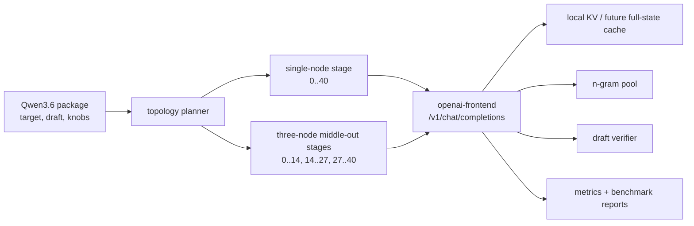

# Qwen Family Deployment Goals

This document is the customer-readiness plan for the Qwen3.6 target model. The
goal is to make Qwen3.6 reliable and measurably useful on both single-node and
multi-node topologies before sending a first customer package.

## Architecture Goal

Qwen3.6 should run from the same package inputs across local, lab, and customer
topologies. The runtime should choose a conservative topology by default, then
enable KV reuse, n-gram speculative decoding, and draft-model speculative
decoding only when the benchmark evidence says the feature helps that workload.



## Lab Environment

The fixed lab baseline is a three-node Qwen3.6 deployment over a private wired
`192.168.0.x` LAN. Resolve each lab host to its `192.168.0.x` address and force
stage binding, binary endpoints, rsync/SSH target selection, and metrics URLs
onto that interface so benchmark results are not mixed with Wi-Fi, mDNS path
changes, or ordinary office networking. The lab should be stable enough to run
repeatable customer-readiness benchmarks:

- dedicated hosts with passwordless SSH, `rsync`, fixed ports, and pinned
  runtime binaries;
- endpoint maps that force stage traffic onto the `192.168.0.x` private LAN;
- one unique host per distributed stage, with duplicate host assignments
  rejected;
- `metrics-server` reachable from every stage, using summary telemetry for
  benchmark runs and debug telemetry only for diagnosis;
- explicit run names, package identities, model ids, topology, corpus path,
  generation settings, and runtime knobs captured in the report artifacts.

The lab baseline should include:

- vanilla llama running Qwen3.6 as the reference model/runtime baseline;
- single-node full-stage Qwen3.6;
- three-node Qwen3.6 with the balanced `14,27` split.

Pinned lab hosts:

| Stage | Host | Lab IP | Notes |
| --- | --- | --- | --- |
| 0 | `studio54` | `192.168.0.2` | launcher host / this machine |
| 1 | `build` | `192.168.0.4` | remote stage host |
| 2 | `black` | `192.168.0.3` | remote stage host |

Host inventory verified over SSH on 2026-04-29:

| Stage | Host | SSH target | LAN interface | OS | Hardware | Memory | GPU |
| --- | --- | --- | --- | --- | --- | --- | --- |
| 0 | `studio54` | `192.168.0.2` -> `mac.lan` | `en0` / `192.168.0.2` | macOS `26.3` (`25D125`) | Mac Studio `Mac13,2`, Apple M1 Ultra, 20 CPU cores | 128 GB | Apple M1 Ultra, 48 GPU cores, Metal 4 |
| 1 | `build` | `192.168.0.4` -> `build.lan` | `en0` / `192.168.0.4` | macOS `26.4` (`25E246`) | Mac mini `Macmini9,1`, Apple M1, 8 CPU cores | 16 GB | Apple M1, 8 GPU cores, Metal 4 |
| 2 | `black` | `192.168.0.3` -> `black.lan` | `en8` / `192.168.0.3` | macOS `26.4.1` (`25E253`) | MacBook Air `Mac14,15`, Apple M2, 8 CPU cores | 24 GB | Apple M2, 10 GPU cores, Metal 4 |

Use the reachable SSH target in `--hosts` and literal LAN IPs in
`--endpoint-host-map` for benchmark runs. `black` is currently reachable from
the launcher as `black.local` for SSH control, while its stage server still
binds to `192.168.0.3` for the private LAN data path. Stage 0 is launched
locally by `skippy-bench run --execute-remote`; stages 1 and 2 are launched
over SSH:

```text
--hosts 192.168.0.2,192.168.0.4,black.local
--endpoint-host-map 192.168.0.2=192.168.0.2,192.168.0.4=192.168.0.4,black.local=192.168.0.3
```

Every lab run must start from a clean host baseline. Before launching any
correctness, smoke, benchmark, or knob-sweep run, execute:

```bash
scripts/qwen-lab-preflight.sh \
  --kill \
  --clean-tmp \
  --min-free-gb 20 \
  --out "$RUN_ROOT/preflight.txt"
```

The preflight must report no stale `skippy-server`, `kv-server`, Llama,
Mesh, or Ollama processes, no listeners on the reserved lab ports, and at least
20 GB free on `/` and `/tmp` for each lab host. Keep `preflight.txt` with the
raw run artifacts, and do not promote a run that started with stale processes,
occupied lab ports, or low disk.

## Benchmark Entry Point

All customer-readiness benchmark numbers must go through the chat-completions
frontend. Use `skippy-server serve-openai`, backed by the shared
`openai-frontend` crate, and send benchmark traffic to `/v1/chat/completions`.

Direct `skippy-prompt` or binary protocol runs are allowed for
correctness isolation, debugging, and preflight checks, but they are not
headline customer benchmark results. If a direct run is included in a report,
label it as diagnostic and keep it separate from chat-completions frontend
numbers.

Future prompt work should converge on the same OpenAI surface. `just prompt`
may remain the operator-friendly launcher, REPL, and log viewer, but its
generation path should be able to drive the stage-0 chat-completions endpoint
instead of maintaining a separate customer-invisible binary request path. This
keeps prompt diagnostics, benchmark traffic, and customer traffic exercising the
same parsing, chat-template, error-shaping, streaming, and usage-accounting
code.

Chat-completions frontend benchmark requirements:

- start `serve-openai` with an explicit `--model-id` matching the package id;
- start `serve-openai` with an explicit `--generation-concurrency` and record
  the value in the result;
- set request `max_tokens` for the benchmark lane, or set
  `--default-max-tokens` to the lane value;
- drive corpus traffic with `skippy-bench chat-corpus` or an equivalent
  chat-completions client that records the same request and error fields;
- include both streaming and non-streaming behavior only when the customer path
  needs both; otherwise prefer the same streaming mode used by the benchmark
  client;
- record `base_url`, advertised `/v1/models` id, request endpoint, streaming
  mode, and API error bodies in the run summary;
- treat frontend parsing, chat template application, SSE framing, usage
  accounting, and API-shaped errors as part of the measured product path.

Baseline Qwen thinking policy:

- disable Qwen thinking for every promoted baseline, local-reference,
  concurrent-depth, cache, and speculation run with request
  `--enable-thinking false`;
- run thinking-enabled traffic only as a separately labeled diagnostic or
  customer-specific package candidate;
- record the exact thinking flag in every raw result and promoted summary.

## Baseline Command Templates

These templates are the fixed starting point for the lab. Replace only the
model/package paths and run ids; keep topology, LAN binding, context,
generation, streaming, concurrency, and thinking controls explicit.

Shared environment:

```bash
export QWEN_MODEL_ID="customer/qwen3.6-package:Q4_K_M"
export QWEN_MODEL_PATH="/path/to/qwen3.6.gguf"
export QWEN_PACKAGE_PATH="/path/to/qwen3.6-layer-package"
export BENCH_ROOT="/Volumes/External/skippy-runtime-bench/qwen36-lab"
export RUN_ID="$(date +%Y%m%d-%H%M%S)"
export RUN_ROOT="$BENCH_ROOT/$RUN_ID"
export BASE_URL="http://192.168.0.2:9337/v1"
export STAGE_HOSTS="192.168.0.2,192.168.0.4,192.168.0.3"
export STAGE_ENDPOINT_MAP="192.168.0.2=192.168.0.2,192.168.0.4=192.168.0.4,192.168.0.3=192.168.0.3"
mkdir -p "$RUN_ROOT"
```

Generate the pinned HF-sourced corpora:

```bash
just bench-corpus smoke
just bench-corpus long
just bench-corpus coding-loop
just bench-corpus long-context
```

Audit token lengths with the actual Qwen3.6 tokenizer before promoting the
freeze:

```bash
skippy-bench token-lengths \
  --model-path "$QWEN_MODEL_PATH" \
  --prompt-corpus target/bench-corpora/long/corpus.jsonl \
  --ctx-size 8192 \
  --generation-limit 512 \
  --enable-thinking false \
  --output-tsv "$RUN_ROOT/long-prompt-lengths.tsv" \
  --summary-json "$RUN_ROOT/long-prompt-lengths-summary.json"

skippy-bench token-lengths \
  --model-path "$QWEN_MODEL_PATH" \
  --prompt-corpus target/bench-corpora/long-context/corpus.jsonl \
  --ctx-size 32768 \
  --generation-limit 512 \
  --enable-thinking false \
  --output-tsv "$RUN_ROOT/long-context-prompt-lengths.tsv" \
  --summary-json "$RUN_ROOT/long-context-prompt-lengths-summary.json"
```

Run correctness before starting throughput work. These reports are the hard
gate for the Qwen3.6 `14,27` topology; `--allow-mismatch` is diagnostic-only
and must not be used for promoted runs:

```bash
cargo build -p skippy-server -p skippy-correctness

target/debug/skippy-correctness single-step \
  --model "$QWEN_MODEL_PATH" \
  --model-id "$QWEN_MODEL_ID" \
  --stage-load-mode layer-package \
  --stage-model "$QWEN_PACKAGE_PATH" \
  --split-layer 14 \
  --layer-end 40 \
  --ctx-size 4096 \
  --n-gpu-layers -1 \
  --prompt "Explain why staged execution must preserve the next token." \
  --activation-wire-dtype f16 \
  --report-out "$RUN_ROOT/correctness-single-step-14.json"

target/debug/skippy-correctness single-step \
  --model "$QWEN_MODEL_PATH" \
  --model-id "$QWEN_MODEL_ID" \
  --stage-load-mode layer-package \
  --stage-model "$QWEN_PACKAGE_PATH" \
  --split-layer 27 \
  --layer-end 40 \
  --ctx-size 4096 \
  --n-gpu-layers -1 \
  --prompt "Explain why staged execution must preserve the next token." \
  --activation-wire-dtype f16 \
  --report-out "$RUN_ROOT/correctness-single-step-27.json"

target/debug/skippy-correctness chain \
  --model "$QWEN_MODEL_PATH" \
  --model-id "$QWEN_MODEL_ID" \
  --stage-load-mode layer-package \
  --stage-model "$QWEN_PACKAGE_PATH" \
  --splits 14,27 \
  --layer-end 40 \
  --ctx-size 4096 \
  --n-gpu-layers -1 \
  --prompt "Explain why staged execution must preserve the next token." \
  --activation-wire-dtype f16 \
  --report-out "$RUN_ROOT/correctness-chain-14-27.json"

target/debug/skippy-correctness dtype-matrix \
  --model "$QWEN_MODEL_PATH" \
  --model-id "$QWEN_MODEL_ID" \
  --stage-load-mode layer-package \
  --stage-model "$QWEN_PACKAGE_PATH" \
  --split-layer 14 \
  --layer-end 40 \
  --ctx-size 4096 \
  --n-gpu-layers -1 \
  --prompt "Explain why staged execution must preserve the next token." \
  --dtypes f32,f16,q8 \
  --report-out "$RUN_ROOT/correctness-dtype-matrix-14.json"
```

Launch the fixed three-node stage chain over the private LAN and keep it alive
for the chat-completions frontend:

```bash
skippy-bench run \
  --hosts "$STAGE_HOSTS" \
  --endpoint-host-map "$STAGE_ENDPOINT_MAP" \
  --model-id "$QWEN_MODEL_ID" \
  --stage-model "$QWEN_PACKAGE_PATH" \
  --splits 14,27 \
  --ctx-size 8192 \
  --max-new-tokens 1 \
  --n-gpu-layers -1 \
  --activation-wire-dtype f16 \
  --stage-telemetry-level summary \
  --metrics-otlp-grpc-addr 192.168.0.2:14317 \
  --metrics-otlp-grpc-url http://192.168.0.2:14317 \
  --execute-remote \
  --keep-remote \
  --work-dir "$BENCH_ROOT" \
  --run-id "$RUN_ID" \
  --output "$RUN_ROOT/stage-chain-smoke.json"
```

Start the chat-completions frontend with an explicit concurrency limit after
the stage chain is listening:

```bash
skippy-server serve-openai \
  --config "$RUN_ROOT/configs/stage-0.json" \
  --bind-addr 192.168.0.2:9337 \
  --first-stage-addr 192.168.0.2:19031 \
  --model-id "$QWEN_MODEL_ID" \
  --default-max-tokens 512 \
  --generation-concurrency 1 \
  --activation-wire-dtype f16
```

Smoke the product path:

```bash
skippy-bench chat-corpus \
  --base-url "$BASE_URL" \
  --model "$QWEN_MODEL_ID" \
  --prompt-corpus target/bench-corpora/smoke/corpus.jsonl \
  --max-tokens 64 \
  --concurrency-depth 1 \
  --stream \
  --include-usage true \
  --enable-thinking false \
  --output "$RUN_ROOT/smoke-chat-corpus.json"
```

Run the customer-readiness baseline:

```bash
skippy-bench chat-corpus \
  --base-url "$BASE_URL" \
  --model "$QWEN_MODEL_ID" \
  --prompt-corpus target/bench-corpora/long/corpus.jsonl \
  --max-tokens 512 \
  --concurrency-depth 1 \
  --stream \
  --include-usage true \
  --enable-thinking false \
  --output "$RUN_ROOT/readiness-depth1-chat-corpus.json"
```

Run concurrent-depth checks by changing only `--concurrency-depth`, output
name, and the matching `serve-openai --generation-concurrency` value when the
goal is true concurrent generation rather than frontend queueing:

```bash
for depth in 1 2 4; do
  skippy-bench chat-corpus \
    --base-url "$BASE_URL" \
    --model "$QWEN_MODEL_ID" \
    --prompt-corpus target/bench-corpora/long/corpus.jsonl \
    --max-tokens 512 \
    --concurrency-depth "$depth" \
    --stream \
    --include-usage true \
    --enable-thinking false \
    --session-prefix "qwen36-depth${depth}" \
    --output "$RUN_ROOT/readiness-depth${depth}-chat-corpus.json"
done
```

Run async prefill-forward only after the synchronous baseline is repeatable.
Use the same package, corpus, context, generation limit, frontend concurrency,
and report shape; the stage-launch delta is only
`--stage-async-prefill-forward`:

```bash
skippy-bench run \
  --hosts "$STAGE_HOSTS" \
  --endpoint-host-map "$STAGE_ENDPOINT_MAP" \
  --model-id "$QWEN_MODEL_ID" \
  --stage-model /path/to/qwen3.6-layer-package \
  --splits 14,27 \
  --ctx-size 8192 \
  --max-new-tokens 1 \
  --n-gpu-layers -1 \
  --activation-wire-dtype f16 \
  --stage-telemetry-level summary \
  --stage-async-prefill-forward \
  --execute-remote \
  --keep-remote \
  --work-dir "$BENCH_ROOT" \
  --run-id "${RUN_ID}-async-prefill" \
  --output "$RUN_ROOT/async-prefill-stage-chain-smoke.json"
```

## Benchmark Corpus

The go-forward benchmark should use stable corpus definitions instead of
hand-picked prompts. The checked-in source of truth is:

```text
crates/skippy-bench/corpora/bench_corpus_sources.json
```

That file pins Hugging Face dataset names, revisions, adapters, quotas, task
families, and routing hints. Lab runs should generate corpora from those pinned
definitions and record the generated `manifest.json` next to the benchmark
report:

```bash
just bench-corpus smoke
just bench-corpus long
just bench-corpus coding-loop
```

Use:

- `target/bench-corpora/smoke/corpus.jsonl` for quick change validation after it
  is generated;
- `target/bench-corpora/long/corpus.jsonl` for customer-readiness numbers after
  it is generated;
- `target/bench-corpora/coding-loop/corpus.jsonl` for repeated edit-loop and
  warm n-gram behavior after it is generated;
- `target/bench-corpora/long-context/corpus.jsonl` for 32k context stress after
  it is generated and token-length audited. This tier expands sampled HF text
  into long stress packets for context capacity and transport testing; do not
  use it for quality or speculation decisions;
- checked-in `crates/skippy-bench/corpora/kv_mixed_prompts.jsonl` for
  small KV and prefix-cache regression runs.

Do not treat an ungenerated `target/bench-corpora/...` path as evidence. The
lab report must include the generated manifest, corpus row count, source
revisions, and any prompt limits used for that run.

Reports must explain where time went, not only whether a run was fast or slow.
Every decision-grade run should include per-family/task rollups, overall token
throughput, TTFT, phase P50/P95/P99, stage compute, downstream wait, forward
write, activation bytes, KV positions, speculative acceptance, repair counts,
and request-level errors. Use the `Benchmark Reporting Contract` section below
as the source of truth for the exact tables and interpretation rules.

M1 corpus-freeze checklist:

- `smoke`, `long`, `coding-loop`, and `long-context` corpora generate from the
  checked-in source manifest without ad hoc prompt edits;
- each generated `manifest.json` records source revisions, resolved revisions,
  row counts, seed, generator commit, and `max_prompt_chars`;
- the sum of per-source quotas matches each generated row count;
- `long` has Qwen3.6 token-length TSV and summary JSON for `ctx_size=8192` and
  `generation_limit=512`;
- `long-context` has Qwen3.6 token-length TSV and summary JSON for
  `ctx_size=32768` and `generation_limit=512`;
- both token-length summaries report `exceeds_context=0`;
- the freeze summary records corpus checksums, manifest paths, tokenizer/model
  identity, thinking flag, and any rows excluded before promotion.

## Context And Generation Limits

The lab should set context and generation limits explicitly. Do not rely on CLI
defaults; some benchmark defaults are intentionally tiny for plumbing tests.

Use these Qwen3.6 lanes:

- customer-readiness corpus: `--ctx-size 8192`, `--max-new-tokens 512`;
- TTFT/prefill comparison: `--ctx-size 4096`, `--max-new-tokens 8`, reported
  as a prefill/TTFT diagnostic rather than customer readiness;
- short smoke/plumbing checks: `--ctx-size 4096`, `--max-new-tokens 64`;
- sustained decode spot check: `--ctx-size 8192`, `--max-new-tokens 1024` on a
  balanced subset of the long corpus and coding-loop corpus;
- long-context stress: `--ctx-size 32768` only with a corpus that actually
  reaches long prompt lengths, reported separately from the baseline.

For chat-completions frontend runs, `--max-new-tokens` maps to the request
`max_tokens` value or to `serve-openai --default-max-tokens` when the client
omits `max_tokens`.

Short generation caps are useful for isolating TTFT, transport, and verifier
overhead, but they should not be the headline customer-readiness result. A
package intended for coding, analysis, or tool-use traffic should prove it can
comfortably generate hundreds of tokens per request. The 512-token readiness
lane is the main result; the 1024-token subset is there to catch decode-time
queueing, speculative recovery cost, and memory growth that shorter runs can
hide.

The corpus generator currently caps prompt text by characters with
`--max-prompt-chars`, so every lab report should include the tokenized prompt
length distribution for the actual Qwen3.6 tokenizer. No reported row should
silently exceed `ctx_size`; either keep `prompt_tokens + max_new_tokens` within
the configured context or record the row as skipped/truncated in the manifest.

## Middle-Out Topology

Qwen3.6 has 40 layers. The stable three-node lab topology is middle-out balanced
execution with one contiguous layer range per host:

```text
stage-0: 0..14
stage-1: 14..27
stage-2: 27..40
```

Middle-Out is not a later optional optimization for the three-node customer
path; it is the baseline topology requirement. Without the balanced middle-out
split, the three-node run is mostly a diagnostic of an uneven pipeline, not a
customer-readiness candidate. The later optimization work should tune around
this topology: request concurrency, prefill chunking, reply credit, async
prefill-forward, activation dtype, speculation, and full-state cache.

The benchmark launcher should continue rejecting lab splits where the largest
and smallest stage differ by more than one layer. Uneven splits can be used for
investigation, but they should not be reported as the customer baseline unless
the topology planner and benchmark report both name them as a customer-specific
package choice.

## KV And Full-State Reuse

Qwen3.6 GGUFs are hybrid/recurrent models. Their reusable decode state is not
only attention KV; it also includes recurrent/SSM state. A KV-only cache is
therefore not a complete representation of model state.

Current policy:

- do not enable KV-only lookup or record for Qwen3.6-style recurrent models;
- keep n-gram speculative decoding enabled because it does not depend on model
  state capture;
- treat beneficial Qwen3.6 cache reuse as a full-state cache goal:
  `attention KV + recurrent/SSM state + position/session metadata`;
- benchmark any future full-state cache against recompute for long repeated
  coding and retrieval contexts, not just short prompts.

Remote package mode must resolve the concrete stage GGUF before running model
inspection. This prevents layer-package directories from bypassing the recurrent
guard and accidentally enabling KV-only cache behavior.

Literature-informed cache policy:

- Marconi ([arXiv:2411.19379](https://arxiv.org/abs/2411.19379)) is the best
  match for Qwen3.6-style hybrid/recurrent caching. Treat it as support for
  exact full-state prefix reuse, not for KV-only cache promotion.
- Prompt Cache ([arXiv:2311.04934](https://arxiv.org/abs/2311.04934)) supports
  making reusable prompt segments explicit. For Qwen3.6 this means
  canonicalizing stable system, tool, policy, and document chunks before hashing
  token prefixes.
- MemServe ([arXiv:2406.17565](https://arxiv.org/abs/2406.17565)) and DLPM
  ([arXiv:2501.14312](https://arxiv.org/abs/2501.14312)) support scheduling
  repeated-prefix work toward cache-local stage processes. Keep this as a
  topology/scheduler investigation after local cache economics are known.
- Pensieve ([arXiv:2312.05516](https://arxiv.org/abs/2312.05516)) supports a
  future multi-tier cache, but the first customer package should stay
  process-local unless measured hot-prefix memory pressure requires a spill tier.
- CacheBlend ([arXiv:2405.16444](https://arxiv.org/abs/2405.16444)) and KVShare
  ([arXiv:2503.16525](https://arxiv.org/abs/2503.16525)) are useful future
  directions for selective recomputation or approximate reuse, but they are not
  safe package defaults until Qwen3.6 has quality/correctness gates for
  non-exact reuse.
- DASH-KV ([arXiv:2604.19351](https://arxiv.org/abs/2604.19351)) is a watch
  item for long-context attention acceleration. Do not mix it into the
  full-state cache path until we have a llama.cpp-compatible implementation and
  exactness/quality evidence for Qwen3.6.

Near-term implication: keep the serving-path full-state cache exact and
stage-local, then measure whether payload minimization or shared-once storage is
needed before trying locality-aware scheduling or multi-tier cache placement.

## Speculative Decoding

Qwen3.6 should ship with speculative modes as package knobs, not as unverified
defaults.

N-gram pooling:

- keep it available for repeated coding, retrieval, and agent edit-loop
  sessions;
- use the coding-loop corpus to decide whether flat or adaptive confidence is
  better for the current verifier path;
- isolate pools by model, tokenizer, tenant, project, session, explicit pool id,
  and n-gram size unless a package intentionally shares a trusted pool.

Checkpoint-backed n-gram speculation:

- include upstream llama.cpp speculative checkpointing
  ([PR #19493](https://github.com/ggml-org/llama.cpp/pull/19493)) as a
  separate experiment lane from draft-model speculation;
- test `--ctx-checkpoints` / checkpoint-backed n-gram modes first on upstream
  `llama-server` with the same chat-completions benchmark client against the
  frozen `coding-loop` corpus, because that is the workload most likely to
  reward repeated-token prediction;
- use it specifically to evaluate speculation for recurrent/SSM-backed Qwen
  contexts where partial sequence removal is not enough for safe rollback;
- if the upstream server lane wins, port the checkpoint/restore API shape into
  the stage0 embedded OpenAI path before trying to promote it for the
  three-node package;
- record checkpoint count, checkpoint create/restore time, accepted tokens,
  reverify tokens, and end-to-end throughput so wins are not hidden by
  checkpoint overhead.

Draft-model speculative decoding:

- certify the target/draft pair with `llama-spec-bench` before enabling it in a
  package;
- run staged prompt corpus modes for `baseline`, `draft-fixed`,
  `draft-adaptive`, `ngram`, and `ngram-adaptive`;
- prefer adaptive draft windows when they improve throughput without excessive
  repair or recovery cost;
- record tokenizer compatibility, acceptance rate, repair count, verify
  throughput, and end-to-end throughput in the package evidence.

The current tested draft candidate is:

```text
barozp/Qwen3.6-28B-REAP20-A3B-GGUF
Qwen3.6-28B-REAP20-A3B-Q2_K.gguf
```

DFlash speculative decoding:

- test the DFlash llama.cpp fork as an external spike before changing `skippy`;
- track upstream llama.cpp
  ([PR #22105](https://github.com/ggml-org/llama.cpp/pull/22105)) as the
  Qwen/DFlash integration candidate, separate from the local fork spike;
- use matched Qwen3.6 target and DFlash draft artifacts, then compare against
  the same no-spec baseline through an OpenAI-compatible surface;
- if it wins locally, evaluate the porting surface: draft architecture loading,
  hidden-state inputs, checkpoint/recovery behavior, metrics, and stage0
  integration;
- keep DFlash package-off until it runs through embedded stage0 OpenAI and the
  three-node stage path with correctness and throughput evidence.

Hybrid speculative proposer:

- add a follow-up experiment for using native n-gram and DFlash together as
  alternative proposers, not as blindly stacked modes;
- test an `ngram-first, DFlash-fallback` policy only after native n-gram wins on
  `coding-loop` and DFlash wins on a broader local OpenAI A/B;
- prefer n-gram proposals when the active context has strong repeated-token
  hits, because they are cheap and can avoid draft-model work;
- fall back to DFlash only when n-gram has no useful proposal or when the
  n-gram confidence gate fails;
- record proposer choice, proposal tokens, accepted tokens, restore/reverify
  cost, and end-to-end throughput by prompt category before considering it for
  embedded stage0 or three-node tests.

## Customer Package

A Qwen3.6 customer package is the set of artifacts and knobs needed to run the
customer's desired topology reproducibly:

- primary target model identity and concrete GGUF or layer-package artifacts;
- optional draft model identity and GGUF artifact;
- layer ranges and host count, including whether the package is single-node or
  multi-node;
- activation wire dtype, expected context size, max tokens, GPU offload policy,
  and prefill chunk policy;
- KV/full-state cache policy and whether it is disabled, diagnostic, or
  production-ready for this family;
- n-gram pool policy, speculative window policy, and draft-model mode;
- served chat model name and frontend settings when applicable;
- metrics, logging, and report retention settings;
- validation evidence: correctness, corpus benchmark summary, speculative
  summary, and known limitations.

The package should be portable enough that the lab can reproduce the customer's
intended deployment and the customer can reproduce the lab's recommended
settings.

Package artifacts should have one stable lab location per model/package identity
that all launchers reuse. The benchmark runner, OpenAI stage-0 server, prompt
launcher, and customer package builder should point at the same materialized
stage GGUFs or package cache instead of re-syncing full model packages into
separate run roots. Remote hosts with limited disk, especially `build`, should
receive only the concrete stage artifacts they need for their assigned layer
range unless a test explicitly exercises full-package materialization.

## Parallel Requests

Parallel request behavior is part of readiness, not an afterthought. The
benchmark plan should include concurrent prompt sessions with distinct
`session_id` and `request_id` values so stage runtimes, KV identity, n-gram
pools, telemetry, and chat-completions request handling do not collapse
unrelated traffic together.

Readiness gates:

- no cross-session state contamination;
- bounded stage queues under concurrent prefill and decode;
- stable TTFT and throughput under realistic parallel depth;
- telemetry queue capacity high enough to avoid drops in summary mode;
- package knobs for `stage-max-inflight`, reply credit, async prefill forward,
  chunk size, and chunk schedule backed by lab evidence.

## Async Prefill-Forward

`--stage-async-prefill-forward` is in scope for the lab, but it is not part of
the first synchronous baseline. Test it as an opt-in transport experiment after
the three-node baseline has repeated cleanly.

Async prefill-forward test rules:

- keep the synchronous baseline as the control run for the same corpus,
  topology, context, generation limit, chunk policy, activation dtype, and
  frontend concurrency;
- run `smoke` first, then `long` at depth `1`, then depths `2` and `4` only if
  queues, memory, telemetry, and request errors stay clean;
- record stage compute, downstream wait, forward write p50/p95/p99, queue max,
  reply-credit waits, dropped telemetry, reconnects, and request errors;
- promote it only if repeated chat-completions runs improve TTFT/tail or total
  throughput after variance, queueing, and error rate are included;
- keep it package-off with the measured reason if it regresses, increases tail
  latency, creates memory growth, or complicates cancellation/recovery.

## Benchmark Reporting Contract

The report must account for the whole product path from OpenAI request arrival
to final result, then break that path into phases that tell us what to
optimize. A report that only says "three-node was slow" is not decision-grade.

Required run identity:

| Field | Required Detail |
| --- | --- |
| Product entry | OpenAI base URL, endpoint, streaming mode, advertised `/v1/models` id |
| Model/package | target model id, source revision/checksum, package id, draft id if any |
| Topology | vanilla llama, single-node full-stage, or three-node split `14,27` |
| Hosts | hostname, LAN IP, stage id, layer range, SSH target, artifact path |
| Corpus | tier, manifest path, row count, checksum, prompt limit, prompt rows used |
| Generation | context size, generation limit, thinking flag, sampling, seed, stop policy |
| Runtime knobs | activation dtype, prefill chunk size, reply credit, inflight, async prefill-forward, frontend generation concurrency |
| Telemetry | telemetry level, queue capacity, metrics DB path, dropped/export-error counts |
| Clean start | preflight path, stale-process result, occupied-port result, free disk result |

Required headline comparison:

| Metric | Vanilla llama | Single-node full-stage | Three-node baseline | Delta vs full-stage |
| --- | ---: | ---: | ---: | ---: |
| Requests | | | | |
| API errors | | | | |
| Wall time | | | | |
| End-to-end p50 | | | | |
| End-to-end p95 | | | | |
| End-to-end p99 | | | | |
| TTFT p50/p95/p99 | | | | |
| Decode tok/s | | | | |
| Total tok/s | | | | |

Required OpenAI pipeline breakdown:

| Phase | Measures | p50 | p95 | p99 | Total | Interpretation |
| --- | --- | ---: | ---: | ---: | ---: | --- |
| HTTP request | server-side OpenAI request entry to response creation | | | | | Reconciles backend spans with client-observed latency. |
| Chat template / prompt prepare | request messages to rendered prompt text | | | | | High values point to frontend/template cost, not model execution. |
| Tokenize | rendered prompt to token ids | | | | | High values point to tokenizer/template hot path or very long prompts. |
| Generation admit | wait for frontend generation concurrency permit | | | | | Non-zero values mean depth runs may be frontend-queued. |
| Downstream connect | stage-0 OpenAI path connecting to binary chain | | | | | Should be tiny after startup; high values imply process or network churn. |
| Prefill | prompt context execution before decode | | | | | Optimize with chunking, middle-out overlap, full-state cache, or prefix reuse. |
| Decode | generated token loop | | | | | Optimize TPOT, speculation, sampling overhead, and per-token stage chaining. |
| Detokenize/text emit | token-to-text plus collector/SSE body work | | | | | Usually small; high values can hide streaming or UTF-8 buffering costs. |
| Response build | final OpenAI JSON/body assembly | | | | | Usually small; high values point to response shaping. |
| Client gap | client elapsed minus server HTTP span | | | | | Client, network, benchmark driver, or report overhead only. |

Required token and speed breakdown:

| Metric | p50 | p95 | p99 | Total / Mean | Interpretation |
| --- | ---: | ---: | ---: | ---: | --- |
| Prompt tokens | | | | | Explains prefill cost and context pressure. |
| Prefill tokens | | | | | Should match prompt minus seed/decode token policy. |
| Generated tokens | | | | | Explains decode cost and generation-limit effects. |
| Hidden thinking tokens | | | | | Must be `0` for promoted thinking-disabled baselines. |
| TTFT | | | | | User-visible first response latency. |
| TPOT | | | | | Per-token decode latency. |
| Steady TPOT | | | | | TPOT after warmup or first-token effects. |
| Prefill tok/s | | | | | Prompt-processing efficiency. |
| Decode tok/s | | | | | Sustained generation efficiency. |

Required distributed-stage breakdown:

| Phase | Stage | Host | Layers | Compute p50/p95/p99 | Forward write p50/p95/p99 | Downstream wait p50/p95/p99 | Activation bytes p50/p95/p99 |
| --- | --- | --- | --- | ---: | ---: | ---: | ---: |
| Prefill | stage-0 | | | | | | |
| Prefill | stage-1 | | | | | | |
| Prefill | stage-2 | | | | | | |
| Decode | stage-0 | | | | | | |
| Decode | stage-1 | | | | | | |
| Decode | stage-2 | | | | | | |

Stage wait interpretation:

- A later stage waiting to receive its first usable activation is expected. It
  cannot compute before the preceding stage produces data.
- Do not treat all downstream wait as waste. Separate true data dependency from
  avoidable serialization, buffering, transport stalls, or credit/backpressure.
- For prefill, the important question is whether boundary activations are
  streamed downstream while the preceding stage continues computing later
  chunks. This is the middle-out behavior that can hide network transfer and
  downstream compute under upstream compute.
- A bad pattern is "stage 1 computes the whole prompt, then sends everything to
  stage 2." A good pattern is "stage 1 sends chunk `i` to stage 2 while stage 1
  computes chunk `i+1`, and stage 2 begins useful work before stage 1 finishes
  all prefill."

Required middle-out overlap fields:

| Field | Meaning | Interpretation |
| --- | --- | --- |
| `first_activation_sent_ms` | Time from request start until `stage.binary_downstream_write` starts for usable downstream activation | Earlier is better for long prefill. In async mode this must come from the async writer span, not enqueue time. |
| `first_activation_received_ms` | Time from request start until the downstream stage receives usable activation | Large gap from sent time points to transport or buffering. |
| `stage_compute_window_ms` | `stage.binary_llama_decode` span duration for a stage and phase | Baseline for how much work can hide transfer/downstream work. |
| `downstream_compute_overlap_ms` | Downstream `stage.binary_llama_decode` time that occurs before upstream phase completion | Higher means middle-out is working. |
| `prefill_pipeline_overlap_pct` | Percent of downstream compute/write hidden under upstream compute | Main middle-out health metric. |
| `tail_wait_ms` | Time after upstream phase completion while downstream or network still works | High tail means chunking, wire dtype, or transfer path may need tuning. |
| `write_blocked_ms` | `stage.binary_downstream_write` span time on the upstream stage | High values indicate backpressure, socket, or bandwidth limits. |
| `reply_credit_wait_count` | Times upstream had to wait for credit/replies | High values indicate credit policy constraining prefill flow. |

Middle-out is considered measured only when the run contains real
`stage.binary_llama_decode`, `stage.binary_downstream_write`, and
`stage.binary_message_timing` spans for the three-node path. Duration attributes
alone are not enough because the report must align stage0, stage1, and stage2
windows on the same timeline.

Required KV/full-state cache breakdown:

| Metric | p50 | p95 | p99 | Total | Interpretation |
| --- | ---: | ---: | ---: | ---: | --- |
| Lookup latency | | | | | Cache lookup overhead. |
| Hits / misses / errors | | | | | Hit rate is useful only if correctness is preserved. |
| Imported pages/tokens/bytes | | | | | Import economics. |
| Recorded pages/tokens/bytes | | | | | Record overhead and storage pressure. |
| Attach latency | | | | | Restore path cost. |
| Cache residency bytes | | | | | Memory pressure per hot prefix and per stage. |
| Recompute-saved wall | | | | | End-to-end wall time saved, measured from spans rather than summed stage elapsed. |
| Full-state exactness | | | | pass/fail | Required before enabling Qwen3.6 cache reuse. |

Required speculative-decoding breakdown when speculation is enabled:

| Metric | p50 | p95 | p99 | Total / Rate | Interpretation |
| --- | ---: | ---: | ---: | ---: | --- |
| Windows | | | | | Speculation opportunities. |
| Proposed tokens | | | | | Draft or n-gram work offered to verifier. |
| Accepted tokens | | | | | Useful speculative work. |
| Rejected tokens | | | | | Wasted speculative work. |
| Acceptance rate | | | | | Main speculation health metric. |
| Full-accept windows | | | | | Best-case windows. |
| Early/tail reject windows | | | | | Helps tune window growth/shrink policy. |
| Recovery ms | | | | | Cost after rejection. |
| Reverify ms | | | | | Verifier cost hidden in apparent decode time. |
| Checkpoint/restore ms | | | | | State management cost. |

How to read a report:

- If token counts differ materially between runs, normalize before blaming
  topology. More generated tokens or longer prompts can explain a slower run.
- If generation-admit time is non-zero, the result includes frontend queueing.
  Interpret concurrent-depth numbers as product behavior, but do not call them
  pure stage-chain parallelism.
- If prefill dominates and overlap is low, investigate chunk size, chunk
  threshold, async prefill-forward, activation dtype, and full-state cache.
- If decode dominates, investigate TPOT, sampling cost, speculative decoding,
  per-token stage-chain round trips, and whether request concurrency helps
  throughput without tail blowup.
- If raw socket/write time is small but downstream wait is high, look for
  serial dependency or missing overlap before tuning the LAN.
- If write-blocked or tail-wait time is high, tune transfer path, activation
  dtype, chunk size, reply credit, inflight limits, or async prefill-forward.
- If detokenization or response build is high, optimize the OpenAI surface
  before changing model topology.
- If KV/full-state cache hits are high but latency does not improve, the cache
  economics are negative for that corpus. Keep it package-off.
- If speculation acceptance is high but wall time does not improve, recovery,
  reverify, checkpoint/restore, or frontend costs are eating the benefit.

## Measurement Plan

Start with the boring baseline path, then add one optimization at a time.
For the three-node customer path, the boring baseline already includes the
middle-out `14,27` split; later optimization work tunes the execution knobs
around that split. The first lab pass should prove repeatability and correctness
before trying to make the numbers pretty.

| Phase | Run | Exit Gate |
| --- | --- | --- |
| 1. Corpus freeze | Generate `smoke`, `long`, `coding-loop`, and `long-context` with `just bench-corpus ...`. Record each `manifest.json`, row count, source revisions, seed, and Qwen3.6-tokenized prompt length distribution. | All corpus generators complete. Manifests record pinned source revisions and row counts. `prompt-lengths.tsv` and summary JSON are available for the 8k readiness and 32k stress lanes. No row where `prompt_tokens + generation_limit > ctx_size` is silently included. |
| 2. Correctness | Run `skippy-correctness` against the full GGUF and the same layer package that will be benchmarked: `single-step` at split `14`, `single-step` at split `27`, `chain` at splits `14,27`, and `dtype-matrix` at split `14`. Validate package tensor ownership before promoting the result. Keep speculation off and Qwen3.6 KV-only cache disabled. | The package validates with source checksum, layer coverage, artifact checksums, and no missing or duplicate owned tensors. Correctness JSON exists for both split boundaries, the full `14,27` chain, and dtype behavior. Promoted reports do not use `--allow-mismatch`. `f16` is exact for the topology; `q8` is either exact or explicitly recorded package-off. |
| 3. Local references | Run the same customer-readiness corpus through the chat-completions frontend against vanilla llama and single-node full-stage Qwen3.6 before spending more time on the three-node long run. Use this to separate model/runtime cost, frontend cost, corpus shape, and generation-limit cost from LAN stage cost. End M3 by setting the explicit three-node performance classification and the projection window used to short-circuit M4 if the run is clearly too slow. | Local reference runs use the same corpus manifest, tokenizer, context, generation cap, served model id, thinking policy, and package identity. Comparison tables include elapsed p50/p95/p99, decode tok/s, total tok/s, error counts, and prompt token distribution. M3 must produce a single-node full-stage projection, then classify M4 relative to it: green is `<= 2x`, yellow is `<= 3x`, red is `> 3x`. If local references are already too slow for the full long corpus, define the smaller calibration subset before resuming three-node optimization. |
| 4. Three-node baseline | After local references identify the realistic target envelope, run `scripts/qwen-lab-preflight.sh --kill --clean-tmp --min-free-gb 20 --out "$RUN_ROOT/preflight.txt"`, then run chat-completions smoke with `--ctx-size 4096`, `max_tokens=64`. Before committing to the full long run, execute the M3-defined projection window on the customer-readiness long corpus or calibrated long subset through the chat-completions frontend with `--ctx-size 8192`, `max_tokens=512`. If the projection is performance-red, stop the run and record a stable-but-too-slow baseline instead of letting it run for hours. | Preflight reports no stale model/stage/Mesh processes, no occupied lab ports, and at least 20 GB free on `/` and `/tmp` for each host. Smoke passes with zero request errors. Stability and performance are separate gates: stability requires zero request errors, no API error bodies, no silent truncation, no unexplained crashes, reconnects, telemetry drops, or queue runaway; performance is classified green/yellow/red against the M3 single-node full-stage projection. A red projection short-circuits the full corpus and records elapsed time, completed rows, projected full-corpus wall clock, token throughput, error count, and stage telemetry. |
| 5. Speculation | Run n-gram modes on `long` and `coding-loop` through the chat-completions frontend. Certify draft pairs with `llama-spec-bench` as a diagnostic gate. Run `baseline`, `draft-fixed`, `draft-adaptive`, `ngram`, and `ngram-adaptive` through the staged chat-completions path. Add two separate follow-up lanes: upstream checkpoint-backed n-gram speculation from llama.cpp PR #19493, and DFlash through the DFlash llama.cpp fork before any stage-runtime port. | Each enabled speculative mode beats the non-speculative staged chat-completions baseline on its target corpus after repair/recovery, checkpoint, draft-proposal, and frontend costs are included. Modes that do not win are recorded as package-off knobs with the reason. Checkpoint-backed n-gram and DFlash stay package-off until they run through the chat-completions benchmark path with correctness evidence and positive end-to-end throughput. |
| 6. Concurrent-depth investigation | Run parallel request depths `1`, `2`, and `4` through the chat-completions frontend first. Increase only if stage queues, telemetry, and memory remain stable. Keep session IDs distinct. | Depths `1`, `2`, and `4` complete without cross-session contamination, request-id/session-id collapse, queue runaway, telemetry drops, or memory growth that continues after the run ends. The promoted report includes the depth table. |
| 7. Frontend concurrency investigation | Confirm whether `serve-openai` serializes generation, then decide whether package concurrency is limited at the frontend or whether the frontend/backend adapter needs a configurable concurrency limit. | The report names the effective frontend generation concurrency limit. If the limit is `1`, depth results are interpreted as frontend-serialized and not as true stage-chain parallelism. |
| 8. Runtime parallelism investigation | Use the runtime lock/session spans from depth runs to decide whether to prototype runtime shards, per-session locking, or an explicit scheduler/batcher. Start with a smoke subset before touching the long corpus. | A parallelism option is promoted only if it improves depth `2` or `4` chat-completions throughput or tail latency without correctness regressions, cross-session contamination, memory runaway, native runtime crashes, or GPU fallback. Otherwise it stays diagnostic/package-off. |
| 9. Transport and prefill knobs | After the stable baseline, sweep only one knob family at a time: prefill chunk size, chunk threshold/schedule, activation wire dtype, `stage-max-inflight`, reply credit, and async prefill-forward. | A knob is promoted only if it improves the chat-completions readiness run after variance, queueing, telemetry drops, and error rate are included. Async prefill-forward must also prove bounded background writer queues and clean cancellation/recovery. Otherwise it remains diagnostic/package-off. |
| 10. Full-state cache investigation | Inventory Qwen3.6 recurrent/SSM state, prototype exact export/restore, test on the three-node `14,27` topology, and measure economics against recompute. Keep KV-only cache disabled throughout. Use the Marconi/Prompt Cache direction: exact hybrid-state prefix identity first, canonical reusable chunks second, locality-aware scheduling only after local cache economics are known. | Full-state cache is either proven exact and beneficial enough to become a package knob, or explicitly recorded as diagnostic/package-off. KV-only lookup/record remains disabled for Qwen3.6. The report must include hit/miss counts, import/export bytes, cache residency bytes, span-derived wall saved, and whether payloads are layer-range-minimal or duplicated whole-state blobs. |
| 11. Package | Capture model identities, split `14,27`, LAN endpoint mapping, context, generation limits, frontend concurrency, prefill chunk policy, speculative knobs, cache policy, shared artifact locations, and report locations. | The package manifest is reproducible from a clean lab checkout, names all customer-facing knobs, reuses the same model slice/package cache across prompt, benchmark, and OpenAI launchers, includes conservative fallbacks, and links to the promoted summary plus raw artifact directory. |

## Milestone Results

This ledger is the first place to check for milestone outcomes. Update it when a
milestone reaches `pass`, `fail`, or `investigate`; leave raw logs and generated
corpora outside git.

Status values:

- `pass`: exit gate met and the next milestone can start;
- `investigate`: enough evidence exists to narrow the issue, but the package is
  not blocked forever;
- `fail`: exit gate missed and the package is blocked until the issue is fixed;
- `pending`: not run yet.

| Milestone | Status | Decision | Evidence | Next Action |
| --- | --- | --- | --- | --- |
| M1. Corpus freeze | pass | Use frozen corpora for correctness and baseline runs. | Generated from commit `b2c2f1b04f26239f0505ae69789b7e51b5a11709` with seed `2458`. Rows: `smoke=24`, `long=565`, `coding-loop=160`, `long-context=70`. Qwen3.6 token audits with thinking disabled all report `exceeds_context=0`. | Start M2 correctness. |
| M2. Correctness | pass | Use the fixed layer package for three-node lab bring-up. | See [qwen-results.md](qwen-results.md#m2-correctness-m2-correctness-20260429-112147). Run root `/Volumes/External/llama-stage-runtime-bench/qwen36-lab/m2-correctness-20260429-112147`. Source `unsloth/Qwen3.6-35B-A3B-GGUF@9280dd353ab587157920d5bd391ada414d84e552/Qwen3.6-35B-A3B-UD-Q4_K_XL.gguf`, SHA256 `707a55a8a4397ecde44de0c499d3e68c1ad1d240d1da65826b4949d1043f4450`. Package validation `valid=true`, `missing_owned_tensors=[]`, `duplicate_owned_tensors=[]`. `single-step` split `14`, `single-step` split `27`, `chain 14,27`, and dtype matrix `f32/f16/q8` all pass with baseline token `814` and predicted token `20139`. | Start M3 local references before resuming three-node long readiness. |
| M3. Local references | pass | Local references set the M4 classification: compare three-node projection to the single-node full-stage projection instead of a hard one-hour wall. Use a projection window of the first 24 long-corpus rows or 12 minutes, whichever comes first. | See [qwen-results.md](qwen-results.md#m3-local-references-m3-local-references-20260429-173642). Run root `/Volumes/External/llama-stage-runtime-bench/qwen36-lab/m3-local-references-20260429-173642`. Full-stage long-24: `errors=0`, `completion_tok_s=47.15`, projected full corpus `43.40 min`. Vanilla llama long-24: `errors=0`, `completion_tok_s=41.52`, projected full corpus `49.50 min`; upstream default branch `master` commit `739393beeb4b78397003d5d8c5dd0c25a051bc14`. M4 classification from the full-stage reference: green `<= 86.8 min`, yellow `<= 130.2 min`, red `> 130.2 min`. | Start M4 projection window on the three-node middle-out path; short-circuit only the full long run if the projection is red. |
| M4. Three-node baseline | investigate, stability pass; performance red | The three-node default-KV path is functionally healthy under the real-TTY launch path, but still projects to `3.65x` the single-node full-stage long-corpus time. Middle-out prefill overlap is real, yet decode dominates the long projection. | See [qwen-results.md](qwen-results.md#m4-projection-m4-projection-chunk128-20260429-200901) and [qwen-results.md](qwen-results.md#real-tty-default-kv-vs-tcq-ab-defaultkv-real-tty-ab-20260502-104818). The current official baseline is the real-TTY default-KV A/B run root `/Volumes/External/llama-stage-runtime-bench/qwen36-lab/defaultkv-real-tty-ab-20260502-104818`: smoke and long-24 passed with `errors=0`, no telemetry drops, and clean `build -> black` connectivity. Long-24 wall `404.26s`, `completion_tok_s=12.86`, projected full 565-row long corpus `158.6 min` versus the single-node full-stage projection `43.40 min`. Mixed TCQ is not promoted because it projects worse on wall (`246.4 min`) and changes finish behavior (`13/24` long prompts hit `max_tokens`). | Keep default KV as the current three-node baseline. Do not run the full long corpus until decode acceleration, topology balance, runtime parallelism, or a smaller explicit customer subset moves the projection into yellow or green. |
| M5. Draft speculation | fail | Draft-model speculative decoding works through the embedded stage0 OpenAI surface, but no tested draft is a package default. The Qwen3.6 28B Q2_K corpus sweep lost to baseline, the Qwen3.5 0.8B batched-rollback projection still loses, and the larger Qwen3.5 2B/4B/9B candidate sweep also fails on both single-node and three-node paths. | See [qwen-results.md](qwen-results.md#draft-openai-speculation-smoke-draft-openai-20260430-074258), [qwen-results.md](qwen-results.md#draft-openai-corpus-sweep-draft-openai-corpus-20260430-075313), [qwen-results.md](qwen-results.md#draft-candidate-preflight-draft-candidate-rerun-20260430), [qwen-results.md](qwen-results.md#draft-batched-verify-projection-spec-bench-qwen35-08b-mini-20260430-091412), and [qwen-results.md](qwen-results.md#draft-candidate-sweep-spec-candidate-single-node-20260430-100809-and-spec-candidate-three-node-20260430-101756). Qwen3.5 2B Q8_0 is closest: single-node window `2` reaches `21.99 tok/s` current spec and `25.64 tok/s` projected rollback vs `41.15 tok/s` target baseline; three-node window `2` reaches `11.40 tok/s` vs no-spec baseline `11.57 tok/s` with `84.7%` acceptance. 4B and 9B drafts have high three-node acceptance but lose more wall time to draft proposal cost. | Keep draft speculative decode package-off. Do not spend more time on larger serial Qwen3.5 draft models for this package. Next speculation work should test n-gram speculation on repeated-edit rows, a cheaper better-aligned draft, or a truly parallel draft proposal path that overlaps draft and target work. |
| M5b. Checkpointed n-gram speculation | investigate, embedded adaptive n-gram positive; native package-off | Native llama.cpp n-gram speculation works with checkpoint fallback on Qwen3.6, but it is highly workload-sensitive and still loses the PR-server OpenAI corpus gates. Repo-owned embedded stage0 adaptive n-gram now wins the full frozen `coding-loop` warm-session corpus locally. A direct PR #19493 checkpoint-capacity sweep confirms checkpointing is functional, but accepted speculative tokens are too sparse for the checkpoint cost to pay off. | See [qwen-results.md](qwen-results.md#native-n-gram-pr-smoke-native-ngram-pr22105-20260430), [qwen-results.md](qwen-results.md#native-n-gram-openai-coding-edit-gate-ngram-openai-coding-edit-20260430-154745), [qwen-results.md](qwen-results.md#repo-n-gram-history-match-warm-session-gate-ngram-history-match-warm-session-20260430-203837), [qwen-results.md](qwen-results.md#repo-n-gram-embedded-stage0-openai-gate-ngram-stage0-openai-warm-session-20260430-213003), [qwen-results.md](qwen-results.md#repo-n-gram-embedded-stage0-openai-full-gate-ngram-stage0-openai-coding-loop-full-20260501-042116), [qwen-results.md](qwen-results.md#local-spec-re-sweep-local-spec-sweep-20260501-050410), and [qwen-results.md](qwen-results.md#speculative-checkpointing-sweep-spec-checkpoint-sweep-20260501-063753). Local upstream `llama.cpp` contains commit `455d8e4be` (`server : speculative checkpointing (#19493)`). The PR #22105 checkout at `67cb0d507` exposes `--spec-type ngram-map-k` and `--ctx-checkpoints`. Single-request native evidence is mixed: fresh quicksort has `draft_n=0`, repeated-line wins, and OpenAI `coding_edit` 50-row loses (`0.98x` for `n=6`). The full embedded stage0 OpenAI coding-loop gate passes: baseline `15.22` completion tok/s, fixed n-gram `16.53` (`1.09x`), adaptive n-gram `16.82` (`1.11x`) with zero errors. The full PR-server native n-gram coding-loop re-sweep loses: `21.33` vs `22.77` completion tok/s (`0.94x`). The checkpoint sweep over `ctx=0/default/4/8/16/32` loses on coding-loop for every checkpoint setting; best coding-loop result is omitted/default checkpointing at `0.98x`. Structured-tool-call default checkpointing shows `1.03x`, but explicit `ctx=32` does not reproduce it, and cumulative acceptance is only about `17-19%`. | Keep native single-request OpenAI n-gram package-off. Carry embedded stage0 adaptive n-gram to the real three-node LAN gate. Fixed embedded n-gram may remain an investigation knob, but adaptive is the only n-gram package candidate. Do not spend more package time on native checkpoint capacity sweeps until a proposer produces materially higher acceptance. |
| M5c. DFlash speculation | fail for default, weak workload-gated investigation only | The DFlash PR branch builds and can win on a short single request, but it is not a package optimization for the coding-loop corpus. The unpatched branch leaks DFlash state across OpenAI server-slot requests; a local reset patch fixes one crash path but still loses to baseline. MLX DFlash also loses on the same coding-loop slice because acceptance is only about `63%`. The latest local PR-server re-sweep did not reproduce a strong structured-tool-call package signal: DFlash block `8` failed cold, and warm DFlash16 was only wall-neutral on structured tool calls. | See [qwen-results.md](qwen-results.md#dflash-pr-fork-smoke-dflash-pr22105-20260430), [qwen-results.md](qwen-results.md#dflash-single-node-openai-ab-dflash-single-node-20260430), [qwen-results.md](qwen-results.md#mlx-dflash-follow-up-mlx-dflash-coding-loop-20260430-142538), [qwen-results.md](qwen-results.md#mlx-dflash-non-coding-matrix-mlx-dflash-workload-matrix-20260430-150606), [qwen-results.md](qwen-results.md#dflash-openai-positive-family-gate-dflash-openai-positive-families-20260430-152732), and [qwen-results.md](qwen-results.md#local-spec-re-sweep-local-spec-sweep-20260501-050410). The actual `ggml-org/llama.cpp` PR ref `refs/pull/22105/head` and branch `ruixiang63/llama.cpp:dflash` both resolve to commit `67cb0d507`, which builds with Metal. Short OpenAI quicksort A/B: baseline `44.49 tok/s`, DFlash `60.70 tok/s`. Coding-loop reset-patch resweep reached `0.65x`; MLX coding-loop reached `0.63x`. Earlier patched GGUF OpenAI block `8` reached `43.35` vs `36.92` completion tok/s (`1.17x`) on `structured_tool_call`, but the latest re-sweep found DFlash16 warm at `32.92` vs `32.55` tok/s (`1.01x`) and DFlash16 coding-loop at `14.92` vs `22.77` tok/s (`0.66x`). Cold DFlash block `8` failed all requests in the latest full sweep. | Keep DFlash package-off for coding-loop/customer-readiness default. Do not add it to the patch queue as a global promoted optimization. Treat DFlash as a low-priority structured-tool-call research lane only after cold-start stability, stored response text, JSON/tool-call validity checks, and embedded stage0 OpenAI integration are solved. |
| M5d. Hybrid speculative proposer | pending | Not yet run. This lane explores n-gram and DFlash as alternative proposal sources under one policy, likely n-gram-first and DFlash-fallback. | Needs positive separate evidence from M5b native n-gram on `coding-loop` and M5c DFlash on a local OpenAI A/B before implementation work starts. Current llama.cpp flags appear mode-oriented rather than a combined proposer scheduler. | Prototype only after M5b and M5c have their own wins. The first gate is a local single-node OpenAI A/B that reports proposer choice, proposed/accepted tokens, checkpoint/restore cost, and wall throughput by prompt category. |
| M6. Concurrent depth | investigate, availability pass at depth `2`; default remains depth `1` | Depth `2` was validated through embedded stage0 OpenAI with two persistent downstream lanes. The first arbitrary gate exposed distributed stage-local cache incoherence (`15/17` HTTP 200, two post-arbitrary `502`s`). The cache-miss fallback gate fixed propagated-hit local misses, and the namespace/depth rerun made cache record export errors best-effort. Patched depth `2` now passes mixed proxy traffic and an ordered/prewarmed gate. The proxy-sequence wall is neutral (`100.856s` depth 1 vs `99.348s` depth 2). The ordered gate proves warm-cache benefit separately, and the prewarmed independent hot replay shows a small depth-2 wall win (`2.143s` sequential vs `1.868s` depth 2, `1.15x`). | See [qwen-results.md](qwen-results.md#package-depth-2-and-arbitrary-traffic-gate-qwen-lan-package-depth2-arbitrary-20260502-175643) for the original failure, [qwen-results.md](qwen-results.md#package-depth-2-cache-miss-fallback-gate-qwen-lan-package-depth2-arbitrary-fallback-20260502-183306) for fallback recompute, [qwen-results.md](qwen-results.md#package-namespace-and-depth-gate-qwen-lan-package-depth1-namespace-gate-20260502-192337-and-qwen-lan-package-depth2-record-skip-gate-20260502-193519) for the depth-1/depth-2 comparison, and [qwen-results.md](qwen-results.md#ordered-warm-cache-and-prewarmed-depth-2-gate-qwen-depth2-ordered-and-prewarmed-20260502-205142) for the ordered/prewarmed gate. Latest passing depth-2 run root `/Volumes/External/llama-stage-runtime-bench/qwen36-lab/qwen-depth2-ordered-and-prewarmed-20260502-205142`. | Keep first-customer package depth at `1` until a customer-shaped throughput gate proves depth `2` on realistic request mixes. Depth `2` is a candidate for prewarmed independent repeated-prefix workloads. |
| M7. Frontend concurrency | investigate, generation concurrency `2` works but is not promoted | Embedded stage0 OpenAI can start with `--openai-generation-concurrency 2`, preconnects persistent downstream lanes, and now handles propagated cache-hit/local-miss plus optional cache-record export failures without returning customer-visible `502`s. The frontend surface is availability-safe at depth `2`. The ordered/prewarmed gate completed `23/23` HTTP `200`; ordered warm hits dropped `shared-a-cold` `21.114s` to `shared-b-partial` `2.206s` and `shared-b-warm` `0.785s`, while prewarmed depth `2` was only a small throughput win. | See [qwen-results.md](qwen-results.md#package-namespace-and-depth-gate-qwen-lan-package-depth1-namespace-gate-20260502-192337-and-qwen-lan-package-depth2-record-skip-gate-20260502-193519) and [qwen-results.md](qwen-results.md#ordered-warm-cache-and-prewarmed-depth-2-gate-qwen-depth2-ordered-and-prewarmed-20260502-205142). Depth `1` produced `17/17` HTTP `200`, p50 `3.403s`, p95 `19.903s`. Patched depth `2` produced `17/17` HTTP `200` on the proxy gate and `23/23` HTTP `200` on the ordered/prewarmed gate. | Keep first-customer generation concurrency at `1`. Promote generation concurrency `2` only for a customer-shaped corpus that is either independent and hot, or shows enough repeated-prefix locality to offset downstream contention. |
| M8. Runtime parallelism | pending | Not yet promoted. | Needs runtime lock/session attribution plus a bounded prototype comparison for critical-section shrink, runtime shards, per-session locking, scheduler/batching, or stage replicas. | Keep parallelism knobs package-off until depth `2`/`4` improves without correctness or stability regressions. |
| M9. Transport, prefill, and KV type knobs | investigate, real-TTY three-node stable; TCQ not promoted for three-node | Keep fixed prefill chunk `256` as the staged prefill default. Mixed TCQ remains a local/single-node investigation knob, not a three-node package default. Static `128,256,384` and the first `adaptive-ramp` implementation are promising on long-tail-only slices but regress the representative 72-row projection. q8 halves decode activation bytes, but the single-request decode probe shows no material wall improvement over f16. | See [qwen-results.md](qwen-results.md#prefill-policy-72-row-projection-prefill-policy-72-20260430-061817), [qwen-results.md](qwen-results.md#decode-accounting-decode-accounting-20260430-063814), [qwen-results.md](qwen-results.md#decode-low-level-instrumentation-decode-lowlevel-20260430-065638), [qwen-results.md](qwen-results.md#decode-lock-hold-attribution-decode-lockhold-20260430-070643), [qwen-results.md](qwen-results.md#local-tcq-kv-full-corpus-sweep-buun-tcq-full-corpus-20260501-180404), [qwen-results.md](qwen-results.md#staged-tcq-surface-and-m4-retry-tcq-three-node-m4-20260502-090414), [qwen-results.md](qwen-results.md#real-tty-tcq-three-node-projection-tcq-real-tty-sweep-20260502-101901), and [qwen-results.md](qwen-results.md#real-tty-default-kv-vs-tcq-ab-defaultkv-real-tty-ab-20260502-104818). The full local TCQ sweep completed `819/819` requests with zero errors; mixed TCQ reached `32.02` weighted completion tok/s (`1.167x` vs `turbo2`) and was strongest on `long-context` (`1.57x`). The real-TTY launch path fixes the previous false `build -> black` routing failure. In an exact three-node A/B, smoke is neutral (`129.96s` default KV vs `130.85s` TCQ). On long-24, default KV finishes in `404.26s`, `12.86` completion tok/s, projected `158.6 min`; TCQ finishes in `627.98s`, `13.32` completion tok/s, projected `246.4 min`, but generates `61%` more completion tokens and hits `max_tokens` on `13/24` prompts versus `0/24` for default KV. | Use default KV for the current three-node package path. Keep TCQ package-off for three-node until correctness/quality checks explain the generation-length shift. Do not spend more full-corpus three-node time until decode/runtime work, topology balance, or a smaller explicit customer subset changes the projection. Use foreground real-TTY SSH for network-sensitive lab bring-up unless detached `screen`/`tmux` equivalence has been proven. |
| M10. Full-state cache | package-candidate for stable repeated-prefix workloads; mixed traffic availability fixed with safe fallback | Code inventory complete; low-level full-state, KV-page, and recurrent-state hooks exist. `skippy-correctness state-handoff` restored full-stage and per-stage Qwen3.6 continuations exactly for full-state, and now validates `kv-recurrent` as an exact cache payload. Recurrent-only is smaller but not exact for non-final stages. At 512 prefix tokens, `kv-recurrent` trims full-state from `76.36 MB` to about `69.01 MB` on stages 0/1 and `70.06 MB` on stage2; at 2048 tokens on stage0 it trims `107.85 MB` to `78.45 MB`. `serve-binary` now supports `full_state_cache.payload={full-state,recurrent-only,kv-recurrent}` with identity, LRU-style eviction, propagated cache-hit control, exact BLAKE3 content-addressed block dedupe, physical-byte capacity, optional cache namespace, best-effort record/export error handling, and KV/recurrent/logical/physical/saved-byte metrics. Embedded stage0 OpenAI cache smoke passed through `/v1/chat/completions`: a `5329`-token prompt dropped from `6.230s` cold to `0.354s` warm, with stage0/stage1/stage2 all hitting local `kv-recurrent` entries. Local prefix-suffix proof passed: a `7277`-token prompt with the same shared prefix but different suffix dropped from `8.601s` cold to `0.842s`, hitting `14/15` chunks and computing only the changed suffix chunk. LAN prefix-suffix proof also passed on `studio54 -> build -> black`: a `6489`-token prompt dropped from `15.917s` cold to `2.078s` for a changed suffix (`12/13` chunks hit at every stage) and `0.610s` for full warm replay (`13/13` chunks hit at every stage). A stage0 dedupe probe over `512/1024/2048` cumulative prefix states found 1MiB exact block dedupe could save `104.47 MB / 219.61 MB` (`47.57%`) with no lossy quantization. A full p512 cross-stage probe also passed for stage0/stage1/stage2 and found exact block dedupe could save `92.08 MB / 208.08 MB` (`44.25%`) across the three stage-local cache payloads. The serving-path dedupe smoke ended at stage0 `1.10 GB logical / 485.57 MB physical`, stage1 `1.10 GB / 452.02 MB`, and stage2 `1.11 GB / 447.43 MB`, while preserving prefix-suffix hits. The BLAKE3 hotness/overhead sweep preserved exact hits and showed `37` stage0 entries using `2.54 GB` logical / `1.09 GB` physical (`43.06%`) after unrelated prompts; the exact repeat of unrelated-alpha still hit `7/7` chunks after intervening unrelated cold prompts. The release capacity sweep removed debug-overhead concerns: shared-prefix cold record dedupe/store is `662ms` over `1.03 GB`, warm reconstruction is `39-52ms`, `512 MiB` preserves the shared-prefix reuse path, and `1 GiB` is the first tested physical budget that also keeps the unrelated-alpha repeat hot after intervening prompts. The release LAN gate with `1 GiB` physical per stage passed on fixed IPs: shared cold prefill `14.908s`, changed suffix `0.352s` with `14/1` hits at every stage, full warm `0.148s` with `15/0` hits, and unrelated-alpha repeat `0.094s` with `7/0` hits after bravo/charlie. The 35-request LAN soak also passed: `35/35` HTTP `200`, no propagated-hit downstream misses, no remote swap delta, max physical resident cache `1,066,902,244 B`, and no warm-cycle prefill over `2s`. The first depth-2 arbitrary gate exposed stage-local cache incoherence with two `502`s; the cache-miss fallback gate then passed `17/17` HTTP `200` by converting `19` propagated-hit local misses into safe recompute. The namespace/depth gate proved namespace identity and patched optional cache-record export failures so the rerun completed `17/17` HTTP `200`. The ordered warm-cache gate proved the isolated cache win: `shared-a-cold` `21.114s`, changed-suffix `shared-b-partial` `2.206s` with `14/1` stage0 hits/misses, full warm `0.785s` with `15/0`, and unrelated-alpha warm `0.443s` with `7/0`. | Needs customer-specific corpus once the first customer prompt shape is known and a longer depth gate before increasing generation concurrency. Replace the placeholder namespace with the final customer/package namespace before shared-process multi-tenant deployment. | Keep KV-only cache disabled. Treat `kv-recurrent` with `>=1 GiB` physical cache per stage as the first conservative package candidate for stable repeated-prefix workloads. Exact BLAKE3 block/content-addressed dedupe is the serving default for cache entries, before any f16/q8 recurrent quantization. Keep recurrent-only diagnostic and full-state as fallback/reference. Use fixed `192.168.0.x` LAN endpoints and foreground real-TTY SSH for lab bring-up; the `build` hostname path timed out during package gates. Stage1 now uses the mounted `/Users/jdumay/models` external model volume for package configs, while stage2 remains host-local under `/tmp` for current lab runs. Keep the cache-miss recompute fallback and best-effort record-skip behavior on for arbitrary mixed traffic; measure whether the customer corpus is mostly coherent hits or mostly fallback recomputes before making cache/concurrency defaults stronger. |
| M11. Package | package-candidate manifest/runbook plus generated-config path created | The first package-candidate manifest and runbook are checked in as [qwen-package-manifest.json](qwen-package-manifest.json) and [qwen-package-runbook.md](qwen-package-runbook.md). They name the fixed LAN topology, split `14,27`, embedded stage0 OpenAI surface, `kv-recurrent` BLAKE3 cache policy, `1 GiB` physical cap, explicit cache namespace, disabled speculation defaults, real-TTY launch requirement, pass/fail quality guards, evidence run roots, and default-on scope. `scripts/qwen-package-generate-configs.py` now generates stage configs and `launch.env` from the manifest instead of hand-copied lab configs. The package path now has a distributed cache-miss fallback so propagated-hit local misses recompute instead of returning `502`, and cache record/export failures are best-effort so optional cache writes cannot fail the model response. The ordered/prewarmed gate keeps `openai_generation_concurrency=1` as the package default while recording depth `2` as a candidate for already-hot independent repeated-prefix workloads. | Needs customer-specific corpus validation before stronger cache/concurrency claims. Replace the placeholder namespace with the actual customer/package/tenant namespace before shipping shared-process deployments. | Default cache on only for stable repeated-prefix workloads: system prompts, tool schemas, policy bundles, and exact repeated RAG/document prefixes. Keep package-controlled for arbitrary traffic, fuzzy reuse, multi-tenant deployments without cache-isolation policy, and concurrent-depth modes above `1` until customer-shaped evidence shows a benefit. |

M1 frozen corpus checksums:

| Corpus | `corpus.jsonl` SHA256 | `manifest.json` SHA256 |
| --- | --- | --- |
| `smoke` | `9ebb6dc0fda6cf5d726c89929017c1ae15d75af20e5b10756582251be0469604` | `f788f807c74f0a3d26d774337ef9ce9ea378140f4cfbb5aecff5591db9e5c5b5` |
| `long` | `758d12a21b2c9b8445828237eb43e8365b070931b0457149b7d73efbfa7a8bc6` | `9da183a14b524eb710d5b0ed5ae892fddc21b8a16e5d6eaf9453977903051650` |
| `coding-loop` | `2adbf6ac1ee94d5e1036db435f931d8e526ce65235353e4706c1637b482443a4` | `f1462d45e9d71677dff9049174ec894bb103f067fa3da381c213233061cc7eb6` |
| `long-context` | `bedfd6124c6c8a73c6523ba44c956d6a48b51005efa772e9b7c0d7e236d13f6d` | `2a10769cf9f8be5487546e340a233e1e84ebaf23b1c8dad8fb50d3f2b503c89e` |

## Exit Criteria

Qwen3.6 is ready for a first customer package when all of these are true:

- the three-node lab run uses the fixed private LAN and split `14,27`;
- the package runs vanilla-reference, single-node full-stage, and three-node
  correctness checks without output mismatches attributable to staging;
- the customer-readiness long corpus completes at `--ctx-size 8192`,
  `max_tokens=512` through the chat-completions frontend with zero request
  errors and no silent truncation;
- every reported run includes corpus manifest, prompt token distribution,
  package identity, API base URL, served model id, topology, host mapping,
  runtime knobs, and telemetry summary;
- three repeated baseline runs have acceptable variance, with no unexplained
  stage crashes, reconnects, telemetry drops, or queue runaway;
- Qwen3.6 KV-only cache remains disabled unless full-state cache support is
  implemented and separately proven beneficial;
- any enabled speculative mode beats baseline on the relevant corpus after
  repair/recovery cost is included; otherwise it remains a package-off knob;
- parallel depths `1`, `2`, and `4` complete without cross-session
  contamination and with bounded stage queue growth;
- the final package includes conservative fallbacks for disabling speculative
  modes and cache modes.

## Results Format

Each lab result should be written as a dated run directory plus a short Markdown
summary. Raw run data should live outside the git history; the repository should
only get curated summaries and small manifests when a result is promoted.
When a milestone is promoted, update `Milestone Results` in this document and
link the result summary or raw artifact directory from the relevant row.

```text
/Volumes/External/skippy-runtime-bench/qwen36-lab/<run-id>/
  summary.md
  manifest.json
  corpus-manifest.json
  driver-result.json
  prompt-lengths.tsv
  stage-summary.tsv
  speculative-summary.tsv
  errors.tsv
```

Use `target/qwen36-lab/<run-id>` only as disposable local scratch. `target/` is
gitignored, and it should not be the only copy of a customer-readiness result.

Check in only:

- updates to this plan when the benchmark policy changes;
- a concise promoted result summary under `docs/family/qwen-results.md` after a
  run becomes decision-grade;
- small JSON/TSV excerpts only when they are needed to explain a decision and do
  not contain huge logs, generated prompt bodies, model artifacts, or customer
  data.

Do not check in:

- generated corpora under `target/bench-corpora`;
- downloaded HF parquet files;
- model GGUFs, layer packages, or stage GGUFs;
- metrics databases, raw logs, KV pages, or full driver dumps.

The summary should lead with the decision, not with raw logs:

Use this `summary.md` shape:

```markdown
# Qwen3.6 Lab Run: <run-id>

## Verdict

Status: pass | fail | investigate
Decision: ship baseline | keep measuring | block package
Reason: one or two sentences.

## Run Identity

| Field | Value |
| --- | --- |
| Date | YYYY-MM-DD |
| Package | target model, draft model, package id |
| Topology | vanilla llama / single-node full-stage / three-node split 14,27 |
| Hosts | hostnames and endpoint IPs |
| Chat-completions frontend | base URL, `/v1/models` id, endpoint, streaming mode |
| Corpus | tier, row count, manifest path |
| Context | ctx size, request `max_tokens`, prompt token p50/p95/max |
| Runtime knobs | dtype, GPU layers, chunk policy, inflight, credit, speculation, cache |

## Correctness

| Check | Report | Result | Notes |
| --- | --- | --- | --- |
| single-step split 14 | `correctness-single-step-14.json` | pass/fail | |
| single-step split 27 | `correctness-single-step-27.json` | pass/fail | |
| chain 14,27 | `correctness-chain-14-27.json` | pass/fail | |
| dtype matrix | `correctness-dtype-matrix-14.json` | pass/fail | record q8 as package-on or package-off |

## Headline Results

| Run | Requests | API errors | Wall | E2E p50 | E2E p95 | E2E p99 | TTFT p95 | Decode tok/s | Total tok/s | Notes |
| --- | ---: | ---: | ---: | ---: | ---: | ---: | ---: | ---: | ---: | --- |
| vanilla llama | | | | | | | | | | |
| single-node full-stage | | | | | | | | | | |
| three-node baseline | | | | | | | | | | |

## OpenAI Pipeline Breakdown

| Phase | p50 | p95 | p99 | Total | Interpretation |
| --- | ---: | ---: | ---: | ---: | --- |
| HTTP request | | | | | |
| Chat template / prompt prepare | | | | | |
| Tokenize | | | | | |
| Generation admit | | | | | |
| Downstream connect | | | | | |
| Prefill | | | | | |
| Decode | | | | | |
| Detokenize/text emit | | | | | |
| Response build | | | | | |
| Client gap | | | | | |

## Token And Speed Breakdown

| Metric | p50 | p95 | p99 | Total / Mean | Notes |
| --- | ---: | ---: | ---: | ---: | --- |
| Prompt tokens | | | | | |
| Prefill tokens | | | | | |
| Generated tokens | | | | | |
| Hidden thinking tokens | | | | | |
| TTFT | | | | | |
| TPOT | | | | | |
| Steady TPOT | | | | | |
| Prefill tok/s | | | | | |
| Decode tok/s | | | | | |

## Task Breakdown

| Family | Requests | Prompt p95 | TTFT p95 | Decode tok/s | Errors | Best mode |
| --- | ---: | ---: | ---: | ---: | ---: | --- |

## Stage Breakdown

| Phase | Stage | Host | Layers | Compute p50/p95/p99 | Forward p50/p95/p99 | Downstream wait p50/p95/p99 | Activation p50/p95/p99 | Queue max |
| --- | --- | --- | --- | ---: | ---: | ---: | ---: | ---: |

## Middle-Out Overlap

| Stage Pair | Phase | First sent | First received | Overlap | Overlap % | Tail wait | Write blocked | Credit waits |
| --- | --- | ---: | ---: | ---: | ---: | ---: | ---: | ---: |

Interpretation:

- expected dependency wait is not a failure;
- low overlap means middle-out is not hiding enough transfer/downstream work;
- high tail wait or write-blocked time is optimization headroom.

## KV / Full-State Cache

| Metric | p50 | p95 | p99 | Total | Decision |
| --- | ---: | ---: | ---: | ---: | --- |
| Lookup latency | | | | | |
| Hits / misses / errors | | | | | |
| Imported pages/tokens/bytes | | | | | |
| Recorded pages/tokens/bytes | | | | | |
| Attach latency | | | | | |
| Full-state exactness | | | | | |

## Speculation

| Mode | Tok/s | Acceptance | Repair count | Verify tok/s | vs baseline | Decision |
| --- | ---: | ---: | ---: | ---: | ---: | --- |

## Failures And Variance

- request errors, timeouts, truncation, telemetry drops, crashes, reconnects
- variance across repeated baseline runs
- any rows skipped or truncated, with reason

## Package Recommendation

- default topology and knobs
- enabled optimizations
- disabled optimizations and why
- follow-up measurements before widening rollout
```

The raw JSON/TSV files can be verbose, but the Markdown summary should stay
short enough that a customer-readiness decision is obvious within the first
screen.

## Benchmark Knob Backlog

The first baseline should keep knobs conservative. After baseline repeatability
is proven, investigate these knobs deliberately and record the effective value
in every promoted result.

Must record for every run:

| Knob | Why |
| --- | --- |
| Frontend concurrency limit | `serve-openai` may serialize generation; depth results need this context. |
| Streaming mode | Streaming and non-streaming measure different frontend behavior. |
| request `max_tokens` / `--default-max-tokens` | Generation length changes decode cost and queue pressure. |
| `--ctx-size` | Controls capacity and memory pressure. |
| `--activation-wire-dtype` | Changes activation bandwidth and exactness policy. |
| `--prefill-chunk-size` | Changes prefill frame count, TTFT, and downstream idle time. |
| `--n-gpu-layers` | Controls offload and memory residency. |
| sampling and seed | Temperature/top-p/top-k/seed/logit-bias must be stable for comparisons. |
| thinking controls | Qwen thinking should be explicitly enabled or disabled, not implicit. |
| telemetry level and queue capacity | Dropped telemetry can hide failures or distort reports. |
| `stage-max-inflight` and reply credit | Main queueing controls under concurrent load. |
| cache and speculation modes | Must be named even when disabled. |

Investigate only after the fixed baseline:

| Knob / Technique | Rule |
| --- | --- |
| Frontend concurrency widening | First prove whether current `serve-openai` serializes generation; widen only with correctness and cancellation coverage. |
| Prefill chunk threshold/schedule | Sweep after a stable chunk-size baseline; promote only if chat-completions TTFT/tail improves. |
| `f32` vs `f16` activation wire | Keep exactness first; treat `q8` as opt-in only after family certification proves it. |
| `--stage-async-prefill-forward` | Keep package-off unless repeated chat-completions runs beat synchronous baseline after variance. |
| Network impairment knobs | Use downstream delay/bandwidth caps only for diagnosis, not customer baseline. |
| Runtime parallelism | Explore critical-section shrinking, per-session locking, runtime shards, schedulers/batching, or stage replicas only after lock/session spans show material concurrency tail. |
| Topology rebalance | Defer until after the single-request prefill investigation identifies whether chunking, middle-out overlap, transfer, or stage compute is the limiting factor. |
| GPU/full-state cache fast paths | Defer until full-state cache exactness and economics are proven. |
| Package materialization/cache reuse | Measure separately from serving latency so transfer and startup time do not pollute request metrics. |

## Full-State Cache Investigation

Qwen3.6 cache work needs its own investigation before it can become a package
feature. KV-only reuse is not safe for this family because recurrent/SSM state
is part of the live decode state. The investigation target is a full-state
cache unit:

```text
attention KV + recurrent/SSM state + position/session metadata
```

Investigation questions:

- Which llama.cpp Qwen3.6 recurrent/SSM tensors must be exported and restored
  with attention KV for exact continuation?
- Can the runtime expose those tensors through the stage ABI without keeping
  stale or partially-restored state after rejection, reset, or session reuse?
- What is the payload size per stage and per token range, and how does it
  compare with recomputing the prefix on the three-node LAN?
- Does full-state restore preserve exact next-token behavior against a no-cache
  staged baseline for repeated-prefix and coding-loop prompts?
- Can cache identity include model revision, tokenizer/template, topology,
  layer range, token range, position config, dtype, and recurrent-state schema?
- What eviction and lease rules are needed so recurrent state is not imported
  into the wrong session or position?

Measurement plan:

| Phase | Run | Exit Gate |
| --- | --- | --- |
| 1. State inventory | Inspect Qwen3.6 runtime tensors and identify attention KV plus recurrent/SSM state required for continuation. | State schema is documented with tensor names, ownership by stage, byte sizes, dtype, and position/session metadata requirements. |
| 2. Local exactness prototype | Export and restore full state inside a single process or single-node full-stage run. Compare cached continuation against no-cache continuation. | Exact next-token/logit behavior matches the no-cache baseline for repeated-prefix smoke prompts. Failures include enough tensor/state diagnostics to explain the mismatch. |
| 3. Three-node stage prototype | Export/import full-state pages per stage on the fixed `14,27` topology. Keep cache local to each stage first. | Three-node repeated-prefix prompts match no-cache staged output with no cross-session contamination and no stale state after reset. |
| 4. Economics | Measure full-state export/import/attach latency, payload bytes, memory pressure, and hit-rate benefit on `kv_mixed_prompts` and `coding-loop`. | Full-state cache beats recompute for at least one realistic repeated-prefix workload after serialization, transfer, attach, and bookkeeping costs are included. |
| 5. Package decision | Decide whether full-state cache is production-ready, diagnostic-only, or package-off. | Production requires exactness, positive economics, bounded memory, clear eviction/lease rules, and summary/report fields for full-state cache hits and misses. |

Until this investigation passes, Qwen3.6 packages must keep KV-only lookup and
record disabled. N-gram speculative decoding remains independent from this
cache work.

## Future Reuse Strategies

The first customer path should stay conservative: exact token-prefix reuse only,
with explicit identity, eviction, and metrics. Broader reuse strategies are
worth recording for later, but each needs its own correctness and economics
gate before it can become a package knob.

| Strategy | Reuses | Candidate Workloads | First Gate |
| --- | --- | --- | --- |
| Exact full-state prefix cache | Exact per-stage prefix state | Repeated system prompts, tool schemas, stable RAG bundles, policy docs | Local and LAN OpenAI prefix-suffix proofs pass with `kv-recurrent`; next gate is resident-memory pressure and cache capacity. |
| Boundary activation cache | Exact stage-to-stage activation payloads | Hot prefixes where transfer dominates or one stage misses local state | Prove byte/storage cost beats recompute and transfer on three-node LAN. |
| Prompt chunk canonicalization | Mechanically equivalent prompt chunks normalized before tokenization | Whitespace-stable policy/tool/schema blocks | Prove canonicalization preserves exact intended text semantics and increases exact cache hits. |
| Document/RAG cache identity | Known document/package prefix states keyed by document hash/version | Reused handbooks, contracts, product docs, retrieval bundles | Prove document identity maps to exact tokenized prefix and invalidates on document/template change. |
| Continuation checkpoint cache | Exact prompt plus generated-token prefix state | Repeated deterministic continuations or retries after interruption | Prove exact token trace identity, bounded memory, and no stale continuation after sampling changes. |
| N-gram speculation | Repeated token patterns verified by target model | Coding loops, structured output, repeated edits/logs | Continue as decode optimization; report acceptance and recovery cost by corpus family. |
| Draft-model speculation | Neural draft proposals verified by target model | Workloads with high acceptance and cheap proposer | Only revisit with a much cheaper/aligned draft or true parallel draft path. |
| Semantic/fuzzy cache | Similar-meaning prompts | Paraphrases and related questions | Do not use for state reuse in customer package; correctness risk is too high without a separate research proof. |

Visual intuition:

```text
Exact cache:
Prompt A: [ same tokens ................ ][ unique tail A ]
Prompt B: [ same tokens ................ ][ unique tail B ]
          ^ safe to reuse

Similar/fuzzy cache:
Prompt C: [ similar words, different tokens ][ unique tail C ]
          ^ do not reuse model state
```

## Concurrent-Depth Investigation

Parallel request behavior must be reported explicitly, not inferred from a
single-request corpus run. The first customer package should know how the
three-node topology behaves through the chat-completions frontend when several
sessions are active at once.

Required depths:

| Depth | Purpose |
| ---: | --- |
| 1 | Baseline latency and throughput. |
| 2 | Light concurrent customer traffic. |
| 4 | First stress point for queueing, memory, and session isolation. |

Optional depths `8` and above can be explored only after depth `4` is stable.

Each concurrent-depth report must include:

- effective frontend generation concurrency limit;
- request count, error count, timeout count, and cancellation count;
- TTFT p50/p95/p99 and decode tok/s by depth;
- total tok/s and per-request tok/s by depth;
- stage queue max, inflight max, and reply credit waits;
- stage compute, downstream wait, and forward write p95/p99;
- memory high-water marks per host when available;
- telemetry dropped-span/count indicators;
- session-id and request-id uniqueness checks;
- n-gram pool isolation checks when n-gram mode is enabled.

Measurement plan:

| Phase | Run | Exit Gate |
| --- | --- | --- |
| 1. Frontend limit check | Confirm the effective `serve-openai` generation concurrency limit before interpreting depth runs. | The report says whether depth runs are true concurrent generation or frontend-serialized requests. |
| 2. Depth-1 control | Run the customer-readiness corpus through the chat-completions frontend at depth `1` using the same package and knobs as the baseline. | Matches the baseline run within expected variance and has zero request errors. |
| 3. Depth-2 run | Run the same chat corpus at depth `2` with distinct session IDs. | No cross-session contamination, no request-id/session-id collapse, zero request errors, and bounded queue growth after the run drains. |
| 4. Depth-4 run | Run a balanced chat subset first, then the full readiness corpus if the subset is stable. | No stage crashes, reconnects, telemetry drops, runaway queues, or memory growth that continues after completion. |
| 5. Runtime scheduling attribution | Use `runtime_lock_wait_ms`, runtime session counts, session reset spans, compute spans, and forward/write spans to split depth overhead into lock contention, useful compute, activation transfer, and downstream compute wait. | The report explains whether depth tail latency is caused by transfer, stage compute, lock wait, session reset, frontend queueing, or a mix. If lock wait is material, start the runtime parallelism investigation before calling the topology saturated. |
| 6. Mode interaction | Repeat chat-completions depth `2` and depth `4` for any speculative mode proposed for the package. | The mode still beats or matches baseline after queueing and repair/recovery costs; otherwise keep it package-off under concurrency. |
| 7. Report promotion | Add the depth table to the promoted `summary.md`. | The package recommendation names the supported concurrency depth and the knobs used to reach it. |

## Runtime Parallelism Investigation

The current stage server can keep multiple TCP lanes connected, but each stage
process owns one `RuntimeState` guarded by a mutex. That means concurrent
requests can be admitted and routed, while model execution inside a stage still
serializes when two sessions want to run llama.cpp at the same time. The
runtime lock spans make this visible as `runtime_lock_wait_ms`.

Do not treat this as a request to remove the mutex around native calls without
evidence. The investigation should compare bounded designs and promote only one
that improves product-path depth runs without sacrificing correctness or
operator stability.

Options to explore:

| Option | Design | Expected benefit | Main risk | Measurement gate |
| --- | --- | --- | --- | --- |
| Shrink critical sections | Keep one runtime, but move bookkeeping, activation encoding, telemetry preparation, and other non-native work outside the lock where safe. | Low-risk reduction in lock hold time. | Limited impact if llama.cpp compute dominates. | Lock wait and lock hold time drop without changing outputs or error rate. |
| Per-session locking | Protect the session map briefly, then run each `StageSession` under its own lock. | Allows different request sessions to compute concurrently if the native model/session layer supports it. | Shared native model handle, Metal backend, or recurrent state may not be safe or useful under simultaneous calls. | Depth `2` smoke improves with zero correctness failures, crashes, or cross-session contamination; native backend remains GPU-resident. |
| Runtime shard pool | Load `N` independent `RuntimeState` shards per stage and assign persistent lanes to shards. | True parallel model contexts with less shared-state ambiguity. | Higher memory use and startup time; may exceed GPU memory or be serialized by the backend anyway. | Depth `2`/`4` throughput or p95 improves enough to justify memory; memory returns to baseline after shutdown. |
| Explicit scheduler/batcher | Keep one runtime but schedule compatible prefill/decode work, potentially batching decode across sessions. | Better GPU utilization without duplicating model memory. | Larger implementation; batching must preserve per-session streaming, cancellation, and sampling semantics. | Demonstrates higher tok/s and bounded TTFT on depth `2`/`4` with exact session isolation. |
| Stage replicas | Run multiple process replicas for a hot stage and route lanes across replicas. | Operationally simple variant of sharding with process isolation. | More ports/processes, more memory, package complexity. | Same gates as runtime shard pool, plus clean process lifecycle and report attribution by replica. |

Start with the lowest-risk measurement path:

1. Use lock hold-time spans beside lock wait to separate model compute from
   mutex contention.
2. Run depth `1`, `2`, and `4` smoke with the current single-runtime design.
3. Prototype either critical-section shrinking or `runtime_shards=2` on the
   stage with material lock tail.
4. Rerun the same smoke subset, then only promote to the long projection if the
   smoke shows real depth benefit.

Exit criteria:

- exactness and no cross-session contamination under concurrent requests;
- no native runtime crashes, reconnect loops, telemetry drops, or GPU fallback;
- memory high-water mark is recorded per host and returns after shutdown;
- p95 or p99 request latency improves, or completion tok/s improves at depth
  `2` or `4`, after startup cost is excluded;
- the package manifest can express the chosen parallelism knob and safe
  fallback.

## Topology Rebalance Follow-Up

Topology rebalance is explicitly after the single-request prefill investigation.
Do not change the `14,27` lab split while measuring whether prefill is limited
by chunk sizing, middle-out overlap, activation transfer, stage compute, or
pipeline tail. Changing topology first would hide which mechanism actually
helped.

After prefill attribution is clear, revisit layer placement with the measured
stage timings instead of equal layer count alone. The first topology question is
whether stage1 is overloaded during prefill relative to stage0/stage2 on the
actual lab hardware.

Candidate rebalance report:

| Candidate | Layers | Why Try It | Exit Gate |
| --- | --- | --- | --- |
| Baseline | `0..14`, `14..27`, `27..40` | Current fixed lab/customer topology. | Remains the control for every topology comparison. |
| Lighter stage1 | e.g. move one or two layers from stage1 to stage2 | Stage1 prefill compute appears heavier than stage2 in current smoke data. | Improves single-request prefill TTFT or prefill wall without decode or memory regression. |
| Lighter stage0 | e.g. move one layer from stage0 to stage1 if stage0 prefill or embedding work dominates | Tests whether embedding/front stage is the bottleneck on longer prompts. | Improves prefill wall and keeps middle-out overlap healthy. |

Topology promotion requires:

- same corpus row, context, generation limit, wire dtype, chunk policy, and
  async setting as the control;
- correctness check for the candidate split before performance numbers count;
- stage compute, transfer, overlap, and tail tables for the candidate and
  baseline;
- no package recommendation until the candidate repeats on at least smoke and
  the M4 projection subset.

## Remote Layer-Package Note

A previous remote-only KV safety bug was found while testing repeated
`good morning` prompts on a three-host Qwen3.6 run. Local recurrent guarding
worked for sliced GGUFs because `model_path` pointed at a GGUF file, but remote
prompt mode used `LoadMode::LayerPackage`, where `model_path` pointed at a
package directory. The guard tried to inspect that directory with
`ModelInfo::open`, failed, and failed open as if KV-only cache was safe.

Bad pre-fix stats looked like:

```text
kv lookup hit=0 miss=1
kv recorded_pages=3 recorded_bytes=0 B record_stages=0,1,2
```

After resolving/materializing the layer package to the stage GGUF before tensor
inspection, remote Qwen3.6 correctly reports:

```text
kv lookup hit=0 miss=0
kv recorded_pages=0 recorded_bytes=0 B record_stages=-
```

## Readiness Gates

Before first-customer deployment, Qwen3.6 should have:

- passing single-node and multi-node correctness for the packaged artifacts;
- a single-node comparison run with the same model, corpus, and generation
  limits;
- a stable three-node middle-out lab benchmark on the long corpus or justified
  calibrated long subset;
- documented cache policy that does not misrepresent KV-only reuse as safe for
  recurrent Qwen3.6 state;
- n-gram and draft speculative results that show when each mode helps;
- parallel request results with errors, drops, and queue pressure recorded;
- a package manifest that captures every customer-facing model, topology, and
  runtime knob;
- clear fallbacks for disabling speculative modes or cache modes if customer
  traffic differs from lab traffic.

## Follow-Up Work

- Promote package manifests into the customer artifact flow.
- Keep `docs/FAMILY_STATUS.md` aligned once Qwen3.6 package defaults are
  promoted to customer-supported status.
