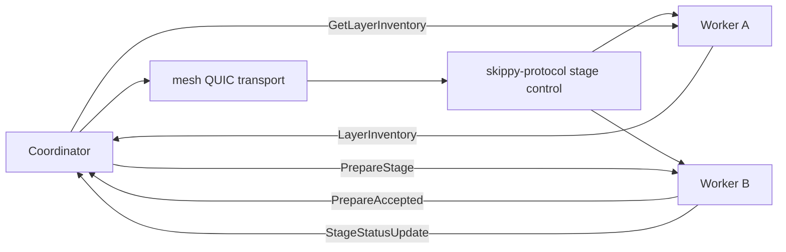
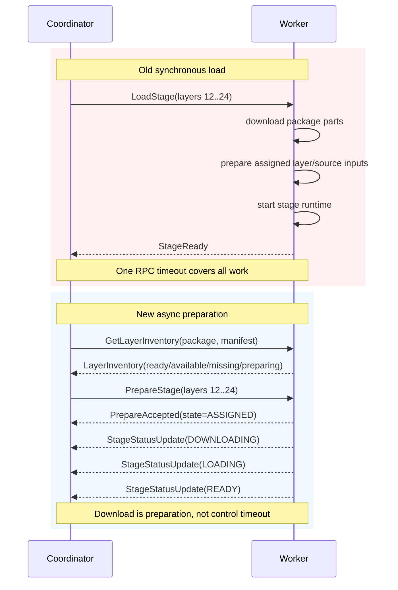
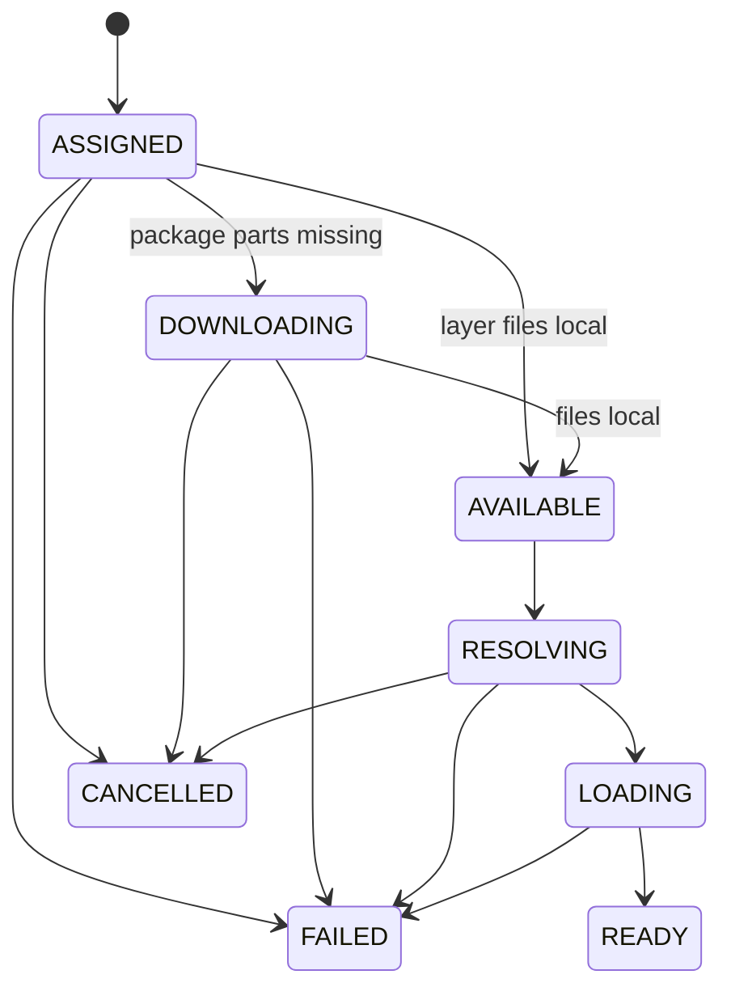
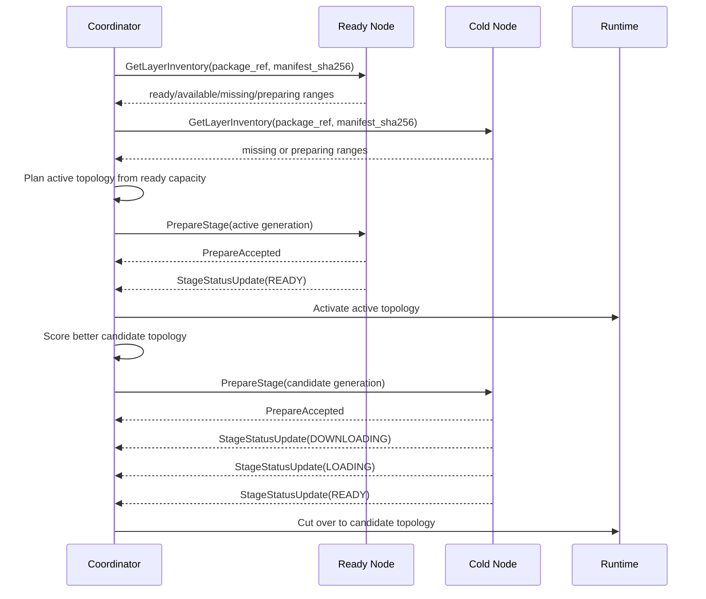
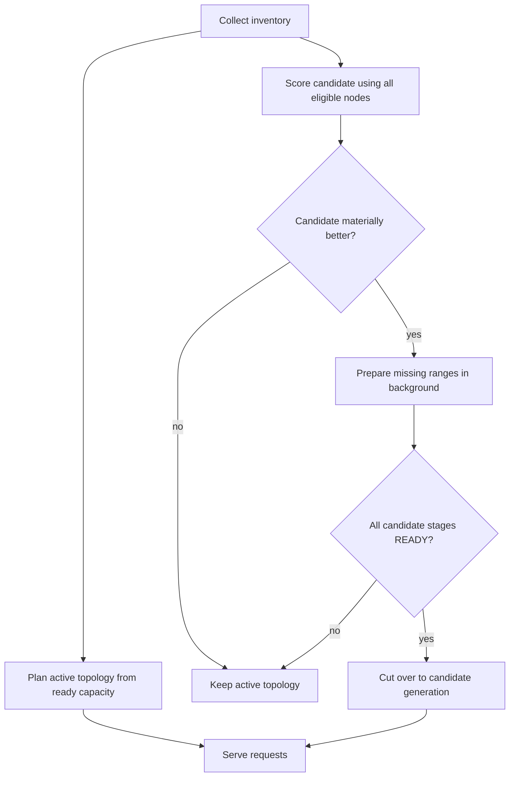

# PR: Make Skippy split topology layer-aware and preparation-driven

## Summary

This PR changes Skippy split serving so model downloads and layer preparation no
longer count against inference or stage-control timeouts.

Nodes now report the layer ranges they can serve or prepare, the coordinator
plans from currently usable capacity, and slower nodes can join later through a
candidate topology once their assigned inputs are local and the stage runtime is
loaded directly from package parts or a local GGUF source.

The protocol change is intentionally breaking and is scoped to the Skippy stage
control protocol. `mesh.proto` gossip is not changed.

## User Impact

- Split serving can start with the best topology available now instead of
  waiting for every selected node to download layers.
- Slow or cold nodes can join a split after preparation completes.
- Model download time is treated as topology preparation, not request latency.
- Status output can explain what each node is doing, including layer range,
  phase, progress when known, and failure reason.
- Existing ready topologies keep serving while a better candidate topology is
  prepared in the background.

## Architecture

The coordinator uses the existing mesh QUIC connection as transport, but all new
messages are Skippy-owned stage-control protobufs in
`crates/skippy-protocol/proto/stage.proto`.

No full layer inventory, progress, or preparation state is added to `mesh.proto`.
The coordinator asks peers directly over the Skippy stage control stream.



## Protocol

The Skippy stage protocol is now the source of truth for layer inventory and
stage preparation.

Today, `LoadStage` is synchronous from the coordinator's point of view: the
coordinator sends one request and waits for the remote node to download or
resolve model artifacts, prepare the assigned stage, start the binary stage,
and return `StageReady`. That makes model download time part of the control RPC
timeout.

This PR replaces that meaning with an explicit asynchronous preparation
protocol. The coordinator first asks what a node has, then assigns preparation
work, and then observes status until the stage is ready.



New protocol concepts:

- `LayerRange`
- `LayerInventory`
- `GetLayerInventory`
- `PrepareStage`
- `CancelPrepareStage`
- `StagePreparationStatus`
- `StageStatusUpdate`

Preparation states:

- `ASSIGNED`
- `DOWNLOADING`
- `AVAILABLE`
- `RESOLVING`
- `LOADING`
- `READY`
- `FAILED`
- `CANCELLED`

### Wire-Level Changes

`StageControlRequest` adds new command variants:

- `get_layer_inventory`
- `prepare_stage`
- `cancel_prepare_stage`
- `stage_status_update`

`StageControlResponse` adds new response variants:

- `layer_inventory`
- `prepare_stage_accepted`
- `stage_preparation_status`
- `stage_status_ack`

`StageRuntimeState` is replaced or expanded with preparation-specific states so
callers do not need to overload `STARTING` for download, source resolution, and
runtime startup.

The existing `StageStatus` payload is extended into a preparation-aware status:

- package identity: `package_ref`, `manifest_sha256`
- assigned layer range: `layer_start`, `layer_end`
- state: assignment/download/source-resolution/loading/ready/failure
- optional progress: `bytes_done`, `bytes_total`
- runtime endpoint: `bind_addr`, present only when the stage is ready
- error string for terminal failures

### Semantic Changes

`LoadStage` is no longer used by split serving as a blocking
download-and-start operation. For split serving, the new flow is:

1. `GetLayerInventory`
2. `PrepareStage`
3. `StageStatusUpdate` push messages, with `GetStageStatus` polling as fallback
4. coordinator activates a topology only after every required stage is `READY`

`LoadStage` can either be removed in the protocol break or kept only as a
compatibility shim for local/single-stage paths that already have local model
artifacts. It must not be used for remote split layer downloads.

### Source Model Scenarios

The protocol must distinguish source layout from stage readiness. In particular,
it must not reintroduce a pipeline where layer package parts are first joined
into a materialized stage GGUF and then loaded. Stage runtime should load from
the source form directly.

Supported source kinds:

- `LAYER_PACKAGE`: a package manifest and per-layer parts are available. Nodes
  report which layer ranges are local, missing, or already loaded by a running
  stage.
- `PLAIN_GGUF`: the node has a normal GGUF model, either from a local path or a
  plain Hugging Face model repository. The node cannot report per-layer package
  files, but it can report that the source GGUF is local and that runtime slice
  loading can filter the assigned layer range directly from that source.
- `SPLIT_GGUF`: the node has a multi-file GGUF source. Inventory reports source
  availability for the whole split set, not a layer-package cache.

For `PLAIN_GGUF` and `SPLIT_GGUF`, `available_ranges` means "the source files
needed to load these ranges are local." It does not imply a separate
materialized stage artifact.

For `LAYER_PACKAGE`, `available_ranges` means "the required package parts for
these ranges are local." Loading should consume those parts directly.

### Materialisation and Source Handling

In this design, "materialisation" must not mean "join selected layer parts into
a new stage GGUF." That path should not come back.

Instead, preparation means making the source inputs available in the form the
runtime can load directly.

#### Layered model repository

A layered repository already contains the model as package parts:

```text
model-package.json
shared metadata / embeddings / output parts
layer 0 part
layer 1 part
...
```

For a stage assigned `layers 12..24`, preparation is:

1. Ensure `model-package.json` is local.
2. Ensure required shared parts are local.
3. Ensure layer parts `12..24` are local.
4. Start the runtime with a package-backed stage config.
5. Runtime loads directly from the package parts.

No intermediate stage GGUF is written.

Inventory semantics for layered repositories:

- `MISSING`: required package parts are not local.
- `DOWNLOADING`: fetching package manifest or parts.
- `AVAILABLE`: required package parts are local.
- `LOADING`: runtime is opening/loading those parts directly.
- `READY`: stage runtime is listening.

Layered repositories support range-specific preparation. A cold node can be
asked to fetch only `layers 12..24` plus required shared parts.

#### Non-layered model repository

A non-layered repository is a plain GGUF repo, a local GGUF file, or a split
GGUF file set. There are no independently downloadable per-layer package parts.

Preparation is:

1. Ensure the source GGUF file, or the complete split GGUF file set, is local.
2. Inspect GGUF metadata to learn layer count and dimensions.
3. Assign a layer range.
4. Start the runtime in runtime-slice mode.
5. Runtime filters tensors while loading the assigned range directly from the
   source GGUF input.

No intermediate stage GGUF is written.

Inventory semantics for non-layered repositories:

- `MISSING`: source GGUF file or split GGUF set is not local.
- `DOWNLOADING`: fetching the full source GGUF repo or file set.
- `AVAILABLE`: source GGUF inputs are local, so any valid layer range can be
  loaded from them.
- `LOADING`: runtime is loading/filtering the assigned range directly.
- `READY`: stage runtime is listening.

For plain or split GGUF sources, `available_ranges` is effectively
`0..layer_count` once the complete source is local. For layered repositories,
`available_ranges` can be sparse and range-specific.

### Why This Is Breaking

This intentionally changes the meaning of stage readiness. In the old protocol,
a successful `LoadStage -> StageReady` meant the remote runtime was loaded and
ready to receive activations. In the new protocol, accepting work and becoming
ready are separate events.

Old nodes do not understand inventory, prepare, or status-update commands. New
coordinators should require the new Skippy stage protocol generation for the
layer-inventory split path.

Base mesh gossip remains unchanged; the break is isolated to Skippy stage
control messages.



## Coordinator Flow

The coordinator creates an active topology only from capacity that can serve
now. Nodes that still need downloads are prepared as background candidates and
can join after they reach `READY`.



## Planning Policy

The coordinator ranks topology inputs by readiness and cost:

1. `READY`
2. `AVAILABLE`
3. `MISSING`, only for background candidates

The initial active topology avoids required downloads. Background preparation is
started only when a candidate is materially better.

Material improvement includes:

- Adding enough capacity to serve a model that otherwise cannot run.
- Reducing the worst-stage layer count by a meaningful threshold.
- Improving VRAM headroom or stage balance.
- Replacing a failed or unhealthy stage.
- Bringing more eligible nodes into the topology when balance improves.

The coordinator should penalize:

- Required download bytes.
- Topology churn.
- Recent failures for the same node/package/range.
- Preparing too many candidates at once.



## Timeout Model

Timeouts are split by responsibility:

- Assignment/control timeout: short, covers accepting a control message.
- Preparation timeout: long or disabled by default, covers download and
  source preparation.
- Stage start timeout: bounded, starts after local artifacts are ready.
- Inference first-byte timeout: starts only after a ready topology is active.

Downloads do not count against inference or stage-control response time.

## Failure and Cancellation

Failures are recorded per node and `{package_ref, manifest_sha256, layer_range}`
with backoff. The coordinator keeps serving the active topology if candidate
preparation fails.

`CancelPrepareStage` cancels stale candidate work. Workers may keep already
downloaded package files because they are useful cache, but should stop source
resolution or runtime loading when practical.

## API and UI

`/api/status` should expose enough state to explain split preparation:

- node id
- package ref and manifest
- layer range
- state and phase
- bytes done and total when known
- current active or candidate generation
- failure reason

Example user-visible states:

- `stage-1: ready, layers 0..12`
- `stage-2: downloading, layers 12..24`
- `stage-3: loading, layers 24..32`
- `stage-4: failed, checksum mismatch`

## Validation

Recommended validation:

- `cargo test -p skippy-protocol --lib`
- `cargo test -p mesh-llm inference::skippy --lib`
- `cargo test -p mesh-llm --lib` for stage-control conversion and runtime status
- Two-node forced split with one warm node and one cold node.
- Slow or throttled model download on a worker; verify active topology serves
  before the cold node joins.
- Candidate replan and cutover after the cold node reaches `READY`.

## Compatibility

This is a breaking Skippy stage protocol change. Mixed old/new split-stage
nodes are not supported for the new layer-inventory preparation path.

Base mesh gossip remains unchanged. Non-skippy mesh behavior is not affected.
